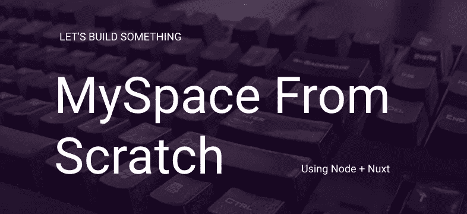
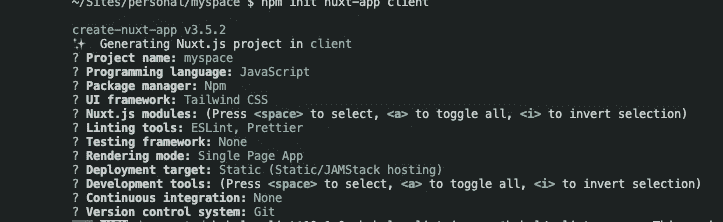

# MySpace 从头开始—第 2 部分:设置节点+ Nuxt 环境

> 原文：<https://blog.devgenius.io/myspace-from-scratch-part-2-setting-up-the-environment-127eb4a6e3ac?source=collection_archive---------4----------------------->



让我们开始吧。首先，我们需要设置我们的项目文件夹。我将遵循服务器/客户端模式。所以项目有一个文件夹，里面有两个子文件夹，一个用于 API，一个用于客户端。像这样:

```
/myspace
    /api
    /client <-- this we will create with the Vue CLI
```

# 启动并运行 API

首先，我们需要启动一个新的节点项目。因此，我转到 api 目录& `npm init`并按照步骤进行操作。没什么特别的，使用所有的默认值。然后，我为我的 web 框架安装了 express:`npm install express --save`mongose，用于我的 DB `npm install mongoose --save`
Nodemon，用于自动刷新代码变化`npm install nodemon --save`和 CORS，用于处理跨源请求`npm install cors --save`

安装完成后，我创建了一个新文件`server.js`，并配置了以上所有内容:

快到了。
我喜欢通过 docker 运行 Mongo，因此它保持自包含，所以我喜欢从 docker 运行我的 API，并为 web 服务器和数据库提供服务。这是通过 Docker 文件和 docker-compose.yml 完成的:

唷。这就是我们需要的 API。要运行 api，请确保您安装了 docker，并在 api 文件夹中运行`docker-compose up`,它将为您启动一切并在端口 3000 上运行。您可以通过导航到 [http://localhost:3000](http://localhost:3000) 来查看我们的一条路线

# 设置客户端

这比我们的最后一步简单多了。在最后一刻，我改变了对 Vue 的看法，决定改用 Nuxt。所以在根文件夹中:

```
npm init nuxt-app client 
```

现在我是这样配置的:



然后在 nuxt.config.js 文件中，我更新了端口，这样它就不会与我们的 api 冲突:

```
server: {
    port: 8000, // *default: 3000* },
...
```

既然我很懒，希望自己的风格简单。我设置了顺风。

```
npx init tailwindcss
```

最后，为了访问我们的 API，我使用了 axios:

```
npm install [@nuxtjs/axios](http://twitter.com/nuxtjs/axios)
```

并将配置添加到 axios 的 nuxt.config.js 文件中:

```
modules: ['@nuxtjs/axios'],axios: {
    baseURL: 'http://localhost:3000',
},
```

然后，我更新了主要组件，以便它 pings 我们的 API 并返回响应。

# 我们被陷害了！

在终端的一个选项卡中，导航到您的 api 目录并运行
`docker-compose up`
在另一个选项卡中，导航到您的客户端目录并运行`npm run dev`然后转到 [http://localhost:8000](http://localhost:8000) ，您将看到应用程序启动并运行，并向 API 发出请求。

安装总是我最不喜欢的部分。从现在开始，我们要建造这座大楼。期待即将到来的下一部分。我计划构建身份验证:**创建一个帐户并登录到应用程序。**

# 从头开始阅读更多 MySpace

[第一部分—创意](https://medium.com/me/stats/post/18a55931ddc6?source=main_stats_page) [第三部分—认证](https://andyhartnett.medium.com/myspace-from-scratch-part-3-authentication-6a48eabef24?source=your_stories_page-------------------------------------)
[第四部分—照片上传](https://andyhartnett.medium.com/myspace-from-scratch-part-4-profile-photos-audio-6ce69871669b)

## 感谢您的关注，当您在这里时，请考虑在 twitter 上关注我！