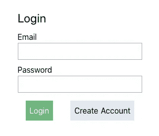
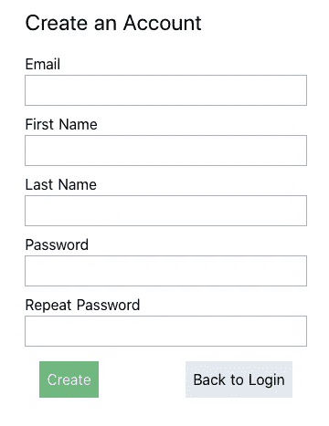

# MySpace 从头开始—第 3 部分:认证

> 原文：<https://blog.devgenius.io/myspace-from-scratch-part-3-authentication-6a48eabef24?source=collection_archive---------3----------------------->

在这篇文章中，我们将介绍帐户创建和登录。

下面是一些基础知识:
-某人通过填写包含其电子邮件、姓名和密码的表单来创建用户
-用户存储在 Mongo 的用户模型中
-当登录 API 时，根据 Mongo DB 检查电子邮件/密码，如果找到用户，则将其返回给客户端。
-出于安全原因，我们需要在存储密码之前对其进行哈希运算。

## 创建帐户创建表单

在应用程序的客户端，我们需要创建一个登录页面。在登录页面上，我们包含了一个到帐户创建页面的链接。所以在 Nuxt 中，我创建了两个新页面。一个用于登录，一个用于创建帐户。

从来没有人指责我是一个设计师，但这里是我的登录和创建帐户页面。我只是用顺风建立了简单的布局。

就像我说的，我不是设计师，但这很简单而且切中要害。让我们用一些 Vue 来完成这个前端工作，使这个表单真正发挥作用。

# 创建帐户流程

1.  用户填写表单
2.  Javascript 验证所有字段都已填写
3.  Javascript 检查密码和重复密码是否相同
4.  向 API 发送请求
5.  如果 API 返回成功，重定向到“主页”
6.  如果 API 返回不成功，抛出一个错误

## 前端

为了验证，我使用了一个循环来处理每个字段的键，并确保每个字段都有`data`。

然后是 if 语句，以确保密码相同。

使用 axios 向 API 发出 post 请求以创建帐户。

使用`toast`显示成功或失败的信息。
我不得不`npm install @nuxtjs/toast --save`

以上处理第 1-3 部分。以下是我创建帐号的代码:

**现在我们需要创建 API 路径**

我创建了一个新文件`/app/routes.js`,暂时存放我所有的路线。我更新了我的`server.js`文件来包含这个文件。

在新的 routes 文件中，我将现有的 route 移动到那里，然后为用户创建的 route 添加了另一个 route。我继续创建了两个新文件:`/app/controllers/UserController.js`用于处理用户对象的请求。以及`/app/models/UserModel.js`用于处理对数据库的访问。

然后，我向 UserController 添加了一个`create()`方法，它用`bcrypt`散列密码，然后使用 UserModel 创建用户并返回该用户的响应。然后我创建 UserModel，它定义模式并返回 mongoose 模型。我添加了一个`Schema.pre()`功能来确保邮件不能重复。

我还生成了一个令牌，这样我们就可以使用它来验证来自客户端的用户请求。为此我使用了`jsonwebtoken`

需要了解的内容很多，但这里是用户控制器:

用户模型:

**我们的账户创建完成了！**

# 让用户登录

这篇文章已经有点长了，所以我要总结一下我所做的，然后给你看 API 和前端模板的代码

## API 端

1.  `/login`的新路线
2.  用户控制器中的新方法`login()`
3.  该方法对照电子邮件的密码(使用 bcrypt)检查密码，如果成功，则返回带有用户令牌的用户对象。
4.  如果不成功，抛出一个错误

## 客户端

1.  点击登录按钮时，将用户名和密码传递给 API
2.  如果成功，重定向到主页
3.  如果不成功，抛出一个 toast 错误消息

# 认证完成

迄今为止，我们取得了哪些成就:

1.  我们有一个完整的工作环境
2.  用户可以创建一个帐户
3.  用户可以登录

不是最令人兴奋的事情，但我们现在正准备开始构建一些有趣的东西！

# 在下一篇文章中

我们将开始创建 MySpace 个人资料页面。一旦用户登录，他们将能够添加照片，并选择其中之一作为他们的个人资料照片。

如果你有什么特别想让我分享的，请在评论中告诉我！下次再见，谢谢你的关注！

本系列往期文章:
[第一部分—简介](https://andyhartnett.medium.com/myspace-from-scratch-with-node-vue-part-1-18a55931ddc6?source=your_stories_page-------------------------------------)
[第二部分—设置环境](https://andyhartnett.medium.com/myspace-from-scratch-part-2-setting-up-the-environment-127eb4a6e3ac?source=your_stories_page-------------------------------------)
[第四部分—照片上传](https://andyhartnett.medium.com/myspace-from-scratch-part-4-profile-photos-audio-6ce69871669b)

## 既然你在这里，考虑一下在 twitter 上关注我吧！