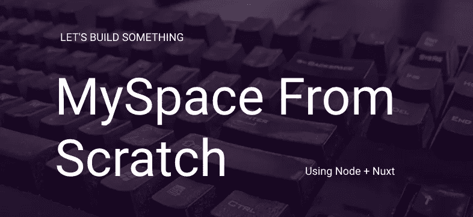

# 从零开始的 MySpace 第 4 部分:照片上传

> 原文：<https://blog.devgenius.io/myspace-from-scratch-part-4-profile-photos-audio-6ce69871669b?source=collection_archive---------6----------------------->

在最后一部分，我谈到了认证。今天我们将讨论一些 MySpace 的东西，我想从照片上传开始。

# 照片上传

这将如何工作的要点是，我们将在前端有一个文件输入，这将被传递给 API，文件将被存储在一个公共的 S3 桶中。保存图像后，我们将把文件路径存储在用户模式的照片数组中。然后，在前端侧，我们将显示个人资料照片，将有一个链接，点击查看更多照片

**前端**

前端相当简单。我们正在做一些基本的复古 myspace 风格，或尽可能接近我可以使用顺风。那么它只是一个 api 调用。但以下是步骤:

1.  文件输入
2.  向 API 发出存储图像的请求
3.  显示个人资料照片
4.  在“图片”页面显示图片

**这是目前的情况—**

轮廓图像周围的经典方框

你的“照片”页面上的旧学校照片库。

下面是实现“Pics”页面和向 API 发送照片的能力的代码:

^这是所有这是照片上传在前端的事情。后端就有点复杂了

**后端**

在后端，我们需要做更多的事情

1.  为用户路由创建中间件:这样我们可以将`user`附加到每个授权的请求上，使事情变得更容易
2.  为存储新照片创建新路线/控制器
3.  `npm install busyboy-connect`并使用它，以便我们可以通过请求文件
4.  使用 AWS SDK 将照片上传到 S3
5.  在用户模式中存储图像数组

**我是人，我栈溢出如何在节点流文件。这是我在那里读到的一些不同线索的组合。

下面是使用 busboy 处理文件的文件上传功能。我为 S3 写了一个包装器，但这不足以分享，它所做的只是让 S3 调用一个 1 liner，这样它在控制器中看起来更好。

无论如何，这是后台魔术:

现在我们可以上传照片到我们的个人资料。现在，图片数组中的第一个索引。因此，当我们想要将一张照片作为我们的“个人资料图片”时，我们只需将它移动到照片数组的前面。

这就是这篇文章的全部内容。在下一篇文章中，我将关注“朋友”和朋友之间的关系。请在接下来的一周中寻找答案！

**本系列往期文章:**
[第一部分—简介](https://andyhartnett.medium.com/myspace-from-scratch-with-node-vue-part-1-18a55931ddc6?source=your_stories_page-------------------------------------)
[第二部分—设置环境](https://andyhartnett.medium.com/myspace-from-scratch-part-2-setting-up-the-environment-127eb4a6e3ac?source=your_stories_page-------------------------------------)
[第三部分—认证](https://andyhartnett.medium.com/myspace-from-scratch-part-3-authentication-6a48eabef24)

# 当你在这里的时候，考虑一下在 twitter 上关注我吧！