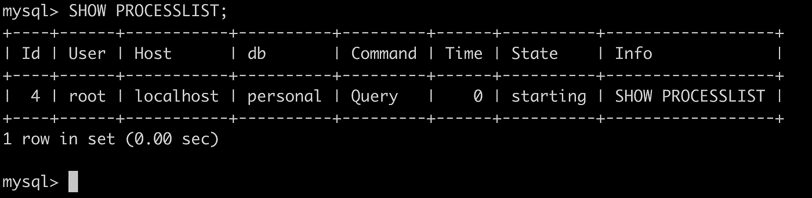
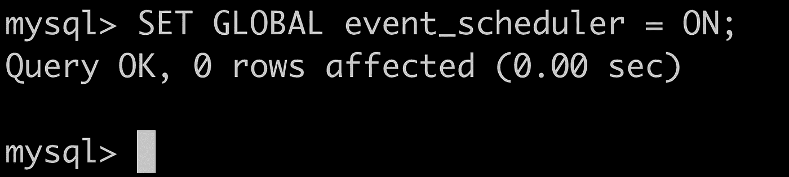
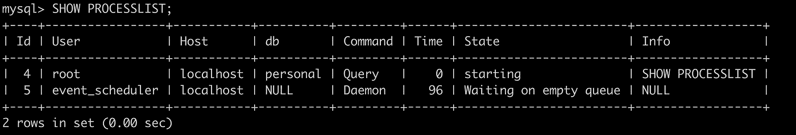
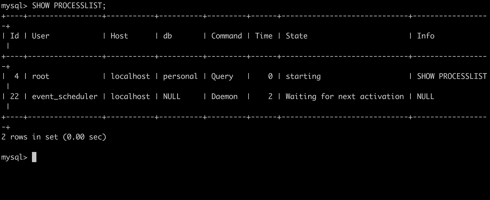

# MySQL:MySQL 事件调度器简介

> 原文：<https://blog.devgenius.io/mysql-brief-introduction-to-mysql-event-scheduler-1035219694dd?source=collection_archive---------1----------------------->


在 [Unsplash](https://unsplash.com/) 上由 [Boitumelo Phetla](https://unsplash.com/@writecodenow) 拍摄的照片

本文将利用 MySQL 事件调度器来创建一些负责完成某些任务的事件。此外，我们将比较 Cronjob(一个用于类似 Unix 的计算机操作系统的软件工具)和 MySQL 事件调度程序。

> **注意**:如果阅读让你昏昏欲睡，先拿起你的咖啡杯，然后继续。*😃*

# 先决条件

1.  MySQL 安装在您的机器上
2.  MySQL 数据库背景
3.  能够简化总是一个优势😃

# 什么是 MySQL 事件调度器？

MySQL 事件调度器是一个管理事件的调度和执行的工具，这些事件就是所谓的根据时间表运行的任务。MySQL 在版本 5.1.6 中引入了事件调度器。当我们创建一个事件时，实际上我们是在创建一个包含一个或多个 SQL 语句的命名数据库对象，这些 SQL 语句以一个或多个固定的时间间隔执行，在特定的日期和时间开始和结束。这个事件调度器的想法类似于Unix **crontab** (也称为“cronjob”)或 **Windows 任务调度器**的想法。

# 什么时候使用 MySQL 事件调度器？

假设您管理由两个表组成的数据库。一个表包含与用户信息相关的数据，如姓名、年龄、出生日期、性别等。在另一个表中，我们希望每天只输入一次数据，在这个表中，我们推送每天创建的用户条目数。

首先，这个问题陈述对你来说看起来很简单！让我们首先使用 cronjob 方法。我们可以编写一个脚本来获取每天创建的所有用户条目，并将结果插入到另一个表中。我们将通过使用 crontab 表达式设置计划时间来使用 cronjob 执行我们的脚本。


但是等等！让我们重复一次这个方法。

*   我们必须编写处理业务逻辑的代码块。
*   然后，我们需要添加一个 cronjob，它将以特定的时间间隔触发我们的脚本。
*   现在我们在这里使用两台机器，一台在数据库中，另一台是我们设置 cronjob 的机器。

> 你不认为这是资源的浪费吗？我们能用单台机器做它吗？感谢 MySQL 任务调度程序！

当我们的任务完全以数据为中心或者补充已经内置到数据库中的功能时，我们可以使用 MySQL 事件调度程序。我们可以使用这个事件调度器进行数据清理、记录某些事件、聚合某些数据等。

# CronJob 上的 MySQL 事件调度程序

在一些用例中，我们更喜欢 MySQL 事件调度程序而不是 Cronjob。但是我们不能基于这些用例做出决定，并声明哪一个是最好的。以下是我们使用 MySQL 事件调度程序的优势:

*   是直接用 MySQL 服务器写的。
*   这是独立于平台的方法。因此，如果我们的应用程序是用任何语言编写的都没关系，我们只需要知道 MySQL。
*   每当需要定期更新或清理数据库时，我们可以使用这种事件调度方法。
*   没有必要每次都编译查询，这样可以提高性能。

# MySQL 事件调度程序配置

MySQL 使用一个名为**事件调度器线程**的特殊线程来执行所有调度的事件。我们可以通过执行以下命令来查看事件调度程序线程的状态:

```
SHOW PROCESSLIST;
```



如果未启用事件调度程序，我们可以使用以下命令将事件调度程序系统变量设置为启用并启动它:

```
SET GLOBAL event_scheduler = ON;
```



现在，如果我们执行第一个命令，我们可以看到事件调度程序线程的状态:



# 创建新的 MySQL 事件语法

让我们使用下面的基本语法创建我们的第一个 MySQL 事件:

```
CREATE EVENT [IF NOT EXIST] event_name 
ON SCHEDULE schedule 
DO event_body
```

在此语法中:

首先，我们用“CREATE EVENT”关键字指定想要创建的事件的名称。**事件名称在同一个数据库中必须是唯一的。**其次，在“ON SCHEDULE”关键字后指定一个日程表。

如果事件是一次性事件，我们使用下面的语法:

```
AT timestamp [+ INTERVAL]
```

如果事件是重复发生的事件，我们使用 EVERY 子句:

```
EVERY interval STARTS timestamp [+INTERVAL] ENDS timestamp [+INTERVAL]
```

第三，将 SQL 语句放在 DO 关键字之后。我们可以在事件体内调用存储过程。如果我们有复合语句，我们可以把它们放在一个“BEGIN END”块中。

# 为我们的用例实现 MySQL 事件

让我们使用下面的命令创建一个包含用户信息(如姓名、年龄、性别、出生日期)的表:

```
CREATE TABLE USERS ( 
id INT PRIMARY KEY AUTO_INCREMENT,
Name VARCHAR(20) NOT NULL,      
Gender VARCHAR(1) NOT NULL, 
AGE INT NOT NULL, 
CREATED_AT TIMESTAMP NOT NULL DEFAULT CURRENT_TIMESTAMP, 
UPDATED_AT TIMESTAMP DEFAULT CURRENT_TIMESTAMP ON UPDATE  CURRENT_TIMESTAMP 
);
```

现在，我们将创建另一个表来存储每天的用户条目数，并使用以下命令创建该表:

```
CREATE TABLE USERS_COUNT_DAY_WISE (
id INT PRIMARY KEY AUTO_INCREMENT,
USER_ENTRIES_ON DATETIME,
COUNT INT
);
```

我们的 MySQL 事件调度程序的时间到了。我们将创建一个事件，从“USERS”表中获取每天的用户条目数，并将结果插入到“USERS_COUNT_DAY_WISE”表中。我们将每天执行一次这个任务。使用下面的命令，我们可以创建此事件，并为其安排一个特定的时间间隔:

```
CREATE EVENT USERS_ENTRY_COUNT
ON SCHEDULE EVERY 1 DAY 
STARTS (TIMESTAMP(CURRENT_DATE) + INTERVAL 1 DAY + INTERVAL 1 HOUR)
DO
INSERT INTO USERS_COUNT_DAY_WISE (USER_ENTRIES_ON, COUNT) SELECT NOW(), COUNT(*) FROM USERS WHERE CREATED_AT >= DATE_SUB(NOW(), INTERVAL 1 DAY);
```

要检查我们执行的事件，我们可以使用下面的命令:

```
SELECT event_schema, event_definition, status, starts, last_executed FROM INFORMATION_SCHEMA.EVENTS
```

# 问候！🥳

*我们已经成功地创建了我们的第一个 MySQL 事件，它将负责一个特定的任务，我们也在特定的时间间隔内激活这个任务。*

作为胜利的一页，让我们检查一下我们预定的事件是否被添加到进程列表中。



# 摘要

为了这篇文章的完整性，让我们快速回顾一下到目前为止我们所学的内容。

*   什么是 MySQL 事件调度器？
*   我们什么时候可以在 Cronjob 上使用它？
*   MySQL 事件调度器的基本命令

> 如果你喜欢这篇文章，别忘了给它一个掌声！


请随时在 [**Linkedin**](https://www.linkedin.com/in/shubham-kaushik-temp/) 上 ping 我，敬请期待下一期！

# 参考

[1] MySQL 官方文档[https://dev.mysql.com/doc/](https://dev.mysql.com/doc/)

[2] MySQL 教程网站[http://mysqltutorial.org/](http://mysqltutorial.org/)