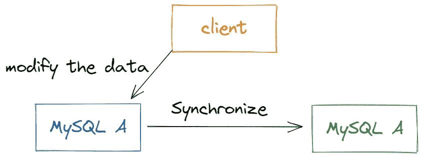
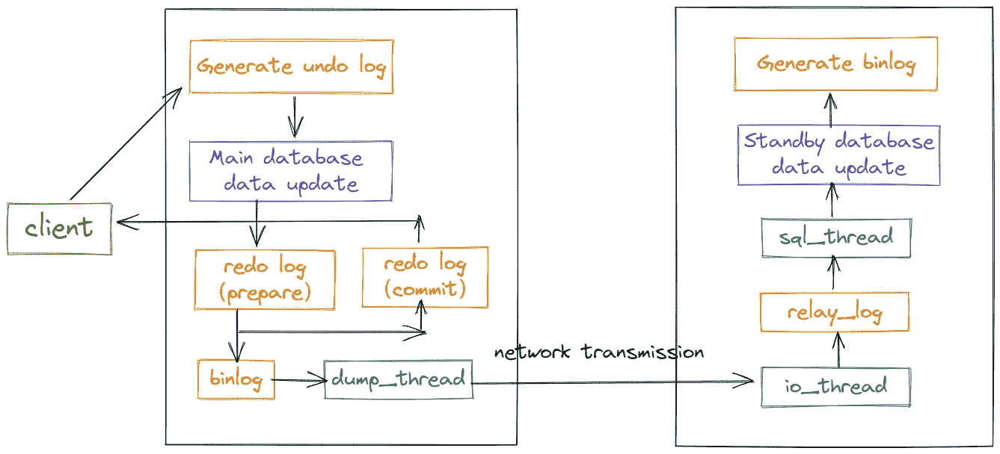

# MySQL 父子复制原则

> 原文：<https://blog.devgenius.io/mysql-parent-child-replication-principle-4001c96e6891?source=collection_archive---------16----------------------->

MySQL 高可用性


本·科尔德在 [Unsplash](https://unsplash.com?utm_source=medium&utm_medium=referral) 上的照片

***为什么需要亲子复制？***

*   读写分离，增强 MySQL 数据库的可用性。
*   对数据进行热备份。
*   结构的扩展。业务量越来越大，I/O 访问频率太高，单机无法满足。此时进行多数据库存储，降低磁盘 I/O 访问频率，提高单机 I/O 性能。

***什么是 MySQL 亲子复制？***

MySQL 父子复制意味着数据可以从 MySQL 数据库服务器父节点复制到一个或多个子节点。

MySQL 默认采用异步复制方式，这样子节点就不必访问父服务器来更新自己的数据，数据更新可以在远程连接上进行，子节点可以复制父数据库中的所有数据库或者某个特定的数据库，或者某个特定的表。



图片来源:作者

***MySQL 亲子复制原理。***

在多源复制中，每个复制源打开一个复制通道，这是一个长链接。

每个复制源都有自己的 IO 线程、一个或多个点 SQL 线程和 realy 日志。

复制源收到事务时，会将其添加到中继日志中，然后通过 SQL 线程执行。相关的官方文件如下:

> ***在 MySQL 多源复制中，一个副本打开多个复制通道，每个复制源服务器一个。复制通道代表事务从源流向副本的路径。***
> 
> ***每个复制通道都有自己的接收方(I/O)线程，一个或多个应用方(SQL)线程，以及中继日志。***
> 
> ***当来自源的事务被通道的接收器线程接收时，它们被添加到通道的中继日志文件，并被传递到通道的应用器线程。***
> 
> ***这使得每个通道能够独立工作。***

父子复制应该分为**第一次连接**建立和**增量数据**同步过程。

**第一次连接。**

备用数据库 B 和主数据库 a 之间保持长连接

主库 A 内部有一个 io_thread 线程，专门服务于备用库 b 的这个长连接。

事务日志同步的完整过程如下:

1.  在备用数据库 B 上使用`change master`命令来设置主数据库 A 的 IP、端口、用户名、密码，以及从哪里开始请求`binlog`，其中包含文件名和日志偏移量。

```
CHANGE MASTER TO MASTER_HOST='192.168.56.104',MASTER_USER='root',MASTER_PASSWORD='qwer_123',MASTER_LOG_FILE='mysql-bin.000001',MASTER_LOG_POS=154;
```

2.在备用数据库 b 上执行`start slave`命令，此时备用数据库将启动两个线程，图中的`io_thread`和`sql_thread`。

其中，`io_thread`负责与主库建立连接。

3.主数据库 A 验证用户名和密码后，开始根据备用数据库 B 传递的位置在本地读取`binlog`，并发送给备用数据库 B。

4.备用数据库 B 得到`binlog`后，将其写入中继日志(relay log)。

5.备用数据库的`sql_thread`读取中继日志，解析日志中的命令，并重放它们以供执行。

**增量同步。**



图片来源:作者

1.  客户端发起更新请求，MySQL 服务器接收请求。
2.  生成与修改后的数据行相对应的撤消日志。
3.  更新成功写入存储器。
4.  InnoDB 生成一个重做日志，目前正处于准备阶段。
5.  服务器层生成`binlog`，提交事务时持久化`binlog`。此时，`binlog`可以开始同步到子库。
6.  重做日志进行磁盘持久化，并将更新执行的新结果返回给客户机(默认异步复制)。
7.  主库发送生成的`binlog`数据。
8.  库的 io_thread 处理 parent 传来的数据，保存为中继日志。子库服务器将检测父二进制日志在特定时间间隔内是否已经改变。如果有变化，它将启动一个 I/OThread 请求父二进制事件。
9.  SQL 线程读取中继日志，解析日志，在子库中回放执行，数据同步完成。最后，I/OThread 和 SQLThread 将进入睡眠状态，等待下一次唤醒。

***MySQL 怎么知道*** `***binlog***` ***是完整的？***

孩子在解析时如何知道一个事务已经完成？因为一个事务的`binlog`有一个完整的格式；`statement`格式中的`binlog`最后会有一个`COMMIT`标签；`row`格式的`binlog`末尾会有一个`XID event`。

*感谢您阅读本文。*

*敬请期待更多。*