# Naiive、Knuth-Mooris-Pratt 和 Rabbin Karp 字符串匹配算法

> 原文：<https://blog.devgenius.io/naiive-knuth-mooris-pratt-and-rabbin-karp-string-matching-algorithms-a54cb141dd7a?source=collection_archive---------11----------------------->

# 简介:

**什么是字符串匹配？**

> 在另一个字符串或文本主体中查找模式字符串的问题是字符串匹配。

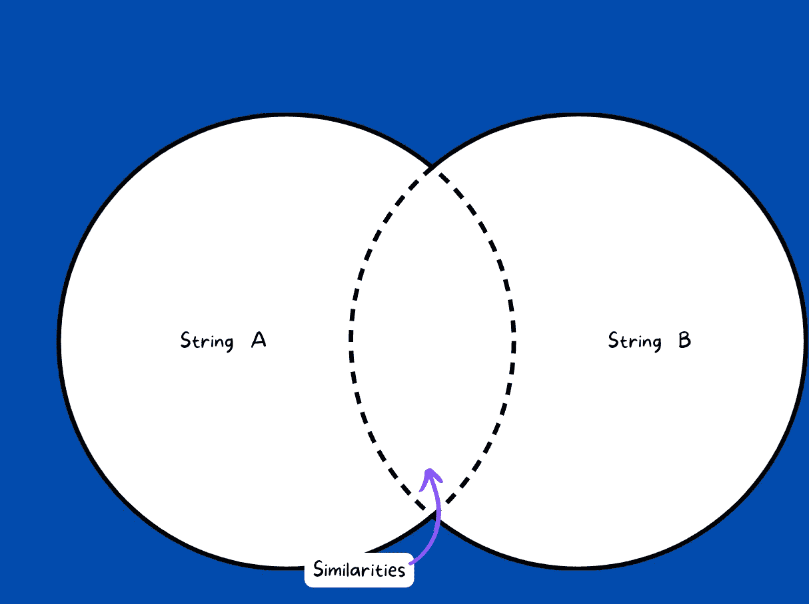

**举例:**

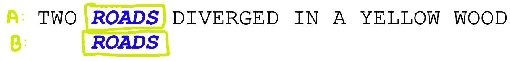

# 简单字符串匹配算法:

这个想法很简单:
(1)取一个相当于 A 中字符串 B 的窗口大小
(2)比较 A 和 B 窗口中的每个字符
(3)如果比较不匹配，滑动窗口到 A 中的下一个字符

**举例:-**

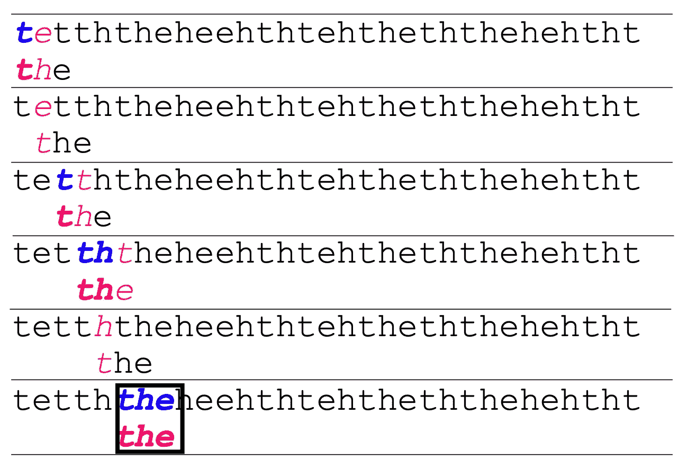

**实现:-**

*输出:-*

```
tet
ett
tth
tht
hth
the
Pattern Found at index: 5 of A
```

**分析算法:-**

在最坏的情况下，我们遍历 A 的所有元素，在里面，对于 A 的每个字符，我们遍历 B 的所有元素(基本上是我们的窗口大小)。因此，时间复杂度为 O(m×n ),空间复杂度为 O(1)。

当 m=n 时，最坏的时间复杂度为 O(n)。然而，最佳情况时间复杂度:ο(N)

因此，我们的下一个目标将是减少这 n 倍的复杂性。我们需要减少一个字的重复。

# Knuth-Morrish-Pratt 算法

*   Knuth-Morris-Pratt (KMP)字符串搜索算法不同于强力算法，它跟踪从以前的比较中获得的信息。
*   KMP 算法是基于字符串前缀和后缀的思想。它检查是否有任何前缀匹配后缀。通俗地说，就是检查字符串的开头部分是否出现在字符串结尾部分的任何地方。

# 𝜋表或故障函数

*   基于以上思路，编制数组或圆周率表。
*   它只是跟踪是否再次遇到前一个元素(来自前缀模式)。如果是，则分配其索引，否则分配 0。
*   这样，我们就可以重复使用上一次的比较。

**示例**

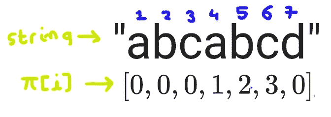

在这里，位置 4、5 和 6 的字符已经出现在位置 1、2 和 3。因此，将索引指定为 4、5、6，其余为 0。

*注意，我们从 1 而不是 0 开始索引，因为这将有助于重置指针*

**饼状图的优点:**

如果你考虑上面的例子，那么饼状图就相当于一个失败函数。这意味着它将告诉我们需要从哪个索引开始搜索。
例如:在上面的字符串中，假设 abab 匹配，但比较在第 6 个索引处中断，即在“c”处。

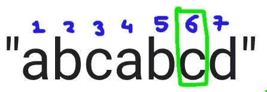

在朴素算法中，我们重新初始化指针(A 和 B 字符串)。

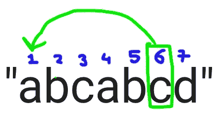

但在 KMP，我们只是简单地做散列(即故障函数)并移动到特定的索引 3。因为我们已经遇到了 ab，为什么要从第 1 个索引开始遍历来重复。

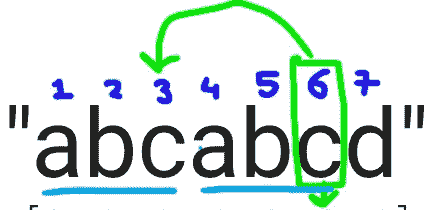

这样我们就避免了重复迭代。

**让我们实现饼状表:-**
*注意:不要在索引中混淆。出于编程目的，我使用 0 作为起始索引，但是在饼状图构造中，它被假定为起始索引 1*

输出:-

```
[0, 0, 0, 1]
```

**字符串匹配:-**

现在，让我们看看如何在 KMP 字符串匹配工程

想想这个，

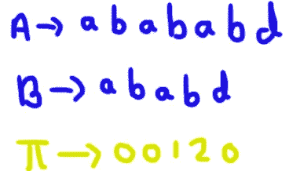

*   首先，abab 匹配了，之后，A 中有 b，而 b 中有 d。
*   所以我们利用失败来运作和跳跃。(注意:B 中第 i+1 个索引不匹配，因此从 I 而不是 i+1 开始跳转)

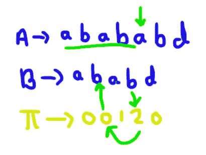

*   现在检查 B 与 A 匹配的下一个索引，继续。

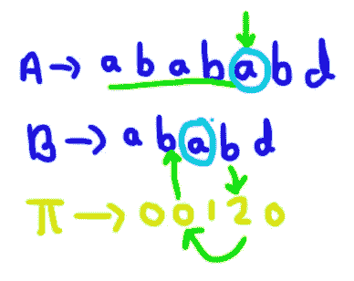

*   在那之后，有 abd 与 B 完全匹配，因为在 A 中，我们到达了终点，在 B 中也到达了终点。我们已经找到了子串。

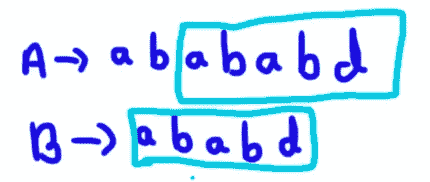

这就是 KMP 减少额外迭代的方法。

参考下图，看看它是如何匹配的

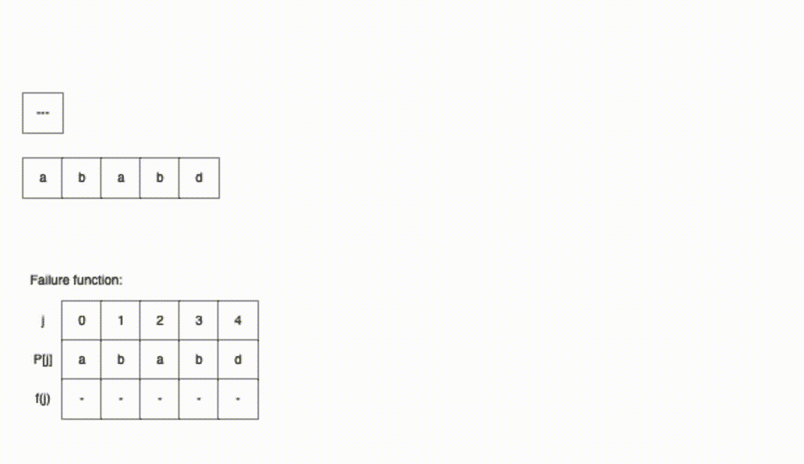

**实现 KMP 算法**

我们有 A 弦“abacaabaccabacabaa”和 B 弦“abacab”

```
A = "abacaabaccabacabaa"
B = "abacab"
```

首先，准备好大饼桌。*我正在重新运行上面的饼状图代码。*

```
pie_table = [0, 0, 0, 1]
```

输出:

```
A_index: 1,B_index: 0, A value 'H', B value'T'
A_index: 2,B_index: 0, A value 'I', B value'T'
A_index: 3,B_index: 0, A value 'S', B value'T'
A_index: 4,B_index: 0, A value ' ', B value'T'
A_index: 5,B_index: 0, A value 'I', B value'T'
A_index: 6,B_index: 0, A value 'S', B value'T'
A_index: 7,B_index: 0, A value ' ', B value'T'
A_index: 8,B_index: 0, A value 'A', B value'T'
A_index: 9,B_index: 0, A value ' ', B value'T'
A_index: 10,B_index: 0, A value 'T', B value'T'
A_index: 11,B_index: 1, A value 'E', B value'E'
A_index: 12,B_index: 2, A value 'S', B value'S'
A_index: 13,B_index: 3, A value 'T', B value'T'
Substring found at index {} 10
```

上述示例的整个跟踪过程如下:

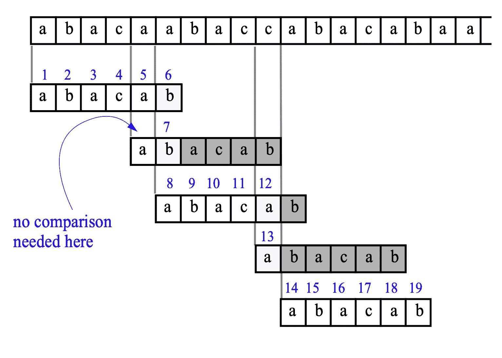

参考下图，了解如何追踪:

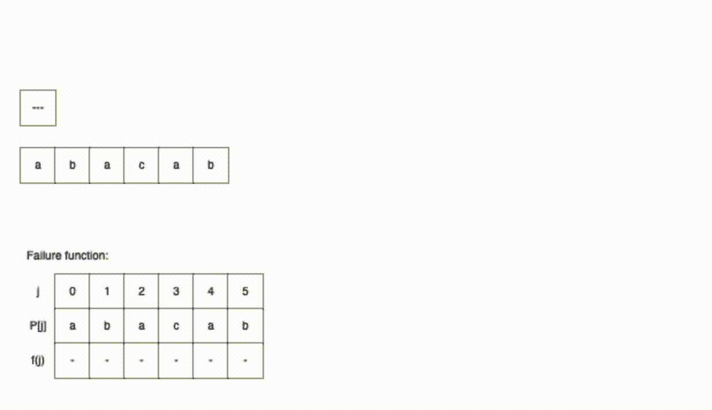

**示例 2:**
让我们想象一下下面的字符串
A = "这是一个测试文本"
B = "TEST"
是如何匹配的

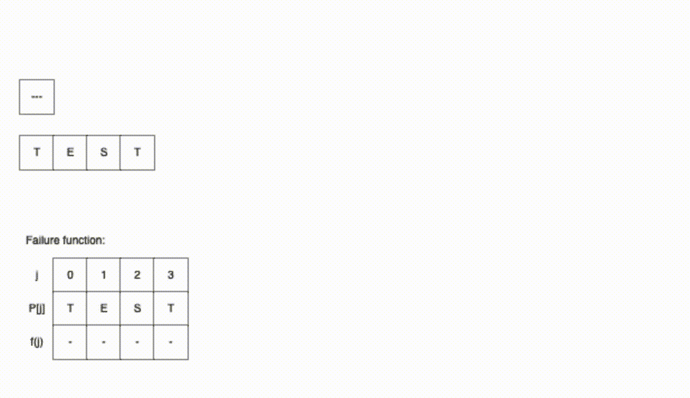

**分析 KMP 算法**

**(1)饼状表准备**

*   为了构造饼图，我们迭代 B 串的所有字符，即 O(m)时间。
*   此外，饼形表也消耗空间，所以空间复杂度也是 O(m)。

**(2)搜索时间**

所以这里 A 指数总是向前移动，我们从不迭代。所以这是在 O(n)中完成的，现在在每次迭代中执行散列，即失败函数，但是散列需要 O(1)时间。此外，在 while 循环的每次迭代中，会发生以下三种情况之一。

1.  A[A _ 索引]= = B[B _ 索引]
2.  A[A_index]！= B[B_index]和 B_index < 0
3.  A[A_index] != B[B_index] and B_index > 0

因此，最多需要 2*len(A)次迭代，即 O(n)次，空间为 O(1)。

**整体时空复杂度**

时间复杂度:O(m+n)
空间复杂度:O(m)

# 拉宾-卡普字符串匹配

Rabin-Karp 字符串搜索算法使用哈希函数来加速搜索。

1.  计算模式的哈希值，以及要比较的每个 M 字符的文本子序列的哈希值。
2.  如果哈希值不相等，算法将计算下一个 M 字符序列的哈希值。
3.  如果哈希值相等，算法将在模式和 M 字符序列之间进行强力比较。

*   这样，每个文本子序列只有一次比较，只有当哈希值匹配时才需要使用暴力。

例如，如果我们想在 T="ababaac "中查找 P="bab "，让我们看看算法的步骤:

这里，散列函数基于 ASCII 码的总和。例如，a 的 ASCII 码是 97，b 是 98，那么 H('aba') = 97+98+97 = 292。

在这里，您还可以看到，对于“aac”和“bab ”,哈希值匹配，但实际上，字符串不匹配。因此，拥有一个好的散列函数是非常重要的。

因此，对于良好的散列函数，如多重散列函数，有各种建议的方法。因此，当一个哈希函数出现不匹配时，请检查下一个哈希函数。

**滚动哈希函数**

基本上，我们可以通过定义窗口大小并对所有字符求和来计算序列的哈希值。但是要在线处理它(意味着一收到字符就处理)，我们可以使用滚动散列函数。因为存在直接从用户接收输入字符并且我们从一开始就不知道的各种情况。

这很简单。下面的可视化展示了我们如何在运行时或在线处理期间计算散列。

假设我们一次处理 3 个字符，而‘a’的 ASCII 码是 1。

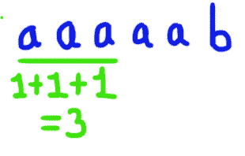

基本上，我们正在减去前一个字符，并添加一个新的字符。

**用一个简单的哈希函数实现 Rabbin Karp 算法**

*   这里我们将使用 ASCII 的和作为我们的散列函数。
*   让我们按照上面的例子定义两个字符串。一个是图案，另一个是文字。

```
A = 'ababaac'
B = 'bab'
```

*   让我们定义一个散列函数，它返回子序列的散列值

```
def hash_fun(string_input):
    sum_ = 0
    for ch in string_input:
        sum_+=ord(ch)
    return sum_
```

*   最初，我们对 A 和 B 都应用散列函数，之后，我们使用滚动函数。

```
window_size = len(B)hash_B = hash_fun(B)
print("hash of b: ",hash_B)
hash_A = hash_fun(A[:3])
print("hash of A: ",hash_A)>>> hash of b:  293
>>> hash of A:  292
```

*   现在，我们需要一个函数来检查两个字符串是否相同，或者只有一个相同的散列。

```
def naive_compare_strings(str1,str2):
    for i in range(window_size):
        if str1[i] != str2[i]:
            return False
    return True
```

*   现在，我们使用滚动散列函数开始比较。

```
for i in range(3,len(A)):
    hash_A = hash_A + ord(A[i]) - ord(A[i-(window_size)]) #Add new value and subtract old value#

    print("Hash for sequence ",(A[i+1-(window_size):i+1])," is ",hash_A)

    if hash_A == hash_B:
        isSame = naive_compare_strings(A[i+1-(window_size):i+1],B)
        if isSame:
            print("Match found")
        else:
            print("Mismatch (Spurious Hit)") >>> Hash for sequence  bab  is  293
>>> Match found
>>> Hash for sequence  aba  is  292
>>> Hash for sequence  baa  is  292
>>> Hash for sequence  aac  is  293
>>> Mismatch (Spurious Hit)
```

## **拉宾卡普建议的哈希函数(拉宾指纹函数)**

*   弱哈希函数总是会导致虚假命中。
*   因此，Rabbin Karp 引入了他自己的哈希函数，如下所示。

假设我们有一个定义为' b '的基数，并将 ASCII 码映射为整数 t[i]。M 是文本的长度。

那么，散列函数将如下:

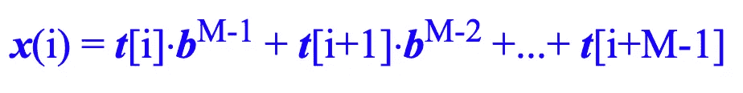

让我们用这个例子来理解上面的散列函数

我们有字符串“abaa ”,并且我们使用默认的 ASCII 到整数映射表。其中 a = 97，b = 98。我们使用基数 b=10。

```
s = 'abaa'
M = len(s)
b = 10
```

x = 97*(10)^(3)+98 *(10)+97 *(10)+97*(10)⁰= 107867

```
x = 97*(10)**(3) + 98*(10)**2 + 97*(10)**1 + 97*(10)**0
print(x) >>> 107867
```

所以，这是一个非常强大的哈希函数，与之前的不同。

> 现在，由于合成值如此之大，Rabbin-Karp 建议通过计算 P 的模数来结束本文
> *其中 P 是一个质数，它应该足够大*

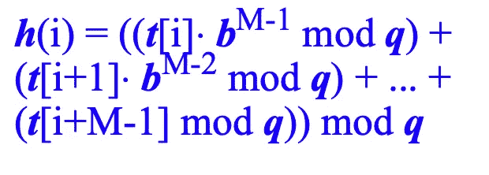

假设 P = 1007，那么 x[i] mod P = 118

```
P = 1007
x = (97000%P + 9800%P + 970%P + 97%P)%P
print(x)>>> 118
```

算法的其余部分保持不变。

**滚动功能如下**

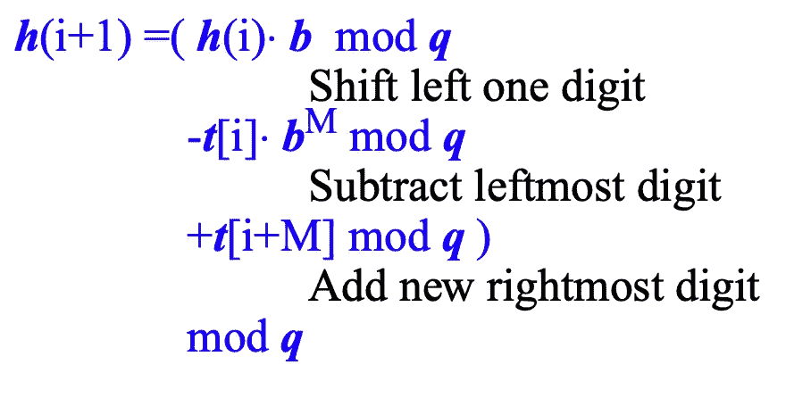

**让我们用兔子指纹函数**来实现上面的代码

```
A = 'ababaac'
B = 'bab'window_size = len(B)def hash_fun(string_input):
    sum_ = 0
    M = window_size
    b = 10
    P = 1007
    for ch in string_input:
        sum_ += (ord(ch)*b**(M-1))%P
        M -= 1
    return sum_%Phash_B = hash_fun(B)
print("hash of B: ",hash_B)
hash_A = hash_fun(A[:3])
print("hash of A: ",hash_A)>>> hash of B:  798
>>> hash of A:  707
```

*输出:-*

```
Hash for sequence  bab  is  798
Match found
Hash for sequence  aba  is  707
Hash for sequence  baa  is  797
Hash for sequence  aac  is  699
```

如你所见，我们现在没有杂散击中。因此，散列函数越好，虚假命中就越少。

**分析算法:**

*   如果散列函数使用足够大的素数，两种不同模式的散列值通常是不同的。
*   如果是这种情况，搜索平均需要𝜃(𝑁时间，其中 n 是大部分文本中的字符数。
*   总是可以构建一个最坏情况复杂度为 O(MN)的场景。然而，只有当用于散列的素数很小时，这种情况才有可能发生。
*   拉宾卡普的空间复杂度是 O(1)

*谢谢你！*

可以参考下面完整的 ipynb 笔记本[https://gist . github . com/pritu L2/06 a2 DCE 857133 b 4357 e 32d 70 de 19 bcfc](https://gist.github.com/pritul2/06a2dce857133b4357e32d70de19bcfc)