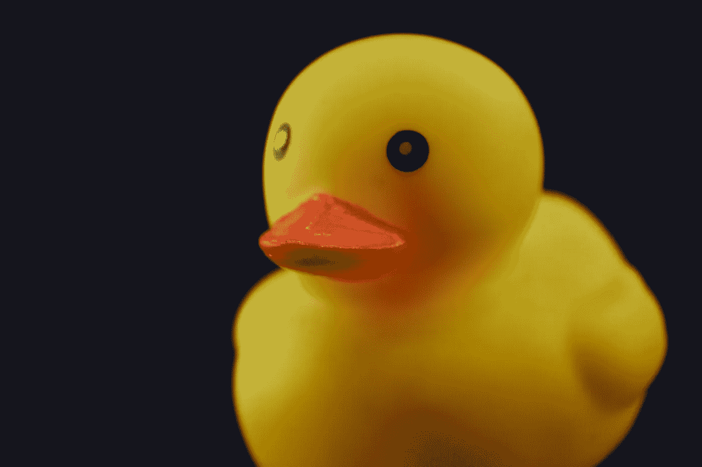
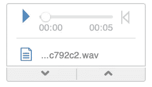

# 用 Mathematica 简单过滤音频亵渎

> 原文：<https://blog.devgenius.io/naive-filtering-of-audio-profanity-with-mathematica-6db3e0cebf6d?source=collection_archive---------4----------------------->

你有没有这样的时候，你懒得手动发出所有的脏话？我可能有一个回避的答案。



照片由[阿曼多](https://www.pexels.com/@armando-are-221834?utm_content=attributionCopyText&utm_medium=referral&utm_source=pexels)从[像素](https://www.pexels.com/photo/close-up-photo-of-a-yellow-rubber-duck-3759364/?utm_content=attributionCopyText&utm_medium=referral&utm_source=pexels)

# 电动吊杆

我最近在 YouTube 上看了一个来自 [ElectroBOOM](https://www.youtube.com/user/msadaghd) 频道的视频，他制作了一个“ [& #！$%ing 按钮](https://www.youtube.com/watch?v=3hQvydvjaiM)“发出哔哔声，审查一系列的脏话和亵渎。

由于我对实际的物理电子学知之甚少，所以我想知道对于我们的软件工程师来说，是否有比硬件工程师更简单的解决方案。

# 高级软件

所以不要浪费时间在低级语言上，最近看了一个关于修改过的 Wolfram 语言音频功能的视频，我决定尝试一下 Mathematica。是的，我知道，我知道。除非你喜欢真正的挑战，否则你至少需要 12 版本才能超越这一点。

你们中有一定年龄的人会知道，我是 Mathematica 的粉丝已经有一段时间了，并把学习它的利基语法和无数的函数视为一种个人终身学习项目。是的，它令人愤怒，但当你难得地洞察到它微妙的力量，阳光透过看似巨大的围墙时，它也极其强大。

# 获取音频

录制一些音频非常简单，

`recording = AudioRecord[]`

对着你的麦克风说一些话，当你完成的时候就打出来，

`AudioStop[recording]`

你会得到一段类似这样的音频，



一段音频

在这个阶段使水平正常化是有帮助的，这也很容易，

`talking = AudioNormalize[Audio[recording]]`

以下是我优美的音调和我的原话。

请注意，当我在研究如何做到这一点时，我已经说了大约 100 次了，但讲话非常清晰，口音很重，而且很乏味。

我不是机器人。还没有。

# 将音频分成口语单词和书面文本

在 Wolfram 语言中，音频可以通过多种方式分解。我发现最简单的方法是使用 [AudioIntervals](https://reference.wolfram.com/language/ref/AudioIntervals.html?q=AudioIntervals) []函数，它可以选择自动寻找音频中包含它认为是人类语音的区域。试试这个，

`wordPeriods=AudioIntervals[talking,”VoiceActivity”];`

上面的变量 wordPeriods 将包含一个`{start, stop}`时间点的列表，这些时间点在声音样本中记录语音。根据你说了什么以及你说了多长时间，

```
{{0.01161, 0.10449}, {0.12771, 0.406349}, {0.452789,2.96054},
 {2.98376, 3.70358}, {3.7268, 4.44662}, {4.58594, 5.28254}}
```

有了区域，你就可以省去演讲。使用[地图](https://reference.wolfram.com/language/ref/Map.html?q=Map) []，很好玩的，朋友们不要害怕功能范式。

```
spokenWords=Map[AudioTrim[talking,#]&,wordPeriods];
```

现在我们有了捕获的讲话，我们还需要知道，从文本上看，实际上说了什么。幸运的是，内置函数 [SpeechRecognize](https://reference.wolfram.com/language/ref/SpeechRecognize.html?q=SpeechRecognize) []使得这也非常容易，

```
foundWords=SpeechRecognize[talking]
```

并且会返回一串它能识别的单词，所以尽量比我平时说得更清楚。这是我尝试时返回的结果，

```
i am really tired of this ducking thing
```

在这一点上，检查你的语音片段和识别的单词数量是否相同是很有用的，否则我的 naive⁴方法就不太管用了。所以用[长度](https://reference.wolfram.com/language/ref/Length.html?q=Length) []来检查它们，以获得安慰的快感。

```
spokenWords // Length
foundWords // Length8
8
```

下面是我写的几个函数，一旦我知道了在笔记本里要做什么，

# 对初学者的亵渎

接下来，我想要一个高质量的音调来掩盖日常用语中不时冒出的无数脏话。采纳了 ElectroBOOM 的建议，我生成了一个简单的 1kHz 音调，并在结尾填充了一点静音，这样它就不会卷到下一个单词中了(关于为什么这很有用，请参阅后面的内容)。

```
profanityTone = AudioPad[AudioGenerator[{"Sin", 1000}, 0.5], 0.25]
```

现在，质量这个词通常被理解为亵渎。好吧，我用了可怕的咒骂语“鸭子”、“闪避”、“厨师”和“烹饪”，列了一个简短的清单，就像这样(随意添加你咒骂最多的词——这也是一种宣泄)。

```
profanityList = {"ducking", "cooking", "duck", "cook"};
```

很容易将这些转换成一个规则集，如下所示，看看任何淘气的单词是如何在 CPU 的命令下转换成“哔”声的，

```
ruleset = Map[# -> "beep" &, profanityList]{"ducking" -> "beep", "docking" -> "beep", "cooking" -> "beep",
 "duck" -> "beep", "cook" -> "beep"}
```

现在，我存储在变量 foundWords 中的，之前识别出的单词列表可以被过滤以保护你的眼睛和耳朵。我还放入了一个 [StringSplit](https://reference.wolfram.com/language/ref/StringSplit.html?q=StringSplit) []，所以返回的将是一个列表而不是一个字符串，因为这对下一阶段很有用，

```
finalWords = StringSplit[StringReplace[foundWords, ruleset]]
```

我的结果是这样的。成功它找到了闪避的东西！

```
{"i", "am", "really", "tired", "of", "this", "beep", "thing"}
```

# 把所有的事情都联系在一起

因为我有和口语一样多的文本单词(记得我之前说过这很重要)，我现在可以把它们和我亵渎的 1kHz [正弦](https://en.wikipedia.org/wiki/Sine)波放在一起。

让我们把它放在一个函数里。请记住，在 finalWords 变量中有被替换的单词(见上文),在 spokenWords 中有原始的声音片段。将它们与上面的亵渎音调一起传递给下面的函数。

我打印出两个变量的长度，只是为了确保它们匹配，因为语音识别并不完美，麦克风上的背景噪声有时会被 AudioIntervals[]误听，并被归类为语音。如果它们不匹配，你将得到一个可怕的混乱和大量的红色文本，这是 Mathematica 通常的方式。

> “我将一种更好的方法留给读者作为练习，因为很自然，这是幼稚的——记住。”
> 选择退出责任，作者的未来小说。

所有有趣的事情都发生在 [For](https://reference.wolfram.com/language/ref/For.html?q=For) []循环中，这里检查传入的每个单词列表，看它是否包含单词“beep”。如果是的话，那么亵渎的音调被[播](https://reference.wolfram.com/language/ref/Sow.html?q=Sow) ⁶，否则实际说的话被播。简单。

结果以样本列表的形式返回，需要连接在一起并进行播放。你可以把 [AudioJoin](https://reference.wolfram.com/language/ref/AudioJoin.html) []放在函数中，但是我当时是在笔记本上玩的，所以这样做了。

```
AudioPlay[AudioJoin[result]]
```

为了让你听得开心，最后的闪避结果，

# 改进和升级

需要进行大量的改进，包括以下内容:

*   使用来自原始捕获的单词之间的适当填充来校正采样的语音。目前这项工作还没有完成，重建的演讲听起来可能有点 odd⁷.的味道
*   添加更多有趣的规则，这是非常容易和非常有趣的。
*   让它实时监听麦克风，并通过在重播前引入短暂延迟的封面，发出你最喜欢的脏话。
*   把脏话变成嘎嘎声，这样任何时候你说闪开，它就嘎嘎叫。这条路上充满了乐趣，我想这也是我未来[团队](https://teams.microsoft.com/edustart) ⁸会议的下一站。Mathematica 的乐趣宝库！

[1]:事实上，我最喜欢的编程语言是 C，紧随其后的是 Swift。是的，我有最喜欢的语言。我也讨厌 Java。记住。
[2]:至少从过去的规划来看是这样的。
[3]:Wolfram 语言有一个内置函数，可以处理很多事情。SpeechRecognize[]目前被标记为实验性的，您需要 Mathematica 12.0+版本才能使用它。
【4】:很幼稚，笨重，但是很好玩！精明的读者会注意到，如果他们说出“哔”这个词，它就会发出哔声。喜剧的价值不应该被低估，因为你现在实际上得到的不是发音“哔”而是一个真正的哔！
【6】:函数[播种](https://reference.wolfram.com/language/ref/Sow.html?q=Sow) []和[收割](https://reference.wolfram.com/language/ref/Reap.html?q=Reap) []非常优秀，您应该使用它们。
【7】:人工合成的机器人语音，过去使用这种方法提取单词并重新排列，使音调听起来古怪。可以说，带走了人性。从一部记忆中的科幻电影来看，这听起来可能非常熟悉。
【8】:我不喜欢团队，当然也不赞同团队，但不幸的是，我确实花了一些时间使用它。我宁愿用 [FaceTime](https://apps.apple.com/us/app/facetime/id1110145091) 。