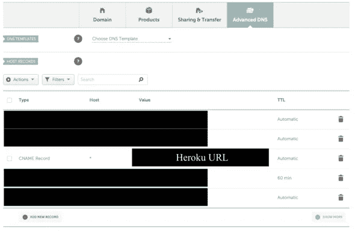
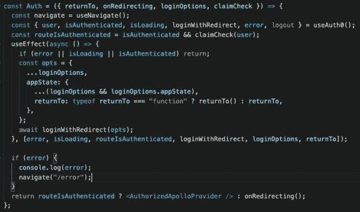
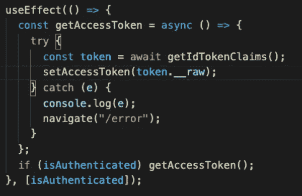

# Namecheap，Webflow，Auth0，Apollo，以及整个 9 码

> 原文：<https://blog.devgenius.io/namecheap-webflow-auth0-apollo-and-the-whole-9-yards-2752a9faaf6d?source=collection_archive---------6----------------------->

与其他帖子截然不同的帖子。我们花了两周时间打造我们的新 MVP，我想分享一下这方面的经验。我将讨论 Namecheap、Auth0 和 GraphQL 的各种问题，当您试图将所有东西结合在一起时，可能会遇到这些问题。

*我不会深究每件事的技术细节，所以这篇文章对那些有软件背景的人来说是最容易理解的。*

*这是一个相当长的，最后见，快乐黑客！*

二月初，我们将想法转向 B2B2C 产品。这样做，我们想到了一个新的名称，并通过 Namecheap 购买了该域名。在各种域名市场中，我发现 Namecheap 是最用户友好的，它内置了所有东西(证书/ssl、域名配置、主机等等)。更重要的是，他们有大量的文档库、操作指南和响应迅速的客户支持。

**将 Heroku & Webflow 连接到 Namecheap**

在第一周内，React 应用程序的初稿就完成了，我正在研究最佳部署策略。最初，我打算使用 AWS，但是 [@kamath_harish](https://twitter.com/kamath_harish) 和 [@lekhasurasani](https://twitter.com/lekhasurasani) 都推荐使用 Heroku。通过 Heroku 部署是如此简单，我想我点击了 3 个按钮。我链接了我们的 Github，可以手动触发`*main*` 分支的部署(有一天我会用 CI/CD 设置自动部署)。

部署完成后，Heroku 允许您为项目创建一个域。我们需要将 Heroku 域映射到从 name price 购买的域。在高级 DNS 设置选项卡下，我创建了一个指向 Heroku 域名的 CNAME 记录。

CNAME 在域名高级域名系统下的记录

对于传统用例，您可以使用 *www* 而不是通配符* *。由于我们应用程序的性质，我们使用通配符方法。我们希望为我们正在合作的每家公司创建子域，并将根域(www 域)指向 Webflow 登录页面。当您准备好托管时，Webflow 提供了非常清晰的说明，因此将登录页面连接到根域非常快。*

## **启用 HTTPS**

你最近什么时候上网，看到过正常的 HTTP 站点？HTTPS 几乎是当今的标准，甚至被纳入谷歌的页面排名算法。

为了启用 HTTPS，你需要升级到 Heroku 的爱好计划。然后从 Namecheap 购买 SSL 证书(我推荐电子邮件验证，因为它是最快的)。接下来，上传到 Heroku。您可以通过 Heroku CLI 上传证书，但我更喜欢 Web UI。

鉴于我们的通配符域用例的性质，我们需要从 Namecheap 购买一个通配符 SSL 证书。将它上传到 Heroku 是很痛苦的，因为我们不断遇到一个奇怪的错误(通过 CLI 和 UI): `... *is currently in use by another app*`。几个小时后，我通过联系客户支持解决了错误，并从那里能够添加通配符证书并启用 HTTPS。

## **用 Auth0 认证**

鉴于我们正在开发一个 B2B 产品，SSO 集成对于最终用户使用他们公司的电子邮件登录至关重要。我过去使用过 AWS 认证，但是 [@SohanChoudhury8](https://twitter.com/SohanChoudhury8) 强烈反对。考虑到不同的选项，我决定使用 Auth0，因为已经有了用于集成 Hasura GraphQL 数据库的[文档](https://hasura.io/learn/graphql/hasura/authentication/1-create-auth0-app/)。

Auth0 有几个特性对我们的用例至关重要。首先是组织。本质上，这是一种将用户分组的方式，一种基于公司组织用户的完美方式。第二是规则。它可用于确定是否允许身份验证，向身份验证令牌添加数据，或完成任何其他类型的功能。归根结底，规则只是 NodeJS 代码。您可以定义多个规则，并且所有规则都必须通过验证才能获得授权。对于我们的用例，我们有 3 个主要规则:验证用户是他们登录的公司的一部分，向数据库查询所需的 auth 令牌添加特殊信息，以及同步用户信息。

出于某种原因，生成的令牌是无效的，我花了太多时间来找出原因。我帮你省点事，文件中有个错误。当您创建用于添加哈苏拉 JWT 索赔的 [Auth0 规则时，将第 3 行的`*accessToken*` *更改为* `*idToken*`。](https://hasura.io/learn/graphql/hasura/authentication/2-custom-jwt-claims-rule/)

Auth0 的另一个重要方面是设置所有的应用程序 URIs:

*   允许的回调 URL:auth 0 将在认证后导航到的 URL(例如 [http://localhost:3000](http://localhost:3000/?utm_campaign=whatever%27s%20on%20my%20mind&utm_medium=email&utm_source=Revue%20newsletter) )
*   允许的注销 URL:用户注销后 Auth0 将导航到的 URL
*   允许的 Web 源:允许定向到 Auth0 进行身份验证的 URL
*   允许的来源:可以调用 Auth0 API 的 URL

## **Auth0 &反应积分**

现在是时候将 Auth0 真正集成到 React 应用程序中了。

`*@auth0/auth0-react*` 库提供了高阶组件(HOC)`[*withAuthenticationRequired*](https://github.com/auth0/auth0-react/blob/master/src/with-authentication-required.tsx)`，可用于保护任何组件(以及路由)。我想用特设包装`*<App />*`组件，从本质上保护整个应用程序。然而，一旦整合，我意识到一个大问题。如果发生身份验证错误(即未授权访问)，则会触发无限循环，其中 Auth0 会重定向到错误状态。我发现了一个 [Github 问题](https://github.com/auth0/auth0-react/issues/122)，其他人也遇到了同样的问题。在这个问题上有很多问题需要解决。

作为创建 Auth0 客户端对象(在 React 中)的一部分，您必须传入一个`*onRedirectCallback*`函数。这定义了认证后 Auth0 应该重定向到哪里。对我们来说，这是发出原始身份验证请求的同一个 URL。例如，如果认证请求是从*www.xxxx.yyyy.com/,*发出的，那么在认证之后，用户应该被重定向到同一个*www.xxxx.yyyy.com/*。但是，如果失败，URL 会变为 Auth0 错误 URL，并且`*onRedirectCallback*` 会重定向到 Auth0 错误 URL，尝试重新认证并触发无限循环。

我不完全同意 Github 问题中的讨论点，因为保护整个`*<App />*`组件是有有效性的。在我看来，应该有更好的方法来处理错误状态。为此，我基于现有的`[*withAuthenticationRequired*](https://github.com/auth0/auth0-react/blob/master/src/with-authentication-required.tsx)` 组件编写了自己的 HOC 组件。

基于需要身份验证的身份验证 0 的自定义临时组件

## **授权为 0 的阿波罗客户端**

如果你仔细观察，你会发现我返回了一个`*AuthorizedApolloProvider*`组件。在 react 中设置普通`*ApolloProvider*`的细节我就不赘述了，因为上面已经有足够的[资源](https://hasura.io/learn/graphql/react/apollo-client/)了。然而，如果使用 Auth0，有一个步骤是不清楚的:获取 idToken。

从 Auth0 获取 idToken

`*getIdTokenClaims*`和`*isAuthenticated*`都来自`*useAuth0*`挂钩。`*setAccessToken*`简单来说就是一个`*useState*`变量。实际的令牌是`*__raw*`值。

## **注销问题**

太好了，现在一切都正常了，对吗？不幸的是，事实并非如此。如果用户能够登录，他们应该能够注销。由于某种原因，当我调用 Auth0 提供的注销处理程序时，什么也没有发生。事实证明，您需要更新租户设置下的*允许的注销 URL*才能真正工作。我不确定为什么这个特殊的设置不像所有其他需要配置的 URIs 一样在应用程序设置下。

## **力 HTTPS**

在购买了 SSL 证书并将它们连接到 Heroku 之后，您可能会认为 HTTPs 在默认情况下是启用的……嗯，不完全是。如果你导航到 [https://aaa。yyy.com，那么是的，HTTPS 将会被使用。但是，如果您只是简单地输入 aaa *.yyy.com* ，那么就使用普通的 HTTP。](https://aaa.yyy.com,)

如果你有一个普通的网站，这很简单，但是使用我们的通配符方法，就不简单了。Namecheap 有关于强制通配符域名 HTTPS 的文档。所以我购买了 Namecheap 虚拟主机，在花了一个周末的时间获得支持后，我了解到它无法通过 Namecheap 进行扩展。Namecheap 要求每个通配符子域(如 aaa.yyy.com、bbb.yyy.com、ccc.yyy.com 等)都要硬编码，以强制 HTTPS。我们支持许多公司，所以这不是一个可扩展的解决方案。另一种选择是[迫使 HTTPS 站在 Heroku 一边](https://help.heroku.com/J2R1S4T8/can-heroku-force-an-application-to-use-ssl-tls)…这并不意味着什么。所以唯一的解决方法是通过 React 应用程序来完成。现在，如果您导航到 HTTP 域，应用程序会将您重定向到 HTTPS 域。我基于 [mbasso 的](https://github.com/mbasso/react-https-redirect)库构建了一个特设的 HTTPS 重定向组件。

## **关闭思路**

回过头来看，所有这些解决方案看起来都像是简单的修补，我同意其中的大部分。然而，找到解决办法的道路并不平坦。我希望这篇文章能帮助任何试图做类似事情的人。如果你想交换意见，请联系我们！