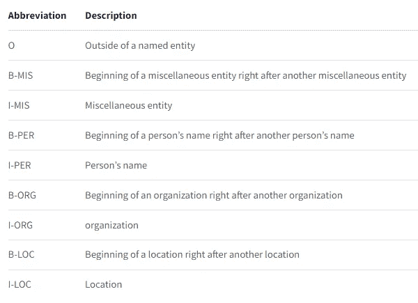
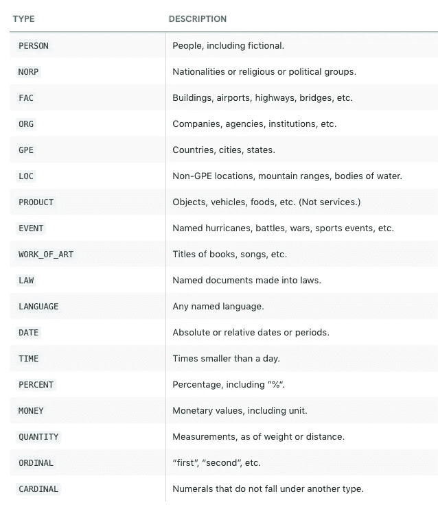

# 命名实体识别(NER)[NLP，Python]

> 原文：<https://blog.devgenius.io/named-entity-recognition-ner-nlp-python-6504d5843f98?source=collection_archive---------3----------------------->


命名实体识别是信息抽取的子任务之一。NER 的主要目的是定位文档中的实体。实体可以是人名、地点名、组织名或任何其他特定的字符串，如日期、故事/文章的名称/数量、产品等等..

## **应用**:

*   内容分类
*   Ques-Ans 发动机
*   新闻/文章推荐
*   用于搜索引擎和许多其他…

一种简单的实现方法是维护一个包含所有已知实体的字典，并进行查找(一种普通的分类器)。但是这里有一个问题…..
假设“苹果股价正在上涨”,如果我们进行查找，我们可能会得到*苹果*作为**水果**而不是**公司**,如果我们不分析环境或考虑背景，这就是问题产生的原因。序列分类器怎么样..？

## 让我们使用 sklearn-crfsuite 实现我们自己的序列分类器

更好的方法是使用**序列分类器**。序列分类是一个预测性的建模问题，在这个问题中，你在空间或时间上有一些输入序列，任务是预测这个序列的类别。

让我们实现我们的序列分类器—

CRFs、HMM 是一些流行的序列分类算法。

我们将使用开源序列标签库 **sklean-crfsuite** 以及标记化的文本(与句子顺序相同以保留上下文)和提供上下文信息的 pos 标签。我们将在 CONLL-03 数据集上训练它。下面是数据集的预览:

```
EU NNP B-NP B-ORG
rejects VBZ B-VP O
German JJ B-NP B-MISC
call NN I-NP O
to TO B-VP O
boycott VB I-VP O
British JJ B-NP B-MISC
lamb NN I-NP O
. . O OPeter NNP B-NP B-PER
Blackburn NNP I-NP I-PERBRUSSELS NNP B-NP B-LOC
1996-08-22 CD I-NP O.........
```



对于杂项，是**杂项**

`"B"`表示一个实体的开始，`"I"`表示它在一个实体内部，`"O"`表示在一个命名的实体
之外，所以如果`B-ORG`表示它是一个实体的开始，这个组织同样适用于其他组织

## 空间实现

spacy 使用的标签列表



您可以在 Notes (第 21–22 页)或 [glossary.py](https://github.com/explosion/spaCy/blob/master/spacy/glossary.py) (来自第 321 行)上查看[。](https://catalog.ldc.upenn.edu/docs/LDC2013T19/OntoNotes-Release-5.0.pdf)

## 使用预训练的 maxent_ne_chunker 实现 NLTK

spacy 和 nltk 实现都有一些问题，比如应该在 spaCy 中检测到`Indian`，应该在 nltk 中检测到`2022`作为日期等等..让我们看看 StanfordNERTagger。

## 使用训练有素的 StanfordNERTagger 实现

斯坦福 NER 也被称为分类器。该软件提供了(任意阶)线性链条件随机场(CRF)序列模型的一般实现。

## 使用预先训练的变压器模型实现

我们使用了基于 BERT 的 ner tagger，你可以在这里读到这个[。](https://huggingface.co/dslim/bert-base-NER)

伯特-基-NER 是一个微调的伯特模型，可用于命名实体识别，并实现了 NER 任务的最先进的性能。它已经被训练识别四种类型的实体:位置(LOC)、组织(ORG)、人(PER)和杂项(MISC)。

这个模型是一个基于 *bert 的*模型，它是在标准 [CoNLL-2003 命名实体识别](https://www.aclweb.org/anthology/W03-0419.pdf)数据集的英文版本上进行微调的。

[](https://nbviewer.org/gist/yashj302/4154d5635e08b97c9bdd6d52c34e6568) [## nbviewer 笔记本

### nlp = pipeline ( "ner "，model = model，tokenizer = tokenizer ) example = " "克什米尔文件是 2022 年印度…

nbviewer.org](https://nbviewer.org/gist/yashj302/4154d5635e08b97c9bdd6d52c34e6568) 

我希望这有助于澄清一些关于 NER 的想法

显然，要使用或制作 NER 标记器，我们需要大量带注释的数据，像 conll-03 这样的数据集仅限于一些实体，如个人、组织、位置和其他。还有其他像 OntoNotes 这样的数据集，它们要大得多，涵盖了不同类型的文本，但它们不是免费的。

你还应该检查 Azure 认知服务，它们有文档摘要、语义分析、实体检测等功能。在这里检查 ner [的 sdk。这里还列出了它支持的实体](https://docs.microsoft.com/en-us/azure/cognitive-services/language-service/named-entity-recognition/quickstart?pivots=programming-language-python)。