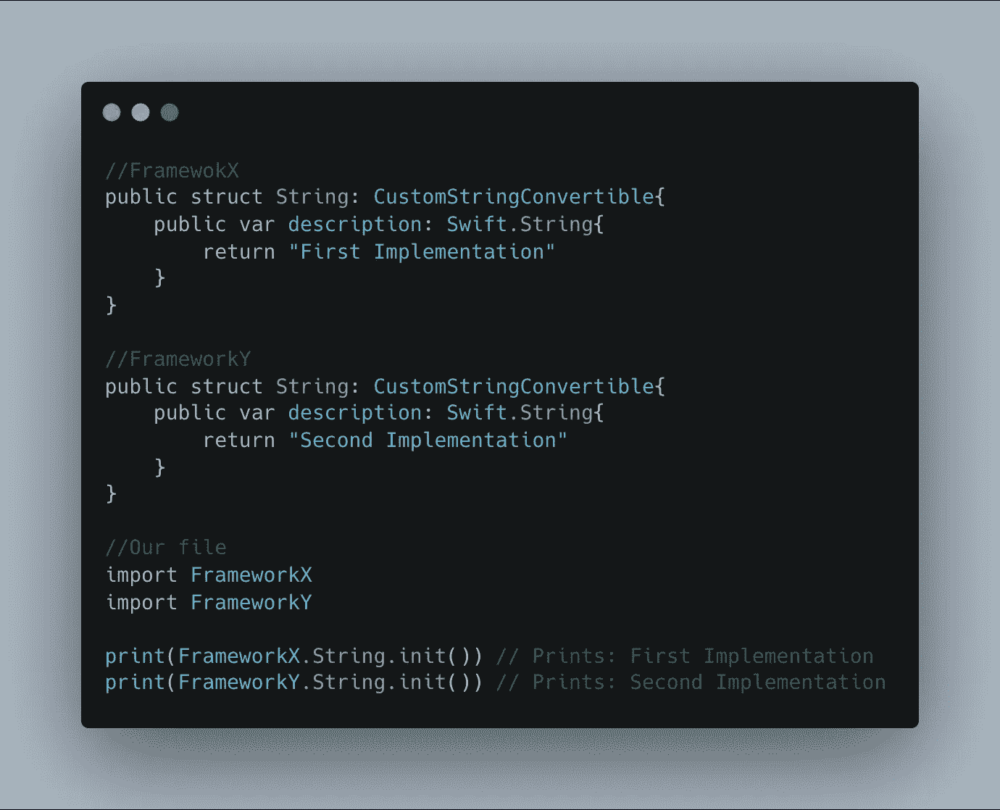

# 名称空间是谈论全局变量的借口

> 原文：<https://blog.devgenius.io/namespace-an-excuse-to-talk-about-global-variables-ed35434c1b5c?source=collection_archive---------9----------------------->

在这篇文章中，我们将了解什么是名称空间，以及我们如何从不必要的变量中清除全局范围。这篇文章是在考虑使用 Swift 语言的情况下写的。

# 目录

*   什么是名称空间？
*   命名空间提示和技巧
*   SwiftUI 框架中的@命名空间
*   关于命名空间的建议

# 什么是名称空间？


它是 python 语言中不同名称空间的饼状图。

*   通常
*   迅速地

## 通常

名称空间是程序的一个区域，它被命名并用于将变量、函数等组合在一起。命名空间为其内部的标识符提供了一个范围。下面列出了命名空间的一些好处:

*   代码组织
*   防止名称冲突。
*   提供封装

**代码组织** 一般来说，命名空间允许我们将代码分组，并将代码分成不同的区域，每个区域都有自己的变量和函数集。这简化了我们的编程过程，并清除了全局 scobe 中不需要的标识符(类型、函数、变量等的名称)。

**防止名称冲突** 当我们将所有代码存储在一个名称空间中时，名称冲突的可能性增加了，但是将我们的关注点划分到不同的主名称空间将有助于防止冲突。

提供封装
我们主要担心的一个问题是封装，封装认为一个类、结构等应该只能访问需要它们操作的东西，而不能更多。创建不同代码区域的名称空间为我们封装代码提供了更好的机会。

## 迅速地

*   描述
*   导入语句

**描述** 不幸的是，命名空间没有被明确地处理。在 Swift 中，所有类型、变量等都由模块自动确定范围，这对应于 Xcode 目标。

大多数时候，不需要模块前缀就可以访问内置标识符，比如 Int、String 等。

```
var randomNmber = Int.random(in: 0...10)
print(randomNumber)
/*
Result-----
A number between 0 and 10
*/
```

在上面的例子中，虽然 Int 结构是在文件外部声明的，但是它是可访问的并且是自动构造的。

但是如果我们想要一个同名的结构会怎么样呢？

```
struct Int{}
var randomNmber = Int.random(in: 0...10)
print(randomNumber)
/*
Result-----
Error: Type 'Int' has no member 'random(in:)'
*/
```

发生这种情况是因为在冲突的情况下，局部类型遮蔽了外部类型。为了解决这种模糊性，必须明确提及名称空间(正如在“Swift”是所有预定义和预声明标识符的名称空间之前所提到的)。

```
var randomNmber = Swift.Int.random(in: 0...10)
```

这样，我们既可以有一个本地 Int，也可以访问预定义的 Int。

注意:如果我们有两个不同的框架，它们都实现了两个同名的不同类或结构，我们需要导入它们，因此将它们都导入到一个文件中，我们应该明确指定我们想要使用哪个框架和哪个类。



**导入语句** 按子模块导入:你要注意，类和模块是有层次架构的。当我们想要导入一个类或模块时，我们无意中导入了它的所有子模块。

```
**import** UIKit.NSAttributedString**func** foo() -> UIView { **return** UIView()}
```

在这里，例如，我们只是导入了一个 NSAttributedString，但是 UIView(整个 UIKit 和 Foundation)也是另外导入的。

那么我们能做些什么来解决这个问题呢？答案带在下面:

按符号导入:只有导入的符号(而不是声明它的模块)在当前作用域中可用:

```
import class UIKit.NSAttributedString func foo() -> UIView {  return UIView() }/*
Result-----
Error: Use of undeclared type 'UIView'
*/
```

个人观点:
所以我的观点是，我们应该只导入那些我们需要的类和结构，例如，如果我们想在 SwiftUI 中扩展 Color，我们不需要导入整个 SwiftUI，我们应该只导入 Color 结构。

# SwiftUI 框架中的@命名空间

在 SwiftUI 中，苹果开发人员为我们提供了一种可能性，可以将视图从一个动画到另一个，并与它们进行交互，就好像它们是同一个视图一样，我说的是“SwiftUI 匹配几何效果”(更多信息请阅读 [this](https://swiftui-lab.com/matchedgeometryeffect-part1/) )。

基本上，它让你能够将两个不同的视图同步为一个视图，并从一个视图到另一个视图制作动画。如果同一视图出现在视图层次结构的两个不同部分，并且想要在它们之间设置动画效果(例如，从列表视图到缩放的详细视图),那么可以使用匹配几何效果。


[https://swiftui-lab.com/matchedgeometryeffect-part1/](https://swiftui-lab.com/matchedgeometryeffect-part1/)

使用匹配几何效果的一个例子。

因此，只有当您可以指定哪些视图应被视为一个视图以及从一个视图到另一个视图的步骤时，匹配的几何效果才能正确工作。第二部分(一个视图到达第二个视图必须经历的步骤)不是我们现在关心的主题，而是第一部分(指定哪两个视图应该被认为是一个视图)。

我们通过给视图一个 ID 和一个名称空间来指定视图。名称空间使得在一个地方不存在两个不同视图的两个相同的 ID 成为可能，并且它通过将视图和 ID 封装在不同的名称空间中来将它们彼此分开。

下面是相应结果的示例:


# 关于带有枚举的命名空间的建议

不幸的是，在 swift 中没有创建名称空间的直接方法，但是您可以考虑使用数据结构，比如枚举。

枚举当然不能用于所有事情，但在某些情况下，如管理应用程序或资产中的颜色，可以使用。请注意下面的例子:


现在，我们可以将颜色字符串和资产字符串封装在各自的颜色和资产枚举中，而不是污染全局名称空间。

那么为什么是 enum 呢？与结构不同，枚举没有合成的初始值设定项；与类不同，它们不允许子类化，这使它们成为模拟名称空间的完美候选。

正如您在上面的代码示例中看到的，您甚至可以将不同的关注点分组到一个大的枚举中，并为该关注点的不同区域创建多个子枚举，例如，您可以拥有一个包含颜色、字体等的 StyleGuide 枚举，或者拥有一个包含您通过应用程序使用的所有图像、图标、插图等的 Asset 枚举。这里我带来了一个 styleGuide enum，用于演示我在一个项目中使用过的内容。


# 结论

现在你会想我们在哪里讨论过全局变量？你说得对，我们至少到现在才知道。使用全局变量，让它们到处出现，确实会给我们带来很大的麻烦，原因有几个。简而言之，它们可以通过所有的应用程序环境访问，事实上，我们无法监控可能导致访问它们的过程，这可能会导致我们进行繁琐的调试过程，长话短说，它们令人毛骨悚然，它们使全局名称空间过于拥挤，等等。

这取决于我们开发人员创造更好的编程和开发应用程序和模块的体验，我认为我们应该考虑和采用每一个和任何一个可以在尊重软件工程概念的同时简化过程和改善开发体验的行动。在这种情况下，我认为使用枚举可以是一个巨大的推动。确保你知道如何以及何时可以使用它们，然后去做，不要问任何人。