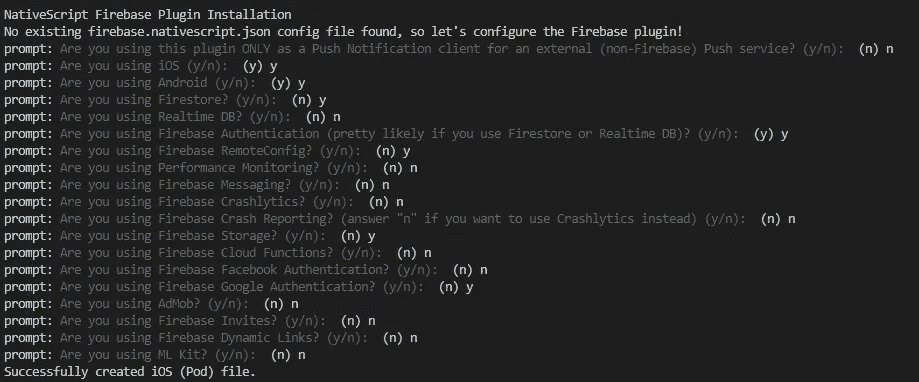

# Nativescript & Firebase:安装和第一步

> 原文：<https://blog.devgenius.io/nativescript-firebase-installation-and-first-steps-19e65ca46be4?source=collection_archive---------8----------------------->

## 在 Firebase 平台上开始使用 Nativescript 的快捷方式


在本教程中，我们将了解如何通过 Firebase 使用 **Nativescript 框架，Firebase**是一个 web 和移动应用开发平台，为开发人员提供各种工具和服务，如**登录、实时数据库、分析等……**，帮助他们开发高质量的应用，而无需从头开始设置后端服务器。

他们的目标是减少后端开发人员的工作量，而不必认真考虑我们的应用程序能够做什么，事实上，除了众所周知的服务，如**认证、数据库的使用和文件的保存**，我们还可以插入自定义代码以在服务器上运行，并放置我们的后端逻辑，而无需任何设置工作。


> 我们将使用 **Angular + Typescript** 组合来开发我们的 Nativescript 应用程序。

**Angular 和 Firebase** 目前被认为是**非常适合 web 应用开发的两种技术**，并且很长一段时间以来，一些开发人员已经构建了允许将 Firebase JavaScript 库集成到 Angular 中的模块。

正如预期的那样，我们的 Nativescript 应用程序将在 Angular 上运行，但这不足以让我们认为上面提到的库将与 Nativescript 完全兼容，这**需要一些注意，以区分 web 应用程序和移动应用程序的开发**。

> Nativescript 不像 Ionic 等其他混合应用框架那样使用 Web 视图，但它会创建一个本地代码

在 Nativescript 中，他们决定将 Angular 中我们称之为**“模块”**的东西重命名为**“插件”**，我们可以在官方市场上找到它们，我们感兴趣的是由 **Eddy Verbruggen** 开发的专用于 Firebase 的那个，Eddy Verbruggen 是这个框架的大力支持者，他通过开发非常有用和有趣的插件，积极地为后者的发展做出贡献。

> 为了开发我们的应用程序，我们将使用它的插件，这将使我们能够在 Android 和 IOS 设备上与 Firebase 和 native script 100%兼容

# 先决条件

为了遵循本教程，我们将假设**NodeJS 环境和 Nativescript 库已经安装在您的计算机**中，并且您已经具备了**Angular 和 Nativescript 开发的基础知识**。

## 开始吧！

# Nativescript 插件安装


我们需要做的第一件事是**创建一个新的 Nativescript 应用程序**，我们将使用**官方空白模板**并通过 **Natviscript CLI** 创建它。

在您的安装脚本中，您必须编写您的应用程序的 **id，因为我们需要它来进行 Firebase 配置**

```
tns create firebasedemo --template tns-template-blank-ng  --appid io.your_creator_id.firebasedemo
```

成功创建应用程序后，进入文件夹

```
cd firebasedemo
```

为了将 Firebase 库集成到我们的 Nativescript 应用程序中，我们需要添加由 Eddy Verbruggen 开发的[Firebase 插件](https://github.com/EddyVerbruggen/nativescript-plugin-firebase)


```
tns plugin add nativescript-plugin-firebase
```

> 在安装过程中，系统会询问您想要使用哪些服务，以便只下载必要的依赖项。



这一步取决于你需要对你的应用做什么，在这一点上，我建议你去**看看 Firebase 提供的服务列表**你就知道你的应用需要哪些服务了。

# Firebase 项目设置

打开[https://console.firebase.google.com](https://console.firebase.google.com)，使用你的谷歌账户进行认证**按照指示的步骤创建一个新项目**，非常简单。


当项目创建完成后，您需要通过添加一些关于您的应用程序的信息来设置 Android 和 iOS 配置。


之后，从 Firebase 仪表盘中取出 Android 的 **google-services.json** 文件和 iOS 的**Google service-info . plist**文件，按照说明将它们正确地放入项目文件夹中


现在，让我们在 Android 或 iOS 上启动应用程序，在模拟器上查看我们应用程序的第一个预览，以确保一切正常，或者如果您想通过 Nativescript Playground 在您的设备上查看它，请启动 **tns 预览**。

# Nativescript 中的 Firebase 实现

> 在 Nativescript 中实现 Firebase 非常简单，我们只需要几行代码来验证安装是否成功

第一步是导入 Eddy Verbruggen 插件并初始化，正如其 GitHub 文档所建议的，插入 app.component 中的所有内容，插入插件导入并在 **OnInit 事件中初始化。**

如果你像我一样使用 Visual Studio 代码,在项目终端你应该会看到这个消息

> firebase.init 完成

这表示应用程序已成功初始化。

感谢阅读！