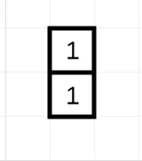

# 自然的密码——斐波那契增值贴

> 原文：<https://blog.devgenius.io/natures-code-a-fibonacci-appreciation-post-d858377a334a?source=collection_archive---------10----------------------->

我们中的一些人可能在早期的编程/数学课上接触过“斐波那契数列”。这是一个如下的数学序列:

> *1，1，2，3，5，8，13，21…等等*

斐波那契数列，对我来说只是一个数列，直到最近，当我了解到它的所有魔力。我姐姐和我正在谈论模式，不知何故话题转向了斐波那契数列。她告诉我斐波那契模式在自然界可以被广泛观察到。这对我来说完全是新闻，我很低调，我不知道早些时候。但是，嘿，迟到总比不到好，对吧？所以我在网上查了一下，这篇文章提炼了斐波那契数列如何作为自然的密码。

# 什么是斐波那契模式？

这里的模式是，序列中的每个数字都可以通过将前面的两个数字相加来生成。

## 例如:

序列中的第 6 个数是 8，它可以由序列中的第 5 和第 4 个数 5 和 3 之和生成。

因此，序列中的第 n 个数在数学上可以表示为:

> *x(n) = x(n-2) + x(n-1)*

# 斐波那契数列—可视化

为了更好地理解这幅图，让我们用图像的形式来形象化这个序列。可以通过以下方式将盒子堆叠在一起来显示顺序:

1.  首先让我们从一个一维的方盒子开始
2.  逆时针方向移动，沿着到目前为止形成的矩形的长度堆叠另一个正方形盒子。这个新的正方形盒子的尺寸应该是到目前为止形成的矩形的长度。

## 让我们一步一步来:

1.  我们从一个 1 维的方盒子开始

2.至此形成的矩形的长度为 1。因此，我们将沿着到目前为止形成的矩形的长度堆叠一个大小为 1 的正方形盒子。

3.至此形成的矩形的长度为 2。因此，我们将沿着到目前为止形成的矩形的长度堆叠一个维度为 2 的正方形盒子。

4.至此形成的矩形的长度为 3。因此，我们将沿着到目前为止形成的矩形的长度堆叠一个维度为 3 的方盒子。

5.至此形成的矩形的长度为 5。因此，我们将沿着到目前为止形成的矩形的长度堆叠一个维度为 5 的正方形盒子。

6.我们可以继续像这样堆叠盒子

让我们记下在此过程中堆叠的方块的尺寸:

1,1,2,3,5,8,13,21, ….斐波那契数列！

# 斐波那契螺旋

更有趣的东西。让我们从第一个方块开始画一条曲线，沿着逆时针方向移动，覆盖所有的方块。

这个曲线看着眼熟吗？这是斐波那契螺旋，可以在很多地方找到，比如:

1.  [鹦鹉螺壳](https://www.goldennumber.net/nautilus-spiral-golden-ratio/)
2.  [松果](https://www.khanacademy.org/math/math-for-fun-and-glory/vi-hart/spirals-fibonacci/v/doodling-in-math-spirals-fibonacci-and-being-a-plant-1-of-3)
3.  [罗马式西兰花](http://www.maths.surrey.ac.uk/hosted-sites/R.Knott/Fibonacci/fibnat.html#veg)

斐波那契螺旋在自然界中无处不在，以至于它被亲切地称为*大自然的代码*。例如，植物更喜欢所有的叶子都得到最大限度的阳光照射。这可以通过让叶子以不重复的角度生长来确保，这样叶子就不会重叠太多，并获得公平的阳光照射。值约为 1.618 的 Phi (φ)是一个无理数，它保证了这一点。因此，叶子通常以这个角度生长。此外，取斐波纳契数列中任意两个相邻数字之间的比率，您可以看到我们越来越接近 Phi 值。

1/1 = 1

2/1 = 2

3/2 = 1.5

5/3 = 1.66

8/5 = 1.6

13/8 = 1.625

21/13 = 1.615

…以此类推，越来越接近 Phi (φ)的值~1.618。

这个数字也被称为 ***【黄金比例】*** 并且在各种事物中都有应用，比如[摄影](https://expertphotography.com/golden-ratio-photography/)[艺术、建筑](http://jwilson.coe.uga.edu/EMT668/EMAT6680.2000/Obara/Emat6690/Golden%20Ratio/golden.html)等等。

虽然斐波那契数列可以在很多地方被发现，但有些人声称我们夸大了它，并倾向于在不一定符合它的事情上强行适应它。这遵循了一个想法，即一旦我们看到一个模式，我们很可能在其他事情上也雕刻出同样的模式。也就是说，我从一个完全不同的角度重温了斐波那契数列并学习了它们，希望你也一样。

哦，嘿，既然你已经走了这么远，这里有一个笑话给你:

> 为什么吉姆不擅长开斐波那契的玩笑？因为他的最后两个笑话不合情理😛

# 参考

如果你迷上了，可以看看这个视频，它对植物中的斐波那契模式有很好的解释