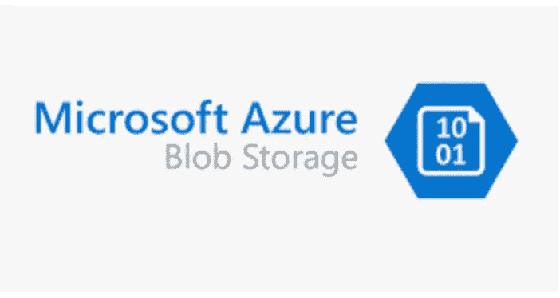

# 使用 Java 客户端导航 Azure 存储验证选项

> 原文：<https://blog.devgenius.io/navigating-azure-storage-authentication-options-using-a-java-client-d8ab31e12308?source=collection_archive---------6----------------------->

这篇博客是我们从零开始讨论**云**概念的系列文章的一部分，面向的是入门知识有限的读者。本文属于*中级*系列，因为它涉及到理解[**Azure 存储帐户**](https://docs.microsoft.com/en-us/azure/storage/common/storage-account-overview) **t.** 的可用认证选项

云系列中的一些早期博客如下。

[**GCP 大查询第一 Python 连接器**](/gcp-big-query-writing-my-first-python-connector-1140b022b88a)[**Azure 造价自动化**](/automating-your-monthly-azure-cloud-cost-spends-a51257a6564f)[**Azure Cosmos RBAC 认证**](/azure-cosmos-db-rbac-authentication-using-a-java-client-720b20c637fe)



# Azure 存储帐户—概述

Azure Storage 是一个通用的命名空间，用于存储各种类型的数据，具体形式为 *blob、队列、表格和磁盘*，具体取决于正在解决的整体云原生用例。从更广的层面来看，存储帐户有两种类型-

## **标准用途存储账户**

它们主要用于日常用例，在性能和 IOPS 方面处于低端，因为它们使用 [**硬盘**](https://en.wikipedia.org/wiki/Hard_disk_drive) 来存储数据。它们支持优步 Azure 存储支持矩阵中的所有类型的数据集。

## **高级存储账户**

顾名思义，这些存储帐户用于服务于更高性能的用例，因为它们通过将数据存储在 [**SSD**](https://en.wikipedia.org/wiki/Solid-state_drive) **上来提供更好的 IOPS 吞吐量。**他们不支持优步 Azure 存储支持矩阵中所有的*队列*和*表*类型的数据集。


Azure 存储帐户中的身份验证方法可以使用三种不同的选项来实现-
i)访问密钥。
ii) SAS 令牌。iii) Azure 活动目录令牌。

## 访问键

访问密钥是默认的基于密码的身份验证机制，具有长期的有效性。这些工作在帐户的名称空间级别，即同一帐户内的所有 ***文件、blobs、队列等*** 共享相同的*主/次*密钥进行访问。使用访问键*不支持操作方面的细粒度访问— ***读、写、创建等*** 。*在定期轮换之前的有效期内，这些产品具有最大的安全风险。


**Azure Blob 访问密钥**

**样本客户端**

**访问密钥- Java 客户端**

## SAS 令牌

共享访问签名向客户端提供受限访问，以使用 Azure 存储帐户进行身份验证。它们的范围是单个容器，而不是优步存储帐户的命名空间。由于创建时有一个过期时间，超过该时间后，它们对身份验证无效，因此它们优化了旋转密钥的操作需求。此外，这些令牌支持基于权限的访问- ***读、写、创建*** ，这有利于创建 ***只读/只写客户端*** ，以支持给定业务用例的数据访问需求。


**Azure Blob SAS 令牌**

**样本客户端**

**SAS 令牌- Java 客户端**

## Azure Active Directory 令牌

使用在 Azure 目录租户中创建的身份，我们可以在 Azure Blob 存储帐户中创建由 RBAC 访问支持的短期令牌。可以使用 [**内置存储角色**](https://docs.microsoft.com/en-us/azure/storage/blobs/assign-azure-role-data-access?tabs=portal) **在 Azure 存储帐户的名称空间级别或在单个容器级别为这些身份分配各种细粒度权限。**

**设置广告应用**

*   为了设置一个广告应用程序，在 Azure 门户的搜索栏中进入 **Azure Active Directory** 。
*   从左侧选项卡中，点击**应用程序注册**并创建一个具有用户友好名称的新应用程序。
*   需要 ***租户 ID、应用 ID 和客户端凭证*** (仅一次查看)来验证客户端并生成临时令牌。


**分配权限**

```
az loginaz role assignment create --role "Storage Blob Data Contributor" --assignee-object-id <object id of the above ad application> --scope "/subscriptions/<subscription>/resourceGroups/<resource-group>/providers/Microsoft.Storage/storageAccounts/<storage-account>/blobServices/default/containers/<container>"
```

**样本客户端**

# 额外资源

[](https://github.com/amit894/java-blob-client) [## GitHub-Amit 894/Java-Blob-client:Azure Blob 机制的身份验证

### 此时您不能执行该操作。您已使用另一个标签页或窗口登录。您已在另一个选项卡中注销，或者…

github.com](https://github.com/amit894/java-blob-client) 

*如需反馈，请留言至****Amit[dot]894[at]Gmail[dot]com****或联系 https://about.me/amit_raj**的任意链接。*