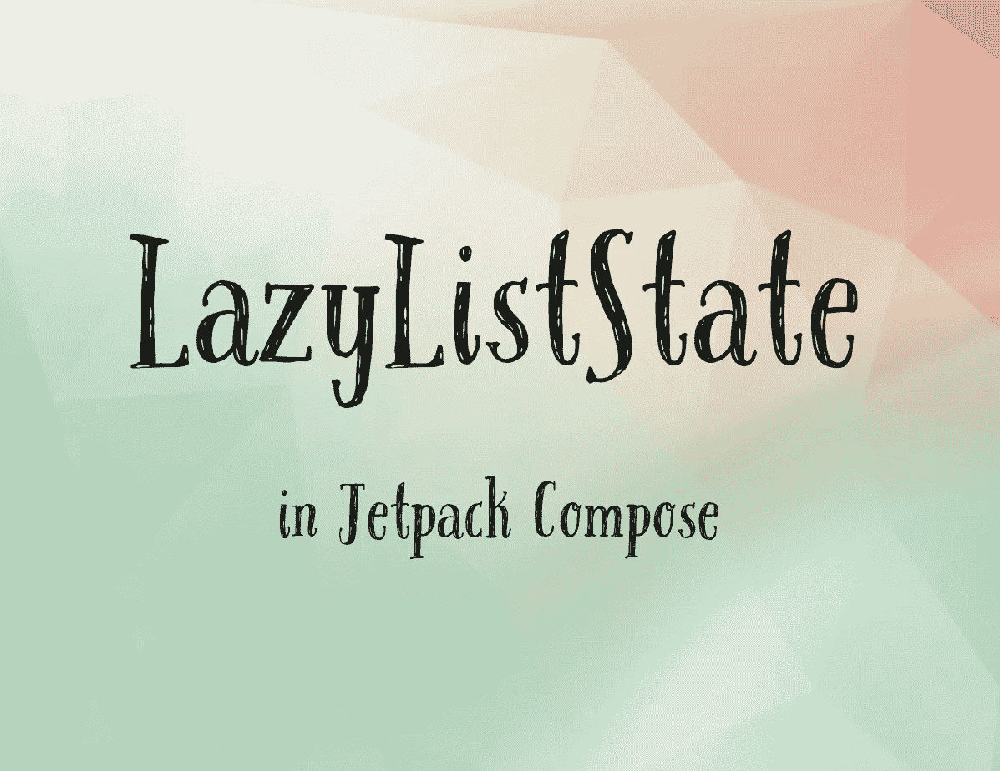

# 使用 LazyListState 编写 Jetpack 中的导航列表

> 原文：<https://blog.devgenius.io/navigating-lists-in-jetpack-compose-with-lazyliststate-b416d7448014?source=collection_archive---------2----------------------->



当 Jetpack Compose 还处于 alpha 阶段时，我立刻被一个简单的演示所吸引:用 LazyColumn 替换 RecyclerView。需要 RecyclerView 5 个文件的事情，LazyColumn 用 5 行就能完成。

```
LazyColumn {
  items(data) {
    ListItem(it)
  }
}
```

LazyColumn 的生产率和开发人员体验的提高是惊人的，而且对于基本用例来说，它非常简单。 [LazyListState](https://developer.android.com/reference/kotlin/androidx/compose/foundation/lazy/LazyListState) 更上一层楼。在本文中，我将向您介绍 LazyListState 的几个最有用的特性。

# 正在设置

使用 LazyListState 非常简单，只需用`rememberLazyListState()`创建一个有状态的 LazyListState 实例，并将其传递给你的 LazyColumn。

```
val listState = rememberLazyListState()
LazyColumn(listState = listState)
```

就是这样！现在我们准备开始使用我们的 LazyListState。

# 性能

LazyListState 有 3 个非常有用的属性:`firstVisibleItemIndex`、`firstVisibleItemScrollOffset`和`isScrollInProgress`。

顾名思义，`firstVisibleItemIndex`返回屏幕上第一个可见项目的索引。这类似于 RecyclerView 的 LayoutManager 的`findFirstVisibleItemPosition()`，但是增加了一个强大的合成功能，它可以反映任何给定时间的状态，因此当底层状态发生变化时，它会强制进行重组。例如，在下面的代码片段中，我们的文本 composable 将始终显示第一个可见项的索引，并在用户滚动 LazyColumn 时自动更新。

```
val listState = rememberLazyListState()
...
Text(text = "First index: ${listState.firstVisibleItemIndex}")
```

没有滚动侦听器，没有更新文本的调用，没有无效视图。由于 Compose 的声明性范式，读取`firstVisibleItemIndex`确保您的 UI 总是反映最新的数据。

类似地，`firstVisibleItemScrollOffset`反映第一个可见项目的顶部和第一个可见像素之间的像素距离。例如，如果您跳到列表中索引 3 处的项目，然后向下滚动 135 像素，`firstVisibleItemScrollOffset`将是 135。当您在项目边界上滚动时，该属性会自动重置。因此，在前面的例子中，如果索引 3 处的项目只有 100 像素高，那么在我们滚动 135 像素后，`firstVisibleItemIndex`将是 4，`firstVisibleItemScrollOffset`将是 35。与 RecyclerView 相比，这是一个显著的改进，RecyclerView 令人困惑的是，它没有保持自己的滚动偏移量，手动跟踪是一个噩梦。

第三个有用的属性是`isScrollInProgress`，它根据当前是否有滚动正在进行而返回 true 或 false。同样，因为 Compose 是声明性的，而 LazyListState 是有状态的，所以它总是反映最新的数据。一个方便的用例可能是每当用户滚动时显示当前滚动位置的标题横幅。

```
if (listState.isScrollInProgress) {
    val currentItem = items[listState.firstVisibleItemIndex]
    HeaderBanner(currentItem)
}
```

# 卷动

LazyListState 还允许您使用`scrollToItem()`将 LazyColumn 滚动到特定位置。`scrollToItem()`需要一个参数`index`，并允许一个可选的第二参数`scrollOffset`。正如您可能已经猜到的那样，将这个函数与我们上面看到的属性结合起来，可以让我们保存和调用我们确切的滚动位置。

```
// Save the current scroll position to a Datastore, database, etc.saveScrollPosition(
  listState.firstVisibleItemIndex,
  listState.firstVisibleItemScrollOffset
)...// And recall the previous scroll positionval index = ...
val offset = ...listState.scrollToItem(index, offset)
```

需要注意的是`scrollToItem()`是一个挂起函数，因此必须从协程范围内调用。这很容易用`rememberCoroutineScope()`组合。所以一个真实的例子应该是这样的:

```
val coroutineScope = rememberCoroutineScope()
val listState = rememberLazyListState()...coroutineScope.launch {
    listState.scrollToItem(index, offset)
}
```

`scrollToItem()`可以在响应用户交互(如点击按钮或拖动滑块)时调用，也可以在启动时调用。如果您在发布时调用它，有两个重要的细节需要注意。首先，[组件应该没有副作用](https://developer.android.com/jetpack/compose/side-effects)，因此您的协程应该从 [LaunchedEffect](https://developer.android.com/jetpack/compose/side-effects#launchedeffect) 启动。第二，`rememberLazyListState()`接受两个可选参数作为初始索引和滚动偏移量。因此，在上面的例子中，我们在启动时加载前一个滚动位置，从存储中加载索引和偏移量，并在创建 LazyListState 时将它们传递给 more 函数可能更有意义:

```
val savedIndex = ...
val savedOffset = ...

val listState = rememberLazyListState(savedIndex, savedOffset)
```

最后需要注意的是，LazyListState 还提供了一个函数`animateScrollToItem()`。这与`scrollToItem()`的行为完全一样，除了它将激活滚动事件，而不是立即跳到新位置。

*关注更多关于 Kotlin 和 Android 开发的最佳实践。*