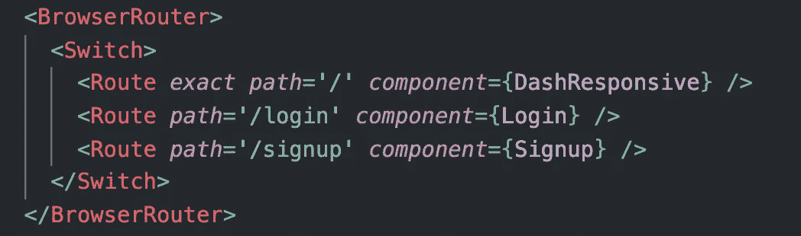

# 导航反应路由器

> 原文：<https://blog.devgenius.io/navigating-react-router-9f74c4c2df4c?source=collection_archive---------1----------------------->

## 使用 react-router-dom 更改 URL 路径并呈现组件

照片由 [Jens Lelie](https://unsplash.com/@leliejens?utm_source=medium&utm_medium=referral) 在 [Unsplash](https://unsplash.com?utm_source=medium&utm_medium=referral) 上拍摄

react-router-dom 包非常适合基于 url 路径呈现不同的 react 组件。因此，React 组件可以通过更改 url 路径来引导其他组件。本文涵盖了我们可以轻松做到这一点的方法，但首先它可能有助于快速了解 React 路由器的基础知识。

# React 路由器基础知识

首先，我们使用下面的命令在 react 应用程序中安装这个包:`npm i react-router-dom`。现在，我们可以将 react-router-dom 中的工具导入到我们计划使用它们的任何组件中。我用命令从我的‘app . js’文件中的 react-router-dom 导入三个工具:`import { BrowserRouter, Route, Switch } from ‘react-router-dom’;`。现在我可以访问一个`<BrowserRouter>`组件、一个`<Route/>`组件和一个`<Switch>`组件。BrowserRouter 包围其他组件，并使它们与 url 保持同步。切换组件确保将呈现匹配 url 位置的第一个路由组件子组件。

路由组件至少需要一个属性，即“路径”属性。当 Route 组件与 url 路径匹配时，它将呈现。当路由路径与 url 路径匹配时，我们有两种方法来确定呈现的内容；我们可以为 Route 提供一个“组件”属性，或者我们可以将组件标签嵌套在开始和结束 Route 标签中。我们用路线渲染的任何组件都必须被导入。下面是这三个 react-router-dom 组件一起工作的例子。

有各种各样的 react-router-dom 组件，但是这三个都工作得很好。如果您是 react-router-dom 的新手，这里是一个很好的起点，可以帮助您了解可用的组件和工具。

 [## React 路由器:React 的声明式路由

### 学习一次，路线无处不在

reacttraining.com](https://reacttraining.com/react-router/web/guides/quick-start) 

现在我们知道了 React 路由器如何基于 url 路径呈现不同的组件，是时候讨论如何导航这些 url 路径以从一个组件到达下一个组件了。

# 改变路径

react-router-dom 为我们提供了几种方法。

## 链接标签

我们可以导入一个`<Link>`标签；它需要一个“to”属性，这是我们要更改的 url 路径。在链接标签中，我们包含了将作为链接的任何元素。链接标签必须在 BrowserRouter 内。这个工具对于简单的应用程序来说工作得很好，但是对于更大、更复杂的 React 应用程序来说效率很低。

## 推送至浏览器历史记录

我首选的导航 url 路径的方法是使用 react-router-dom 提供的“历史”对象。如果我们直接从一个 Route 标记中的一个组件导航，该组件已经可以访问 history 对象。另一方面，如果我们的组件没有直接嵌套在路由标签中，或者甚至位于 BrowserRouter 之外，那么我们必须调用‘with router’来赋予我们改变历史的能力！

这不是 DeLorean，但是“withRouter”确实给了我们改变浏览器历史的能力。无论我们在何处发现 BrowserRouter 影响之外的组件，我们都可以通过从 react-router-dom 导入 withRouter 来赋予它历史对象。“withRouter”是一个高阶组件，所以我们将组件包装在它里面，如下所示:`export default withRouter(MovieCard);`。

一旦我们知道我们的组件可以访问“历史”对象，就该访问历史，并最终使用它来更改 url 路径。如果组件是一个类组件，我们用`this.props.history`访问历史，而不是用`props.history`访问功能组件的历史。history 对象有一个“push”方法，该方法将目标路径作为参数。

这个工具的最大好处是我们可以把它放在任何需要的地方，而不用在不必要的标签中嵌套任何东西。一个用例可能是我们有一个出现在每一页的菜单。该菜单将位于浏览器之外，因为它的出现与 url 路径无关。我们的菜单项需要更改 url 路径并呈现不同的组件。下面是一个带有“onClick”属性的“登录”菜单项的示例，该属性可推送历史记录:

感谢 react-router-dom 提供的工具，我们可以基于 url 路径呈现组件，并从 react 应用程序中的任何组件更改 url 路径。

 [## 反应-路由器-dom

### React 路由器的 DOM 绑定。$ NPM install-save react-router-DOM 然后用一个像 webpack 这样的模块捆绑器，用作…

www.npmjs.com](https://www.npmjs.com/package/react-router-dom)  [## React 路由器:React 的声明式路由

### 学习一次，路线无处不在

reacttraining.com](https://reacttraining.com/react-router/web/api/withRouter)