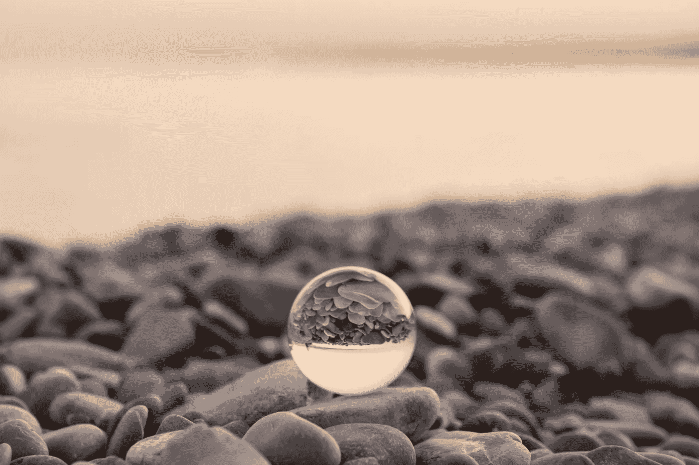
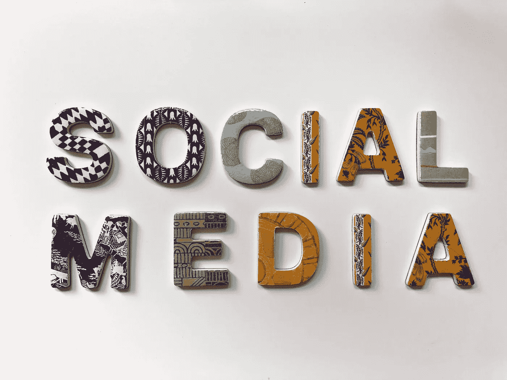
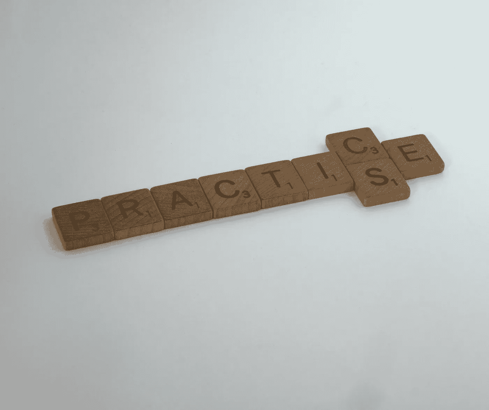
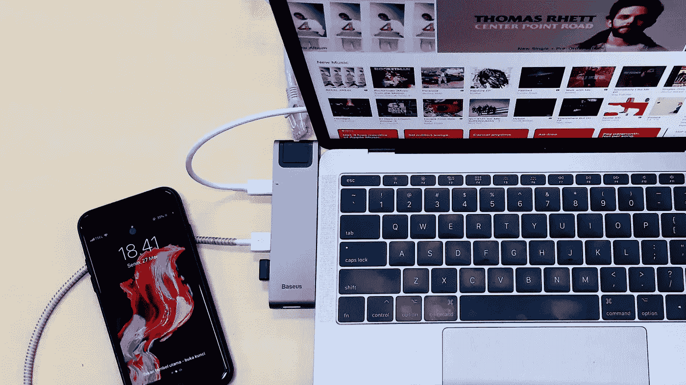

# 导航技术会议演讲

> 原文：<https://blog.devgenius.io/navigating-tech-conference-speaking-f4f91990a0ac?source=collection_archive---------7----------------------->

凯恩·莱因霍尔德森在 [Unsplash](https://unsplash.com/s/photos/public-speaking?utm_source=unsplash&utm_medium=referral&utm_content=creditCopyText) 上的照片

公开演讲可能会令人生畏。但是接下来的事情绝对是值得的！无论怎么想象，我都不擅长公开演讲。这可能就是为什么，两年前，我承诺在我的一次绩效评估中把这作为一个目标(随之而来的是许多私下的咒骂)。更糟糕的是，我把它当成了头等大事。

你看，那时我这样做是因为我坚信，为了个人和职业的成长，我有时不得不感到不舒服。我需要紧张，因为我正冒险进入未知的领域。对我来说，还有一个未知的可怕领域:会议讨论。

我以前没有在会议上讲话的经验，甚至也没有在公开场合讲话的经验，所以我决定把这种出汗活动作为一个目标，并对我知道会让我负责的同事们说出来。我把自己关在里面。在经历了一堆抽象写作、反馈会议、提交和数不清的拒绝之后，我自豪地向你承认，这是我一生中最好的决定之一。不要误解我，公开演讲和仅仅是它的想法仍然让我头晕，但我有一个更好的把握。我已经做过几次了，这些经历让我在以后的舞台上不会晕倒。

会议谈话可能会让人害怕。这需要很多准备。至少对我来说是这样，因为公开演讲对我来说不是天生的，我想在决定它是否适合我之前给它一个公平的机会。因此，如果你想在不久的将来解决会议讨论的问题，这篇文章就是为你准备的！我希望我分享的内容对你开始会议讨论之旅有所帮助。

今天，我想和你们分享我申请和准备会议演讲的一步一步的过程:

# 在脑海中翻动书页

照片由[格伦·凯莉](https://unsplash.com/@glencarrie?utm_source=unsplash&utm_medium=referral&utm_content=creditCopyText)在 [Unsplash](https://unsplash.com/s/photos/think?utm_source=unsplash&utm_medium=referral&utm_content=creditCopyText) 拍摄

这是思考阶段。它会帮助你决定一个话题，一个谈论的想法。以下是一些想出话题的想法:

*   想想你目前正在做的事情，倒回到十个月前，想想你会对过去的自己说些什么。
*   或者想想让你彻夜难眠的故事、卡片或特写。你是怎么处理的？
*   你是怎么工作的？你使用什么工具？有哪些有助于提高工作效率的工具？
*   远程工作。这是一个现在被广泛谈论的话题，对于远程工作来说，永远没有足够的工具/技巧。
*   你对科技行业有非传统的了解吗？如果有，就要分享！
*   你日常工作的一部分是什么？里面有哪些常见的被忽略的东西？
*   作为你工作的一部分，你还和哪些人或角色一起工作？这些特定的交流工具或技巧有帮助吗？
*   我也喜欢看科技会议列表，浏览往年的会议。有时候我会从这里得到灵感。

不胜枚举。这不是一个详尽的列表，也不意味着是。但希望它提供了一个良好的开端。

# 写下一些谈话要点

在 [Unsplash](https://unsplash.com/s/photos/write?utm_source=unsplash&utm_medium=referral&utm_content=creditCopyText) 上 [NeONBRAND](https://unsplash.com/@neonbrand?utm_source=unsplash&utm_medium=referral&utm_content=creditCopyText) 拍摄的照片

这纯粹是个人喜好。我喜欢这样做，以此来确保我选择的主题有内容。我试着列出五到十件我可以谈论的事情。这让我觉得我已经选择了一个可以谈论的话题。

# 选题反馈！

照片由[马库斯·温克勒](https://unsplash.com/@markuswinkler?utm_source=unsplash&utm_medium=referral&utm_content=creditCopyText)在 [Unsplash](https://unsplash.com/s/photos/discussion?utm_source=unsplash&utm_medium=referral&utm_content=creditCopyText) 上拍摄

接下来，我喜欢和我信任的同事以及我认识的有会议演讲经验的同事交谈。我想知道我选择的主题是否值得参加会议。如果他们愿意去听一个关于我选择的话题的报告。这有助于我确保团队成员对这个话题感兴趣。

# 摘要

照片由[丹尼尔·麦金尼斯](https://unsplash.com/@dsmacinnes?utm_source=unsplash&utm_medium=referral&utm_content=creditCopyText)在 [Unsplash](https://unsplash.com/s/photos/beginning?utm_source=unsplash&utm_medium=referral&utm_content=creditCopyText) 上拍摄

不言而喻，大多数会议，如果不是全部的话，都会要求提供摘要作为会议报告提交过程的一部分。摘要需要简洁明了，清楚地说明听众能从你的演讲中得到什么。参加会议的人需要知道他们在参加一个讲座时注册了什么，摘要必须给他们一个好主意。我喜欢把我的摘要组织成这样:

*   开场白:与主题相关的事实。
*   问题。这可以是一个问题。
*   潜在解决方案一瞥。不要泄露谈话内容，而是选择两个你最感兴趣的话题，将其压缩成几句话，并添加到你的摘要中。
*   一个结论。听你演讲的人能从听你演讲中得到什么，就一句话。

# 反馈:第二部分

艾米丽·莫特在 [Unsplash](https://unsplash.com/s/photos/ask?utm_source=unsplash&utm_medium=referral&utm_content=creditCopyText) 上的照片

有一次，我找出了我的摘要中所有我能找到的漏洞，并修改了多次，我向我的同事征求反馈。我给他们看我的摘要，并寻求反馈。这是否简明扼要地抓住了我想说的话的精髓？我们可以做些什么改变来使它变得更好？最后，如果你读了这篇摘要，你会愿意参加这个演讲吗？

# 标题

照片由[斯文·菲舍尔](https://unsplash.com/@sf_mediach?utm_source=unsplash&utm_medium=referral&utm_content=creditCopyText)在 [Unsplash](https://unsplash.com/s/photos/nice?utm_source=unsplash&utm_medium=referral&utm_content=creditCopyText) 上拍摄

对我来说，这是抽象写作中最难的部分。想出一个吸引人的、有创意的、能传达信息的标题。创意不是我的强项，我努力为我的会议演讲摘要想出一个有创意的标题。我很幸运，我有一个朋友，她不仅有惊人的创造力，而且非常乐于助人，我无耻地依赖她给我出主意。因此，如果有一个建议我会给你，当谈到想出一个标题，这是确定的斗争在这方面，但你绝对应该寻求帮助，如果你需要它。相信我，时间会越来越好的。这也有助于浏览技术会议的会议标题。你也许能从那里得到一些想法。

# 简历和照片

在 [Unsplash](https://unsplash.com/s/photos/social-media?utm_source=unsplash&utm_medium=referral&utm_content=creditCopyText) 上 [Merakist](https://unsplash.com/@merakist?utm_source=unsplash&utm_medium=referral&utm_content=creditCopyText) 拍摄的照片

你有一个想法，并准备提交给会议。在实际提交过程开始之前，确保找到一张你自己的照片，并确保在你认为合适的时候更新你的社交媒体。大多数会议都需要一张照片，有些会议还需要你的 Twitter 账号。准备好这些，如果你选择分享它们，将有助于你提交得更快。

# 提交

照片由[米 PHAM](https://unsplash.com/@phammi?utm_source=unsplash&utm_medium=referral&utm_content=creditCopyText) 在 [Unsplash](https://unsplash.com/s/photos/fun?utm_source=unsplash&utm_medium=referral&utm_content=creditCopyText)

一旦你准备好了你的标题和摘要，你就可以开始提交你的演讲了！我喜欢这部分。这比写摘要给我更多的满足感。我在以下地点寻找即将召开的会议:

*   [气动工作台](https://airtable.com/shrBMFY4CSpSRGmAs/tblAfvlQwnxHzUPTc)
*   [confs.tech](https://confs.tech/cfp)
*   Twitter/LinkedIn(我推荐使用标签搜索来找到你选择的会议)

找到你认为你的主题可能适合的会议。大多数会议都有一个他们想找的话题列表。在提交之前，请务必仔细阅读该列表。

如果社交媒体是你的事情，如果你想在未来的论文会议上得到通知，请确保关注社交媒体上的互联网会议。这样您就可以了解 CFP 的最新信息。

# 等待…

照片由[菲尔在](https://unsplash.com/@philhearing?utm_source=unsplash&utm_medium=referral&utm_content=creditCopyText) [Unsplash](https://unsplash.com/s/photos/wait?utm_source=unsplash&utm_medium=referral&utm_content=creditCopyText) 上听到

等待的游戏是艰难的。有时候拒绝更难。但是不要担心！失败只是重新定向(我不是轻描淡写的这么说)。如果你愿意，联系会议委员会，看看他们是否对你的提交有任何反馈。feeeback 一定会对你的下一次会议提交有所帮助！

# 接受

卡蒂亚·奥斯丁在 [Unsplash](https://unsplash.com/s/photos/thumbs-up?utm_source=unsplash&utm_medium=referral&utm_content=creditCopyText) 上拍摄的照片

好好珍惜吧。享受这一刻。参加会议并被接受并不容易。你做到了！所以，恭喜你！

请务必确认您的接受。确保分配的插槽适合您。如果你有一个更喜欢的时间，一定要传达出来。如果有冲突，也要确保沟通。务必尽快做这件事。

# 演示文稿

由[亚历克斯·利特温](https://unsplash.com/@alexlitvin?utm_source=unsplash&utm_medium=referral&utm_content=creditCopyText)在 [Unsplash](https://unsplash.com/s/photos/presentation?utm_source=unsplash&utm_medium=referral&utm_content=creditCopyText) 上拍摄

现在是实际的工作，准备演示文稿的任务！我通常在演讲中使用 keynote，但就像大多数其他东西一样，我确信还有其他一些工具。对于你的初稿，我会说不要担心工具。只需将所有内容集中在一个位置。从在幻灯片上打字开始。一个大脑垃圾场。它不需要马上看起来很漂亮。还记得之前的谈话要点列表吗？把这些放进幻灯片。然后开始迭代过程。我喜欢遵循的顺序是:

*   标题幻灯片
*   关于我
*   议程
*   动机(统计数据/个人经历/我为什么要做这个演讲？)
*   谈话要点
*   结论
*   最后一张幻灯片(其他资源/参考资料/联系信息)

在以上所有幻灯片中，确保**在适当的地方给予表扬**。确保**引用参考文献**。

# 练习

布雷特·乔丹在 [Unsplash](https://unsplash.com/s/photos/practice?utm_source=unsplash&utm_medium=referral&utm_content=creditCopyText) 上拍摄的照片

我喜欢在实际做演示以获得反馈之前练习几次我的演讲。我大量使用演示者笔记。打印出有帮助的幻灯片。确保坚持练习，同时在练习之间留出合理的休息时间。要考虑的一件重要的事情是安排好你演讲的时间。确保你在分配的时间内，同时考虑问答时间，如果你需要考虑的话。一旦你感觉舒服了，继续进行更多的练习，但是要在其他人面前。

# 与公司一起实践

[斯科特·格雷厄姆](https://unsplash.com/@sctgrhm?utm_source=unsplash&utm_medium=referral&utm_content=creditCopyText)在 [Unsplash](https://unsplash.com/s/photos/presentation-slide?utm_source=unsplash&utm_medium=referral&utm_content=creditCopyText) 上拍照

一旦我发现我的演讲被接受了，我会选择至少两个人来反馈我的演讲，并确保他们有空并且愿意给我反馈。然后，我安排了一个小时的时间来展示我的演讲，就像我在会议上寻求反馈一样。我尽量将这些反馈会议间隔至少一周。当我发现我的演讲被接受时，我马上安排这些会议，因为这有助于我集中注意力，保持在正确的轨道上，并给我可以倒推的日期(准备好我的实际演讲)。在这些会议中，记下所有的反馈非常重要。在安排这些演示文稿时，请确保留出足够的时间来整合您可能收到的任何反馈。

# 演讲前准备

照片由[瑜伽士设计](https://unsplash.com/@yogasdesign?utm_source=unsplash&utm_medium=referral&utm_content=creditCopyText)在 [Unsplash](https://unsplash.com/s/photos/computer-cable?utm_source=unsplash&utm_medium=referral&utm_content=creditCopyText) 上拍摄

大多数会议都很好地确保了发言人知道什么是可用的，以及他们应该带什么:电缆、电线等。确保彻底地浏览列表。如果有演示指南，请务必遵守。如果一个会议没有给你这个信息，至少在会议前一两个星期联系他们，询问他们的布置情况和他们提供的信息。我也喜欢保留一份我的演讲的 PDF 版本，这样如果他失控了(最坏的情况),我至少可以用一份 PDF 文档来展示。如果说有什么不同的话，那就是它让我在会议开始前睡得很安稳。另一个好主意是将演讲的最终版本上传到云端(iCloud/Google drive 等)，这样如果你因为某种原因不得不使用另一台电脑，你可以直接在那台电脑上访问你的演讲。

此外，确保查看会议上的其他会议，并记下您想要参加的会议。很多会议都有应用程序，你可以用来跟踪这些信息。

# 通话时间！

若昂·克鲁兹在 [Unsplash](https://unsplash.com/s/photos/conference?utm_source=unsplash&utm_medium=referral&utm_content=creditCopyText) 上的照片

你的大日子来了。如果你像我一样，在你演讲的前一天，你可能会有一个非常不安的夜晚。没关系。演讲后你会很累，但是你有时间补觉。我喜欢提前参观我的会场，在当天早些时候感受一下我将在哪里发表演讲。与组织者交谈，并确保将您的笔记本电脑连接到您房间的投影仪，以确保您都准备好了，并记住这一点:“即使您忘记了什么，请记住，观众中没有人知道”(由我最喜欢的同事和朋友之一提供)。

# 演讲后

照片由[雷·轩尼诗](https://unsplash.com/@rayhennessy?utm_source=unsplash&utm_medium=referral&utm_content=creditCopyText)在 [Unsplash](https://unsplash.com/s/photos/celebrate?utm_source=unsplash&utm_medium=referral&utm_content=creditCopyText) 拍摄

耶！你做到了！你已经做好了准备，并做了你的会议发言，🥳，尽管你可能想离开房间去庆祝，只要再坚持几分钟。有可能观众中的人想过来和你谈谈。所以**等待，交谈，社交**然后庆祝。

会议讨论是我决定尝试的最好的事情之一。我还有很长的路要走，但我为自己的进步感到骄傲。在 10 多个人面前演讲仍然令人紧张。但是我喜欢我演讲后的感觉。我从未去过珠穆朗玛峰，但在我的演讲后，我有这样的感觉:站在世界之巅。

在会议上发言不仅有助于你成长为一名专业人士，也是一种回馈社会的好方式。到目前为止，我所做的演讲都是我希望有人在我开始或我职业生涯中到达某个位置时告诉我的事情。灵感来自你过去的经历！

祝你在即将到来的和所有未来的会议上好运！