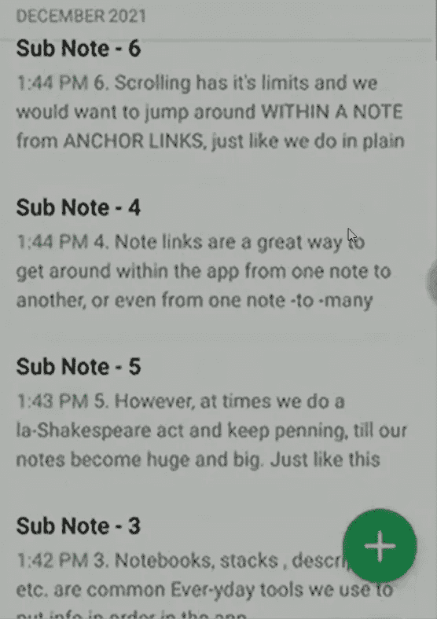

# 在笔记中导航——像 Evernote 中的锚标签一样的 HTML

> 原文：<https://blog.devgenius.io/navigating-within-a-note-html-like-anchor-tags-in-evernote-1ceb93779d2?source=collection_archive---------12----------------------->

我们所有人都曾因为 Evernote 上的笔记太长而哭过。

Evernote 是帮助我们快速获取正确信息的工具。对于长笔记，通过无休止的滚动和搜索来查找我们需要的信息变成了一件苦差事！

如果我们可以在 Evernote 中的一个笔记中跳来跳去，就像在普通的 HTML 中一样，这不是很好吗？

嗯，事实证明 Evernote 团队不愿意实现任何类似于 HTML 锚标签的功能。他们热衷于保留 note 应用的敏捷降价特性。

毕竟降价也有不利的一面！Lol！

不尽然！

## 我们这里有一个简洁的工具，可以让我们在 Evernote notes 中进行类似 HTML 的锚标签导航！

如果你喜欢看视频，可以看看下面视频中的解决方案。关于黑客攻击的详细分析，请继续阅读。

虽然 Evernote ***没有*** 让我们链接到 内的不同部分**，它 ***让我们链接到****其他笔记*** *。*****

我们将使用这个特性来实现类似 HTML 的注释内锚定标签功能。

1.  **为我们要链接到的主笔记的各个部分制作单独的子笔记:**

我们从要链接的主笔记中剪切并粘贴每个部分到一个单独的子笔记中。

将部分剪切并粘贴到单独的子笔记中

在这里，我把我的章节分成了 12 个子笔记。

每个部分都被分成一个子注释

2.**将子注释的链接添加到主注释的目录中:**

Evernote 让我们轻而易举地做到这一点！

首先，我们用一个简单的点击和保持命令选择所有的子音符。

选择所有子注释

然后我们使用 Evernote **复制笔记链接**命令一次性复制所有链接。像这样:

用一个**复制注释链接**命令复制所有链接

最后，我们用一个简单的粘贴命令将复制的链接放入主注释的目录中。

将链接粘贴到我们的主笔记中

现在我们在主笔记中有了这些子笔记的链接，作为一个漂亮的目录。

子注释是我们主注释中的一个很好的目录

***亲提示:您可以给目录中的链接取一个合适的名称，帮助您快速找到正确的子笔记。***

我希望这个小技巧能帮助你在 Evernote 中快速移动，轻松地在正确的时间找到正确的信息。

我们将带着更酷的应用程序和软件解决方案回来，帮助您利用您最喜爱的技术实现更多目标！

在那之前，干杯并享受你的一天！