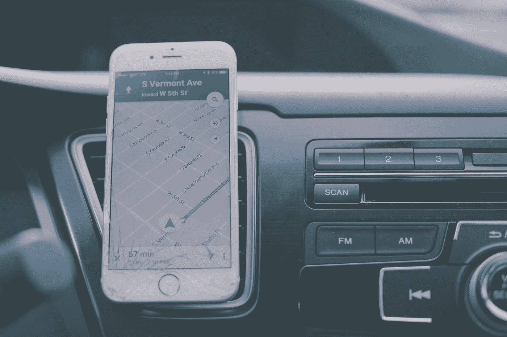

# 颤振中的导航和路由

> 原文：<https://blog.devgenius.io/navigation-routing-in-flutter-655f08183084?source=collection_archive---------1----------------------->

## 第 3 部分:通过你的应用程序找到你的路。



[丹钟](https://unsplash.com/@dannayyyboi?utm_source=medium&utm_medium=referral)在 [Unsplash](https://unsplash.com?utm_source=medium&utm_medium=referral) 上拍照

> PS:这是我给初学者的扑系列的第三部分。如果你想看看剩下的部分，链接在文章的末尾。

我们每天从一个地方航行到另一个地方。无论是从家里去杂货店、健身房还是办公室，我们都要通过一条路径从一个源头到达我们想要的目的地。类似地，在 Flutter 中，我们有路径可以用来导航到想要的小部件。

如果你来自 Android，你会熟悉用于在活动和片段之间导航的*意图*的概念。如果你熟悉 iOS，那么等价的是使用连接器在视图间导航。来到 Flutter，有几种在屏幕间导航的方法。

# 第 1 部分:基本导航

让我们看看最基本的导航形式，它使用了***navigator . push()***和***navigator . pop()***方法

```
*class* FirstRoute *extends* StatelessWidget {
  @override
  Widget build(BuildContext context) {
    *return* Scaffold(
      appBar: AppBar(
        title: Text('First Route'),
      ),
      body: Center(
        child: RaisedButton(
          child: Text('Open route'),
          onPressed: () {
            *// Navigate to second route when tapped.* Navigator.push(
              context,
              MaterialPageRoute(
                builder: (context) => SecondRoute(),
              ),
            );
          },
        ),
      ),
    );
  }
}

*class* SecondRoute *extends* StatelessWidget {
  @override
  Widget build(BuildContext context) {
    *return* Scaffold(
      appBar: AppBar(
        title: Text("Second Route"),
      ),
      body: Center(
        child: RaisedButton(
          onPressed: () {
            *// Navigate back to first route when tapped.* Navigator.pop(context);
          },
          child: Text('Go back!'),
        ),
      ),
    );
  }
}
```

让我们来看看这是如何工作的:

如果仔细观察 FirstRoute 和 SecondRoute 中的 ***onPressed()*** 函数，您会发现在小部件之间导航是多么容易。让我们来分析一下。

Navigator.push()接受两个参数:

1.  build context:build context 非常简单明了，它为导航器提供了必须导航的上下文。简单来说，你可以认为这是源头。
2.  route:可以使用 MaterialPageRoute 的实例，用新屏幕替换整个屏幕。MaterialPageRoute 需要一个构建器方法，您可以在该方法中指定要在应用程序中导航到的目的地。

转到 SecondRoute，它利用 Navigator.pop()方法返回到 FirstRoute。基本上，这里发生的事情是，当你按下屏幕时，它们会被添加到堆栈中，当你想要移除它们时，它们会弹出。

# 第 2 部分:命名路由

现在我们已经了解了如何在两个屏幕之间导航，让我们来看看更复杂的东西。随着应用程序的发展，跟踪所有路线变得越来越困难。解决这个问题的一种方法是通过指定的路由进行抖动。

您可以定义所有路线的地图，并在希望导航到不同路线时调用名称。让我们来看看它是如何工作的。我们将使用上面定义的两个小部件*和 ***SecondRoute()*** 。*

```
*MaterialApp(
  initialRoute: '/',
  routes: {
    '/': (context) => FirstRoute(),
    '/second': (context) => SecondRoute(),
  },
);*
```

*您在 ***MaterialApp()*** 中定义您的路线，这是您的应用程序的根。如果您查看第 1 部分中的 starter 项目，您将看到默认情况下 MaterialApp 使用“home”参数。定义命名路由时，您可以在 home 或 initialRoute 之间进行选择，不要同时设置两者，否则会出错。为了在这个场景中导航，我们简单地用下面的代码替换 FirstRoute()中的 ***onPressed()*** 的内容:*

```
*Navigator.pushNamed(context, '/second');*
```

*就这么简单！*

# *第 3 部分:生成的路线*

*现在我们已经知道了如何使用命名路线导航，让我们更进一步。假设您希望通过点击一个按钮从一个屏幕导航到另一个屏幕。但同时您希望执行网络调用或实现一些业务逻辑，例如在导航之前检查用户访问控制。生成的路线来救援。*

```
*class MyApp extends StatelessWidget {
  // This widget is the root of your application.
  @override
  Widget build(BuildContext context) {
    return MaterialApp(
      title: 'Flutter Demo',
      theme: ThemeData(
        primarySwatch: Colors.*blue*,
        visualDensity: VisualDensity.*adaptivePlatformDensity*,
      ),
      onGenerateRoute: _generatedRoutes,
    );
  }

  Route _generatedRoutes(RouteSettings settings) {
    // implement business logic here switch (settings.name) {
      case '/first':
        return MaterialPageRoute(builder: (context) => FirstRoute());
      case '/second':
        return MaterialPageRoute(builder: (context) => SecondRoute());
      default:
        return ErrorPage();
    }
  }
}*
```

*正如您所看到的，我们使用 onGenerateRoute 参数，该参数接受用户定义的函数(UDF ),您可以在导航之前在该函数中实现您的自定义业务逻辑。在这种情况下，路由使用命名路由。因此，为了导航，您可以使用 **pushNamed()** 以我们在上面看到的相同方式调用它。*

# *包裹*

*总之，在本文中，我们已经学习了路由和导航的基础知识，并且了解了名为 routes，onGenerateRoutes 的导航器类。一定要让我知道你想让我写的主题，我会尽我所能写出来。在那之前，编码快乐！*

*PS。本文是系列文章的一部分。点击这里查看其他文章:*

1.  *[适合初学者的颤振](https://medium.com/dev-genius/flutter-for-beginners-c2fae3d4d540)*
2.  *[小部件在颤动](https://medium.com/dev-genius/widgets-in-flutter-a53e3c671f13)*
3.  *[导航&颤振中的路由](https://medium.com/dev-genius/navigation-routing-in-flutter-655f08183084)*
4.  *[颤振布局](https://medium.com/dev-genius/layouts-in-flutter-c65b0dc6b356)*
5.  *[颤振中的列表视图](https://medium.com/dev-genius/listviews-in-flutter-12bab3dccadc)*