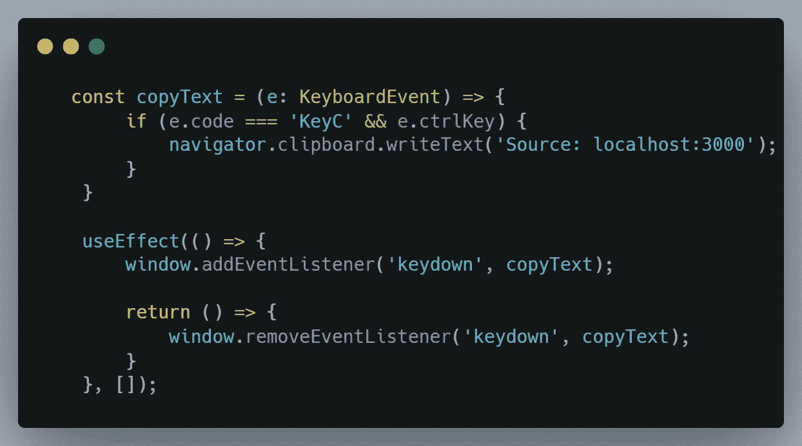
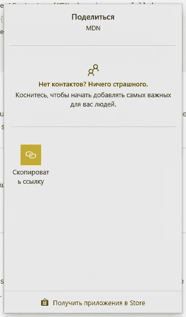
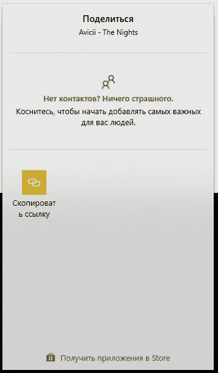

# 领航员。你必须知道的对象。

> 原文：<https://blog.devgenius.io/navigator-object-that-you-must-know-b45a822a54c0?source=collection_archive---------8----------------------->


JavaScript 为您提供了许多可以自动化和改进您的例程的对象。这是对象的[列表](https://developer.mozilla.org/en-US/docs/Web/API),但是有时我们找不到可以解决我们问题的对象。在谈论导航器对象之前，我建议你看一下我们使用导航器的情况。

# 1)添加复制信息的来源。

今天，保护你的脑力劳动是非常重要的，navigator API 为剪贴板提供了这一点。



在这段代码中，我们创建了一个 **copyText** 函数，然后在用户使用键盘时执行，如果用户按下了 **Ctrl** + **C** 我们从 **clipboard** 对象调用一个 **writeText** 方法，该对象是我们从 **navigator 获得的。**

## Navigator 为您提供了一个处理剪贴板 API。

有关剪贴板和导航器的所有信息，请阅读此。

# 2)自动检测用户的语言。

如果您想要更改可由用户浏览器语言转换的元素的行为，您可以使用**语言**属性。

```
<Wrapper disabed={navigator.language === 'de'}>
 { 
  navigator.language === 'de' 
   ? "We don't support Deutsch language"  
   : "Hello there!" 
}
</Wrapper>
```

在这段代码中，如果当前语言是德语，我们将更改内容。

如果你想检测一个用户的位置，你可以使用一个高级的**导航器。**

```
const options = {
 enableHighAccuracy: true,
 timeout: 5000,
 maximumAge: 0
}; function **success**(pos: any) {
 const crd = pos.coords;
 console.**log**(crd);
} navigator.geolocation.**getCurrentPosition**(
 **success**, () => '', options
); 
```

而这段代码输出在控制台下一个对象中:

```
accuracy: 4805.634862627858altitude: nullaltitudeAccuracy: nullheading: null**latitude**: 51.5469816**longitude**: 46.0339043speed: null
```

由此我们需要获取一个**纬度**和**经度来获取当前用户的位置。你为什么需要它？看你了:)**

# 3)使用内置平台方法更新共享机制。

您多久会看到一次复制一个部分/段落机制？通常，开发者不会让你这么做，但是即使你使用了它，你复制了网址，你会发送网址吗？

每个浏览器都可以引用您的本机平台 API，例如，如果您正在使用 Window 并使用本机共享机制，您将会看到:



看起来很棒，不是吗？对于这个导航器有一个**分享**的方法。

```
<div>
 <span onClick={() => {
  navigator.**share**({
   title: 'Avicii - The Nights',
   url: 'https://www.youtube.com/watch?v=UtF6Jej8yb4'
  })
 }}>share me!</span>
</div>
```



这个机制也让你分享文件，如果你对此感兴趣的话，请看这个[主题](https://developer.mozilla.org/en-US/docs/Web/API/Navigator/share#sharing_files)。

# 4)振动你的手机

我不推荐这种机制，因为这打破了**用户隐私政治**。我如何理解**用户隐私政治？**

> **您的站点/应用程序必须只能在浏览器选项卡中运行，不能再运行了。与计算机内置方法绑定的外部浏览器逻辑如 GPS、振动和性能打破了这种政治**

但无论如何你应该知道。

```
navigator.vibrate(200); // vibrate for 200msnavigator.vibrate([100,30,100,30,100,30,200,30,200,30,200,30,100,30,100,30,100]); // Vibrate 'SOS' in Morse.
```

> 但这将在用户启用[粘性用户激活](https://developer.mozilla.org/en-US/docs/Web/Security/User_activation)后生效。

# 5)你的应用主题的用户电池

有一种理论认为，如果电池电量不足，出租车公司会改变价格。我不建议你这样做，但无论如何，这可以改善你的用户界面和 UX。

```
const [battery, **setBattery**] = **useState**();**useEffect**(() => {
 window.navigator.**getBattery**().**then**(r => {
  **setBattery**(r.level * 100);
 });
}, []);return <div>
 {
   battery < 30 && <ul>
    <li>Unimportant information</li>
    <li>Unimportant information</li>
    <li>Unimportant information</li>
    <li>Unimportant information</li>
  </ul>
 } 
</div>
```

正如你所看到的，这段代码我们隐藏了不必要的内容，以便快速制作和理解界面。**什么是不必要的内容？**这些可以是添加、导航和块，它们可以被删除而不影响应用程序的主逻辑。

# 导航仪为什么这么杂，是什么？

**导航器**是告诉你关于**用户代理**的一切的对象，正如你所理解的，使用这个对象你可以改进你的代码和 UI/UX。但不幸的是，navigator 对象包含一些在某些浏览器中仍然不受支持的方法和字段。

**拜拜，感谢阅读。**

