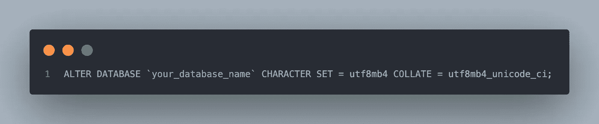

# 用 Django 在 MySQL 5.7 中从 utf8 到 utf8mb4

> 原文：<https://blog.devgenius.io/nc-django-mysql-migrating-from-utf8-to-utf8mb4-9d8b2753e632?source=collection_archive---------7----------------------->


不知道 MySQL 5.7 默认对 UTF-8 字符有 3 字节的限制吗？我也没有。但是确实如此，如果你使用 MySQL，这就是一个问题。这篇文章将向您展示如何在不中断 Django 应用程序的情况下，自动将数据库从 utf8 迁移到 utf8mb4。

# 为什么这是一个问题？

我不会深入细节，但简短的版本是:

1.  MySQL 的 utf8 编码不是 UTF 8，所以当用户试图保存一个 4 字节的字符，比如表情符号🙃，您将开始得到如下错误:

```
django.db.utils.OperationalError: (1366, “Incorrect string value: ‘\\xF0\\x9F\\x99\\x83’ for column ‘name’ at row 1”)
```

2.MySQL 5.7 将于 2023 年 10 月寿终正寝，其默认编码是 utf8，而 MySQL 8 的默认编码现在是 utf8mb4。所以最终您还是会想迁移到 utf8mb4 或者跨表使用一堆不匹配的字符集。

如果你对*为什么*感兴趣，这两篇文章做得很好:

*   [DBA 关于将 MySQL 数据库从‘utf8’迁移到‘utf8mb 4’字符集的深入指南](https://saveriomiroddi.github.io/An-in-depth-dbas-guide-to-migrating-a-mysql-database-from-the-utf8-to-the-utf8mb4-charset/)
*   [如何在 MySQL 数据库中支持完整 Unicode](https://mathiasbynens.be/notes/mysql-utf8mb4)

# 怎么修？

**第一步:安全第一** 使用牛逼的 [django-dbbackup](https://github.com/jazzband/django-dbbackup) 应用程序或使用 **mysqldump** 创建备份，如下所示:


mysqldump 命令来备份数据库

**步骤 2:更新你的 Django 设置** 如果你还没有这样做，在你的 *settings.py* 中确保你使用 utf8mb4 作为默认编码。这告诉 MySQL 服务器，您的应用程序将向它发送 utf8mb4 编码的数据(而不是 utf8 默认值)。


settings.py 中的数据库配置

**步骤 3:更新你的数据库、表格和列，使用 utf8mb4** 从历史上看，这是事情变得有点乏味的地方。在 MySQL 5.7 之前，您需要根据数据类型和最大长度为所有基于文本的列和索引创建自定义语句，如这里的[所述](https://mathiasbynens.be/notes/mysql-utf8mb4)。

幸运的是，从 MySQL 5.7 开始，事情变得简单了一些，我在下面提供了一个方便的脚本来帮你做这件事。它是这样工作的:

首先，它将数据库的默认字符集和排序规则分别更改为 utf8mb4 和 utf8mb4_unicode_ci。这告诉数据库应该使用 utf8mb4 作为所有新表的默认编码。



用于迁移数据库的 SQL

接下来，它更改所有现有的**表**的默认字符集和排序规则，然后对每个表运行*分析+重新创建*。前者会自动将字符集和排序规则应用于所有现有的表格和基于文本的列/索引——根据需要调整大小——而后者只是[的良好实践](https://dev.mysql.com/doc/refman/5.7/en/analyze-table.html)。


SQL 来迁移数据库的表(和列)

# 从 utf8 到 utf8mb4 的 Bash 脚本