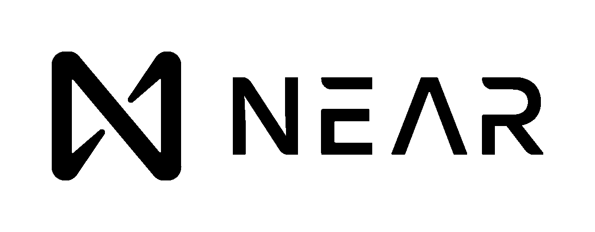

# 近似协议合同教程:捐赠预警

> 原文：<https://blog.devgenius.io/near-protocol-contract-tutorial-donations-alert-9f79a859c16b?source=collection_archive---------24----------------------->



# 项目描述

网络 3 捐款在附近与溪流警报。

## 特征

*   web3 应用程序
*   用邮件发送捐赠
*   捐赠统计
*   显示捐赠提醒

## 更多功能

*   警报页面的配置(字体、颜色、背景颜色、音乐等)
*   为捐赠添加图像
*   向电报发送警报
*   保存图片的所有作者
*   标桩(标桩时给出一些标高)

## 创建新项目

对于 rust 中的新人，你可以从近队开始阅读[](https://www.near-sdk.io/)*然后回到中队。*

```
*// create new library project
# cargo new near-donations --lib*
```

*添加到 cargo.toml*

```
*[package]
name = "near-donations"
version = "0.1.0"
authors = ["dkot <https://medium.com/@tokd>, dkot.near"]
edition = "2021"

[lib]
crate-type = ["cdylib"]

[dependencies]
near-sdk = {version="4.1.1"}

[profile.release]
codegen-units = 1
# Tell `rustc` to optimize for small code size.
opt-level = "z"
lto = true
debug = false
panic = "abort"
# Opt into extra safety checks on arithmetic operations https://stackoverflow.com/a/64136471/249801
overflow-checks = true*
```

*在 rust 上写任何代码的最好工具是 *cargo fmt* 和 *cargo clippy。**

*从任何合同的模板开始*

```
*use near_sdk::borsh::{self, BorshDeserialize, BorshSerialize};
use near_sdk::{near_bindgen, PanicOnDefault};

#[near_bindgen]
#[derive(BorshDeserialize, BorshSerialize, PanicOnDefault)]
pub struct Contract {}

#[near_bindgen]
impl Contract {
    #[init]
    pub fn new() -> Self {
        Self {}
    }
}*
```

*为了更好地理解如何在合同中存储数据，请阅读关于 [*集合*](https://www.near-sdk.io/contract-structure/collections)*

*存储捐赠的结构:*

```
*#[derive(Serialize, Deserialize, BorshDeserialize, BorshSerialize, Debug, PartialEq, Eq)]
#[serde(crate = "near_sdk::serde")]
pub struct Donation {
    /// Donation account id
    pub account_id: AccountId,
    /// Donation sum
    pub sum: U128,
    /// Donation message
    pub msg: String,
}*
```

*对于合同中的商店捐赠，如果我们希望支持迭代，请使用 LookupMap 或 TreeMap。其中 key —捐赠标识，value —捐赠。将商店添加到合同结构和捐赠序列中，以了解我们有多少捐赠:*

```
*use near_sdk::json_types::U128;
use near_sdk::store::LookupMap;

#[near_bindgen]
#[derive(BorshDeserialize, BorshSerialize, PanicOnDefault)]
pub struct Contract {
    /// we can deploy contract to any other account on near and specify main account hear for all transfers
    beneficiary: AccountId,

    /// storage for all donations
    /// <donation_id, Donation>
    donations: LookupMap<U128, Donation>,
    /// sequence growing after insert donation
    donations_sequence: u128,
}*
```

*并将受益人字段添加到所有代币转移合同中。*

*现在我们可以实现我们的函数了。*

## *新功能*

*契约中的第一个函数必须在区块链上初始化它的状态。LookupMap 需要前缀，它可以只是 enum。*

```
*#[derive(BorshSerialize, BorshStorageKey)]
enum StorageKey {
    Donations,
}
#[init]
pub fn new(beneficiary: AccountId) -> Self {
    Self {
        beneficiary,
        donations: LookupMap::new(StorageKey::Donations),
        donations_sequence: 0
    }
}*
```

## *捐赠功能*

*在我们使用近币的功能中需要使用#[应付款]属性来接受代币转账。只需通过键获取条目，如果存在则抛出异常，如果不存在则插入新记录。在增加序列和转移捐赠给受益人之后。*

```
*use near_sdk::store::lookup_map::Entry;

#[payable]
pub fn donate(&mut self, msg: String) {
    match self.donations.entry(U128::from(self.donations_sequence)) {
        Entry::Occupied(_) => env::panic_str("donation id already exist"),
        Entry::Vacant(e) => {
            e.insert(Donation {
                account_id: env::signer_account_id(),
                sum: U128::from(env::attached_deposit()),
                msg,
            });
        }
    }

    self.donations_sequence += 1;

    Promise::new(self.beneficiary.clone()).transfer(env::attached_deposit());
}*
```

## *获取捐赠和捐赠序列*

*知道了序列号，我们可以请求任何捐赠记录。*

```
*pub fn get_donation(&self, donation_id: U128) -> Option<&Donation> {
    self.donations.get(&donation_id)
}

pub fn donations_sequence(&self) -> U128 {
    U128::from(self.donations_sequence)
}*
```

*现在我们已经准备好接受捐赠和阅读信息。但是从近命令行界面这样做并不舒服。让我们构建轻型前端，并将其部署到我们的 WEB3 合同中。*

## *构建和部署*

*在文件夹中写入 build.sh:*

```
*#!/bin/bash
set -e

RUSTFLAGS='-C link-arg=-s' cargo build --target wasm32-unknown-unknown --release
cp target/wasm32-unknown-unknown/release/*.wasm ./res/*
```

*对于构建，只需运行。/build.sh 如果你想纠正检查代码，写*货物检查*。*

*为了部署您的合同，请在 cli 附近下载并安装[并在构建后编写您想要在哪个帐户上部署的文件，不要在主帐户上部署它，请创建一些其他的类似 contributions-my account . near 的文件，因为现在 web4 只支持二级域。](https://github.com/near/near-cli#installation)*

*并通过调用受益人的新方法来初始化您的合同。受益人可以是合同账户，也可以是您的其他账户。*

```
*near deploy --wasmFile res/near-donations.wasm --accountId <Contract Account ID>
near call <Contract Account ID> new '{"beneficiary":"<Account ID>"}' --accountId <Contract Account ID>*
```

# *网络 4(网络 3)*

*[web4 项目](https://github.com/vgrichina/web4)直接从合同中给一个免费的域名请求我们的前端。[这里是 rust 演示](https://github.com/frol/near-web4-demo)*

*我们支持 web4 所需要的一切就是实现 web4_get 方法。指定页面的路径。*

```
*#[derive(Debug, Serialize, Deserialize)]
#[serde(crate = "near_sdk::serde")]
pub struct Web4Request {
    #[serde(rename = "accountId")]
    pub account_id: Option<String>,
    pub path: String,
    #[serde(default)]
    pub params: std::collections::HashMap<String, String>,
    #[serde(default)]
    pub query: std::collections::HashMap<String, Vec<String>>,
    pub preloads: Option<std::collections::HashMap<String, Web4Response>>,
}

#[derive(Debug, Serialize, Deserialize)]
#[serde(crate = "near_sdk::serde", untagged)]
pub enum Web4Response {
    Body {
        #[serde(rename = "contentType")]
        content_type: String,
        body: near_sdk::json_types::Base64VecU8,
    },
    BodyUrl {
        #[serde(rename = "bodyUrl")]
        body_url: String,
    },
    PreloadUrls {
        #[serde(rename = "preloadUrls")]
        preload_urls: Vec<String>,
    },
}

#[near_bindgen]
impl Contract {
    /// Learn more about web4 here: https://web4.near.page
    pub fn web4_get(&self, request: Web4Request) -> Web4Response {
        if request.path == "/stats" {
            return Web4Response::Body {
                content_type: "text/html; charset=UTF-8".to_owned(),
                body: include_str!("stats.html").as_bytes().to_owned().into(),
            };
        }

        if request.path == "/alerts" {
            return Web4Response::Body {
                content_type: "text/html; charset=UTF-8".to_owned(),
                body: include_str!("alerts.html").as_bytes().to_owned().into(),
            };
        }

        Web4Response::Body {
            content_type: "text/html; charset=UTF-8".to_owned(),
            body: include_str!("donation.html").as_bytes().to_owned().into(),
        }
    }
}*
```

*前端页面可以在 [github 页面](https://github.com/dkotTech/near-donations/tree/main/near-contract/src)中找到。*

## *更多功能*

*其余的建议功能将在第二部分。你可以主动在 discord 中添加或更改列表，也可以通过 github 自己完成。*

*Github 全代码【https://github.com/dkotTech/near-donations *

*不和谐问题服务器【https://discord.gg/aXTpQPTTxd *

*感谢阅读。*