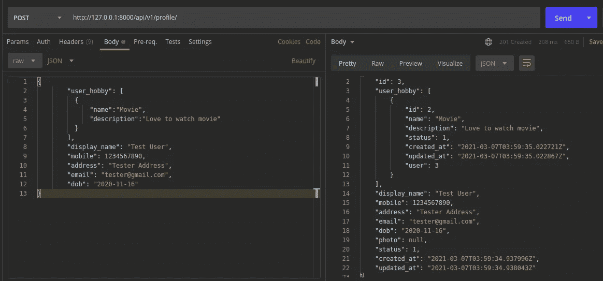
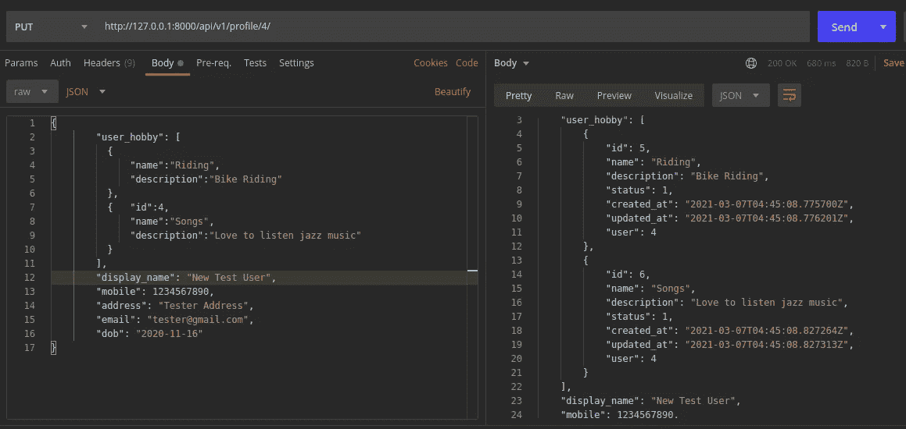

# Django Rest 框架中的嵌套序列化程序

> 原文：<https://blog.devgenius.io/nested-serializers-in-django-rest-framework-6b36bf011074?source=collection_archive---------1----------------------->

使用支持 GET、POST、PUT 方法的 DRF 创建嵌套序列化程序的 API。


我们知道今天几乎所有的网站和移动应用都是基于 API 的。我们在 Spotify 上播放歌曲，由于 API，它立即播放。搜索你所在地区的温度，你会在一秒钟内得到结果。这是因为 Api 与 app 的交互。我们可以用不同的技术创建我们的 API。DRF 是其中之一。

在这篇文章中，我将向您展示如何在 Django rest 框架中创建 API，以及如何处理嵌套的序列化程序。为什么我提到了嵌套序列化程序，因为如果你去寻找这个问题，你很难找到确切的答案。为了方便起见，我将讨论这个场景。开始吧！

要在 Django 中创建 rest API，请确保您已经在虚拟环境中安装了 Django 和 Django rest 框架。关于安装，你可以访问 [Django](https://docs.djangoproject.com/en/3.1/intro/tutorial01/) 和 [Django rest 框架](https://www.django-rest-framework.org/)网站。安装完成后，创建您的项目和应用程序。在我的例子中，我的项目名称是 DProject，我的应用程序名称是 API。

在 DProject/urls.py 文件中

```
from django.contrib import admin
from django.urls import path,include
from django.conf import settings
from django.conf.urls.static import static

urlpatterns = [
    path('admin/', admin.site.urls),
    path('api/v1/', include('api.urls')),
] + static(settings.*STATIC_URL*, document_root=settings.*STATIC_ROOT*) + static(settings.*MEDIA_URL*, document_root=settings.*MEDIA_ROOT*)
```

静态设置用于在应用程序中提供文件。

在 DProject/setting.py 中，确保这些设置应该存在。

```
INSTALLED_APPS = [
    'django.contrib.admin',
    'django.contrib.auth',
    'django.contrib.contenttypes',
    'django.contrib.sessions',
    'django.contrib.messages',
    'django.contrib.staticfiles',
    'rest_framework',
    'api',
]MEDIA_ROOT = os.path.join(BASE_DIR, 'media')
MEDIA_URL = '/media/'
```

现在来看 API 模型。

```
from django.db import models

class Profile(models.Model):
    display_name = models.CharField(max_length=30)
    mobile = models.IntegerField()
    address = models.TextField()
    email = models.EmailField()
    dob = models.DateField()
   photo=models.FileField(upload_to='profile/',null=True,blank=True)
    status = models.IntegerField(default=1)
    created_at = models.DateTimeField(auto_now_add=True)
    updated_at = models.DateTimeField(auto_now=True)

class Hobby(models.Model):   user=models.ForeignKey(Profile,on_delete=models.CASCADE,related_name='user_hobby',null=True,blank=True)
    name = models.CharField(max_length=30)
    description = models.TextField()
    status = models.IntegerField(default=1)
    created_at = models.DateTimeField(auto_now_add=True)
    updated_at = models.DateTimeField(auto_now=True)
```

**Profile** 模型用于收集用户的基本细节，而 **Hobby** 模型用于收集具有 Profile 的用户的爱好。

现在我要用这样一种方式来制作 Profile API，我可以用同样的 API 保存用户的爱好。这里我将使用嵌套的序列化器。REST 框架中的序列化器的工作方式非常类似于 Django 的`Form`和`ModelForm`类。DRF 提供了一个`Serializer`类，为您提供了一种强大的通用方法来控制响应的输出，以及一个`ModelSerializer`类，为创建处理模型实例和查询集的序列化程序提供了一个有用的快捷方式。我将使用 ModelSerializer。

在 **api** 文件夹中，我正在创建一个文件 **serializer.py** 。

```
from rest_framework import serializers
from .models import Profile,Hobby

class HobbySerializer(serializers.ModelSerializer):

    class Meta:
        model = Hobby
        fields = '__all__'class ProfileSerializer(serializers.ModelSerializer):
    user_hobby = HobbySerializer(many=True)

    class Meta:
        model = Profile
        fields = '__all__'

    def create(self, validated_data):
        user_hobby = validated_data.pop('user_hobby')
        profile_instance = Profile.objects.create(**validated_data)
        for hobby in user_hobby:
            Hobby.objects.create(user=profile_instance,**hobby)
        return profile_instance
```

你注意到了吗，我在 ProfileSerializer 中调用我的 HobbySerializer 类。这被称为序列化器的**嵌套**。为了处理 POST 方法，我将覆盖 create 方法，在该方法中，我保存个人资料数据，然后保存创建个人资料的人的爱好。现在让我们在视图中调用我们的 ProfileSerializer。

**在 api/views.py 中**

```
from rest_framework import viewsets
from .models import Profile
from .serializers import ProfileSerializer
# Create your views here.

class ProfileViewset(viewsets.ModelViewSet):
    queryset = Profile.objects.all()
    serializer_class = ProfileSerializer
    http_method_names = ['get','post','retrieve','put','patch']
```

现在我在 API 文件夹中创建 urls.py 文件，用于调用 **ProfileViewset** 。

**在 api/urls.py 中**

```
from django.urls import path,include
from api.views import ProfileViewset
from rest_framework.routers import DefaultRouter

router = DefaultRouter()
router.register('profile',ProfileViewset)

urlpatterns = [
    path('', include(router.urls)),
]
```

让我们来看看《邮差》中的 API。



发布数据

**答对了！！**您是否注意到，个人资料和爱好数据已成功保存？我们可以通过发送 JSON 格式的爱好列表来发布多个爱好，因为在调用 **ProfileSerializer** 中的 **HobbySerializer** 类时，我启用了 **many=True** 属性。它同时接受多个对象。

现在是时候关注 PUT 方法了。我想编辑相同格式的数据。为此，我将发送一个我想编辑的个人资料 id 和爱好 id。考虑一下我要处理的情况。

现在，我在我的数据库中有以下数据。

```
{"id": 4,"user_hobby": [{"id": 3,"name": "Movie","description": "Love to watch movie","status": 1,"created_at": "2021-03-07T04:19:12.154278Z","updated_at": "2021-03-07T04:19:12.154515Z","user": 4},{"id": 4,"name": "Songs","description": "Love to listen Party song","status": 1,"created_at": "2021-03-07T04:19:12.266035Z","updated_at": "2021-03-07T04:19:12.266291Z","user": 4}],"display_name": "Test User","mobile": 1234567890,"address": "Tester Address","email": "tester@gmail.com","dob": "2020-11-16","photo": null,"status": 1,"created_at": "2021-03-07T04:19:12.015695Z","updated_at": "2021-03-07T04:19:12.015750Z"}
```

我想用 **id=4** 编辑我的爱好，并添加一个新爱好，而不是用 **id=3** 的爱好。因为这样会发送 **id=4** 修改后的数据和一个没有任何 **id** 的新爱好数据，这样我的新爱好会用 **id=3** 替换掉这个爱好。

让我们覆盖 **ProfileSerializer** 中的更新方法。

**在 api/serializer.py 中**

```
def update(self, instance, validated_data):
    user_hobby_list = validated_data.pop('user_hobby')
    instance.display_name = validated_data.get('display_name', instance.display_name)
    instance.mobile = validated_data.get('mobile', instance.mobile)
    instance.address = validated_data.get('address', instance.address)
    instance.dob = validated_data.get('dob', instance.dob)
    instance.email = validated_data.get('email', instance.email)
    instance.photo = validated_data.get('photo', instance.photo)
    instance.save() """getting list of hobbies id with same profile instance""" hobbies_with_same_profile_instance = Hobby.objects.filter(user=instance.pk).values_list('id', flat=True)

    hobbies_id_pool = []

    for hobby in user_hobby_list:
        if "id" in hobby.keys():
            if Hobby.objects.filter(id=hobby['id']).exists():
                hobby_instance = Hobby.objects.get(id=hobby['id'])
                hobby_instance.name = hobby.get('name', hobby_instance.name)
                hobby_instance.description = hobby.get('description',hobby_instance.description)
                hobby_instance.save()
                hobbies_id_pool.append(hobby_instance.id)
            else:
                continue
        else:
            hobbies_instance = Hobby.objects.create(user=instance, **hobby)
            hobbies_id_pool.append(hobbies_instance.id)

    for hobby_id in hobbies_with_same_profile_instance:
        if hobby_id not in hobbies_id_pool:
            Hobby.objects.filter(pk=hobby_id).delete()

    return instance
```

在 update 方法的第一行，我弹出 hobby 的数据，然后更新现有的个人资料数据。此外，我正在获取一个带有**相同配置文件实例**的**爱好 id** 的列表。**爱好 _id_pool** 列表用于维护我将要编辑或创建的爱好的**id**。然后迭代**用户爱好列表**并检查**爱好对象**是否有**id**。如果一个爱好**有 id** ，那么我会用那个 id 更新这个爱好，否则我会创建一个新的**爱好**。最后，我正在检查**爱好 _ id _ 池**列表中**爱好 _ with _ same _ profile _ instance**列表的 id。如果 id 不在**爱好 _ id _ 池**列表中，那么**将删除**该爱好。我们来测试一下这个逻辑。



更新数据

> 瞧吧！！你注意到了吗，我在 id=4 的相同个人资料中添加了新的爱好“骑马”,并编辑了 id=4 的爱好。我还编辑了显示名称。id=3 的爱好被删除。一切正常。这是**serializer . py**文件的完整代码。

```
from rest_framework import serializers
from .models import Profile,Hobby

class HobbySerializer(serializers.ModelSerializer):

    class Meta:
        model = Hobby
        fields = '__all__'

class ProfileSerializer(serializers.ModelSerializer):
    user_hobby = HobbySerializer(many=True)

    class Meta:
        model = Profile
        fields = '__all__'

    def create(self, validated_data):
        user_hobby = validated_data.pop('user_hobby')
        profile_instance = Profile.objects.create(**validated_data)
        for hobby in user_hobby:
            Hobby.objects.create(user=profile_instance,**hobby)
        return profile_instance

    def update(self, instance, validated_data):
        user_hobby_list = validated_data.pop('user_hobby')
        instance.display_name = validated_data.get('display_name', instance.display_name)
        instance.mobile = validated_data.get('mobile', instance.mobile)
        instance.address = validated_data.get('address', instance.address)
        instance.dob = validated_data.get('dob', instance.dob)
        instance.email = validated_data.get('email', instance.email)
        instance.photo = validated_data.get('photo', instance.photo)
        instance.save()

        hobbies_with_same_profile_instance = Hobby.objects.filter(user=instance.pk).values_list('id', flat=True)

        hobbies_id_pool = []

        for hobby in user_hobby_list:
            if "id" in hobby.keys():
                if Hobby.objects.filter(id=hobby['id']).exists():
                    hobby_instance = Hobby.objects.get(id=hobby['id'])
                    hobby_instance.name = hobby.get('name', hobby_instance.name)
                    hobby_instance.description = hobby.get('description',hobby_instance.description)
                    hobby_instance.save()
                    hobbies_id_pool.append(hobby_instance.id)
                else:
                    continue
            else:
                hobbies_instance = Hobby.objects.create(user=instance, **hobby)
                hobbies_id_pool.append(hobbies_instance.id)

        for hobby_id in hobbies_with_same_profile_instance:
            if hobby_id not in hobbies_id_pool:
                Hobby.objects.filter(pk=hobby_id).delete()

        return instance
```

所有这一切都非常简单明了。更多细节，可以访问 [Django rest 框架的](https://www.django-rest-framework.org/)官方文档页面。

关注我更多即将发布的帖子，如果我的帖子对你有帮助，谢谢！！