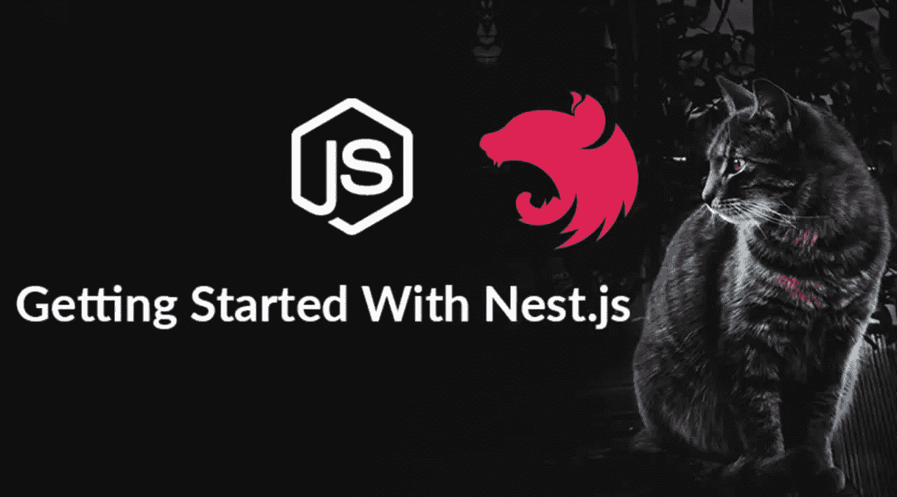
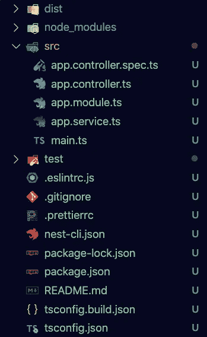
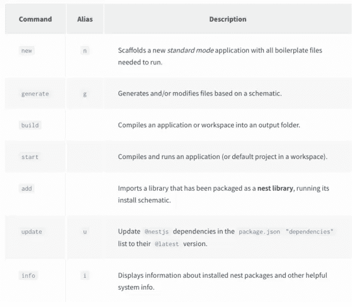
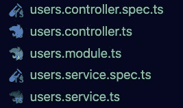
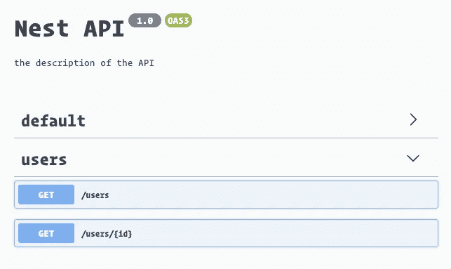
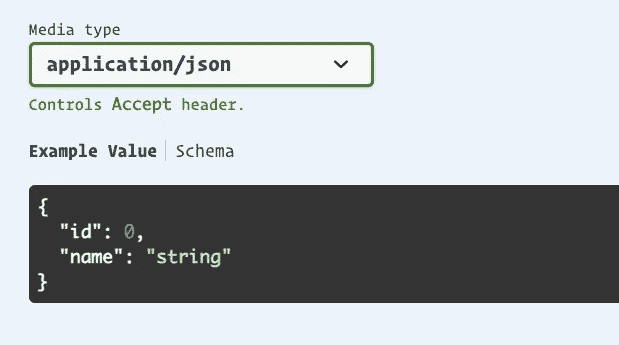

# NestJS——我们城市需要的英雄

> 原文：<https://blog.devgenius.io/nestjs-the-hero-our-city-needed-b5fb854ba879?source=collection_archive---------1----------------------->



几年来，我一直在构建和参与使用 Node + express 的项目。每次我们都使用不同的模式，并从零开始，为服务器添加很多必需品。我意识到这不仅本身很耗时，而且也使得新团队成员很难经常参与进来，因为这需要一些时间来让他们熟悉架构。一位客户公司的经理曾在一次 zoom 会议上小声说了“nest”这个词，这个词碰巧传进了我的耳朵，引起了我的一点兴趣。我以前听说过它，但听说它只是一个明确的框架后就放弃了。我的想法是，为什么我要在 Express 上扔比我已经是🧐.更多的东西然后我把它放了，但它像大多数科技产品一样不断侵蚀我的好奇心，所以我决定花些时间去探索它。

首先，让我们根据文档描述了解一下 nest 是什么。

> 用于构建高效、可靠和可伸缩的服务器端应用程序的渐进式 Node.js 框架。

这让我想到一个公关团队在他们写这篇文章时的最后状态，他们真的很想找到一堆让我们这样的开发者开心的关键词，但这意味着什么呢？为了进一步表达(双关语)这意味着什么，让我们看看在构建 express 服务器时可能会遇到的一些常见问题。

1.  输入验证和错误处理

*   输入验证通常需要自己的系统和团队来交流这种方法。你可以为这个或者仅仅是函数创建定制的中间件，但是最终它需要我们知道我们想要详细抛出哪些错误，并且创建一堆函数来验证输入。如果你不小心，在某些情况下需要像 joi 这样的额外的包，这会变得很麻烦。
*   错误可能要求您遵循一系列条件流来查看某些东西是否存在，或者验证是否返回了差异。这还不算太糟，但是接下来您可能需要有意识地进行团队协作，决定哪一层应该负责错误处理。

2.定义架构或架构缺失的模式

*   默认情况下，Express on it 不会生成任何内容。您可以使用一些 CLI 工具作为入门工具，但这通常不是最佳选择，因为没有严格遵循或维护它们。这意味着你可以自由地以任何你认为合适的方式构建你的应用程序，不管是好是坏。
*   你可以构建有史以来最伟大的服务器，但是如果模式很难遵循，或者他们真的不适合，那么加入新的团队成员会变得很困难。

3.文档是…什么文档？？

*   文档通常留给开发团队来处理。让我们面对现实吧，我们并不总是在记录我们的应用程序方面做得最好。很多时候，我们从自己的角度来写我们认为重要的东西，在大多数情况下，这只是“开始”部分，仅此而已。我们并不总是很好地记录如何添加新的特性来遵循已建立的模式，或者有什么路线以及它们的细节。

4.添加新功能非常耗时

*   给定一个存储库模式，其中您可能有一个很好的文件结构，这意味着您必须一次手工构建多个文件，这可能非常耗时。
*   这增加了一个非常沉重的样板文件，可能需要一整天的时间来编写，并且需要更多的时间来定义和测试。

这些听起来都像是对 Express 的许多否定，请记住，我只是指出这些来定义 Nestjs 带来的一些解决方案。如果你真的认为一项技术可以为你做所有伟大的事情，那么你也必须承认它的缺陷。现在，让我们创建一个基本的项目，看看 Nest 是如何解决这些问题的。

# 🧐入门

我知道你很想开始，但是在我们创建第一个项目之前..我们需要在全球范围内安装 nest CLI。打开您的终端，键入以下内容。

```
$ npm i -g @nestjs/cli
```

您可以通过执行以下操作来验证您现在已经全局安装了 nest。

```
$ nest --v
```

您现在应该看到 Nest 的当前稳定版本已经安装。现在我们可以使用 CLI 为我们生成一个新项目。在键入以下命令后，可能需要一段时间来安装和搭建项目，所以请耐心等待，因为它会执行它的神奇🧙🏽‍♂️.

```
$ nest new project-name
```

*注意:* `*project-name*` *将会是你的项目的名字，所以你可以随意改变它。*

您现在应该会看到类似下面的内容。



嵌套文件结构

我们的主要应用程序文件将位于`src`目录中，在那里我们将找到我们的`main.ts`文件。在继续深入研究这个目录之前，让我们首先运行我们的应用程序，确保一切正常。

```
$ npm run start:dev
```

您应该在终端中看到一些消息，定义了 Nest 正在采取的操作。当你开始用更多的“东西”填充你的应用程序时，你会看到它采取步骤加载你的控制器和模块，并建立依赖关系。打开你的浏览器，进入`http:localhost:3000/`，你应该会在页面上看到一条写着“hello world”的消息。现在让我们来看看你的文件，从`main.ts`开始，找出负责这个的代码在哪里，以及它是如何一起工作的。👀

```
import { NestFactory } from '@nestjs/core';
import { AppModule } from './app.module';async function bootstrap() {
  const app = await NestFactory.create(AppModule);
  await app.listen(3000);
}
bootstrap();
```

简单地🥜，这是你在正规快递 app 里的`index.js`或者`server.js`。它是您实际的服务器应用程序所在的地方。您将能够在这里应用您的中间件，并定义您的服务器应该在哪个端口上。注意它是从`./app.module`导入`AppModule`，让我们看看里面有什么。我们稍后会再次查看这个文件。

```
import { Module } from '@nestjs/common';
import { AppController } from './app.controller';
import { AppService } from './app.service';@Module({
  imports: [],
  controllers: [AppController],
  providers: [AppService],
})
export class AppModule {}
```

如果你曾经在前端使用过 Angular，你会发现两者之间有很多相似之处，因为它们都使用 decorators 并且有非常相似的实现。模块目录将通知应用程序其余的目录看起来是什么样子，它们的角色应该是什么。在 express 中，这通常由您通过一个导入周期手动完成。当您稍后向应用程序添加模块时，如用户、项目、组织等..这些模块将被添加到这里。还要注意的是，这个装饰也告诉我们哪些控制器和提供者属于这个主模块。接下来我们来看看控制器。

```
import { Controller, Get } from '@nestjs/common';
import { AppService } from './app.service';// Controller decorator establishes the route
// adding 'app' string to it changes the route to localhost:3000/app
@Controller()
export class AppController {
  constructor(private readonly appService: AppService) {} // allows you to nest routes
  // adding 'hello' string to it changes the route to localhost:3000/app/hello
  @Get()
  getHello(): string {
    return this.appService.getHello();
  }
}
```

我们可以把控制器想象成我们的端点通常被定义的地方，以及它们在某种意义上应该做什么。还记得你打开浏览器看到根目录呈现给你的“hello world”消息吗？`@Controller()`装饰器默认路径为`/`。所以如果我们把它改成如下:

```
@Controller('app')
```

如果我们刷新浏览器，我们现在应该会在页面上看到类似于以下内容的错误

```
// 20210410222848
// <http://localhost:3000/>{
  "statusCode": 404,
  "message": "Cannot GET /",
  "error": "Not Found"
}
```

这是因为我们早些时候在我们的装饰器中将路线更改为应用程序。所以现在，如果你去`[<http://localhost:3000/app>](<http://localhost:3000/app>)`你会再次看到我们珍贵的“你好，世界”信息。如果我们看看剩下的代码，我们会看到调用`getHello()`服务的方法。

```
@Get()
  getHello(): string {
    return this.appService.getHello();
  }
```

如果我们希望我们的路线是`http://localhost:3000/app/hello`，那么我们所要做的就是将以下内容添加到`@Get()`装饰器中:

```
@Get('hello')
```

现在，您应该能够查看该 URL，并看到我们的“hello world”消息已经再次重新定位。我们可以在研究完`app.service.ts`文件后再回到这里，构建一些服务。

```
import { Injectable } from '@nestjs/common';@Injectable()
export class AppService {
  getHello(): string {
    return 'Hello World!';
  }
}
```

在大多数情况下，服务是你和 ORM 交流的地方。在这种情况下，我们还没有建立连接(这将在后面的文章中介绍)，我们只是在 AppService 调用了`getHello()`方法后返回一个值。我们终于到了“你好，世界！”正在被创建🎉🎊。我们可以想象现在在这里做许多其他事情，但相反，让我们创建一个我们自己的功能。走完导致所有这些模式的步骤。

# 添加功能💆🏽‍♀️

在 express 中，如果我们想添加新功能..我们不得不手动操作。我们必须创建符合既定模式的文件，并添加所有的逻辑。当然，这可能会令人望而生畏，并消耗掉大量时间。Nest 为我们提供了几个 CLI 命令来完成这项工作。



NestJs CLI 命令

从上面的列表中，我们将经常使用`generate`来创建新的特性。我们可以用以下命令一次一个文件地创建一个`User`特征。

```
$ nest generate module users
$ nest generate service users
$ nest generate controller users
```

生成模块后，您会看到它被自动添加到装饰器的`app.module.ts`导入中。

```
import { UsersModule } from './users/users.module';@Module({
  imports: [UsersModule],
  controllers: [AppController],
  providers: [AppService],
})
```

然后在添加服务和控制器之后，您会看到它自动添加到您的`user.module.ts`中，因此您不需要担心自己进行连接。就我个人而言，我不喜欢必须添加每个单独的文件，所以我宁愿一次将它们全部脚手架起来。这正是下一个命令将为我们做的。

```
$ nest g resource users
```

这个命令提供了一些额外的选择，因为它可以根据您的选择构建成不同的东西。如果你选择使用这个命令，跟随这篇文章，你可以选择`RESTful API`作为你的第一选择，然后回答`yes`到`CRUD`。我们将构建由该选项搭建的附加目录。您的文件结构现在应该包含一个名为`users`的文件夹，并包含以下文件。



为我们的用户提供 NestJS 模块

我们在应用程序结构中已经介绍过的许多概念在这里都适用。你会注意到它共享完全相同的模式，这种模式会在你构建应用程序的整个过程中共享。这使得您的团队成员更容易学习模式并做出贡献。正如我们所看到的，添加一个新特性只是一个快速的命令，让自己熟悉这个模式非常简单。我们可以跳过`users.module.ts`，因为它与它的应用程序相似，没有新的添加，我们从看`users.controller.ts`开始。

让我们从添加我们的`getUsers`端点开始。

```
import {
  Controller,
  Get
} from '@nestjs/common';
import { UsersService } from './users.service';@Controller('users')
export class UsersController {
  constructor(private usersService: UsersService) {} @Get()
  getUsers(): any {
    return this.usersService.findAll();
  }
}
```

你会注意到这种模式目前也与我们的应用程序相似。在继续我们的服务文件之前，让我们也添加`getUsersById`控制器，因为我们在这个区域。

```
@Get(':id')
  getUserById(@Param('id') id: string): any {
    const user = this.usersService.findById(Number(id));
    return user;
  }
```

哇哦👀那看起来和`getUsers`方法有点不同？你是正确的！！这种方法与以前的方法有几个主要区别。

1.  装饰者现在有一个`:id`在里面。如果我们还记得我们以前对这个装饰器的介绍，在它里面添加一个字符串会附加到 route。在本例中，为我们创建了一个用户 id 变量。它会以参数的形式出现。
2.  `getUserById`的参数中增加了`@Param`。这是一个内置的嵌套装饰器，允许我们定义这个端点的参数。在字符串中，我们可以给它命名为`id`,然后使用 typescript 来定义 id 应该是什么，在我们的例子中，它将作为字符串出现。我们需要在以后改变这一点，因为我们将使用数字作为字符串。
3.  我们的服务调用使用`(Number(id))`，这是因为我们的 id 将是数字，所以我们必须手动将它们从`string`转换为`number`。稍后，我们将探索 Nest 如何通过管道为我们做到这一点。

既然已经解决了，让我们检查一下我们的`users.service.ts`文件

```
import { Injectable } from '@nestjs/common';@Injectable()
export class UsersService {}
```

哇，这么多空！！如果你使用了 scaffolding 命令，那么由于`CRUD`选项非常好，你可能已经在这里写了一些东西，我们将从头开始解决这个问题。首先，因为我们不会在本文(后面的文章)中使用数据库..我们将创建一组用户与之交互。请注意，通常这是引入 ORM 的地方，而不是像我们将要做的那样将数据保存在内存中。现在让我们添加数组。

```
@Injectable()
export class UsersService {
  private users: User[] = [ // these are my team members LOL
    { id: 0, name: 'Andre' },
    { id: 1, name: 'Carlos' }, // <-- hey, that's me
    { id: 2, name: 'Emily' },
    { id: 3, name: 'Norbert' },
    { id: 4, name: 'Alex' },
  ];
```

太好了！！现在我们有了可以互动的用户。我们现在可以继续创建我们的服务了。

```
findAll(): any {
    return this.users;
  }
  findById(userId: number): User {
    return this.users.find((user) => user.id === userId);
  }
```

就是这样！！我们完成了，现在我们可以发布一个拉式请求进行审查，打包我们的东西，然后回家。开个玩笑，这才是真正有趣的地方。在 express 中，通常当我们到达这一点时..我们将不得不打开`Postman`或`Insomnia`来测试我们的端点并验证响应和异常。对我来说，这是令人生畏的，除了我们自己的个人测试之外，并没有真正的贡献。相反，我们可以做的是包含 swagger 文档。所以，让我们借此机会谈谈 swagger，它是什么，它能为我们和我们的团队做些什么。

# 大摇大摆地进来😎

Swagger 是一个交互式文档工具，允许您详细描述您的端点。你可以通过多种方式做到这一点，比如访问他们的[网站](https://swagger.io/)，利用他们的 API 工具生成文档。我们将采取不同的方法，这将允许我们在工作时实现文档，并在有人点击`/docs`路线时生成大摇大摆的文档。首先，我们需要在我们的应用程序中安装 swagger UI。

```
$ npm install --save @nestjs/swagger swagger-ui-express
```

因为 Nest 使用 ExpressJS，所以我们可以使用 Express 模块作为 Nest 的一部分。这意味着我们可以两全其美。现在我们已经安装了 swagger UI，我们可以进入我们的`main.ts`文件来添加中间件并传递一些配置选项。

```
import { NestFactory } from '@nestjs/core';
import { DocumentBuilder, SwaggerModule } from '@nestjs/swagger';
import { AppModule } from './app.module';async function bootstrap() {
  const app = await NestFactory.create(AppModule);// configuration for swagger, we can set different values
  const config = new DocumentBuilder()
    .setTitle('Our Nest API')
    .setDescription('Super cool API that uses Nest to return Users')
    .setVersion('1.0')
    .build();// tells the swagger module to create the document
// with the config options we just built up
  const document = SwaggerModule.createDocument(app, config);// sets the route for the docs, adds it to the our app
// and passes in the documentation
  SwaggerModule.setup('/docs', app, document); await app.listen(3000);
}
bootstrap();
```

就是这样！！现在我们应该能够打开浏览器到文档端点`[<http://localhost:3000/docs>](<http://localhost:3000/docs>)`，看到我们的大摇大摆的文档开始形成。现在我们可以测试我们的两个端点。



我们的招摇博士

请注意，我们添加到配置中的细节用于填充页面的标题数据。我们还应该看到我们的两个超级棒的端点完全显示。我们可以使用这些来测试我们的工作，并记录我们的端点以供他人查看和使用。仅仅从几行代码中，我们已经获得了很多价值，但是当我们更详细地探索我们的端点时，我们会发现缺少了很多东西。Swagger 并不能真正提前告诉我们我们的对象应该是什么样子，或者我们应该期望得到什么回报。这是一个问题，因为它没有定义我们的意图或帮助我们或队友太多，我们现在将修复它。

# 更霸气！！😎x2

首先，我们将意识到我们并没有利用 typescript 提供给我们的巨大优势。我们到处都在删除`any`，所以我们不知道我们的函数调用会带来什么。让我们花点时间来填写创建将定义我们的用户的实体。在您的`/src/users`目录中，添加一个名为`entities`的新文件夹。然后创建文件`users.entity.ts`。

```
import { ApiProperty } from '@nestjs/swagger';export class User {
  @ApiProperty()
  id: number; @ApiProperty()
  name: string;
}
```

这里我们定义了一个带有`id`和`name`的`User`实体(这两个字段是我们在服务文件中提供给用户数组的)。我们还包括一个超级花哨的大摇大摆的装饰师`@ApiProperty()`。您可以查看[文档](https://docs.nestjs.com/openapi/types-and-parameters)了解更多细节，但本质上这让 swagger 知道这些是`User`类型的属性。我们也可以传递一个对象来定义一个不需要的字段。

```
@ApiProperty({ required: false })
```

还有一个[插件](https://docs.nestjs.com/openapi/cli-plugin)，如果你想让 swagger 自动为你做这件事，你可以选择加入。在一个较小的项目中，这没什么大不了的，但是在一个较大的项目中，这会变得非常冗长，所以让我们添加那个插件并移除上面的`@ApiProperty()`装饰器。请注意，默认情况下，您将使您的所有字段成为必填字段，因此，如果您有任何应该是可选的字段，请添加上述必填选项。让我们在根目录和插件中打开我们的`nest-cli.json`。

```
{
  "collection": "@nestjs/schematics",
  "sourceRoot": "src",
  "compilerOptions": {
    "plugins": ["@nestjs/swagger"]
  }
}
```

就是这样！！现在我们应该能够从我们的用户实体中移除我们的`@ApiProperty()`。现在我们终于可以回到我们的`users.service.ts`文件，添加我们新创建的用户类型。

```
import { Injectable } from '@nestjs/common';
import { User } from './entities/user.entity';@Injectable()
export class UsersService {
  private users: User[] = [
    { id: 0, name: 'Andre' },
    { id: 1, name: 'Carlos' },
    { id: 2, name: 'Emily' },
    { id: 3, name: 'Norbert' },
    { id: 4, name: 'Alex' },
  ]; findAll(): User[] {
    return this.users;
  }
  findById(userId: number): User {
    return this.users.find((user) => user.id === userId);
  }
}
```

太好了！！现在，当我们看一下我们的 swagger 文档时，我们应该看到包含了下面的模式。这将使每个人都能看到您的终端会带来什么，随着您的服务器扩展并包含更多终端，这对我们来说将变得非常有价值。



Swagger UI 示例对象

# 添加发布方法

所以我注意到我的一些队友在我们的用户列表中不见了。让我们通过添加一个 POST 方法来解决这个问题。让我们从移动到我们的`users.controller.ts`开始，添加创建用户的代码。

```
@Post()
  createUser(CreateUserDto): User {
    return this.usersService.createUser(body);
  }
```

又是新东西！！让我们回顾一下这个方法带来的一些附加功能。

1.  `@Post()`decorator——类似于它的`@Get()`对应物，它允许我们为这个请求定义一个嵌套的端点(可选)。
2.  `CreateUserDto` type - DTO 代表数据传输对象，这不是内置元素。数据传输对象是一个术语，它定义了将被传输到数据库中的对象。我喜欢把这看作是`entity`的反义词。虽然一个`entity`可以定义一个来自数据库的对象，但是`DTO`将定义被传入的数据。这两者并不总是唯一的，可以是不同的形状或类型。

有了这种方式，让我们现在创建我们的 DTO。在您的用户目录中，创建一个新文件夹并将其命名为`dto`，然后添加一个名为`create-user.dto.ts`的文件。这个命名并没有什么特别的，我们只是遵循了一个和我们在这个项目的其他部分会发现的相似的模式。在新创建的 DTO 文件中，我们可以添加我们期望作为响应对象返回的内容。

```
export class CreateUserDto {
  name: string;
}
```

现在我们可以导入它，并在我们的`users.controller.ts`文件中为用户的 POST 请求中使用它。现在我们可以进入我们的`users.service.ts`文件，并添加将用户推入内存数组的逻辑。

```
createUser(createUserDto: CreateUserDto): User {
    const newUser = {
      id: this.users[this.users.length - 1].id + 1,
      ...createUserDto,
    };
    this.users.push(newUser);
    return newUser;
  }
```

这很好，因为我们现在知道了我们的反应和身体物体的形状。然而，在前面，我们谈到了验证是 NestJS 的内置部分。通常在这一点上，我们要么为我们的参数手写一堆验证，要么引入一个库来尝试为我们做这些。这两种解决方案都需要一些样板文件和侵入式逻辑管理。Nest，这就简单多了。我们可以从使用`ValidationPipe`开始，你可以在文档中的这里阅读关于这个[的更多信息，但是本质上，这为我们提供了对以下已经包含的库的访问。](https://docs.nestjs.com/techniques/validation#using-the-built-in-validationpipe)

1.  [类验证器](https://www.npmjs.com/package/class-validator)——一个装饰验证器，在幕后使用`validator.js`。
2.  [类转换器](https://www.npmjs.com/package/class-transformer) —这允许你将一个普通的对象转换成某个类的实例，反之亦然。

为了将它添加到我们的嵌套项目中，我们可以在我们的`main.ts`中这样做。

```
import { ValidationPipe } from '@nestjs/common';
import { NestFactory } from '@nestjs/core';
import { DocumentBuilder, SwaggerModule } from '@nestjs/swagger';
import { AppModule } from './app.module';async function bootstrap() {
  const app = await NestFactory.create(AppModule); app.useGlobalPipes(new ValidationPipe()); const config = new DocumentBuilder()
    .setTitle('Nest API')
    .setDescription('the description of the API')
    .setVersion('1.0')
    .build();
  const document = SwaggerModule.createDocument(app, config);
  SwaggerModule.setup('/docs', app, document); await app.listen(3000);
}
bootstrap();
```

现在我们可以通过进入我们的`users.controller.ts`和一些装饰器和管道来开始利用这一点。

```
// the import
import { ParseIntPipe, Param, Body } from '@nestjs/common';// in our controller class
...getUserById(@Param('id', ParseIntPipe) id: number): User {
    return user;
  }createUser(@Body() body: CreateUserDto): User {
    return this.usersService.createUser(body);
  }
```

1.  `@param()` -这个装饰器用于验证请求参数。在这种情况下，我们使用它来验证我们的 id 现在是一个数字而不是一个字符串。
2.  `ParseIntPipe` -由于 JSON 解析的性质，id 以`string`的形式出现，但是我们的数据库 id 都是`numbers`。这个管道将为我们把 id 从字符串类型转换为数字，这样我们就可以删除旧的迫使我们自己去做的逻辑。
3.  `@Body()` -这个装饰器允许我们验证通过请求体传入的条目。这意味着，如果在这个级别发现问题，我们不必编写逻辑来捕获这个问题并发送一个用户友好的错误，Nest 会为我们处理这个问题。但是它是怎么知道的

现在，我们可以进入 DTO 文件，进一步定义我们想要的任何约束。

```
import { IsAlphanumeric, MaxLength, IsNotEmpty } from 'class-validator';export class CreateUserDto {
  @IsNotEmpty() // validates name is not empty
  @IsAlphanumeric() // validates name is alphanumeric
  @MaxLength(10) // validates name is no longer than 10 chars
  name: string;
}
```

上述验证通常需要整个手写正则表达式魔法系统和其他条件逻辑。我们能够编写几行代码并添加这种验证。我们甚至可以进入我们的 Swagger UI 文档，在我们的 POST 和 GET by id 端点上测试这些文档，以查看我们得到的不同错误消息。

# 查询 RESTful API 隐藏的宝石

查询通常需要一些解析和逻辑来定义，在我们的`users.controller.ts`中，NestJS 让我们在一行中定义和验证所有这些。

```
import { Query } from '@nest/common';getUsers(@Query('name') name?: string): User[] {
    return this.usersService.findAll(name);
}
```

然后在`users.service.ts`做一个快速的改变，将它加入我们的服务中

```
findAll(name?: string): User[] {
    if (name) {
        return this.users.filter(name);
    }
    return this.users;
}
```

# 错误处理

Nest 带有一个内置的异常层，可以处理应用程序中所有未处理的异常。这意味着当你的应用没有处理一个异常时(比如你忘记写一个或者你的异常不够详细)，它会自动上升到这个层，这个层会自动发送一个适当的用户友好的响应。这一点很重要，因为我们很容易忽略一些常见的异常，或者编写一些异常所需的逻辑很耗时。

```
// basic usage of HttpException class
@Get()
async findAll() {
  throw new HttpException('Forbidden', HttpStatus.FORBIDDEN);
}// overriding the entire response body of the HttpException class
@Get()
async findAll() {
  throw new HttpException({
    status: HttpStatus.FORBIDDEN,
    error: 'This is a custom message',
  }, HttpStatus.FORBIDDEN);
}
```

这里我们看到了一个名为`HttpException()`的异常处理程序。这个类是所有其他嵌套异常扩展的基础，以给出更详细的用户友好的错误消息。我们还可以用它来创建我们自己的自定义错误对象，这些对象是从`HttpException`类扩展而来的。

```
// implementation
export class ForbiddenException extends HttpException {
  constructor() {
    super('Forbidden', HttpStatus.FORBIDDEN);
  }
}// usage in your controller
@Get()
async findAll() {
  throw new ForbiddenException();
}
```

显然，每次遇到新的常见异常时，都必须编写一堆从`HttpException`扩展而来的定制异常处理程序，这并不有趣。为此，Nest 提供了一堆预制的内置 HTTP 异常类，它们已经完成了这项工作，并提供了用户友好的错误消息。

假设我们有一个很常见的例子，我们想通过 id 搜索一个用户，但是他们不存在于我们的数据库中。这通常需要在服务器构建过程中我们这边做一些事情。首先可能是授权检查，然后是参数验证，最后是异常处理。我们将在这里通过使用 Nest 的`NotFoundException`类来讨论最后一部分。

```
getUserById(id: number): User {
    const user = this.usersService.findById(id);
    if (!user) {
      throw new NotFoundException();
    }
    return user;
  }// returned response Object
{
  "statusCode": 404,
  "message": "Not Found"
}
```

这为我们提供了一些优势。

1.  我们不必编写自己的异常逻辑，这为我们提供了现成的、团队成员可以轻松解析的可读代码。
2.  我们可以更明确地知道抛出了什么异常。
3.  我们可以利用这个机会进一步定义我们的错误消息。

# 更大的惊喜！！！😎x100

我们的 Swagger UI 文档的一个问题是它没有定义足够多的端点。如果您搭建了另一个特性，它将堆积在您的用户端点之上，因为 swagger 目前无法识别一个特性的结束和另一个特性的开始。此外，在运行测试之前，它不知道我们的返回对象对象和消息应该是什么。我们可以用神气活现的装修工来解决这个问题。让我们跳回`users.controllers.ts`并添加一些。

```
import {
  Body,
  Controller,
  Get,
  NotFoundException,
  Param,
  ParseIntPipe,
  Post,
  Query,
} from '@nestjs/common';
import {
  ApiBadRequestResponse,
  ApiCreatedResponse,
  ApiNotFoundResponse,
  ApiOkResponse,
  ApiQuery,
  ApiTags,
} from '@nestjs/swagger';
import { CreateUserDto } from './dto/create-user.dto';
import { User } from './entities/user.entity';
import { UsersService } from './users.service';@ApiTags('users') // separates users items in swagger docs
@Controller('users')
export class UsersController {
  constructor(private usersService: UsersService) {} @ApiOkResponse({
    type: User,
    isArray: true,
    description: 'Returns all users in array',
  })
  @ApiQuery({ name: 'name', required: false })
  @Get()
  getUsers(@Query('name') name?: string): User[] {
    return this.usersService.findAll(name);
  } @ApiNotFoundResponse()
  @ApiOkResponse({
    type: User,
    isArray: false,
    description: 'Returns Single User by Id',
  })
  @Get(':id')
  getUserById(@Param('id', ParseIntPipe) id: number): User {
    const user = this.usersService.findById(id);
    if (!user) {
      throw new NotFoundException();
    }
    return user;
  } @ApiCreatedResponse({
    type: User,
    description: 'Creates a user in memory',
  })
  @ApiBadRequestResponse()
  @Post()
  createUser(@Body() body: CreateUserDto): User {
    return this.usersService.createUser(body);
  }
}
```

1.  `@ApiOkResponse`——这让我们有机会预先定义读者应该期望得到什么。在我们的`getUsers`案例中，我们明确定义了我们将得到一个`Users`数组。
2.  对于那些讨厌的 404 响应，我们也可以定义为 swagger，让我们的读者知道在这种情况下会发生什么。
3.  作为一名前端开发人员，我经常不得不问我的后端开发人员，我应该从创建的响应中期待什么。在某些情况下，您可能只需要 id、整个对象或者什么都不需要。有了这个，我们就可以看一看 Swagger UI 文档，然后回到它。
4.  `@ApiBadRequestResponse()` -在创建或更新时，经常会出现不好的请求。很高兴能够告诉读者在这种情况下会发生什么。

# 结论😤

在本文中，我们探讨了 NestJS 的许多基本特性。仍然有很多事情要做，包括创建微服务、WebSockets 等等。如果你和我一样是一个死忠的 Express 用户，那么我希望这能激发你足够的好奇心去探索 Nest 并使用它。