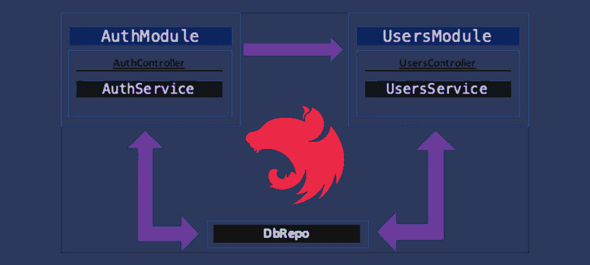
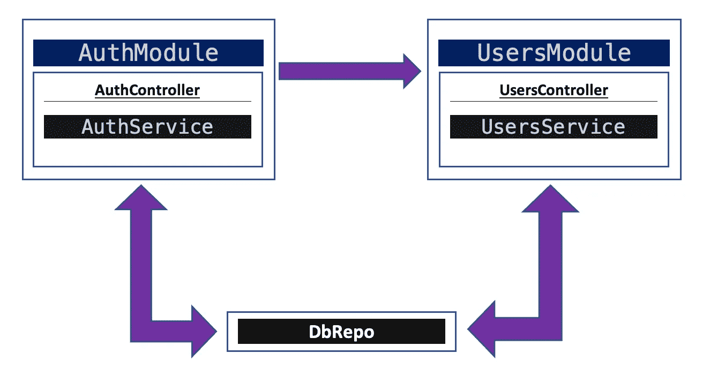

# NestJS:使用 solo @ injectable 类作为单例提供者

> 原文：<https://blog.devgenius.io/nestjs-use-a-solo-injectable-class-as-a-singleton-provider-884911eff279?source=collection_archive---------1----------------------->



**简介**

[NestJS](https://nestjs.com/) [模块](https://docs.nestjs.com/modules)默认为[单线态](https://en.wikipedia.org/wiki/Singleton_pattern)。当从同一个模块中提供它们时，它们的提供者也是单例的。然而，在某些情况下，我们希望使用一个 solo 类作为一对或更多模块的提供者。在这种情况下，我们可以使用 solo 类作为 singleton 或 not。让我们看看我们能做些什么。

**案情**

让我们再来看看“经典”案例，其中有两个模块:AuthModule 和 UsersModule。假设我们想使用 DbRepo 类作为单例提供者。AuthModule 应该优先于 UsersModule，因为我们只使用经过身份验证的用户。

传入的请求有两个选项:

它应该已经通过登录过程，以便通过 AuthModule → AuthController →注册获得授权(例如，获得 JWT 令牌)。

运筹学

它可以自由访问以创建新用户，同样通过 auth module auth controller→登录。

@ injectable DbRepo 同时服务于 AuthServise 和 UsersService(提供数据并与之交互)。因此，这些服务中的每一个都必须将 DbRepo 注入到其构造函数中。

```
constructor(private dbRepo: DbRepo) {}
```

无论如何，UsersModule 必须将 AuthModule 添加到其 imports 部分数组中。



**这不是单一方法**

此时，我们将 DbRepo 分别(独立地)添加到 AuthModule 和 UsersModule 的 providers array 部分:

授权模块

用户模块

在这种方法中，每个模块都创建自己的 DbRepo 实例，因此**这不是单一的**。例如，如果您创建一个新用户(auth module→auth controller→sign up ),则无法在 UsersModule 中反映该用户(例如，users module →userscontroller→get users)

**单例方法**

不应将 DbRepo 添加到这两个模块中。它必须只添加到具有优先级的模块，即 AuthModule。

而且，还得出口。这样，导入 AuthModule 的任何其他模块都可以立即使用导出的提供者——在我们的例子中是 DbRepo。

授权模块

用户模块

然后，UsersModule 不必做任何事情。因为它导入了 AuthModule，所以 UsersModule 中的任何提供者/服务都可以访问从 AuthModule 提供和导出的 DbRepo 的单例实例。

就是这样！

我希望你喜欢它！