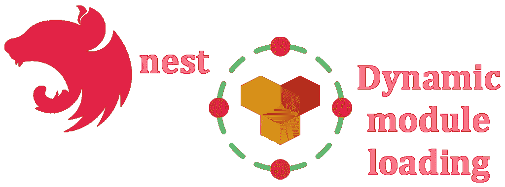
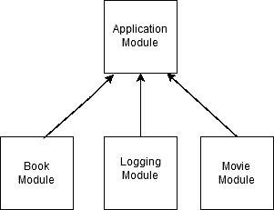
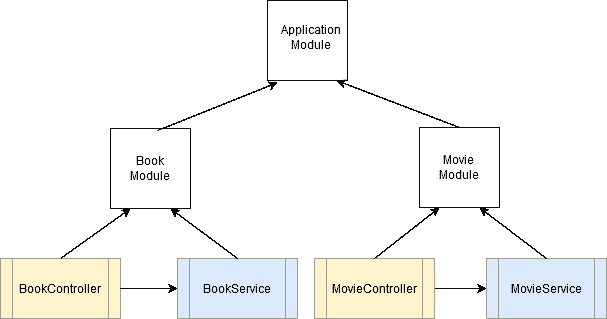
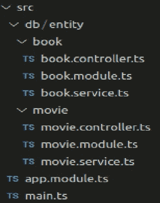
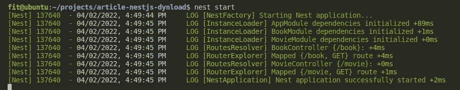
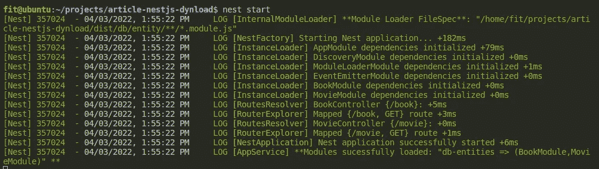

# 具有动态模块加载的 NestJS

> 原文：<https://blog.devgenius.io/nestjs-with-dynamic-module-loading-6391baf94f43?source=collection_archive---------1----------------------->



## 描述

[**NestJS**](https://github.com/nestjs/nest) 是一个构建良好的服务器端类型脚本框架，它实现了重要的设计模式，如 [**依赖注入原则**](https://en.wikipedia.org/wiki/Dependency_injection) 。

NestJS 集中了使用 Nodejs 构建一致的微服务或整体服务器所需的所有技术。

NestJS 使用三个主要构建块来构成应用程序:

*   控制器
*   提供者
*   模块

> NestJS 中的控制器负责处理任何传入的请求，并将响应返回给应用程序的客户端。
> 
> **提供者**(也称为服务)可以被创建并注入控制器或其他提供者。提供者旨在抽象任何形式的复杂性和逻辑。
> 
> **模块**让你分组相关文件。通过模块引用提供者和控制器。在 NestJS 中，默认情况下，模块封装提供者。换句话说，不可能将不是模块的一部分或从另一个模块导出的提供程序注入到模块中。模块可以导入其他模块——基本上，这允许跨模块共享提供者。

下图说明了 NestJS 中模块的概念。



如您所见，每个应用程序至少有一个根模块(应用程序模块)。**根模块**基本上是 NestJS 用来构建**应用图**的起点。

在 nestjs 中，模块被定义为带有@Module decorator 的类，该类将一个对象作为输入，该对象具有用于创建模块、提供者和控制器之间的关系的部分(属性):

> **提供者**它接受一个提供者列表作为输入。这些提供者将由 NestJS 注入器实例化。默认情况下，属于某个模块的提供程序将在该模块中可用。
> 
> 控制器这个数组指定了模块中控制器的集合。基本上，NestJS 会在启动时自动实例化它们。
> 
> **导入**在这个部分，我们可以指定导入模块的列表。基本上，这允许跨模块共享提供者
> 
> **Exports** 指定该模块提供的提供者。换句话说，我们指定由这个模块导出的提供者。

## 先决条件

我们假设您的系统上安装了 **git cli** 、 **nodejs** 和 **nestjs cli** 。本教程是在一个 ***linux 环境*** 中运行的，但是你可以很容易地为你喜欢的操作系统进行调整。

## 简单的 NestJS 应用程序

我们将创建两个版本的 API 来访问伪数据库中两个实体(表)的内容——只是通过 id 查找条目。

第一个版本采用传统格式，我们将把封装实体的两个模块分别导入到 appmodule 中。

第二个版本将动态导入/src/db/entity 子目录中的所有模块

这很酷，就好像你为这个子目录中的新实体创建了新的模块，这些模块将被动态地导入，而不需要你引用它们。您只需创建它们，它们就会自动成为系统的一部分

这样，我们的系统将具有以下格式:



## 实体单元

对于每个实体，我们将有一个响应 HTTP 请求的控制器、一个对实体数据执行搜索的服务(由控制器使用)以及一个引用相应控制器和服务的模块(如上图所示，我们有对应于实体 **Book** 和 **Movie** 的单元)。

## 无动态模块加载的版本

**理论讲够了，让我们把面团投入工作吧！**

**下面是 API 应用程序的子目录:**

****

**让我们检查最相关的源代码**

## ****app . module . ts****

**根模块***app . module . ts***只是将图书和电影实体模块导入到系统中。**

```
import { Module } from '@nestjs/common';
import { BookModule } from './db/entity/book/book.module';
import { MovieModule } from './db/entity/movie/movie.module';

@Module({
  imports: [BookModule, MovieModule],
})
export class AppModule {}
```

**db/entity 子目录包含实体列表(书籍和电影)及其各自的模块、提供程序和控制器文件。由于相似性，我们将只检查图书实体的源代码。**

## ****book . module . ts****

**模块***book . module . ts***也很简单。只需加载控制器***book . controller . ts***并使提供者***book . service . ts***可用。**

```
import { Module } from '@nestjs/common';
import { BookService } from './book.service';
import { BookController } from './book.controller';

@Module({
  controllers: [BookController],
  providers: [BookService],
})
export class BookModule {}
```

## *****book . controller . ts*****

**控制器***book . controller . ts***响应路径 **/book** 上的 HTTP GET requenst，接受 **ID** 参数，只返回带有相应 ID 的书。**

**控制器使用 **book.service.ts** 服务的 findById 方法搜索并返回与 **ID** 对应的图书。**

```
import { Controller, Get, ParseIntPipe, Query } from '@nestjs/common';
import { BookService, Book } from './book.service';

@Controller('book')
export class BookController {
  constructor(private readonly bookService: BookService) {}

  @Get()
  getBook(@Query('id', ParseIntPipe) id: number): Book {
    return this.bookService.findById(id);
  }
}
```

## ****book . service . ts****

**最后， ***book.service.ts*** 服务简单地提供了 **findoById** 方法，该方法根据图书的 **ID** 从伪图书表中返回一本书。**

```
import { Injectable } from '@nestjs/common';

export interface Book {
  id: number;
  title: string;
}

@Injectable()
export class BookService {
  private static _books: Array<Book> = [
    {
      id: 1,
      title: 'Nest.js: A Progressive Node.js Framework (English Edition)',
    },
    { id: 2, title: 'NestJS Build a RESTFul CRUD API' },
    { id: 3, title: 'Pratical Nest.js' },
  ];

  findById(id: number): Book {
    return BookService._books.find((book) => book.id === id);
  }
}
```

## **执行 API**

**使用以下命令运行 API 时:**

```
# Run the NestJS server application
$ nest start
```

**您将在控制台上看到以下消息:**

****

**简单又干净。现在让我们把事情复杂化一点。**

## **带动态模块加载的**版本****

**NestJS 本身实现了模块[](https://docs.nestjs.com/fundamentals/lazy-loading-modules)**的延迟加载，允许您在启动时不必加载所有模块。****

****我们在这里提议的不是这个。我们在启动时加载它，但不需要手动加载每个模块。****

****为了动态加载模块，我们使用 [**GLOBs**](https://en.wikipedia.org/wiki/Glob_(programming)) 在某个子目录中查找模块，并使用本机函数 ***import()*** 从相应的 JS 文件中加载并提取模块(记住，这是在运行时加载的，我们不再处于 TS 环境中)。****

****更改原始项目后，我们有以下更改:****

## ******app . module . ts******

****根模块***app . module . ts***的主要变化有:****

*   ****不再显式加载实体单元模块(书籍和电影)。****
*   ****我们提供了一个***app . service . ts***只是为了在动态模块加载时接收一个事件，并显示在控制台中。****
*   ****我们使用我们的动态模块加载器(***ModuleLoaderModule***)的 ***寄存器*** 方法，通过指定一个选项参数，该参数带有关于在哪里动态加载模块的信息。****

****我们有以下源代码:****

```
**import { Module } from '@nestjs/common';
import { EventEmitterModule } from '@nestjs/event-emitter';
import * as path from 'path';
import { AppService } from './app.service';
import { ModuleLoaderModule } from './common/module-loader.module';

@Module({
  imports: [
    EventEmitterModule.forRoot({ wildcard: true }),
    /**
     * Load all entity unit modules in subdirectory /db/entity
     */
    ModuleLoaderModule.register({
      name: 'db-entities',
      /**
       * Make sure the path resolves to the **DIST** subdirectory, (we are no longer in TS land but JS land!)
       */
      path: path.resolve(__dirname, './db/entity'),
      fileSpec: '**/*.module.js',
    }),
  ],
  providers: [AppService],
})
export class AppModule {}**
```

## ****动态模块加载器****

****在***/公共*** 子目录中，我们有三个新的源来执行动态加载服务:****

*   *******module-loader-defs . ts***—该文件包含动态加载模块使用的定义。****
*   *******module-loader . service . ts***—只在模块动态加载结束时发出一个事件。****
*   *******【module-loader . module . ts***——实际上是做脏活的。****

## ******模块加载器定义******

```
**import { ModuleRef } from '@nestjs/core';

/**
 * Constants used in ModuleLoader implementation
 */
export const MODULE_LOADER_OPTIONS = 'MODULE_LOADER_OPTIONS';
export const MODULE_LOADER_NAMES = 'MODULE_LOADER_NAMES';
export const MODULE_LOADER = 'MODULE_LOADER';
export const EV_MODULE_DYN_LOADER = 'EV_MODULE_DYN_LOADER.';

/**
 * Options interface for ModuleLoaderModule.register
 */
export interface IModuleLoaderOptions {
  /**
   * Name of modules
   */
  name: string;
  /**
   * Path's modules to load
   */
  path: string;
  /**
   * Depth to search modules inside of directories's path
   * default: -1 (INFINITY) - searches in root path only
   */
  depht?: number;
  /**
   * File spec to match - accepts globs and list of globs/file names
   * default: '*.module.ts'
   */
  fileSpec?: string | Array<string>;
  /**
   * File spec to ignore - accepts globs and list of globs/file names
   */
  ignoreSpec?: string | Array<string>;
}

/**
 * Event type fired when modules are loaded
 */
export interface IModuleDynLoaderEvent {
  name: string;
  moduleNames?: Array<string>;
  error?: Error | string;
}**
```

## ******module-loader . service . ts******

```
**import { Injectable, Inject, Scope, OnModuleInit } from '@nestjs/common';
import {
  MODULE_LOADER_OPTIONS,
  MODULE_LOADER_NAMES,
  EV_MODULE_DYN_LOADER,
  IModuleLoaderOptions,
} from './module-loader-defs';
import { EventEmitter2 } from '@nestjs/event-emitter';
import { nextTick } from 'process';

@Injectable({
  scope: Scope.TRANSIENT,
})
export class ModuleLoaderService implements OnModuleInit {
  constructor(
    @Inject(MODULE_LOADER_OPTIONS) private _options: IModuleLoaderOptions,
    @Inject(MODULE_LOADER_NAMES) private _moduleNames: Array<string>,

    private eventEmitter: EventEmitter2,
  ) {}

  /**
   * @description Emmits as events when modules are loaded
   */
  onModuleInit() {
    nextTick(() => {
      const eventName = EV_MODULE_DYN_LOADER + this._options.name;
      this.eventEmitter.emit(eventName, {
        name: this._options.name,
        moduleNames: this._moduleNames,
      });
    });
  }
}**
```

## ******module-loader . service . ts******

```
**import { Logger, Module, DynamicModule } from '@nestjs/common';
import * as fb from 'fast-glob';
import * as path from 'path';
import { ModuleLoaderService } from './module-loader.service';
import {
  MODULE_LOADER,
  MODULE_LOADER_OPTIONS,
  MODULE_LOADER_NAMES,
  IModuleLoaderOptions,
} from './module-loader-defs';

export const moduleLoaderFactory = {
  provide: MODULE_LOADER,
  useFactory: (moduleLoaderService: ModuleLoaderService) => {},
  inject: [ModuleLoaderService],
};

interface IModuleInfo {
  name: string;
  module: DynamicModule;
}

/**
 * @description helper static class to load modules dynamically.
 */
class InternalModuleLoader {
  static readonly logger = new Logger(InternalModuleLoader.name);

  /**
   * @param _options for GLOB searches
   * @returns a Promise thats resolves to a list of name and module references based on _options filespec
   */
  static async loadModules(
    _options: IModuleLoaderOptions,
  ): Promise<Array<IModuleInfo>> {
    return new Promise((resolve, reject) => {
      this.getModuleFileNames(_options).then((filePaths: Array<string>) => {
        if (filePaths.length == 0) {
          resolve([]);
        } else {
          const loadedModules: Array<Promise<any>> = filePaths.map((filePath) =>
            this.loadModule(filePath),
          );
          if (loadedModules.length === 0) {
            resolve([]);
          } else {
            const moduleInfos: Array<IModuleInfo> = new Array();
            Promise.all(loadedModules).then((modules: Array<any>) => {
              for (let i = 0; i < modules.length; i++) {
                let module = modules[i];
                const moduleField = Object.keys(module).find(
                  (key) => key.indexOf('Module') >= 0,
                );
                if (moduleField) {
                  moduleInfos.push({
                    name: moduleField,
                    module: module[moduleField],
                  });
                }
              }
              resolve(moduleInfos);
            });
          }
        }
      });
    });
  }

  /**
   * @description Uses native import() to dynamicly load a module
   * @param modulePath
   * @returns a Promise thats resolves to module loaded
   */
  private static async loadModule(modulePath: string): Promise<any> {
    return import(modulePath);
  }

  /**
   * @description Uses FatsGlob to load the filenames for the modules
   * @param _options for GLOB searches
   * @returns a list of module's file paths
   */
  private static async getModuleFileNames(
    _options: IModuleLoaderOptions,
  ): Promise<Array<string>> {
    const spec: Array<string> = (
      typeof _options.fileSpec === 'string'
        ? [_options.fileSpec]
        : _options.fileSpec
    ).map((fileSpec) => path.join(_options.path, fileSpec));
    let options: fb.Options = {
      onlyFiles: true,
    };
    if (_options.depht) {
      options.deep = _options.depht < 0 ? Infinity : _options.depht;
    }
    if (_options.ignoreSpec) {
      options.ignore = Array.isArray(_options.ignoreSpec)
        ? _options.ignoreSpec
        : [_options.ignoreSpec];
    }
    this.logger.log(`**Module Loader FileSpec**: "${spec}"`);

    return fb(spec, options);
  }
}

@Module({})
export class ModuleLoaderModule {
  /**
   * @description Load Modules dynamically via GLOBs and native import() function.
   * @param moduleLoaderOptions options for GLOB searches
   */
  public static async register(
    moduleLoaderOptions: IModuleLoaderOptions,
  ): Promise<DynamicModule> {
    const moduleInfos = await InternalModuleLoader.loadModules(
      moduleLoaderOptions,
    );
    const modules = moduleInfos.map((moduleInfo) => moduleInfo.module);
    const moduleNames = moduleInfos.map((moduleInfo) => moduleInfo.name);

    return {
      module: ModuleLoaderModule,
      imports: [...modules],
      providers: [
        {
          provide: MODULE_LOADER_OPTIONS,
          useValue: moduleLoaderOptions,
        },
        {
          provide: MODULE_LOADER_NAMES,
          useValue: moduleNames,
        },
        ModuleLoaderService,
        moduleLoaderFactory,
      ],
    };
  }
}**
```

****使用以下命令运行 API 时:****

```
**# Run the NestJS server application
$ nest start**
```

****您将在控制台上看到以下消息(*注意，图书和电影实体单元的模块被正确地动态加载了*):****

********

## ****运行本教程中的示例****

## ****装置****

```
**# Clone tutorial repository
$ git clone https://github.com/maceto2016/NestJSDynLoad

# access the project folder through the terminal
$ cd NestJSDynLoad

# Install dependencies
$ npm install**
```

## ****运行应用程序(从 NestJSDynLoad 文件夹)****

```
**# Run the NestJS server application
$ nest start**
```

## ****测试应用程序****

```
**# Get book with id = 1
$ curl http://localhost:3000/book?id=1 | json_pp**
```

## ****结论****

****在本教程中，我们对构建良好的 NestJS 框架做了一个简单的介绍。****

****我们演示了如何将给定子目录中的所有模块动态加载到您的 NestJS 应用程序中，而不需要您在代码中手动引用这些模块。这在某些情况下是可行的。****

****本文中使用的原则允许各种实现，包括您自己版本的模块延迟加载。****

****您是否可以使用 NestJS ConfigService 来实现 ***registerAsync*** 版本，以便从 env 文件中定义的 fileSpec 加载文件列表？****

****由你决定！****

****感谢您的阅读。我很高兴听到你的反馈！****