# 。NET 5 预览版

> 原文：<https://blog.devgenius.io/net-5-preview-13fc5ccf103f?source=collection_archive---------16----------------------->


# 1.C# 9

C# 9 将有许多特性，包括记录、顶级语句、改进的模式匹配等等。
**在此阅读更多**:[https://medium.com/dev-genius/c-9-early-review-5bcd88296c54](https://medium.com/dev-genius/c-9-early-review-5bcd88296c54)

# 2.F# 5

F# 5 将会有 F#脚本的包引用，增强的切片，`nameof`函数以及更多的新特性和改进。
**此处阅读更多:**
1。[https://dev blogs . Microsoft . com/dotnet/announding-f-5-preview-1/](https://devblogs.microsoft.com/dotnet/announcing-f-5-preview-1/)
2 .[https://dev blogs . Microsoft . com/dotnet/f-5-update-for-net-5-preview-4/](https://devblogs.microsoft.com/dotnet/f-5-update-for-net-5-preview-4/)

# 3.正则表达式性能改进

## **1。字符**

```
private Regex _regex = new Regex("[a-zA-Z0-9]*", RegexOptions.Compiled);

public bool IsMatch() => _regex.IsMatch("abcdefghijklmnopqrstuvwxyz123456789ABCDEFGHIJKLMNOPQRSTUVWXYZ");
```


字符差异

## **2。基于跨度的**

```
private Regex _regex = new Regex("hello.*world", RegexOptions.Compiled);

public bool IsMatch() => _regex.IsMatch("hello.  this is a test to see if it's able to find something more quickly in the world.");
```

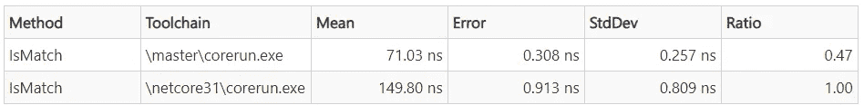

基于跨度的差异

## **3。基于阵列的**

基于数组的字符:

```
private static Random s_rand = new Random(42);

private Regex _regex = new Regex("([ab]cd|ef[g-i])jklm", RegexOptions.Compiled);private string _input = string.Concat(Enumerable.Range(0, 1000).Select(_ => (char)('a' + s_rand.Next(26))));

public bool IsMatch() => _regex.IsMatch(_input);
```

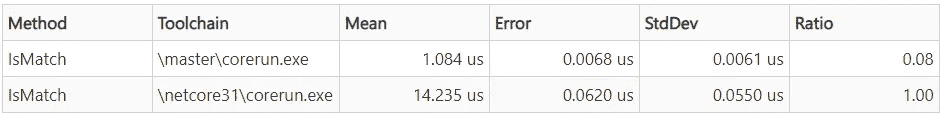

基于数组的字符差异

基于数组的数字:

```
private readonly Regex _regex = new Regex("[0-9]{3}-[0-9]{2}-[0-9]{4}", RegexOptions.Compiled);

public bool IsMatch() => _regex.IsMatch("123-45-678");
```

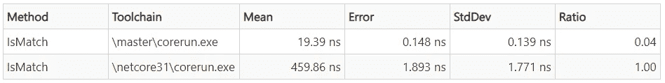

基于数组的数字差分

## **4。基于回溯的**

任意数量的子查询:

```
private Regex _regex = new Regex("a*a*a*a*a*a*a*b", RegexOptions.Compiled);

public bool IsMatch() => _regex.IsMatch("aaaaaaaaaaaaaaaaaaaaa");
```

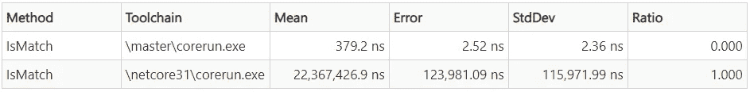

基于回溯的差异

任何符号:

```
private readonly Regex _regex = new Regex(@".*text", RegexOptions.Compiled);

public bool IsMatch() => _regex.IsMatch("This is a test.\nDoes it match this?\nWhat about this text?");
```

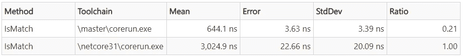

基于回溯的任意符号差

## **5。并发优化:**

```
Parallel.Invoke(
            () => { while (true) Regex.IsMatch("abc", "^abc$"); },
            () => { while (true) Regex.IsMatch("def", "^def$"); },
            () => { while (true) Regex.IsMatch("ghi", "^ghi$"); },
            () => { while (true) Regex.IsMatch("jkl", "^jkl$"); });
```

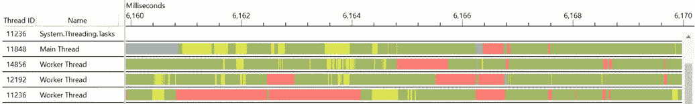

。网络核心 3.1


。网络 5

## **6。替换优化:**

```
private Regex _regex = new Regex("a", RegexOptions.Compiled);
private string _input = string.Concat(Enumerable.Repeat("abcdefghijklmnopqrstuvwxyz", 1_000_000));

public string Replace() => _regex.Replace(_input, "A");
```

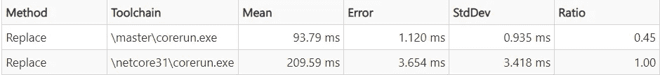

更换速度差

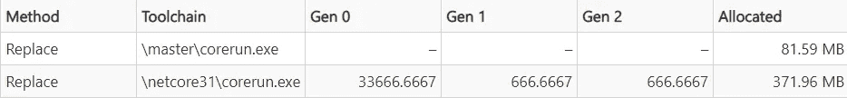

替换内存分配差异

**在这里阅读更多:**[https://dev blogs . Microsoft . com/dotnet/regex-performance-improvements-in-net-5/](https://devblogs.microsoft.com/dotnet/regex-performance-improvements-in-net-5/)

# 4.提高字符串的性能。ToUpperInvariant，string。ToLowerInvariant，char。ToUpperInvariant，char。ToLowerInvariant 和其他相关模式

1.  通过将`string.ToUpperInvariant`、`string.ToLowerInvariant`、`char.ToUpperInvariant`、`char.ToLowerInvariant`直接绑定到正确的`TextInfo`实例来提高它们的性能，而不是通过`CultureInfo.Invariant`跳跃。
2.  尽可能在调用点避免解引用`CultureInfo.InvariantCulture`,使用特定于不变量的代码路径。
3.  更换图案`if (string.Trim().Length != 0)`以使用`string.IsNullOrWhiteSpace`代替。
4.  替换不正确使用文化感知`string.ToUpper` / `string.ToLower`的调用站点，改为使用`ToUpperInvariant` / `ToLowerInvariant`。
5.  替换不正确地使用文化感知`string.IndexOf(...)`的调用站点，使用`string.IndexOf(..., StringComparison.Ordinal)`来代替。
6.  替换不正确使用区分区域性的`string.StartsWith(...)` / `string.EndsWith(...)`的调用站点，改为使用序数`string.StartsWith(..., StringComparison.Ordinal)` / `string.EndsWith(..., StringComparison.Ordinal)`。
7.  如果一个项目专门针对。网芯最新，把`string.IndexOf("x", StringComparison.Ordinal)`改成`string.IndexOf('x')`。

# 5.HTTP 1.1 和 HTTP/2 性能改进

1.  [HTTP 1.1 SocketsHttpHandler 性能](https://github.com/dotnet/corefx/pull/41640)
2.  [HTTP/2 伸缩性能](https://github.com/dotnet/runtime/pull/35694)

# 6.系统。Json 的改进

1.  [增加对 JSON dotnet/runtime #655](https://github.com/dotnet/runtime/pull/655) 上保留引用的支持——[启用](https://github.com/dotnet/runtime/issues/29900) `[ReferenceLoopHandling](https://github.com/dotnet/runtime/issues/29900)`，这是 JSON.NET 序列化的关键特性之一。
2.  [添加新系统。net . http . Json project/namespace dot net/runtime # 33459](https://github.com/dotnet/runtime/pull/33459)—为 HttpClient 添加了[新的扩展方法，允许从/到 JSON 的序列化](https://github.com/dotnet/runtime/issues/32937)。
3.  [添加](https://github.com/dotnet/runtime/pull/33444) `[JsonConstructor](https://github.com/dotnet/runtime/pull/33444)` [并支持使用参数化的构造器进行反序列化 dotnet/runtime #33444](https://github.com/dotnet/runtime/pull/33444) —向 JsonSerializer 添加对不可变类和结构的支持。
4.  添加 JsonIgnoreCondition】每属性忽略逻辑# 34049-添加对空值处理的支持，这是 JSON.NET 序列化的另一个特性。
5.  [将复制构造函数添加到 JsonSerializerOptions](https://github.com/dotnet/runtime/pull/34725) —使框架库能够管理一个`JsonSerializerOptions`实例，使用它设置的特定值，同时类型随时间变化。
6.  [添加对非公共访问器的 JsonIncludeAttribute &支持](https://github.com/dotnet/runtime/pull/34675) —启用非公共 getter 用法，这类似于 Newtonsoft 的功能。Json `JsonProperty`属性。

# 7.垃圾收集工

1.  [卡片标记窃取— dotnet/coreclr #25986](https://github.com/dotnet/coreclr/pull/25986) —服务器 GC(在不同线程上)现在可以在标记由老一代对象保持活动的 gen0/1 对象时进行工作窃取。这意味着短暂的 GC 暂停在某些 GC 线程比其他线程花费更长时间来标记的情况下会更短。
2.  [引入固定对象堆— dotnet/runtime #32283](https://github.com/dotnet/runtime/pull/32283) —实现了 POH(固定对象堆)特性的一部分—GC 的内部部分。这个新堆(本质上是 LOH 的对等体)将允许 GC 单独管理固定对象，从而避免固定对象对分代堆的负面影响。
3.  [允许在后台清理 SOH 时从空闲列表分配大对象— dotnet/runtime #2103](https://github.com/dotnet/runtime/pull/2103) —在 BGC 清理 SOH 时，使用空闲列表启用 LOH 分配。以前，这只是在 LOH 上使用段尾空间。这允许更好地使用堆。
4.  [后台 GC 挂起修复— dotnet/coreclr #27729](https://github.com/dotnet/coreclr/pull/27729) —挂起修复减少了 BGC 和用户线程被挂起的时间。这减少了在 GC 发生之前挂起托管线程所需的总时间。 [dotnet/coreclr #27578](https://github.com/dotnet/coreclr/pull/27578) 也促成了同样的结果。
5.  [修复 docker-dot net/runtime # 980](https://github.com/dotnet/runtime/pull/980)中的命名 cgroup 处理-添加了对从命名 c group 读取限制的支持。以前我们只从全局中读取。

# 8.的 Windows 窗体设计器。网络核心

1.  除了`DataGridView`和`ToolStripContainer`之外的所有 Windows 窗体控件
2.  `UserControl`和自定义控件基础架构
3.  所有设计器功能，如
    3.1 拖放
    3.2 选择、移动和调整大小
    3.3 剪切/复制/粘贴/删除
    3.4 与属性窗口的集成
    3.5 事件生成等等
4.  新的`WebView2`控件
    这个基于 chromium 的嵌入式浏览器控件允许为。网络应用。两者都支持它。网芯和。用于 Windows 窗体和 WPF 应用程序的. NET Framework 平台。你可以在微软文档中找到[入门教程](https://docs.microsoft.com/microsoft-edge/webview2/gettingstarted/winforms)。
5.  当地资源
6.  部分支持本地化:
    6.1 控件和 UserControl 的可本地化属性可以序列化为 ResX 文件(通过将`Localizable`属性设置为`true`)。
    6.2 通过改变`Language`属性支持不同的语言。
    6.3 在的预览中增加了额外的`Cultures`。NET 5，符合 Unicode 国际组件标准(ICU)。
7.  控件支持:
    7.1 所有对话框控件
    7.2`PropertyGrid`
    7.3`HScrollBar`
    7.4`VScrollBar` 7.5`DomainUpDown`
    7.6`TrackBar`
    7.7`TableLayoutPanel`
    7.8 第三方控件基础支持
    7.9 数据绑定基础支持
    7.10 设计器与`TableLayoutPanel`
    7.11 [折叠的改进这一](https://github.com/dotnet/winforms/issues/3067)[变化](https://github.com/dotnet/winforms/pull/3155)使得管理具有多个`ListViewGroups`的表单变得更加容易

**在这里阅读更多:**[https://dev blogs . Microsoft . com/dotnet/windows-forms-designer-for-net-core-released/](https://devblogs.microsoft.com/dotnet/windows-forms-designer-for-net-core-released/)

# 9.C#源代码生成器

源代码生成器是 C#开发人员可以编写的一种新的组件，它让您可以做两件主要的事情:

1.  检索一个代表所有正在编译的用户代码的*编译*对象。这个对象可以被检查，你可以为正在编译的代码编写使用语法和语义模型的代码，就像现在的分析器一样。
2.  生成 C#源文件，可以在编译过程中添加到*编译*对象中。换句话说，您可以在编译代码时提供额外的源代码作为编译的输入。

当这两者结合在一起时，源代码生成器就变得如此有用。您可以使用编译器在编译期间构建的所有丰富元数据来检查用户代码，然后将 C#代码发送回基于您所分析的数据的相同编译中！如果您熟悉 Roslyn 分析器，您可以将源生成器视为可以发出 C#源代码的分析器。

源代码生成器作为编译的一个阶段运行，如下图所示:

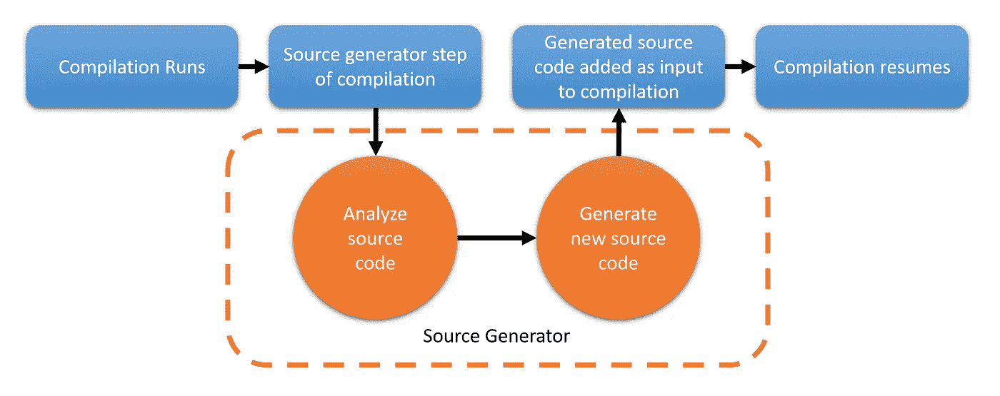

**关于源代码生成器的更多信息:**[https://dev blogs . Microsoft . com/dotnet/introducing-c-source-generators/](https://devblogs.microsoft.com/dotnet/introducing-c-source-generators/)

# 10.[突破性变化]删除内置的 WinRT 支持。NET 5.0

内置的 WinRT 支持已经被 Windows 团队提供的 [C#/WinRT](https://docs.microsoft.com/windows/uwp/csharp-winrt/) 工具链所取代。NET 5.0。WinRT 互操作中的这个[变化是一个突破性的变化](https://github.com/dotnet/runtime/issues/37672)，并且。使用 WinRT 的 NET Core 3.x 应用程序需要重新编译。

的[支持 WinRT APIs 中介绍了这些优势。网络 5](https://github.com/dotnet/runtime/issues/35318) :

*   WinRT 互操作可以独立于。NET 运行时。
*   使 WinRT 互操作与为其他操作系统(如 iOS 和 Android)提供的互操作系统对称。
*   可以利用许多其他优势。NET 功能(AOT、C#功能、IL 链接)。
*   简化了。NET 运行时代码库([删除 60k 行代码](https://github.com/dotnet/runtime/pull/36715))。

**详见**[https://github.com/dotnet/docs/issues/18875](https://github.com/dotnet/docs/issues/18875)发布的正式文件。

# 11.Windows ARM64

。NET 应用程序现在可以在 Windows ARM64 上本地运行。这是在中添加了对 Linux ARM64 的支持之后。网芯 3.0。与。NET 5.0，你可以在 Windows ARM64 设备上开发 web 和 UI 应用，并将你的应用交付给拥有 [Surface Pro X](https://www.microsoft.com/en-us/p/surface-pro-x/8VDNRP2M6HHC) 和类似设备的用户。你已经可以跑了。网芯和。Windows ARM64 上的. NET Framework 应用程序，但通过 x86 仿真。这是可行的，但原生 ARM64 执行有更好的性能。

**阅读更多关于性能优化的内容:**
1。[使用 arm64 内部函数](https://github.com/dotnet/runtime/issues/33308)
2 优化库代码。[提高 ARM64 的性能。NET 5.0](https://github.com/dotnet/runtime/issues/35853)

# 12.RyuJIT 改进

1.  [空检查折叠的改进](https://github.com/dotnet/runtime/pull/1735) —通过观察更多可能不需要空检查的模式，在更多情况下不再需要生成空检查。
2.  [优化的公共子表达式求值(CSE)](https://github.com/dotnet/runtime/pull/1463)—JIT 查找并折叠只需要求值一次的重复表达式(wiki)。
3.  [优化“常量 _ 字符串”。长度](https://github.com/dotnet/runtime/issues/5310) —优化该模式并将代码压缩到正确的整数值。
4.  [JIT:在变形之前构建基本块预测列表](https://github.com/dotnet/runtime/pull/1309) —对 JIT 中的阶段进行重新排序，以允许更早地使用关键优化，从而为后续阶段带来更好的代码质量和更少的工作，这提高了 JIT 吞吐量(参考 PR 中的“TP”)。
5.  [使用 xmm for stack prolog—dot net/runtime # 32538](https://github.com/dotnet/runtime/pull/32538)—更改为 x86/x64 prolog 零位代码。改进:[Json](https://github.com/dotnet/runtime/pull/32538#issuecomment-595503265)； [TechEmpower](https://github.com/dotnet/runtime/pull/32538#issuecomment-595619687/) 。功劳:[本·亚当斯](https://github.com/benaadams)。
6.  [为 GT_SIMD 和 GT _ HW 内在树节点添加 ValueNumbering 支持— dotnet/runtime #31834](https://github.com/dotnet/runtime/pull/31834) —为 SIMD 和硬件内在类型启用优化器。
7.  [对未使用的间接寻址使用 GT _ null check—dot net/runtime # 32641](https://github.com/dotnet/runtime/pull/32641)—删除多余的 null 检查。
8.  I [nvoke nullable box 优化较早— dotnet/runtime #32269](https://github.com/dotnet/runtime/pull/32269) —改进对`Nullable<T>`的优化。
9.  [针对各种数组索引模式优化范围检查— dotnet/runtime #1644](https://github.com/dotnet/runtime/pull/1644) —范围检查消除方面的改进。
10.  [为密封类优化](https://github.com/dotnet/runtime/pull/32790)`[obj.GetType() != typeof(X)](https://github.com/dotnet/runtime/pull/32790)`[—dot net/runtime # 32790](https://github.com/dotnet/runtime/pull/32790)—对类型检查表达式的改进。
11.  [更积极地消除重复的零初始化— dotnet/runtime #31960](https://github.com/dotnet/runtime/pull/31960) —消除重复的零初始化的更好和更广泛的方法。
12.  [早期 opts 使用的 Fix 方法和基本块标志— dotnet/runtime #2196](https://github.com/dotnet/runtime/pull/2126) —使得某些优化可以更频繁地使用。例如，用常数替换数组长度现在更常见了。
13.  [实现栈上替换(OSR)的简单版本— dotnet/runtime #32969](https://github.com/dotnet/runtime/pull/32969) 。[栈上替换(OSR)](https://github.com/dotnet/runtime/blob/master/docs/design/features/OnStackReplacement.md) 是一种新功能，它允许在方法执行过程中更改当前运行的方法所执行的代码，而这些方法在“栈上”是活动的。这个特性目前是试验性的和可选的(在 x64 上)，旨在改进分层编译的更具挑战性的性能特征。请试用并给我们反馈。
14.  [动态泛型字典扩展特性 dotnet/runtime #32270](https://github.com/dotnet/runtime/pull/32270) —基于改进运行时用来存储泛型类型和方法信息的低级(本机代码)字典的实现，泛型的一些(可能是许多)使用现在有了更好的性能([初始性能发现](https://github.com/dotnet/runtime/pull/32270#issuecomment-586459130))。请参见 [Perf: Collection Count()在内核中比 CLR](https://github.com/dotnet/runtime/issues/11971#issuecomment-462183168) 慢，了解更多信息。
15.  [JIT:允许 CORINFO _ HELP _ ready torun _ GENERIC _ HANDLE 被优化 dotnet/runtime #34221](https://github.com/dotnet/runtime/pull/34221) 。提高 Ready2Run 映像中泛型的代码质量。
16.  [JIT:为隐式 byref structs #33004](https://github.com/dotnet/runtime/pull/33004) 启用尾部调用和复制省略。提高在“尾调用”位置调用中作为参数的结构的代码质量。
17.  [新的、更快的、可移植的 tailcall 助手实现](https://github.com/dotnet/runtime/pull/341)。
18.  [改进了影响正则表达式编译的 JIT 速度](https://github.com/dotnet/runtime/pull/35352)
19.  [使用 BSF/BSR 的新硬件固有特性提高英特尔架构性能](https://github.com/dotnet/runtime/pull/34550)
20.  [实现向量{Size}。AllBitsSet](https://github.com/dotnet/runtime/pull/33924)
21.  [结构处理改进](https://github.com/dotnet/runtime/pull/36146)
22.  [消除冗余零初始化的优化](https://github.com/dotnet/runtime/pull/36918)

# 13.RyuJIT ARM64 改进

1.  [针对 ARM64 的矢量 BitArray—dot net/runtime # 33749](https://github.com/dotnet/runtime/pull/33749)—[BitArray 类](https://docs.microsoft.com/dotnet/api/system.collections.bitarray?view=netframework-4.8)经过更新，使用 [ARM64](https://github.com/dotnet/runtime/tree/master/src/libraries/System.Private.CoreLib/src/System/Runtime/Intrinsics/Arm) 内部函数为 ARM64 添加了一个[硬件加速实现。BitArray 的](https://github.com/dotnet/runtime/blob/8511b5b9cc957ce824fc88c0780249fc0edbef15/src/libraries/System.Collections/src/System/Collections/BitArray.cs#L181)[性能改进](https://github.com/dotnet/runtime/pull/33749#issuecomment-603597689)非常显著。
2.  [实现矢量。天花板/向量。floor dot net/runtime # 31993](https://github.com/dotnet/runtime/pull/31993)—实现向量。天花板/向量。根据 [API 提案](https://github.com/dotnet/runtime/issues/20509)，Floor 使用 x64 和 ARM64 内部函数。
3.  [实施 ASIMD 提取插入提取矢量 64 提取矢量 128](https://github.com/dotnet/runtime/pull/35030)
4.  [实现 ASIMD 扩大、缩小、饱和内部函数](https://github.com/dotnet/runtime/pull/35612)
5.  [添加 VectorTableList 和 TableVectorExtension 内部函数](https://github.com/dotnet/runtime/pull/35600)
6.  [增加对 arm64 固有的 CreateScalarUnsafe()的支持](https://github.com/dotnet/runtime/pull/34579)
7.  [ARM64 对 Vector64 的内在支持。创建()和 Vector128。Create()](https://github.com/dotnet/runtime/pull/35590)
8.  [优化位操作。带有 arm64 内部函数的 PopCount()](https://github.com/dotnet/runtime/pull/35636)
9.  [实现复制和复制选定的标尺](https://github.com/dotnet/runtime/pull/36144)
10.  [ASIMD 移位内在函数](https://github.com/dotnet/runtime/pull/36830)
11.  [多项式乘法长内函数](https://github.com/dotnet/runtime/pull/36853)
12.  [优化 Vector64 和 Vector128。创建方法](https://github.com/dotnet/runtime/pull/36267)
13.  [优化 ToScalar()和 GetElement()使用 arm64 固有](https://github.com/dotnet/runtime/pull/36156)
14.  [优化 ToVector128，ToVector128Unsafe 和 Vector128。GetLower()](https://github.com/dotnet/runtime/pull/36732)
15.  [针对 R2R、Arm 和 Arm64 场景优化间接呼叫](https://github.com/dotnet/runtime/pull/35675)
16.  [优化 R2R 和 JIT 的虚拟调用存根](https://github.com/dotnet/runtime/pull/36817)

# 14.膨胀系统。目录服务。Linux 和 macOS 协议

对[系统的跨平台支持。添加了目录服务协议](https://docs.microsoft.com/dotnet/api/system.directoryservices.protocols)。

[系统。directory services . Protocols](https://docs.microsoft.com/dotnet/api/system.directoryservices.protocols)是比[系统更低级的 API。DirectoryServices](https://docs.microsoft.com/dotnet/api/system.directoryservices) ，启用(或者可以用来启用)更多场景。系统。DirectoryServices 包括仅 Windows 的概念/实现，因此跨平台不是一个显而易见的选择。这两个 API 集都支持控制目录服务服务器并与之交互，如 [LDAP](https://en.wikipedia.org/wiki/Lightweight_Directory_Access_Protocol) 或 [Active Directory](https://en.wikipedia.org/wiki/Active_Directory) 。

# 15.。NET SDK 对。NET 框架程序集

[。NET SDK 现在将自动引用](https://github.com/dotnet/sdk/issues/4009)的[微软。给定项目文件中的. NETFramework 目标框架，NET Framework . reference assemblies](https://www.nuget.org/packages/Microsoft.NETFramework.ReferenceAssemblies/)nu get 包。这种变化使建筑成为可能。NET Framework 项目在没有所需的。已安装. NET Framework 目标包。这种改进是特定于目标包的，并没有考虑到项目可能具有的其他依赖性。

# 16.本地出口

本地导出项目使您能够:

*   公开自定义本机导出。
*   不需要像 COM 这样的高级互操作技术。
*   跨平台工作。

**更多信息请点击:** [土特产出口。网](https://github.com/AaronRobinsonMSFT/DNNE)

# 17.本机托管应用程序

多年来，我们已经看到了各种各样的托管模式。NET 在本机应用程序中的应用。 [@rseanhall](https://github.com/rseanhall) 提出并实现了[一个新颖的新模型来做这件事](https://github.com/dotnet/runtime/issues/35465)，它利用了。NET 应用程序宿主层(特别是加载依赖项)，同时允许从本机代码调用自定义入口点。

# 18.单文件应用程序

单文件应用——一种新的[单文件发布类型](https://github.com/dotnet/runtime/issues/36590),它从单个二进制文件中执行您的应用(例如，可以在只读介质上使用)。

对于，X64 上支持此功能。NET 5.0，在 Windows 和 Linux 上。它将适用于 ARM32/64 应用程序。对于单个文件，依赖于运行时和自包含的发布类型都将被支持。

# 19.P95+延迟改进

1.  [改进分层 JIT 编译使用的调用计数机制](https://github.com/dotnet/runtime/pull/32250),使启动时的性能更加平稳
2.  [内部通用字典的动态扩展](https://github.com/dotnet/runtime/pull/32270)消除了通用代码带来的性能下降
3.  [钉住对象堆](https://github.com/dotnet/runtime/pull/32283)减少因钉住导致的堆碎片
4.  减少特定情况下的 GC 暂停时间，如[数组。复制](https://github.com/dotnet/coreclr/pull/27776)、[数组。排序](https://github.com/dotnet/runtime/pull/35297)或[对象拆箱](https://github.com/dotnet/runtime/pull/32353#issuecomment-586642480)

# 20.缩小容器图像的大小

进行了一项更改，显著减小了您在多阶段构建场景中提取的聚合映像的大小(这是一种非常常见的模式)。[ASP.NET 映像](https://github.com/dotnet/dotnet-docker/pull/1848)之上的 SDK 映像被重新基于，而不是 [buildpack-deps](https://hub.docker.com/_/buildpack-deps) 。

这一变更对于多阶段构建具有以下优势(在[文档](https://github.com/dotnet/dotnet-docker/blob/master/samples/aspnetapp/Dockerfile)中的使用示例):

使用 Ubuntu 20.04 Focal 的多阶段构建成本**:**

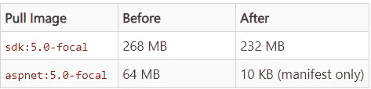

*净下载节省量* : 100 MB (-30%)

Debian 10 Buster 的多阶段构建成本:

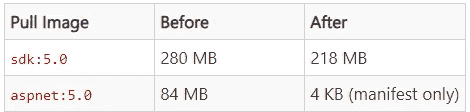

*净下载节省量* : 146 MB (-40%)

**有关更多详细信息，请参见:**[dot net/dot net-docker # 1814](https://github.com/dotnet/dotnet-docker/issues/1814#issuecomment-625294750)

# 21.阿尔卑斯山 3.12

对于 Alpine 3.12 的支持。添加了 NET 5。Alpine Linux 的维护者在 5 月 29 日宣布了 Alpine 3.12 的[发布。](https://twitter.com/alpinelinux/status/1266471727678337024)

# 22.事件管道

## **1。事件管道中增加了装配负载诊断**

程序集加载信息已添加到事件管道中。这一改进是使作为的一部分的类似诊断功能可用的开始。NET 框架与[融合日志查看器](https://docs.microsoft.com/dotnet/framework/tools/fuslogvw-exe-assembly-binding-log-viewer)。您现在可以使用以下命令，使用 [dotnet-trace](https://docs.microsoft.com/dotnet/core/diagnostics/dotnet-trace) 来收集这些信息:

```
dotnet-trace collect --providers Microsoft-Windows-DotNETRuntime:4:4 --process-id [process ID]
```

工作流程在[用事件管道](https://github.com/richlander/testapps/tree/master/trace-assembly-loading)跟踪装配加载中描述。您可以看到一个简单测试应用程序的程序集加载信息。

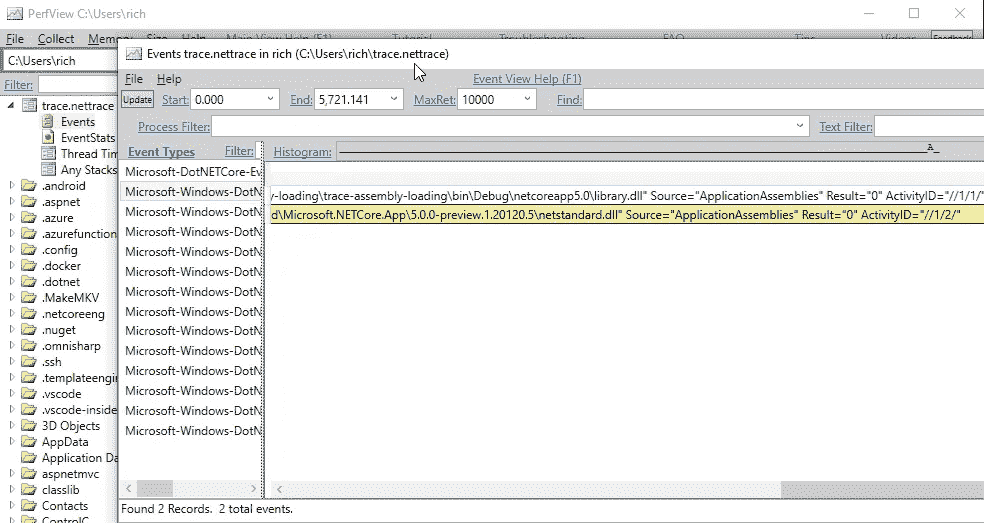

## **2。事件管道分析器 API**

事件管道是新增的一个子系统和 API。NET Core 2.2 使[在任何操作系统上执行性能和其他诊断调查](https://github.com/dotnet/runtime/blob/master/docs/project/linux-performance-tracing.md)成为可能。英寸 NET 5.0 中，事件管道已经扩展到允许探查器编写事件管道事件。这种情况对于以前依赖 ETW 来监控应用程序行为和性能的检测分析器来说至关重要。

# 23.在 Windows 上支持 ICU

[ICU](http://site.icu-project.org/) 库，为 Linux 和 macOS 上的应用程序提供 Unicode 和全球化支持。我们现在在 Windows 上使用[这个相同的库。](https://docs.microsoft.com/en-us/windows/win32/intl/international-components-for-unicode--icu-)[这一变化](https://github.com/dotnet/runtime/pull/34645)使得全球化 API 的行为，如特定于文化的字符串比较，在 Windows 10 和其他操作系统之间保持一致。

# 24.支持 cgroup v2(用于容器)

。NET 现在有了对 cgroup v2 的[支持，它有望在 2020 年及以后成为一个重要的容器相关 API。Docker 目前使用的是 cgroup v1(已经被。网)。相比之下，cgroup v2 比 cgroup v1 更简单、更高效、更安全。可以从 2019 Docker 更新了解更多](https://github.com/dotnet/runtime/pull/34334) [cgroup 和 Docker 资源限制](https://devblogs.microsoft.com/dotnet/using-net-and-docker-together-dockercon-2019-update/)。Linux 发行版和容器运行时正在添加对 cgroup v2 的支持。。一旦 cgroup v2 环境变得更加普遍，NET 5.0 将在其中正常工作。感谢奥迈尔·马吉德的支持。红帽网。

# 25.GitHub 回购整合

作为的一部分。NET 5 发布，GitHub 回购的[数量减少。回购边界对项目的许多方面都有重大影响，包括构建和问题管理。与。NET Core 1.0，在 ASP.NET、英孚和微软有超过 100 个回购。网芯。有了这个最新的版本，你现在可以用一只手数一次回购。几乎所有回购都被转移到了 dotnet org。](https://github.com/dotnet/runtime/issues/13688)

查看新的整合回购:

*   [dotnet/runtime](https://github.com/dotnet/runtime) (是 dotnet/corefx，dotnet/coreclr，和 dotnet/core-setup)
*   [dot net/aspnet core](https://github.com/dotnet/aspnetcore)(aspnet org 中的几个回购)
*   [dot net/SDK](https://github.com/dotnet/sdk)(was dot net/SDK，dotnet/cli)

**附注:你可以在这里找到更多信息:**

1.  [宣布。NET 5 预览 1](https://devblogs.microsoft.com/dotnet/announcing-net-5-0-preview-1/)
2.  [宣布。NET 5 预览版 2](https://devblogs.microsoft.com/dotnet/announcing-net-5-0-preview-2/)
3.  [宣布。NET 5 预览版 3](https://devblogs.microsoft.com/dotnet/announcing-net-5-0-preview-3/)
4.  [宣布。NET 5 预览版 4](https://devblogs.microsoft.com/dotnet/announcing-net-5-preview-4-and-our-journey-to-one-net/)
5.  [宣布。NET 5 预览版 5](https://devblogs.microsoft.com/dotnet/announcing-net-5-0-preview-5/)
6.  宣布。NET 5 预览版 6
7.  [版本中的所有重大变更(在 dot net/运行时中)](https://github.com/dotnet/runtime/issues?q=is%3Aopen+is%3Aissue+label%3Abreaking-change&milestone=7)