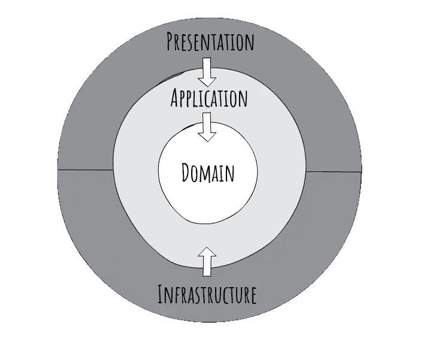
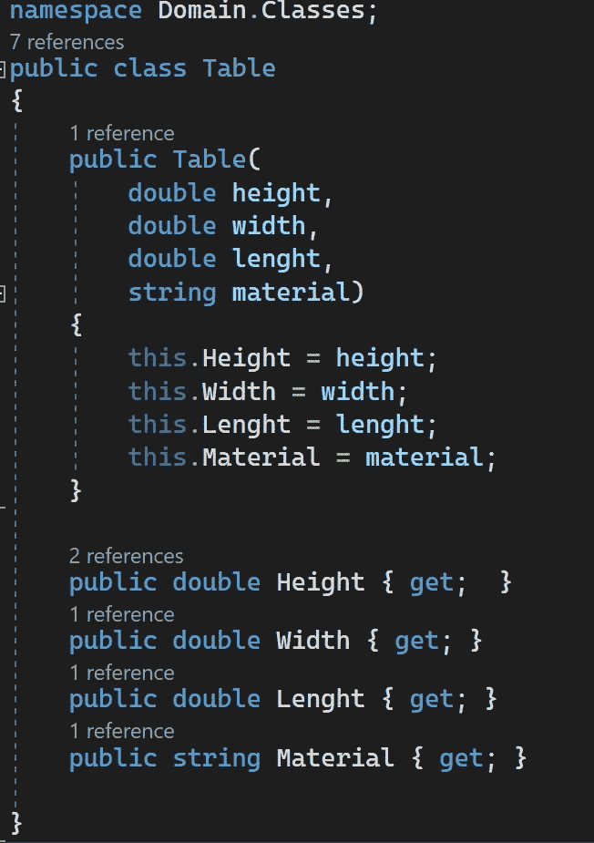
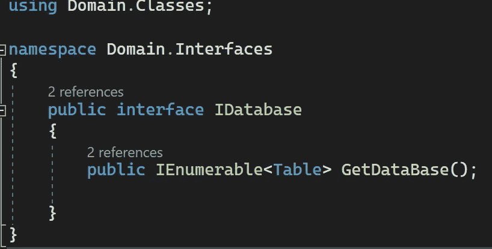
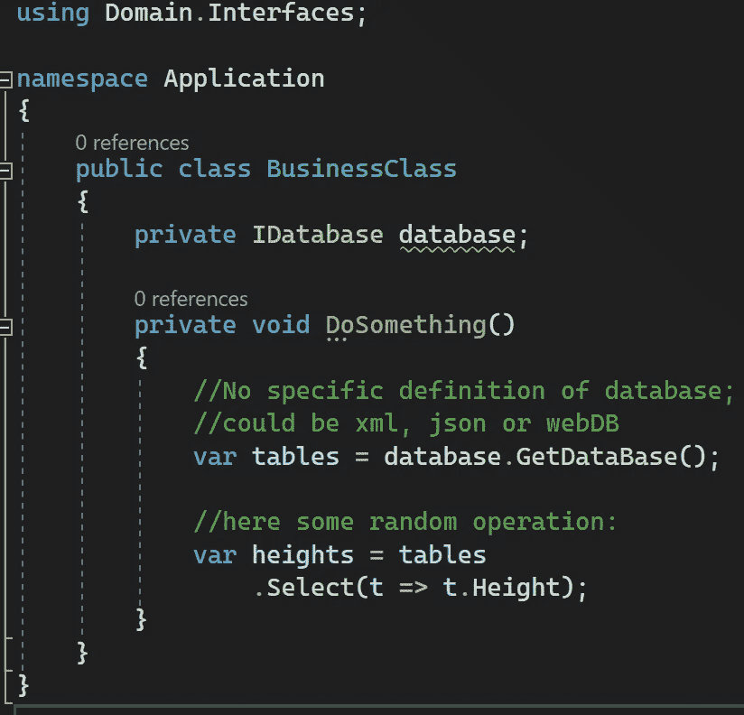
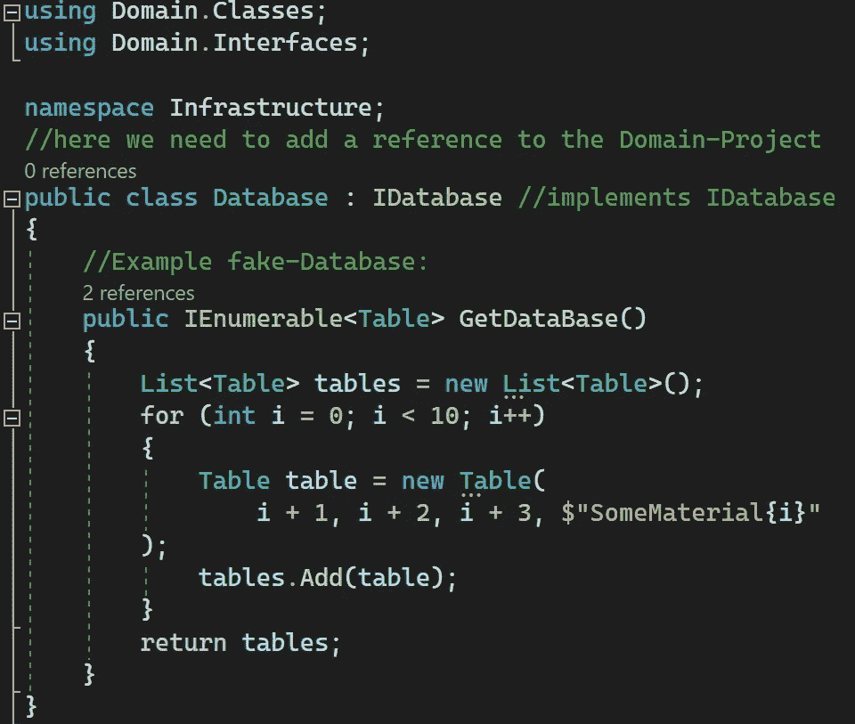
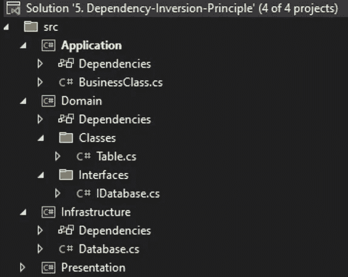
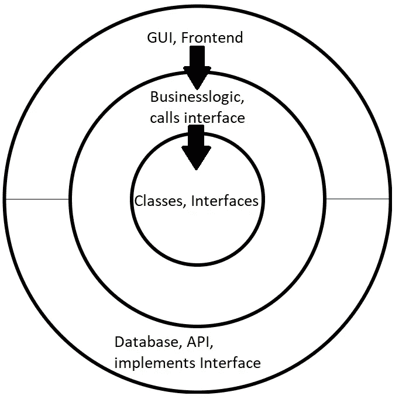

# 。Net C# —干净的架构和依赖倒置原则

> 原文：<https://blog.devgenius.io/net-c-clean-architecture-dependency-inversion-principle-7ea64f586c58?source=collection_archive---------6----------------------->

这篇文章是关于五个坚实原则中的最后一个——依赖倒置原则。其中一个重要的部分是理解接口在软件开发中的好处。在这种情况下，为了提供最大限度的整洁，我还将深入探讨软件架构的主题。

[https://pix abay . com/photos/architecture-building-city-design-1840297/](https://pixabay.com/photos/architecture-building-city-design-1840297/)

*向我的兄弟和导师* [***托比亚斯·斯特兰***](https://medium.com/@tobias.streng)*—*
*如果你喜欢这篇文章并想在。* ***网*** *和* ***角*** *，请关注我们:P*

# 有意义的代码的关键是有意义的架构

首先，我们需要建立一个有用的代码架构。我偏爱的模式是基于 Jason Tayors 的 clean Architecture。Net 应用程序。

就像 Robert C. Martins 已经解释过的那样:
一个整体系统首先被**划分成几个更小的系统/项目，**然后这些系统/项目形成彼此之间明确定义的依赖和接口。这些系统可以分解成不同的模块，每个模块服务于一个特定的目的。这种整体系统的结构基于洋葱层模型，每一层代表一个模块。

在模型的中间是**域层**，它为所有其他模块提供基本的元素或类，并且不能依赖于任何其他层。

第二层包含**应用层**，负责实际工作逻辑。后续级别使用的元素也可以在这里定义。

最外面的两层，即**表示和基础设施**，提供外部影响。
**基础设施**提供来自外部来源的数据和**表示**，例如图形用户界面，如果可用的话。

由于这种架构形式，各个外层总是依赖于内层，但是内层不依赖于外层。这使得外层可以互换。表示层是 web 界面还是 API 并不重要，逻辑是一样的。也有可能实现另一个数据库，没有任何问题。

[https://jasontaylor.dev/clean-architecture-getting-started/](https://jasontaylor.dev/clean-architecture-getting-started/)

罗伯特·c·马丁首先解释了这一原则，并在本质上描述了**更高层次的元素不应该依赖于更低层次的元素。**层次中较高级别的元素可能**只知道其服务元素的接口**，而不知道服务元素本身。因此，较低层次的变化会影响较高层次，但反之亦然。在较高和较低的元素之间绘制了一个抽象层，这确保了调用不会发送到执行元素本身，而是发送到它的层

# 使用命令行界面设置项目:

基本上，整个项目被分成几个小项目。
要创建它们，**打开控制台**并依次运行以下命令**:**

> mkdir name your application
> CD name your application
> dot net new SLN
> mkdir src
> mkdir test
> 
> cd src
> 
> mkdir 域
> cd 域
> dotnet new classlib
> cd..
> 
> mkdir Application
> CD Application
> dot net new class lib
> CD..
> 
> mkdir 基建
> cd 基建
> dotnet new classlib
> cd..
> 
> mkdir Presentation
> CD Presentation
> dotnet new console
> CD..
> 
> 激光唱片..
> cd..
> 
> dotnet SLN add src/Domain/
> dotnet SLN add src/Application
> dotnet SLN add src/基建
> dotnet SLN add src/Presentation

# 示例数据库

让我们以下面的场景为例:我们需要来自任何数据库的数据，希望处理这些数据，然后在最后再次输出。然后我们将看到为什么数据来自哪里并不重要。

# 域:

域**包含从每个项目**调用的所有元素。这些可以是必须普遍可用的类和方法。

## 对象:

首先，我们需要一个例子。让我们创建一个包含一些家具典型属性的对象*表*:

## 连接

依赖倒置完全基于使用接口。一个接口有点像一个“模板”或者一个“规则”你的类应该是什么样子。**是一个类似于类的类型定义，除了它纯粹代表了一个对象和它的用户之间的契约**。它既不能直接实例化为对象，也不能定义数据成员。因此，接口只不过是方法和属性声明的集合。

**在这个例子中，我们只需要方法 GetDataBase(** )

# 申请:

应用程序**包含整个程序的业务逻辑**。这是进行数据处理的地方。

# 基础设施:

基础设施**包含从外部引入到整个项目中的所有元素。**可以是数据库或 API

## 数据库:

这里我们将模拟一个**假数据库**来更好地说明这个原理

# 项目浏览器:

# 结论

将整个项目划分为几个更小的单元在开始时可能有点陌生，但这有助于保持跟踪，并使以后更容易更改代码。与软件开发的其他领域相比，这种方法也非常适合初学者。
通过被限制在接口上，产生错误的可能性被大大降低了，并且未来的改变不会出现预期的问题。

# 请查看我的其他文章:

*   [LINQ——如何避免 C#中的嵌套循环](https://medium.com/codex/linq-how-to-avoid-nested-loops-in-c-ed4ae19886e4)
*   [编程范例—简介](https://medium.com/dev-genius/programming-paradigms-a-very-short-brief-5324908640bd)
*   [C# —面向对象编程](https://medium.com/codex/c-object-oriented-programming-oop-2d92a5cd336f)
*   [c#——简单解释的单一责任](https://medium.com/@sebastianstreng96/c-single-responsibility-easily-explained-e3fabbf0d877)
*   [OCP——真正重要的是什么](https://medium.com/@sebastianstreng96/ocp-what-really-matters-610159d600dc)
*   [提高程序员积极性的 8 大技巧](https://medium.com/@sebastianstreng96/top-8-tips-to-improve-your-motivation-as-programmer-be63b2baaf7e)
*   [对网络的简要了解](https://medium.com/codex/a-brief-insight-into-networks-2171f1e9aea1)
*   [发送&接收—7 层 OSI 模型](https://medium.com/codex/send-receive-the-7-layer-osi-model-e475829b999)
*   [七层网络协议浅显易懂](https://medium.com/@sebastianstreng96/7-layer-network-protocols-easily-explained-e11e3e09f34d)