# 。NET Core 和 k8s 技巧 1:小心跨平台的时区，如 Windows OS 和 Linux Docker 容器

> 原文：<https://blog.devgenius.io/net-core-tip-1-beware-of-timezones-across-platforms-like-windows-os-and-linux-docker-containers-9fd3287b1e16?source=collection_archive---------2----------------------->

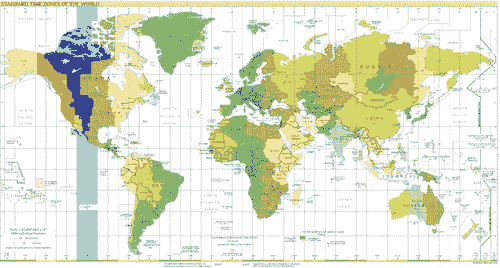

**TL/DR:当您需要使用/插入日期时间**时，请确保在运行不同服务的每个操作系统中使用相同的时区

**先决条件**

*   Windows 10
*   。网络核心 3.1
*   Visual Studio 2022
*   带有 WSL 2 的 Docker 桌面
*   目标:Linux Docker 容器

演示项目

[](https://github.com/nicoclau/TimeZoneLinuxContainerDateTime) [## GitHub-nicoclau/time zonelinuxcontainerdatetime:从 Dockerfile 设置 Linux 上的正确时区

### 此时您不能执行该操作。您已使用另一个标签页或窗口登录。您已在另一个选项卡中注销，或者…

github.com](https://github.com/nicoclau/TimeZoneLinuxContainerDateTime) 

# **简介**

# **语境**

我们有两个应用程序:

- **应用 A** 运行在 **Windows 操作系统**上，时区为**巴黎**巴黎
- **应用 B 使用 ASP.NET CORE 3.1**开发，运行在 Kubernetes 集群内的 **Docker 容器**内的 **Linux** 上

应用程序 A 向应用程序 B 发送带有新的**日期时间**的消息。应用程序 B 需要将新的**日期时间**存储在一个 SQL Server 表中。

不幸的是，我遇到了一个问题。

# **问题**

我有以下问题

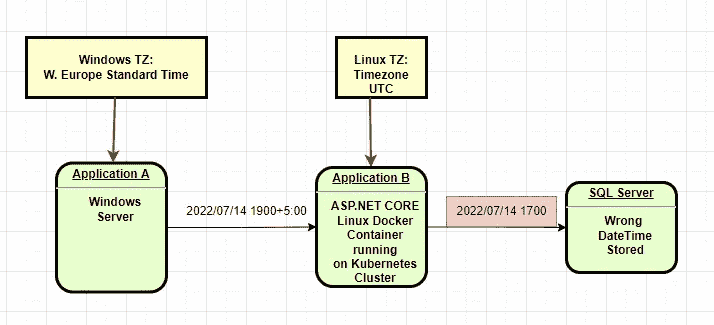

SQL Server 表中的日期时间错误

我们注意到 SQL Server 表上的日期时间落后了 2 个小时。例如，我们从 19:00 到 17:00。

# **分析**

在解决这个问题之前，我们需要知道在 ASP.NET 核心 3.1 上运行的应用程序 B 使用的是哪个 Linux 发行版。

为什么？因此，我们将知道在 Linux 操作系统上使用什么命令可以解决这个问题。

为了开发我们的应用程序 B，我们使用了 x86–64 架构的开发机器。我们使用 ASP.NET 核心 3.1，因为应用 B 是一个 REST Web API，而 3.1 版是我们项目时微软 ASP.NET 核心的 LTS。

在稍后的演示中，我们将看到当我们使用 Visual Studio 2022 添加**docker 文件**时，它选择基本 docker 图像:

**以 mcr.microsoft.com/dotnet/core/aspnet:3.1-buster-slim 为基地**

我们可以找到适用于 x86–64 架构的 ASP.NET 核心 3.1 Dockerfile 文件:

[](https://github.com/dotnet/dotnet-docker/blob/main/src/aspnet/3.1/buster-slim/amd64/Dockerfile) [## 主 dotnet/dotnet-docker 上的 dotnet-docker/Dockerfile

### 此时您不能执行该操作。您已使用另一个标签页或窗口登录。您已在另一个选项卡中注销，或者…

github.com](https://github.com/dotnet/dotnet-docker/blob/main/src/aspnet/3.1/buster-slim/amd64/Dockerfile) 

我们可以看到 Dockerfile 使用了:

```
mcr.microsoft.com/dotnet/**runtime:3.1.27-buster-slim**
```

Dockerfile 然后在文件系统中下载并安装 x64 的 ASP.NET 核心 3.1.27:

[https://dotnetcli . azure edge . net/dotnet/aspnetcore/Runtime/3 . 1 . 27/aspnetcore-Runtime-3 . 1 . 27-Linux-x64 . tar . gz](https://dotnetcli.azureedge.net/dotnet/aspnetcore/Runtime/3.1.27/aspnetcore-runtime-3.1.27-linux-x64.tar.gz)

最后，我们来看看 mcr.microsoft.com/dotnet/runtime:3.1.27-buster-slim 用的是什么 Linux 发行版

它依赖于 MCR . Microsoft . com/dot net/runtime-deps:3 . 1 . 27-buster-slim-arm 64v 8 它自身依赖于**arm 64v 8/debian:buster-slim**

所以 mcr.microsoft.com/dotnet/core/aspnet:3.1-buster-slim 的 T2 使用的是 Linux Debian 发行版。

我们可以检查我们的运行容器:

```
root@xxx:/app# cat /etc/os-release 
PRETTY_NAME="Debian GNU/Linux 10 (buster)"
NAME="Debian GNU/Linux"
VERSION_ID="10"
VERSION="10 (buster)"
VERSION_CODENAME=buster
ID=debian
HOME_URL="[https://www.debian.org/](https://www.debian.org/)"
SUPPORT_URL="[https://www.debian.org/support](https://www.debian.org/support)"
BUG_REPORT_URL="[https://bugs.debian.org/](https://bugs.debian.org/)"
```

所以现在我们确定我们使用的是 Debian GNU Linux 版本 10 (buster)。
现在，我们能做些什么来解决我们的问题呢？

现在我们知道 Debian GNU Linux 已经安装了[https://www.iana.org/time-zones](https://www.iana.org/time-zones)的 **tzdata**

我们可以用/etc/localtime 和/etc/timezone 来检查它

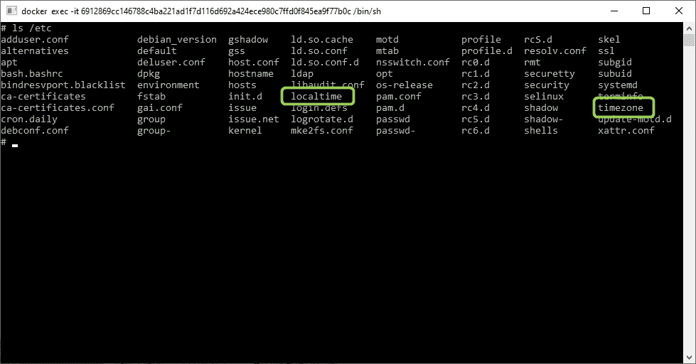

举例来说，如果 Linux 发行版是 Linux Alpine，这将是一个不同的故事，需要进一步的步骤来安装 **tzdata** 。

所以我们要做的就是直接设置正确的时区。
来看看解决方案。

**解决方案**

我们需要在 Windows 和 Debian Linux 中使用相同的时区。我们将拭目以待。

在我们的例子中，Windows Server 使用了。net 核心程序。
所以在 Linux os(运行我们的应用程序 B 的容器使用的 Debian Linux)中，我们需要将时区设置为**“欧洲/巴黎”。**

我们将看到我们可以在许多层面上做到这一点。

我们会遇到以下情况，我们会看到问题得到解决:

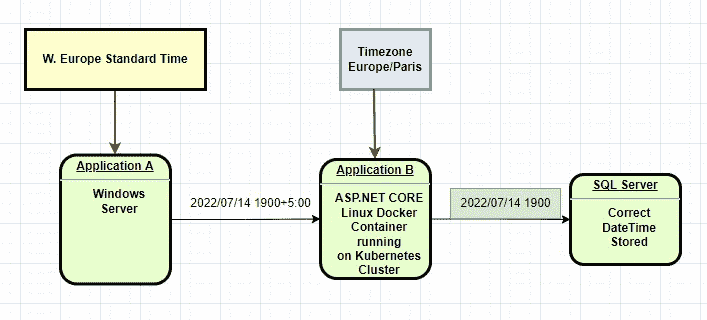

**时区相同，但不同操作系统的名称不同**

我们可以更改 Linux Debian 操作系统的时区:

*   OS 环境变量:我们将在这里使用的最灵活的解决方案
*   操作系统文件系统
*   代码库 C#。网络核心

> 注意，正如你在图表上看到的，Windows 和 Linux 的时区名称是不同的。

我们将使用操作系统环境变量解决方案。
为什么？因为我们可以在操作系统和代码库之外改变环境变量。所以非常灵活。

我们可以在三个不同的可能位置更改环境变量:

*   dockerfile 文件
*   docker 运行时(docker 运行时的选项)
*   kubernetes 部署(yaml 文件)

我们将在演示中使用 dockerfile 选项。

# 演示

我们刚刚用。网络核心 3.1

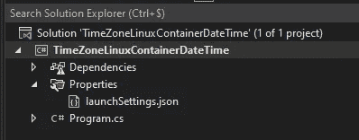

它只会显示日期。

```
using System;
using System.Text.Json;namespace TimeZoneLinuxContainerDateTime
{ internal class Program
  {
    static void Main(string[] args)
    {
      Console.WriteLine(DateTime.Now);
    }
  }
}
```

我们将 docker 支持添加到我们的控制台项目中。

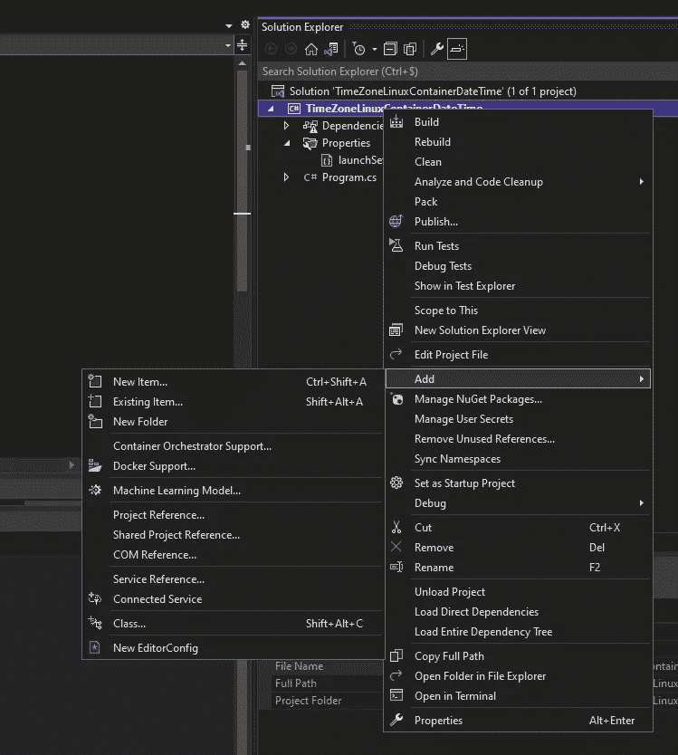

点击 Docker Support 并选择 Linux 作为目标操作系统:

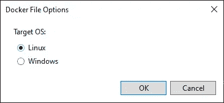

点击确定。

Visual Studio 2022 将在后台运行 Docker:

```
========== Checking for Container Prerequisites ==========Verifying that Docker Desktop is installed...Docker Desktop is installed.========== Verifying that Docker Desktop is running... ==========Verifying that Docker Desktop is running...Docker Desktop is running.========== Verifying Docker OS ==========Verifying that Docker Desktop's operating system mode matches the project's target operating system...Docker Desktop's operating system mode matches the project's target operating system.========== Pulling Required Images ==========Checking for missing Docker images...Pulling Docker images. To cancel this download, close the command prompt window.docker pull mcr.microsoft.com/dotnet/runtime:3.1Docker images are ready.========== Warming up container(s) for TimeZoneLinuxContainerDateTime ==========Starting up container(s)...docker build -f "C:\Dev\TimeZoneLinuxContainerDateTime\TimeZoneLinuxContainerDateTime\Dockerfile" --force-rm -t timezonelinuxcontainerdatetime:dev --target base  --label "com.microsoft.created-by=visual-studio" --label "com.microsoft.visual-studio.project-name=TimeZoneLinuxContainerDateTime" "C:\Dev\TimeZoneLinuxContainerDateTime"#1 [internal] load build definition from Dockerfile#1 sha256:a3f449de26c280f82facd0cfe113e19009b34882c0092ca5f2b6f2b8a6a662a5#1 transferring dockerfile: 893B 0.0s done#1 DONE 0.1s#2 [internal] load .dockerignore#2 sha256:0c0d7ec41ea95c8f3d3d0c411c7a88079bdfcc88396cb7ebc856b651e82a345d#2 transferring context: 382B 0.0s done#2 DONE 0.1s#3 [internal] load metadata for mcr.microsoft.com/dotnet/runtime:3.1#3 sha256:0553f26b35189d38deb0143a81e5c83c941e9b39a74cfa379650145f26f6db1f#3 DONE 0.0s#4 [base 1/2] FROM mcr.microsoft.com/dotnet/runtime:3.1#4 sha256:84cc03a55bd4a33aba1714c34d872646c9ef15055bd99dc6df9422de3007a647#4 DONE 0.0s#5 [base 2/2] WORKDIR /app#5 sha256:5127c3c72b2387bd931efa010eae7503fb3d72051e78617116669bc0d87685dc#5 CACHED#6 exporting to image#6 sha256:e8c613e07b0b7ff33893b694f7759a10d42e180f2b4dc349fb57dc6b71dcab00#6 exporting layers done#6 writing image sha256:e090c4f7d0a7473c836c0200b7414636e4e3fdd9057a07456815add40f91b4ea done#6 naming to docker.io/library/timezonelinuxcontainerdatetime:dev done#6 DONE 0.0sUse 'docker scan' to run Snyk tests against images to find vulnerabilities and learn how to fix themdocker run -dt -v "C:\Users\xxx\vsdbg\vs2017u5:/remote_debugger:rw" -v "C:\Dev\TimeZoneLinuxContainerDateTime\TimeZoneLinuxContainerDateTime:/app" -v "C:\Dev\TimeZoneLinuxContainerDateTime:/src/" -v "C:\Users\xxx\.nuget\packages\:/root/.nuget/fallbackpackages3" -v "C:\Program Files (x86)\Microsoft Visual Studio\Shared\NuGetPackages:/root/.nuget/fallbackpackages" -v "C:\Program Files\dotnet\sdk\NuGetFallbackFolder:/root/.nuget/fallbackpackages2" -e "DOTNET_USE_POLLING_FILE_WATCHER=1" -e "NUGET_PACKAGES=/root/.nuget/fallbackpackages3" -e "NUGET_FALLBACK_PACKAGES=/root/.nuget/fallbackpackages;/root/.nuget/fallbackpackages2;/root/.nuget/fallbackpackages3" --name TimeZoneLinuxContainerDateTime --entrypoint tail timezonelinuxcontainerdatetime:dev -f /dev/nullfdf2a2d45bbcbb806679b06ffbd163386ae7021e5f1e2bf178120d0ae20b100fContainer started successfully.========== Finished ==========
```

发生了什么事？VS 在 Docker 容器中构建并运行我们的应用程序，并将调试器附加到它上面。此外，它通过使用卷将我们的项目代码链接到它。

下面是完整的命令:

```
docker run -dt -v "C:\Users\xxx\vsdbg\vs2017u5:/remote_debugger:rw" -v "C:\Dev\TimeZoneLinuxContainerDateTime\TimeZoneLinuxContainerDateTime:/app" -v "C:\Dev\TimeZoneLinuxContainerDateTime:/src/" -v "C:\Users\xxx\.nuget\packages\:/root/.nuget/fallbackpackages3" -v "C:\Program Files (x86)\Microsoft Visual Studio\Shared\NuGetPackages:/root/.nuget/fallbackpackages" -v "C:\Program Files\dotnet\sdk\NuGetFallbackFolder:/root/.nuget/fallbackpackages2" -e "DOTNET_USE_POLLING_FILE_WATCHER=1" -e "NUGET_PACKAGES=/root/.nuget/fallbackpackages3" -e "NUGET_FALLBACK_PACKAGES=/root/.nuget/fallbackpackages;/root/.nuget/fallbackpackages2;/root/.nuget/fallbackpackages3" --name TimeZoneLinuxContainerDateTime --entrypoint tail timezonelinuxcontainerdatetime:dev -f /dev/null
```

我们可以在 Docker 桌面上检查容器:

在 Docker 图像部分:

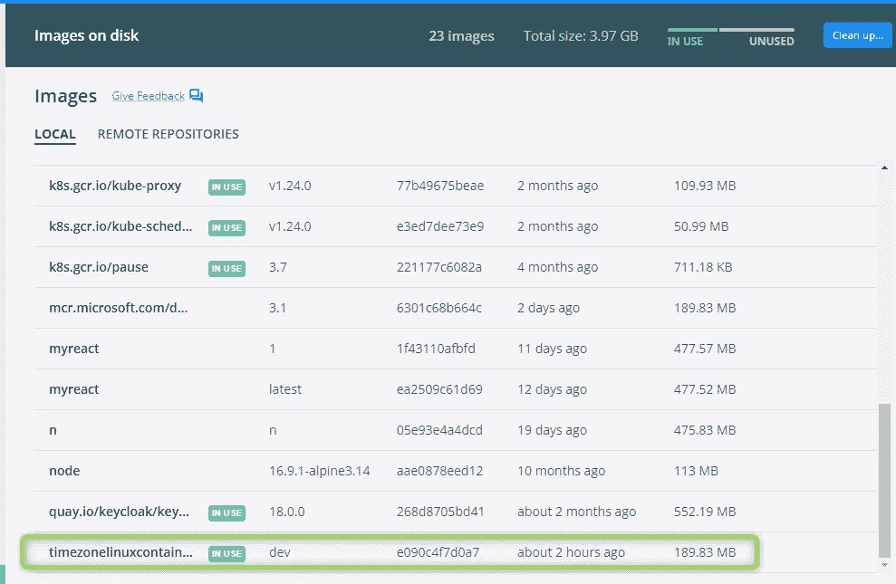

我们可以看到它正在使用，这意味着我们有一个运行的容器。

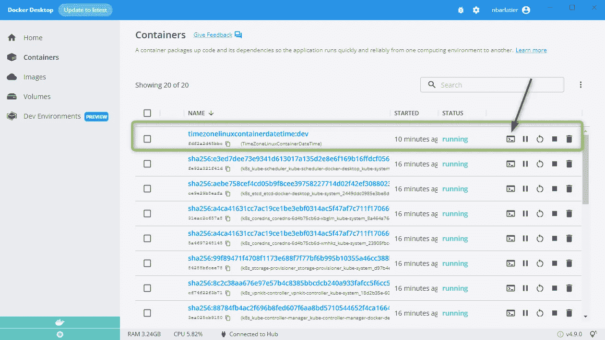

我们去贝壳(红色箭头):


让我们检查运行命令所使用的时区

```
# date
```

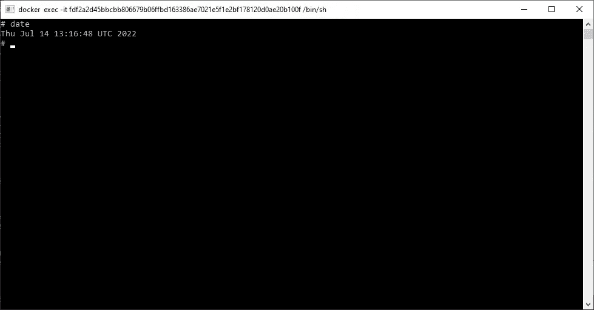

我们可以看到日期是在 UTC 时区。

这会给我们的程序带来问题，让我们看看。

让我们在我们的程序中增加一个断点。

让我们通过点击“Docker”从 VS 运行程序:

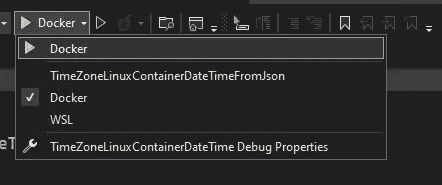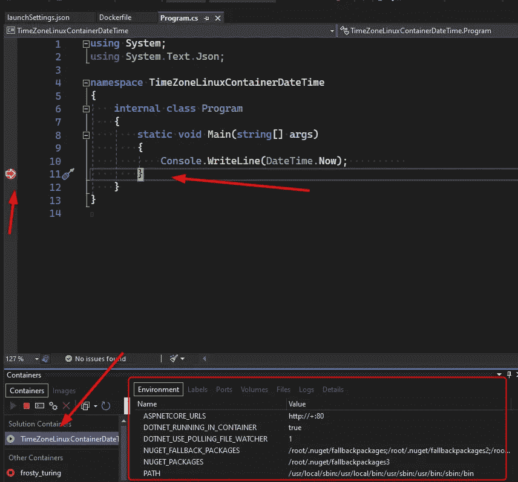

调试暂停，当我们单击我们的容器时，我们可以看到环境、卷等..

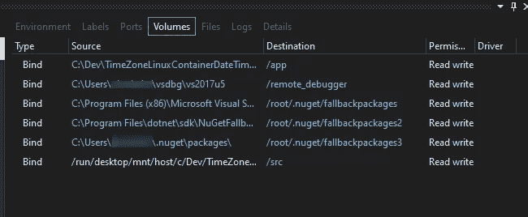

让我们在“Logs”选项卡上看看我们的程序在日期时间显示了什么:

```
07/14/2022 13:28:33
```

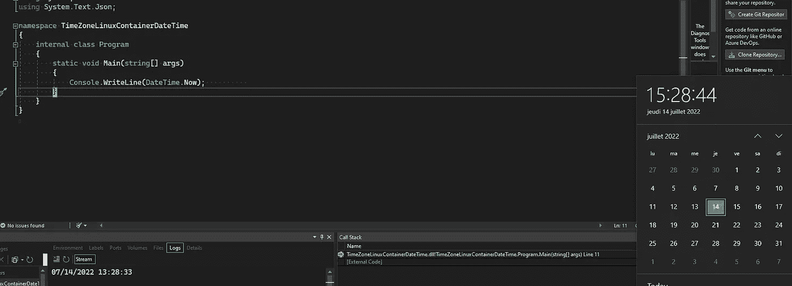

但是我们预计是 CEST 时区的 15:28:33。

现在让我们试试我们的解决方案:

我们在 docker 文件中添加环境变量 **TZ** =“欧洲/巴黎”,并重新构建和运行我们的应用程序:

```
#See https://aka.ms/containerfastmode to understand how Visual Studio uses this Dockerfile to build your images for faster debugging.FROM mcr.microsoft.com/dotnet/runtime:3.1 AS baseWORKDIR /appENV TZ="Europe/Paris"FROM mcr.microsoft.com/dotnet/sdk:3.1 AS buildWORKDIR /srcCOPY ["TimeZoneLinuxContainerDateTime/TimeZoneLinuxContainerDateTime.csproj", "TimeZoneLinuxContainerDateTime/"]RUN dotnet restore "TimeZoneLinuxContainerDateTime/TimeZoneLinuxContainerDateTime.csproj"COPY . .WORKDIR "/src/TimeZoneLinuxContainerDateTime"RUN dotnet build "TimeZoneLinuxContainerDateTime.csproj" -c Release -o /app/buildFROM build AS publishRUN dotnet publish "TimeZoneLinuxContainerDateTime.csproj" -c Release -o /app/publishFROM base AS finalWORKDIR /appCOPY --from=publish /app/publish .ENTRYPOINT ["dotnet", "TimeZoneLinuxContainerDateTime.dll"]
```

我们再次看到程序被断点暂停，但是我们注意到环境中的不同:

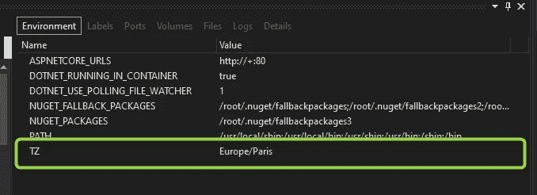

所以现在运行我们的应用程序的 linux 应该显示预期的当前日期时间(不是 2 小时后):

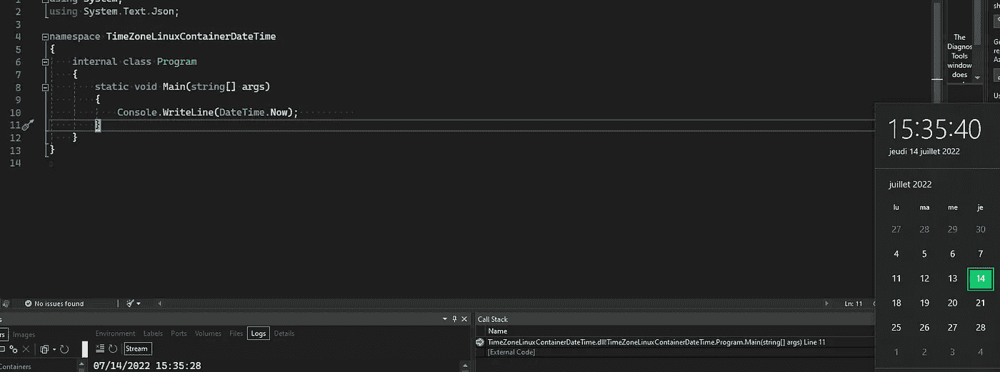

我们得到:

```
07/14/2022 15:35:28
```

最后，我们可以在 shell 上检查时区:

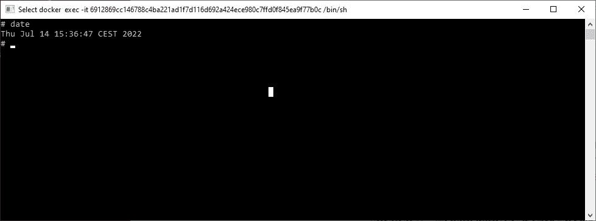

我们确实在 CEST 时区。

请查找演示项目:

[](https://github.com/nicoclau/TimeZoneLinuxContainerDateTime) [## GitHub-nicoclau/time zonelinuxcontainerdatetime:从 Dockerfile 设置 Linux 上的正确时区

### 此时您不能执行该操作。您已使用另一个标签页或窗口登录。您已在另一个选项卡中注销，或者…

github.com](https://github.com/nicoclau/TimeZoneLinuxContainerDateTime) 

**结论:**

当我们使用不同的操作系统时，我们需要知道时区。
当我们使用 Linux Docker 容器运行我们的工作负载时，情况更是如此。

**参考文献:**

关于这个问题的一些文章:

[](https://devblogs.microsoft.com/dotnet/cross-platform-time-zones-with-net-core/) [## 跨平台时区。网络核心

### 中开发跨多个操作系统的应用程序。NET Core 在处理时区信息时可以…

devblogs.microsoft.com](https://devblogs.microsoft.com/dotnet/cross-platform-time-zones-with-net-core/) [](https://dejanstojanovic.net/aspnet/2018/july/differences-in-time-zones-in-net-core-on-windows-and-linux-host-os/) [## 中时区格式的差异。Windows 和 Linux 主机上的 NET Core

### 最近，我正在将日期时间值转换为不同的时区，因为服务器运行在一个…

dejanstojanovic.net](https://dejanstojanovic.net/aspnet/2018/july/differences-in-time-zones-in-net-core-on-windows-and-linux-host-os/) [](https://www.howtogeek.com/devops/how-to-handle-timezones-in-docker-containers/) [## 如何处理 Docker 容器中的时区

### 时区是容器化应用程序时常见的混淆来源。你的 cron 任务会在右边运行吗…

www.howtogeek.com](https://www.howtogeek.com/devops/how-to-handle-timezones-in-docker-containers/) 

关于这个主题的最佳文章:

[](https://hoa.ro/blog/2020-12-08-draft-docker-time-timezone/) [## 指南:修复 Docker 中的所有时间和时区问题

### 在介绍本指南的 Docker 部分之前，有必要记住如何设置 Linux 上的时间和时区…

和乐](https://hoa.ro/blog/2020-12-08-draft-docker-time-timezone/)