# 。NET Core 和 k8s 技巧 2:如何在 Kubernetes 的 Linux Docker 容器中运行的. NET 控制台应用程序中发现内存泄漏

> 原文：<https://blog.devgenius.io/net-core-tip-2-how-to-troubleshoot-memory-leaks-within-a-net-a3a81c137b3c?source=collection_archive---------11----------------------->

1.  介绍

我们经常认为，因为垃圾收集器自动管理内存使用，因为。NET Framework 1.0 发布，我们不需要担心。还有在。NET Core，脚本一定是一样的吧？

错了。垃圾收集器，通常称为 GC，帮助我们回收不再被引用的对象。但是当对象仍然被引用但没有被使用时，GC 帮不了我们(它们是基本的“死”对象，我们可以将这种情况与不再被使用但仍然混乱我们的代码库的“死”代码进行一点比较)。

因此，如果我们不小心使用代码，我们可能会遇到两种情况:

*   大规模内存泄漏:内存泄漏很快，很容易被注意到，而且在大多数情况下更容易修复
*   偷偷摸摸的内存泄漏:它更慢，更不明显，而且通常更难修复

内存泄漏可能有成千上万种原因，但我们可以列出主要原因:

*   一个**静态收藏**变大
*   一个**缓存**，过一会儿不释放项目
*   一个**长时间运行的线程**带有一个引用一个大集合的局部变量
*   **未按预期手动释放的非托管内存**(。net core 经常在幕后使用非托管代码)
*   **捕获的变量**获得更长的 TTL(生存时间)
*   没有在需要时调用 **Dispose 方法**
*   非常复杂的**对象依赖关系**会使移除对象更加困难
*   错误使用**字符串操作**
*   错误使用**终结器**
*   错误使用**事件订阅**
*   永远不会释放对象的死锁线程
*   指针的错误使用(我知道它非常模糊，很难精确定位！)

这不是一个完整的列表，但它已经可以给我们很多线索了:)

这里是上下文，我们在 QA 环境中没有看到任何内存泄漏，所以我们决定部署我们的。生产 Kubernetes 集群上的网络核心奇迹。

但是过了一段时间后，每当我们的内存达到极限时，豆荚就会重新启动。

当我们的应用程序在 Kubernetes 生产集群中的 docker 容器中运行时，我们就像“该死的”我们有内存泄漏，并且没有任何方法或工具来发现问题…

还好这不是真的，我们有几种方法来解决我们的内存泄漏！微软放了很多工具，我们可以直接从运行我们的 docker 容器下载。NET 应用程序的内存泄漏问题！

就是今天这篇文章要讲的:)

1.  语境

首先，我们将使用 Linux 容器 docker 进行演示。而且，我们会使用 **Linux 发行版 Debian 和一个. net 核心应用**。

对于这个演示，我将使用一个简单的案例:一个带有一个长期运行的任务**的**控制台应用程序**，该任务将每秒钟向一个集合添加项目**。

为什么是控制台应用程序？因为这样我们就能找到问题的本质，内存泄漏。代码库将非常简单，但将揭示我们在处理复杂的现实生活情况时需要知道的一切！

1.  工具

我们将看到一些可以帮助我们的工具。

对于此演示，我们需要:

*   **Visual Studio 2022**
*   **docker 桌面**用于运行 Docker 容器运行时并构建我们的 Docker 映像
*   **minikube** 为我们的演示提供了一个带有单个节点的 kubernetes 集群
*   **点网转储**工具，用于 x64 架构的**Linux**从微软下载网站([https://aka.ms/dotnet-dump/linux-x64](https://aka.ms/dotnet-dump/linux-x64))直接下载。

我们将从用。网芯。然后，我们将把我们的演示部署到我们的 **MiniKube Kubernetes 集群。**

最后，我们将直接从运行 docker 容器的应用程序中安装以下工具:dotnet-dump。

1.  演示应用程序

让我们创建我们的演示:

请在此处找到完整的代码库:

[记忆缺失。NET Core 6.0 控制台应用程序演示](https://github.com/nicoclau/MemoryLeak)

这里我将使用我们能找到的最简单的模板:控制台应用程序。

我们将创建一个非常简单的。NET 6.0 控制台应用程序(。NET 6.0 有长期支持(LTS))。

我们这样做是为了知道我们需要添加什么，并避免大量的样板代码，这会使我们的教程不太清楚。

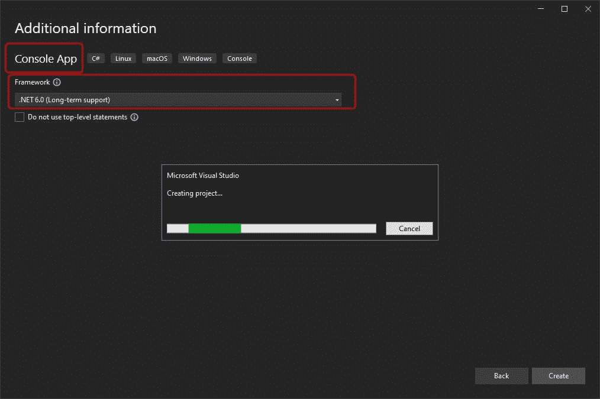

我们将需要添加以下内容:

``

我们首先需要“微软。这将帮助我们使用依赖注入器(DI)容器。它将用于注入 2 个依赖项:

*   记录器
*   内存缓存(见下一个 NuGet 微软。扩展.缓存.内存)

“微软。Extensions.Caching.Memory”将帮助我们在演示中使用内存中的缓存。

我们将向您展示当我们不恰当地使用缓存时，出现内存泄漏问题是多么容易。

如果你是一个初学者，请阅读这个链接。网络核心:

[内存缓存](https://learn.microsoft.com/en-us/dotnet/core/extensions/caching#in-memory-caching)

> IMemoryCache 的当前实现是 ConcurrentDictionary 的包装器，公开了一个功能丰富的 API。缓存中的条目由 ICacheEntry 表示，可以是任何对象。内存缓存解决方案非常适合在单个服务器上运行的应用程序，其中所有缓存的数据都在应用程序的进程中租用内存。

所以基本上它是一个著名的 ConcurrentDictionnary 的包装器，我们稍后会用到它的更多特性！

我们得到以下 csproj:

[https://gist . github . com/nicoclau/334 b0c 4371 b18d 9641 a 7982 ADC 3d 9 f4b # file-memory leak-csproj](https://gist.github.com/nicoclau/334b0c4371b18d9641a7982adc3d9f4b#file-memoryleak-csproj)

最后是一个非常详细的最新文档的链接

【https://github.com/dotnet/AspNetCore. docs/blob/main/aspnetcore/performance/caching/memory . MD

现在让我们看看如何用程序. cs 运行我们的控制台应用程序

```
using MemoryLeak; using Microsoft.Extensions.DependencyInjection; using Microsoft.Extensions.Hosting; IHost host = Host.CreateDefaultBuilder(args) .ConfigureServices( { services.AddMemoryCache(); services.AddHostedService<MyWorker>(); }) .Build(); await host.RunAsync();
```

我们首先使用**通用主机**，它将为我们提供许多非常有用的特性。

> *主机是封装了应用程序的资源和生命周期功能的对象，例如:*

*   依赖注入
*   记录
*   配置
*   应用程序关闭
*   IHostedService 实现

这里我们将使用 IHostedService、日志记录和依赖注入特性。

在我们的应用程序中，我们需要配置 DI 来添加两个服务:

*   内存缓存服务(仅当我们不使用[ASP.NET](http://ASP.NET)核心与 AddMvc 为例。就像我们的控制台应用程序一样)
*   托管服务(我们将详细说明为什么我们使用这种类型的服务)

当我们看扩展方法 AddMemory 时

您可以在下面找到源代码:

[https://github . com/dot net/runtime/blob/main/src/libraries/Microsoft。extensions . caching . memory/src/memorycacheservicecollectionextensions . cs](https://github.com/dotnet/runtime/blob/main/src/libraries/Microsoft.Extensions.Caching.Memory/src/MemoryCacheServiceCollectionExtensions.cs)

我们可以看到它将添加 IMemoryCache: MemoryCache 的静态实例，因为它使用了 Singleton 模式。

如果您没有记错的话，静态变量可能会导致内存泄漏。所以在这里要小心。

我们现在将了解我们为什么使用托管服务。请记住，我们需要一个长期运行的控制台应用程序，它每秒钟都会添加一个缓存项。

我们需要将我们的控制台应用程序托管在一个可以一直运行的**服务中**并且**可以从任何 env 优雅地关闭**:服务器中的 dotnet 运行时、docker 容器或 Kubernetes。

为此，我们使用**通用主机**的**托管服务特性**。

请在下面找到更多细节的链接，这里我们将更多地关注我们的背景。

[https://pgroene . WordPress . com/2018/08/02/host builder-ihost-ihostedserice-console-application/](https://pgroene.wordpress.com/2018/08/02/hostbuilder-ihost-ihostedserice-console-application/)

我们将在通用主机中托管我们的应用程序。当这个主机启动时，它将为依赖容器中注册的每个 IHostedService 调用 StartAsync 方法。在我们的例子中，我们手动添加了一个名为 MyWorker 的托管服务。

让我们看看我们的托管服务 MyWorker 源代码:

这里我们使用了一个来自 BackgroundService 的派生类，它通过覆盖 StartAsync 和 StopAsync 方法来帮助我们正确地实现托管服务。

我们需要做的就是为我们的 BackgroundService 实现编写抽象方法 ExecuteAsync。

```
protected override async Task ExecuteAsync(CancellationToken stoppingToken) { while (!stoppingToken.IsCancellationRequested) { _logger.LogInformation("Worker running at: {time}", DateTimeOffset.Now); await Task.Delay(1000, stoppingToken); var cacheEntryOptions = new MemoryCacheEntryOptions(); _memoryCache.Set(Guid.NewGuid(), new byte[10000], cacheEntryOptions); } }
```

只要我们不要求用令牌取消，它就会循环运行。不要和 SigTerm 信号(ctrl+C)混淆，因为我们有几个不同级别的 CancellationTokens。

所以基本上这个为后台服务创建的令牌永远不会在我们的项目代码库中被取消。

现在我们可以看到，我们利用了与 DI 一起注入的日志记录器和由 DI 实例化的内存缓存。

我们记录日期，暂停 1000 毫秒并插入一个新项目。我们看到可以用 MemoryCacheEntryOption 配置条目插入。

我们以后会明白为什么我们需要它。目前，它什么也没做。

现在我们有:

*   承载控制台应用程序的通用主机
*   作为后台服务实现的单个托管服务将由主机运行

这是一个非常简单的演示。现在让我们为我们的应用程序创建一个 docker 映像。

使用 Visual Studio 2022，创建它非常简单。我们只需要向我们的项目添加一个 docker 文件:

我们用右键点击我们的项目存储器，选择“添加”，然后选择“Docker 支持…”菜单

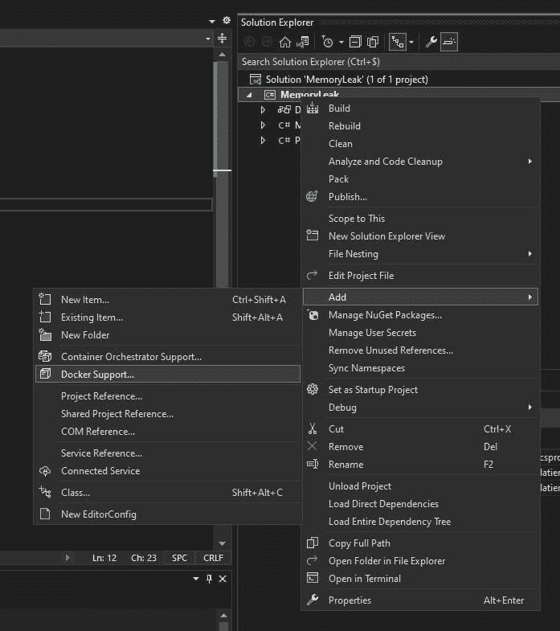

Visual Studio 2022 将在项目根位置创建并添加以下 Dockerfile 文件:

此外，Visual Studio 2022 将添加以下运行/调试选项:Docker

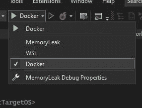

我们可以通过以下链接了解这一点:

[https://learn . Microsoft . com/en-us/visual studio/containers/container-build？wt . MC _ id = visual studio _ containers _ aka _ container fast mode&view = vs-2022](https://learn.microsoft.com/en-us/visualstudio/containers/container-build?WT.mc_id=visualstudio_containers_aka_containerfastmode&view=vs-2022)

让我们运行“Docker”选项，我们看到:

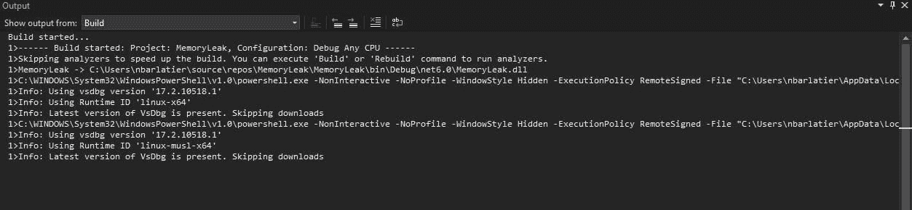

VS 2022 将第一次运行 docker(或者当我们更新我们的项目时),以构建一个特殊的 Docker 映像，我们可以在调试中使用它来连接 VS 2022。

我们将获得以下容器窗口，其中包含正在运行的容器、应用程序日志:

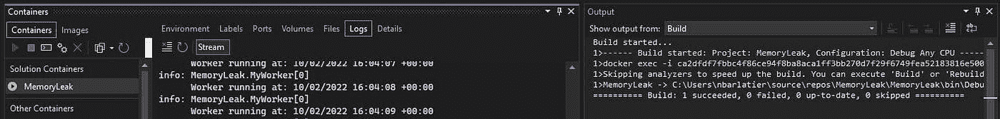

所以现在我们确信我们的应用程序可以在 Kubernetes 上运行。让我们看看容器的内存使用情况:

```
C:\Tutorial>docker stats
```

我们得到:

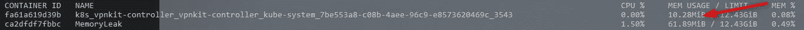

61MB 在很短的时间内。

docker stats 实时更新指标

我们看到我们的记忆完成度上升:

它不是巨大的，但它将在一天结束的时候！它从来没有下降，所以我们肯定有一个内存泄漏。

现在让我们看看如何找到内存泄漏的原因。

首先，我们需要创建一个“真实的”码头工人形象。目前，我们只有一个“dev”docker 映像:

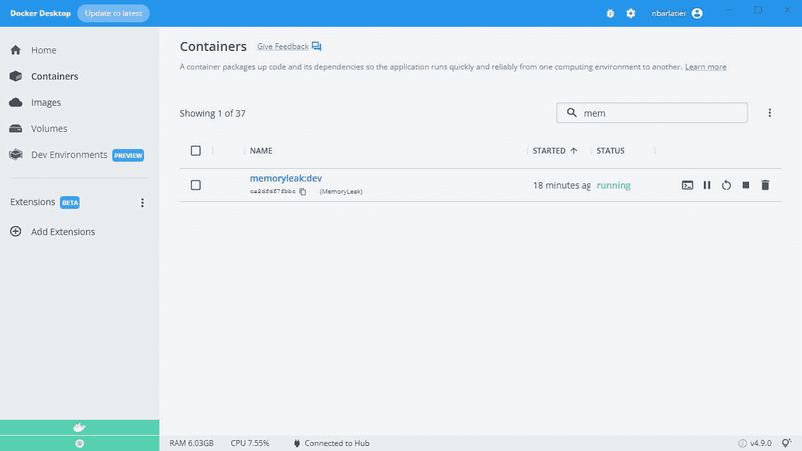

当我们查看运行中的容器时:

容器 ID 图像命令创建状态

ca 2d fdf 7 fbbc memory leak:dev " tail-f/dev/null " 26 小时前启动

我们可以看到，我们没有像在 docker file**entry point[" dot net "，" MemoryLeak.dll"]** 中添加的那样运行应用程序的命令。我们看到的是一个虚假的命令“tail -f /dev/null ”,它只是让我们的容器保持活动状态，但不运行我们的应用程序。这将是 VS 2022 的工作，它的调试器将运行应用程序并将其自身附加到其上。

让我们创建自己的 docker 图像:)

首先让我们停止我们的“dev”容器:

```
> docker stop ca2dfdf7fbbc > docker ps -a ca2dfdf7fbbc memoryleak:dev "tail -f /dev/null" 26 hours ago Exited (137) 10 seconds ago
```

现在让我们转到 MemoryLeak.sln 位置

λ树。/f 卷 OS 卷序列号的文件夹路径列表是 yyyy C:\xxxx\MEMORYLEAK │。dockerignore │。gitattributes │。git ignore│memory leak . SLN│[readme . MD](http://README.md)│└───memoryleak

然后运行以下命令 docker build，我们需要知道 Dockerfile 在哪里。我们需要从解决方案根目录运行命令。

```
λ docker build -f MemoryLeak\Dockerfile -t memoryleak:1 .
```

[+] Building 53.3s (18/18) FINISHED => [internal] load build definition from Dockerfile 0.1s => => transferring dockerfile: 733B 0.0s => [internal] load .dockerignore 0.1s => => transferring context: 382B 0.0s => [internal] load metadata for [mcr.microsoft.com/dotnet/sdk:6.0](http://mcr.microsoft.com/dotnet/sdk:6.0) 0.4s => [internal] load metadata for [mcr.microsoft.com/dotnet/runtime:6.0](http://mcr.microsoft.com/dotnet/runtime:6.0) 0.5s => [build 1/7] FROM [mcr.microsoft.com/dotnet/sdk:6.0@sha256:a78..](http://mcr.microsoft.com/dotnet/sdk:6.0@sha256:a788c58ec0604889912697286ce7d6a28a12ec28d375250a7cd547b619f19b37) 39.1s => => resolve [mcr.microsoft.com/dotnet/sdk:6.0@sha256:a78..](http://mcr.microsoft.com/dotnet/sdk:6.0@sha256:a788c58ec0604889912697286ce7d6a28a12ec28d375250a7cd547b619f19b37) 0.0s => => sha256:31b3f1ad4ce1f369084d0f959813c51df0ca17d9877d5ee88c2db6ff88341430 31.40MB / 31.40MB 8.1s => => sha256:7ed415b4bd19c2b83ef768757b22c5156111db042fd62be4263ba200b4c0c8d0 15.17MB / 15.17MB 4.9s => => sha256:357910a178d4d646acde36bf2c2a95fc59893a78c92a56a47ef8cc89627f850a 31.63MB / 31.63MB 8.2s => => sha256:a788c58ec0604889912697286ce7d6a28a12ec28d375250a7cd547b619f19b37 1.82kB / 1.82kB 0.0s => => sha256:3f5873abb5240a10f3abee05c6f89933d2da0b06037a0532aeb7ddd7959f8252 2.01kB / 2.01kB 0.0s => => sha256:05057078be7d5b0fdc8424f965a11d416639373f9388ecaeb4e2af2ce5bbc1c4 7.17kB / 7.17kB 0.0s => => sha256:7b9388913c3cc3dacffa41ae2bb30c18b54cc5f522fa6ef2faacf48b0dff6020 156B / 156B 5.0s => => sha256:871ef3419da3410a47aa97b7655d8543add053e27cac5c5922ff3ee1f75793cd 9.46MB / 9.46MB 8.1s => => sha256:c3514d10142f3a43d3037bc770248d6093c76d46a47ebe8ac4232c8b29d9eaab 25.37MB / 25.37MB 14.0s => => sha256:c65769fdd163d4fcba401982b5b50f0f78ec1970e68c45fb6671a8864c977683 148.14MB / 148.14MB 31.2s => => sha256:8b2829492cd27a90e4bde8169f4c4e3d2e6c17be2354f230684b05d40ea6df90 12.89MB / 12.89MB 12.6s => => extracting sha256:31b3f1ad4ce1f369084d0f959813c51df0ca17d9877d5ee88c2db6ff88341430 44.4s => => extracting sha256:7ed415b4bd19c2b83ef768757b22c5156111db042fd62be4263ba200b4c0c8d0 1.0s => => extracting sha256:357910a178d4d646acde36bf2c2a95fc59893a78c92a56a47ef8cc89627f850a 40.0s => => extracting sha256:7b9388913c3cc3dacffa41ae2bb30c18b54cc5f522fa6ef2faacf48b0dff6020 0.0s => => extracting sha256:871ef3419da3410a47aa97b7655d8543add053e27cac5c5922ff3ee1f75793cd 0.6s => => extracting sha256:c3514d10142f3a43d3037bc770248d6093c76d46a47ebe8ac4232c8b29d9eaab 2.5s => => extracting sha256:c65769fdd163d4fcba401982b5b50f0f78ec1970e68c45fb6671a8864c977683 6.6s => => extracting sha256:8b2829492cd27a90e4bde8169f4c4e3d2e6c17be2354f230684b05d40ea6df90 0.6s => [internal] load build context 0.1s => => transferring context: 6.34kB 0.0s => [base 1/2] FROM [mcr.microsoft.com/dotnet/runtime:6.0@sha256..](http://mcr.microsoft.com/dotnet/runtime:6.0@sha256:dfa132a1bcb0339f54b2b518052c866986c0bb6fd77bdf692dbd3cea4c6111e6) 15.7s => => resolve [mcr.microsoft.com/dotnet/runtime:6.0@sha256..](http://mcr.microsoft.com/dotnet/runtime:6.0@sha256:dfa132a1bcb0339f54b2b518052c866986c0bb6fd77bdf692dbd3cea4c6111e6) 0.0s => => sha256:357910a178d4d646acde36bf2c2a95fc59893a78c92a56a47ef8cc89627f850a 31.63MB / 31.63MB 8.2s => => sha256:dfa132a1bcb0339f54b2b518052c866986c0bb6fd77bdf692dbd3cea4c6111e6 1.82kB / 1.82kB 0.0s => => sha256:52b235bf8819546e70018d2c0612d06c28f4ac1675f54e596eda99eb3757d154 1.16kB / 1.16kB 0.0s => => sha256:66f36cf5dbe3c14bb49f5b84faba4c36ac65130f464446a00818b4d217ca6abd 2.80kB / 2.80kB 0.0s => => sha256:31b3f1ad4ce1f369084d0f959813c51df0ca17d9877d5ee88c2db6ff88341430 31.40MB / 31.40MB 8.1s => => sha256:7ed415b4bd19c2b83ef768757b22c5156111db042fd62be4263ba200b4c0c8d0 15.17MB / 15.17MB 4.9s => => sha256:7b9388913c3cc3dacffa41ae2bb30c18b54cc5f522fa6ef2faacf48b0dff6020 156B / 156B 5.0s => => extracting sha256:31b3f1ad4ce1f369084d0f959813c51df0ca17d9877d5ee88c2db6ff88341430 3.0s => => extracting sha256:7ed415b4bd19c2b83ef768757b22c5156111db042fd62be4263ba200b4c0c8d0 1.0s => => extracting sha256:357910a178d4d646acde36bf2c2a95fc59893a78c92a56a47ef8cc89627f850a 2.0s => => extracting sha256:7b9388913c3cc3dacffa41ae2bb30c18b54cc5f522fa6ef2faacf48b0dff6020 0.0s => [base 2/2] WORKDIR /app 0.9s => [final 1/2] WORKDIR /app 0.2s => [build 2/7] WORKDIR /src 1.3s => [build 3/7] COPY [MemoryLeak/MemoryLeak.csproj, MemoryLeak/] 0.1s => [build 4/7] RUN dotnet restore “MemoryLeak/MemoryLeak.csproj” 3.9s => [build 5/7] COPY . . 0.3s => [build 6/7] WORKDIR /src/MemoryLeak 0.1s => [build 7/7] RUN dotnet build “MemoryLeak.csproj” -c Release -o /app/build 4.4s => [publish 1/1] RUN dotnet publish “MemoryLeak.csproj” -c Release -o /app/publish /p:UseAppHost=false 3.1s => [final 2/2] COPY — from=publish /app/publish . 0.1s => exporting to image 0.1s => => exporting layers 0.1s => => writing image sha256:527b38b31f488ddefd8c3fe00bd47da30dbd88dfe36516c760866afb809c0a9f 0.0s => => naming to [docker.io/library/memorylceak:1](http://docker.io/library/memorylceak:1) 0.0s

使用“docker 扫描”对图像运行 Snyk 测试，以找到漏洞并了解如何修复它们

第一次用了一会儿(只有 0.3 秒而不是 53.3 秒！)如果我们再做一次，速度会更快，因为 Docker 使用了缓存层:

现在让我们检查一下我们的 docker 图像:

```
λ docker images REPOSITORY TAG IMAGE ID CREATED SIZE memoryleak 1 527b38b31f48 8 minutes ago 190MB
```

让我们通过运行一个容器来测试我们的 docker 映像:

```
λ docker run memoryleak:1
```

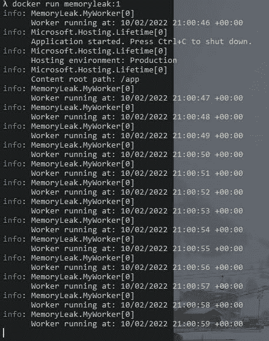

我们现在准备在一个 kubernetes 集群中部署它。

首先，我们需要轻松地创建这个集群。

我们将使用 **Minikube** ，它非常简单且功能强大，足以满足我们的需求:我们在 kubernetes 集群中只需要一个节点。

请访问以下链接:

https://minikube.sigs.k8s.io/docs/[欢迎页面](https://minikube.sigs.k8s.io/docs/)

安装页面【https://minikube.sigs.k8s.io/docs/start/ 

这非常简单，它自动检测你的开发机器的正确安装程序！

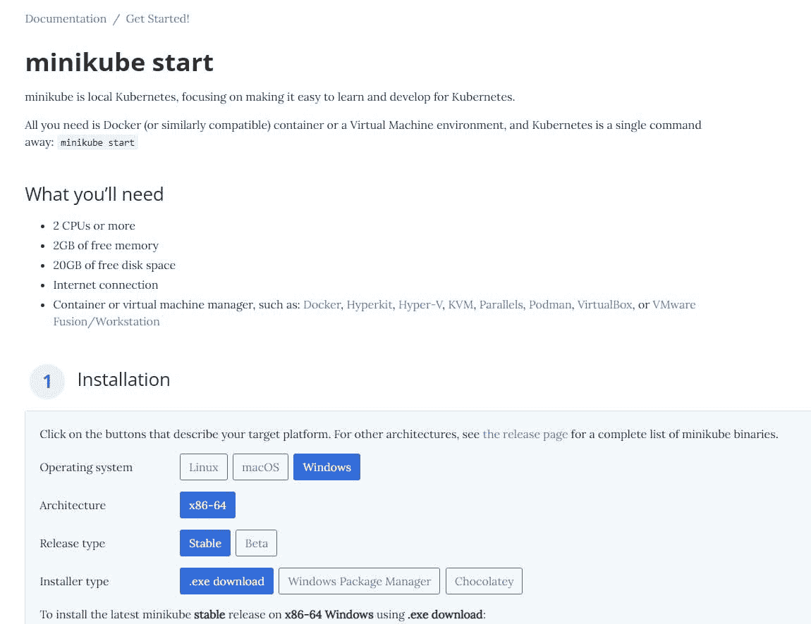

我们需要跑

**！！传递参数-extra-config = kube let . housing-interval 非常重要，否则我们将无法从 pod 中获取指标！！**

我们准备好使用我们的 kubernetes 集群了！

我们还需要启用两个附加组件:

*   带有命令的仪表板:minikube 插件启用指标-服务器
*   metrics-server 命令:minikube addons 启用 metrics-server

我们必须启用以下附加组件:


让我们打开仪表板:

```
λ minikube dashboard * Verifying dashboard health ... * Launching proxy ... * Verifying proxy health ... * Opening http:
```

浏览打开，我们看到:

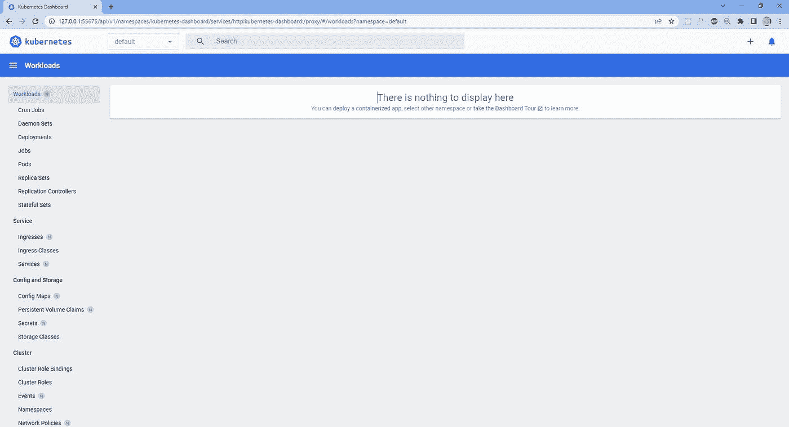

让我们将内存泄漏 docker 映像添加到 minikube 使用的 VM 中:

```
λ minikube image load memoryleak:1
```

过了一会儿，docker 映像在虚拟机中可用了。

让我们检查一下:

我们使用 SSH 访问虚拟机:

我们可以看到 memoryleak docker 图像。

我们现在可以部署它，并使用度量服务器查看内存度量！

让我们打开部署表单页面:

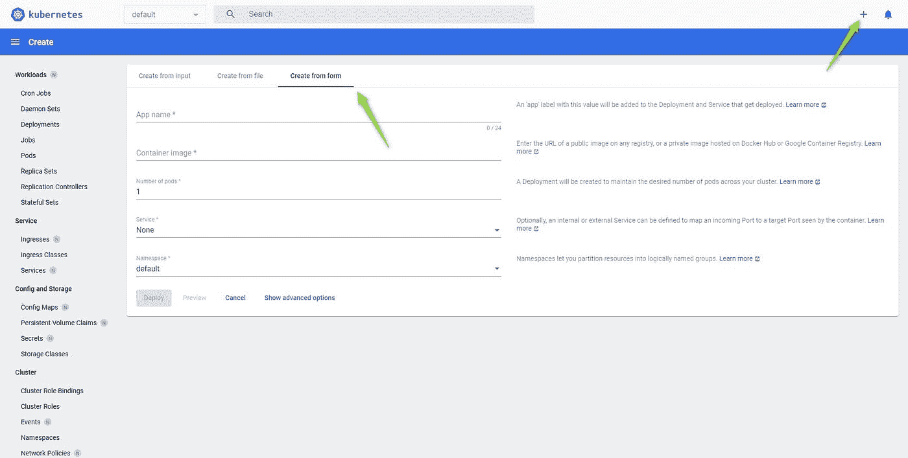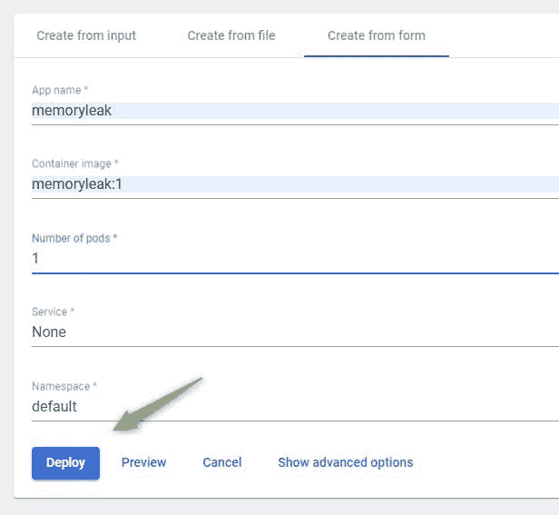

我们单击部署

我们得到:

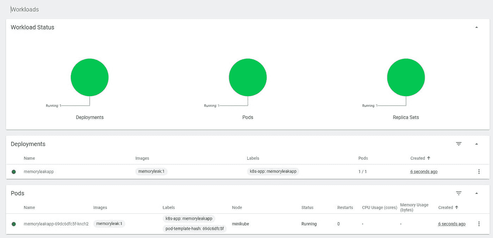

我们成功地在 minikube 集群上部署了我们的应用，部署时只使用了一个 pod。

过一会儿，我们会看到显示的 CPU 和内存指标:

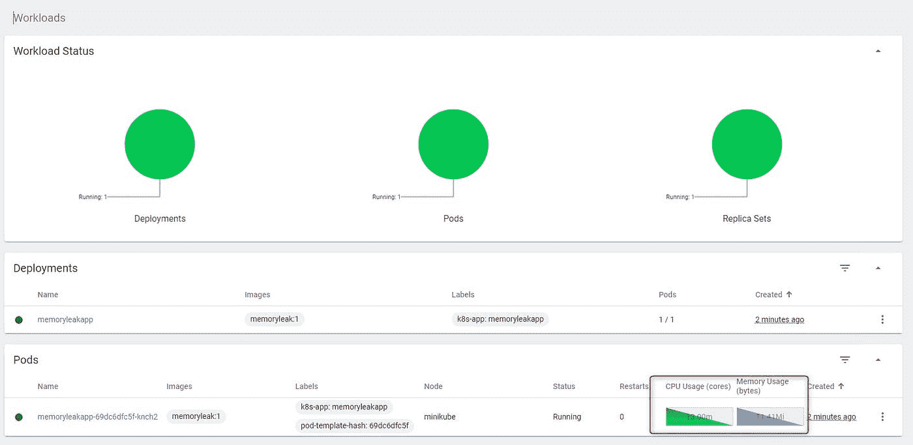

几分钟后我们看到记忆的完善演变:

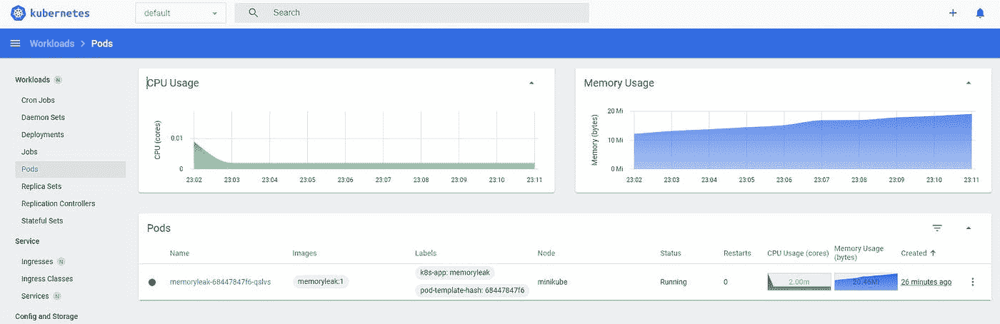

我们可以看到内存使用缓慢上升，但没有停止。

我们可以看到日志

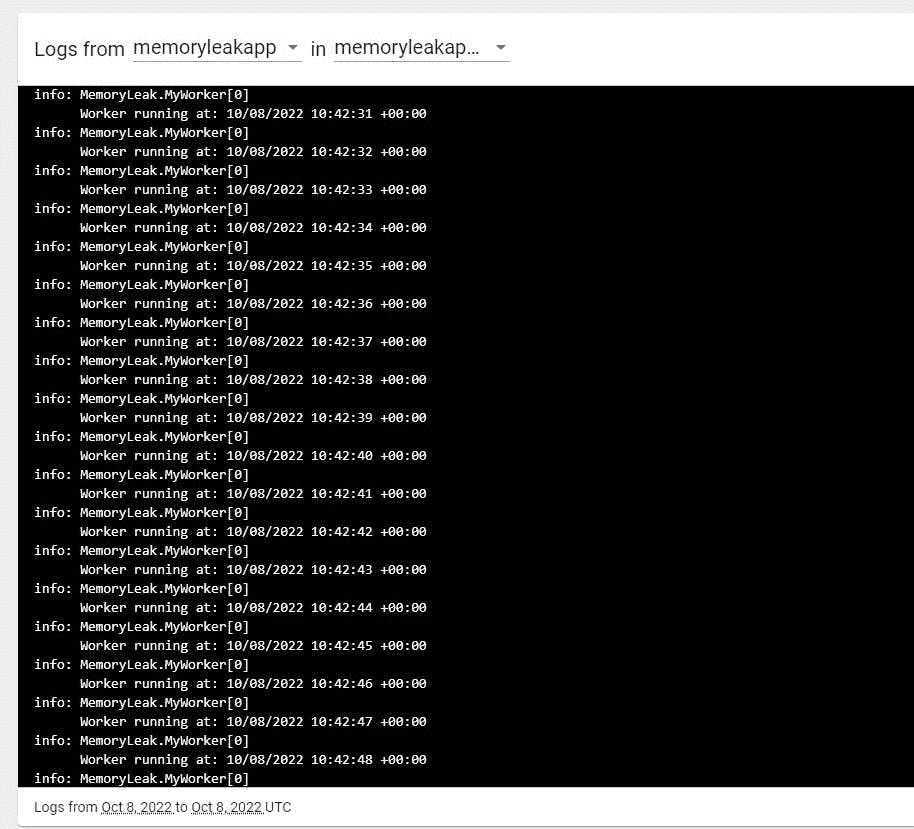

让我们详细看看内存使用情况

点击执行

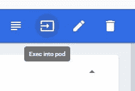

让我们运行命令:

```
root@memoryleakapp-69dc6dfc5f-knch2:/app# cat /sys/fs/cgroup/memory/memory.usage_in_bytes
```

运行它很多次，我们可以看到内存使用量不断增加。

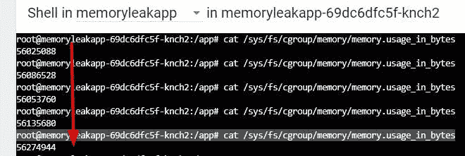

现在我们看到了内存泄漏，让我们通过使用我们需要安装在 pod 中的另一个工具来看看为什么会发生这种情况。

在 pod 内安装点网络转储

[https://learn . Microsoft . com/en-us/dot net/core/diagnostics/dot net-dump](https://learn.microsoft.com/en-us/dotnet/core/diagnostics/dotnet-dump)

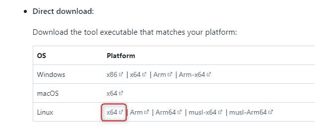

我们需要更新我们容器的 Debian Linux repo 并安装 curl 工具:

我们使用命令:apt 安装 curl

现在，让我们从以下网址下载我们的工具:

[aka.ms/dotnet-dump/linux-x64](https://aka.ms/dotnet-dump/linux-x64)

我们在/tools 创建了一个目录，并在那里下载了我们的工具:

现在我们需要使 dotnet-dump 成为一个可执行文件:

```
root@memoryleakapp-69dc6dfc5f-m28fv:/tools# chmod +x dotnet-dump root@memoryleakapp-69dc6dfc5f-m28fv:/tools# dotnet-dump --help bash: dotnet-dump: command not found root@memoryleakapp-69dc6dfc5f-m28fv:/tools# ./dotnet-dump --help Usage: dotnet-dump [options] [command] Options: --version Show version information -?, -h, --help Show help and usage information Commands: collect Capture dumps from a process analyze <dump_path> Starts an interactive shell with debugging commands to explore a dump ps Lists the dotnet processes that dumps can be collected from.
```

现在我们可以看到这些过程:

```
root@memoryleakapp-69dc6dfc5f-m28fv:/tools# ./dotnet-dump ps 1 dotnet /usr/share/dotnet/dotnet dotnet MemoryLeak.dll
```

现在，让我们从这个过程中收集两个转储文件，中间间隔几分钟，这样我们可以更清楚地看到其中的内存泄漏:

```
root@memoryleakapp-69dc6dfc5f-m28fv:/tools# ./dotnet-dump collect -p 1 Writing full to /tools/core_20221008_173927 Complete root@memoryleakap
```

一旦我们运行了两次这个命令，我们就用下面的命令将这些转储文件从 pod 复制到我们的开发机器上的本地目录:

```
λ kubectl cp default/memoryleakapp-69dc6dfc5f-m28fv:/tools/core_20221008_172957 core_20221008_172957.dump
```

就是把文件从 pod 复制到我们的机器上。

首先在源代码中:我们在这里给定 pod 的名称空间 default，然后是 pod 名称，然后是分隔符':'，然后是文件名

我们给了一个空间

然后第二在目的地我们给你想要的路径和文件名。

我们对第二个转储文件做同样的事情:

```
λ kubectl cp default/memoryleakapp-69dc6dfc5f-m28fv:/tools/core_20221008_173323 core_20221008_173323.dump
```

现在我们有了两个转储文件，我们可以使用它们来获得内存泄漏的来源。

这将是我们下一篇文章的主题！

结论:

我们学习了如何使用 microsoft 工具在任何 kubernetes 集群中运行的. Net 核心应用程序出现内存泄漏时获取转储。

*原载于*[*https://nicolasbarlatier . hash node . dev*](https://nicolasbarlatier.hashnode.dev/net-core-tip-2-how-to-troubleshoot-memory-leaks-within-a-net-console-application-running-in-a-linux-docker-container-in-kubernetes)*。*