# 。NET Core 和 k8s 技巧 3:使用 PerfViewer 排除在 Kubernetes 中运行的. NET 控制台应用程序中的内存泄漏故障

> 原文：<https://blog.devgenius.io/net-core-tip-3-troubleshooting-memory-leaks-within-a-net-cee5934a69b9?source=collection_archive---------11----------------------->

在之前的[文章](https://medium.com/dev-genius/net-core-tip-2-how-to-troubleshoot-memory-leaks-within-a-net-a3a81c137b3c)中，我们看到了如何获取转储文件来帮助我们发现应用程序中的内存泄漏。

今天我们将了解如何使用转储文件。

我们将使用:

*   [PerfView](https://github.com/microsoft/perfview) :一个免费的性能分析工具，帮助隔离 CPU 和内存相关的性能问题。过去它是用于 Windows 操作系统的，但是现在它可以处理在 Linux 机器上收集的分析数据！

首先让我们看看如何使用 PerfView！

1.  PerfView

首先我们可以找到下面的下载页面:

[https://github . com/Microsoft/perf view/blob/main/documentation/downloading . MD](https://github.com/microsoft/perfview/blob/main/documentation/Downloading.md)

我们可以得到最新的版本:

[https://github.com/Microsoft/perfview/releases](https://github.com/Microsoft/perfview/releases)

我们打开 PerfView 应用程序:


我们接受最终用户许可协议(EULA)。

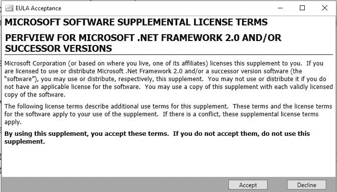

让我们打开包含两个转储文件的文件夹(确保扩展名为*。dmp)

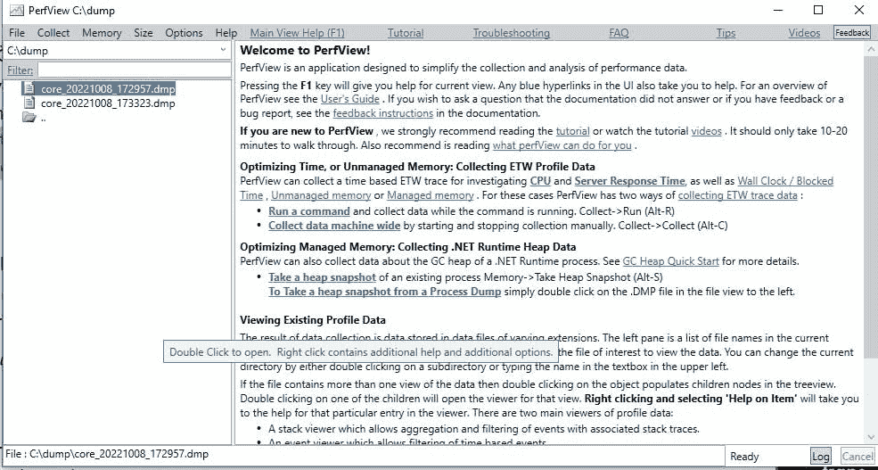

我们双击第一个转储文件，它会打开对话框:

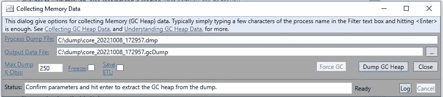

让我们点击“转储垃圾收集堆”按钮:

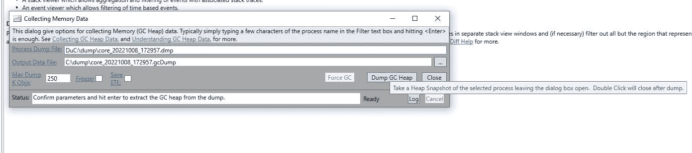

我们看到以下对话框:

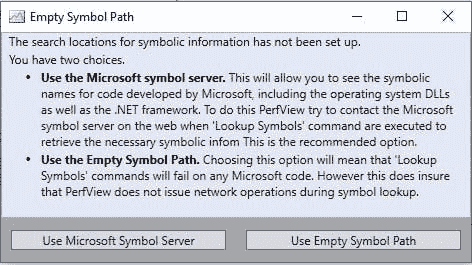

我们暂时关闭它，让它结束。

我们对第二个转储文件再次执行相同的操作。

最后我们得到:

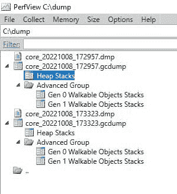

现在让我们设置符号路径:

转到文件>设置符号路径>点击添加 Microsoft 符号服务器

我们得到:

SRV*C:\ Users \ nbar la ~ 1 \ AppData \ Local \ Temp \ symbol cache*[msdl.microsoft.com/download/symbols](https://msdl.microsoft.com/download/symbols)

让我们将应用程序的 pdb 文件复制到 C:\dump 中

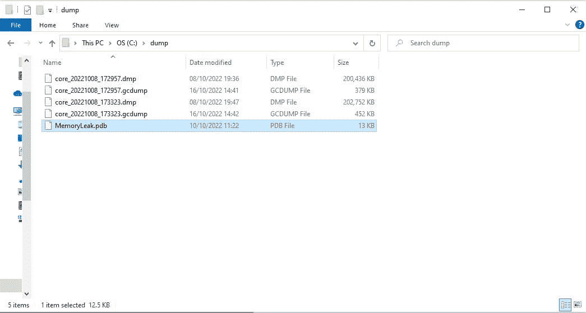

添加路径:

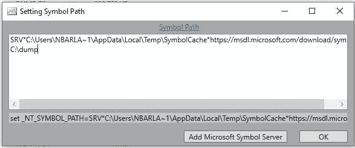

这样我们就可以得到关于代码路径的所有信息。

让我们通过双击“堆栈”来打开第二个 GC 转储文件:

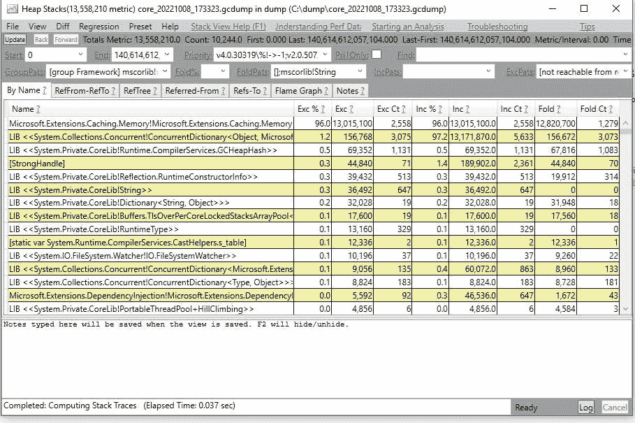

让我们转到菜单“Diff”>“带基线:堆栈 xxxxxx”

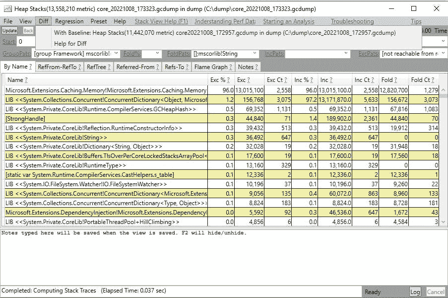

我们得到一个新的对话框“比较堆堆栈”:

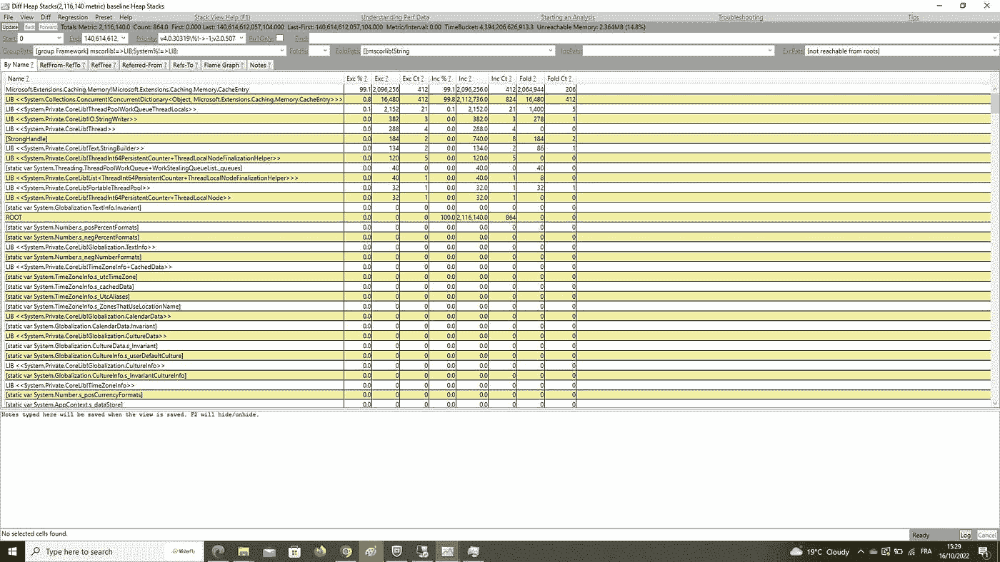

让我们关注一下选项卡:

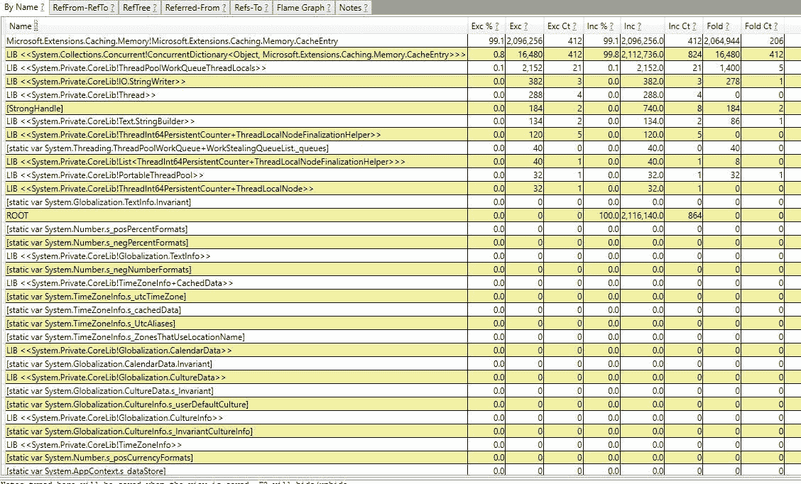

我们可以立即看到，堆内 99%的差异是由“Microsoft。extensions . caching . memory . cache entry "。基本上，两个转储之间 99%的新分配来自这些类型。

所以我们要重点关注这些类型，知道他们从哪里来！为此，让我们双击类型，PerfView 将焦点转移到选项卡“Refered-From”:这是调用者视图。

> *来电查看*
> 
> 调用者视图显示了一个方法的所有可能调用者。它是一个树视图(类似于 calltree view)，但是节点的“子节点”是节点的“调用者”(因此它是 calltreeview 的“后向视图”)。一种非常常见的方法是在“byname”视图中找到一个相当大的节点，查看它的调用方(通过双击“byname”视图中的条目)，然后查看是否有更好的语义分组，该节点应该折叠到“up the stack”中。

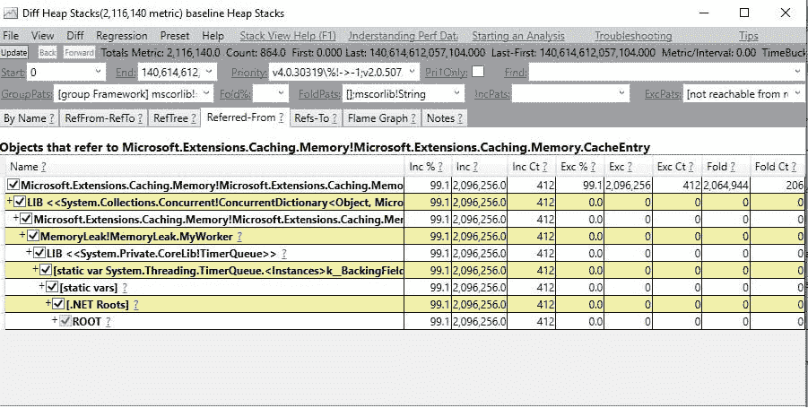

因此，我们将从底部到顶部阅读，以查看分配的类型是在哪里分配的，以及是由哪些类型分配的:

在底部我们可以看到“根”:GC 首先通过这个根来找到对我们的类型“Microsoft”的所有引用。extensions . caching . memory . cache entry "。

就在上面，我们可以看到一个特定类型的根。NET Roots”是为了告诉用户它是托管代码，并且它是引用我们的“Microsoft。extensions . caching . memory . cache entry "。

然后我们可以看到一个非常中间的节点，叫做“静态变量”:基本上它是一个静态变量，开始我们的引用。记住静态变量是 GC 识别的一种根类型。

现在我们知道我们有一个静态变量，它到底是什么？我们可以在上面的节点上看到:“Static var system . threading . timerqueue . >

好的，我们稍后会看到它是关于什么的。在上面的节点中，我们可以看到“LIB 系统”。二等兵。科里布！TimerQueue”:它是告诉用户 TimeQueue 在。NET 库仅此而已。

上面我们可以看到类型:“MemoryLeak！记忆缺失。MyWorker”:现在看着眼熟！这是我们的集会“记忆 Leak”和我们的班级“记忆 Leak”。我的工人被“！”分隔。

所以现在我们可以关注我的工人来找到我们的漏洞:)

上面我们看到“微软。扩展.缓存.内存！微软。extensions . caching . memory . memory cache "

它是我们的 Microsoft 类型的 MyWorker 的一个字段。来自程序集 Microsoft . extensions . caching . memory 的 extensions . caching . memory . memory cache

现在我们到了最后一种类型:微软。extensions . caching . memory . cache entry 解释了我们在内存方面的差异。

所以现在我们确切地知道了以下字段的内存泄漏来自哪里:

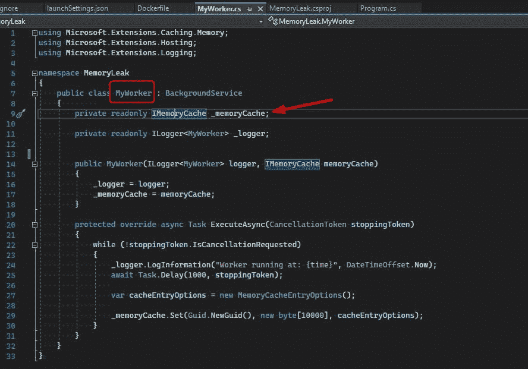

我们可以看到一个关于内存缓存的字段，它实际上是接口 IMemoryCache。

当我们查看接口的实现时，我们看到:

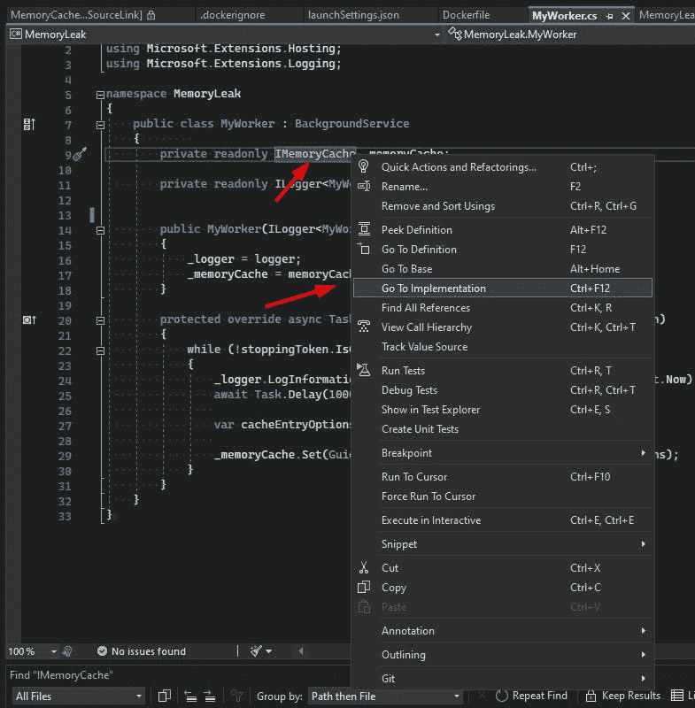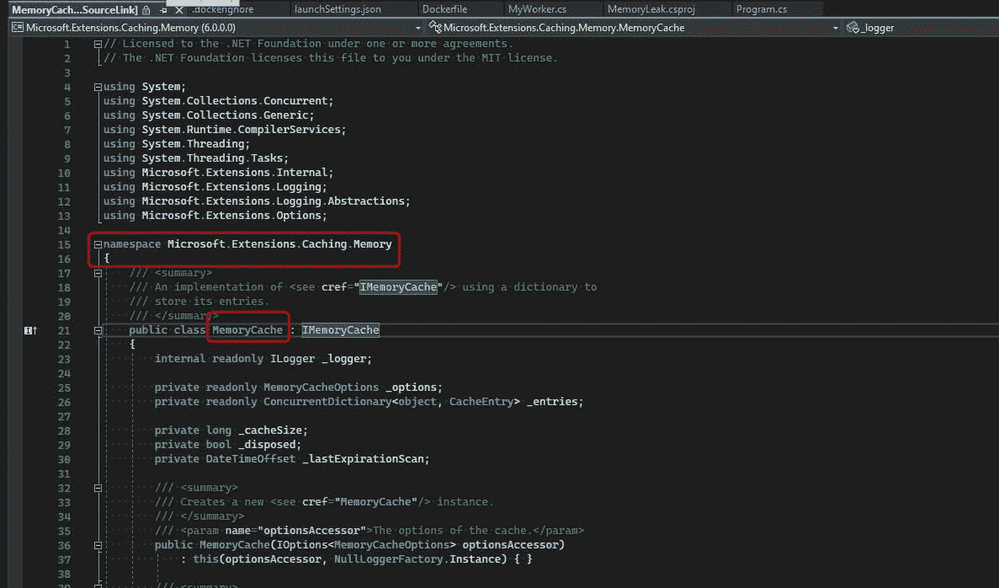

与 PerfViewer 返回的类型相同！

现在我们知道需要修复属性:_memoryCache 的内存泄漏。

我们看到这个属性只在这里使用:

```
protected override async Task ExecuteAsync(CancellationToken stoppingToken)
        {
            while (!stoppingToken.IsCancellationRequested)
            {
                _logger.LogInformation("Worker running at: {time}", DateTimeOffset.Now);
                await Task.Delay(1000, stoppingToken);var cacheEntryOptions = new MemoryCacheEntryOptions();_memoryCache.Set(Guid.NewGuid(), new byte[10000], cacheEntryOptions);
            }
        }
```

我们可以看到，我们的托管服务只在内存缓存中添加了一个新的相当大的字节数组，并使用 guid 作为查找它的关键字。

还记得 MemoryCache 是由下面的代码注入到我们的 DI 中的吗:

```
using MemoryLeak;
using Microsoft.Extensions.DependencyInjection;
using Microsoft.Extensions.Hosting;

IHost host = Host.CreateDefaultBuilder(args)
    .ConfigureServices(services =>
    {
        services.AddMemoryCache();
        services.AddHostedService<MyWorker>();
    })
    .Build();

await host.RunAsync();
```

我们使用扩展方法 AddMemoryCache 在 DI 中添加 MemoryCache。我们用 VS 2022 反编译一下:

```
// Licensed to the .NET Foundation under one or more agreements.
// The .NET Foundation licenses this file to you under the MIT license.

using System;
using Microsoft.Extensions.Caching.Distributed;
using Microsoft.Extensions.Caching.Memory;
using Microsoft.Extensions.DependencyInjection.Extensions;

namespace Microsoft.Extensions.DependencyInjection
{
    /// <summary>
    /// Extension methods for setting up memory cache related services in an <see cref="IServiceCollection" />.
    /// </summary>
    public static class MemoryCacheServiceCollectionExtensions
    {
        /// <summary>
        /// Adds a non distributed in memory implementation of <see cref="IMemoryCache"/> to the
        /// <see cref="IServiceCollection" />.
        /// </summary>
        /// <param name="services">The <see cref="IServiceCollection" /> to add services to.</param>
        /// <returns>The <see cref="IServiceCollection"/> so that additional calls can be chained.</returns>
        public static IServiceCollection AddMemoryCache(this IServiceCollection services)
        {
            if (services == null)
            {
                throw new ArgumentNullException(nameof(services));
            }

            services.AddOptions();
            services.TryAdd(ServiceDescriptor.Singleton<IMemoryCache, MemoryCache>());

            return services;
        }

....
```

我们可以看到 IMemory 将以 singleton 的形式作为 MemoryCache 返回。因此 MemoryCache 将在应用程序存在期间一直存在。

我们的应用程序在一个静态变量中添加条目:_memoryleak，而不是每秒都删除它们:我们有内存泄漏！

我们能做些什么来修复它？我们可以在一段时间后移除一个暂时不用的项目，或者我们可以在绝对时间后移除它。

让我们采取第二种解决方案:

```
protected override async Task ExecuteAsync(CancellationToken stoppingToken)
        {
            while (!stoppingToken.IsCancellationRequested)
            {
                _logger.LogInformation("Worker running at: {time}", DateTimeOffset.Now);
                await Task.Delay(1000, stoppingToken);

                var cacheEntryOptions = new MemoryCacheEntryOptions();

                cacheEntryOptions.SetAbsoluteExpiration(TimeSpan.FromMilliseconds(500));

                _memoryCache.Set(Guid.NewGuid(), new byte[10000], cacheEntryOptions);
            }
        }
```

我们只是将每个项目的绝对过期时间设置为 500 毫秒，所以我们新添加的项目将在 500 毫秒后被删除，所以在我们的应用程序添加新项目之前，因为我们的任务延迟了 1000 毫秒。

通过这个简单的修复，内存泄漏就消失了。记住，大多数情况下，修复内存泄漏比发现它要容易得多！

**结论**

我希望这篇关于内存泄漏的介绍是有用的，并且您将能够修复您的产品中的其他内存泄漏。我只是希望它不会发生，但现在你可以解决它！

如果你喜欢我的文章，请帮我订阅:)干杯！

*原载于*[*https://nicolasbarlatier . hash node . dev*](https://nicolasbarlatier.hashnode.dev/net-core-tip-3-troubleshooting-memory-leaks-within-a-net-console-application-running-in-kubernetes-with-perfviewer)*。*