# 网飞展示:Python 中的 EDA

> 原文：<https://blog.devgenius.io/netflix-shows-eda-in-python-1f50bdb53301?source=collection_archive---------7----------------------->

你好。在本文中，我将带您在非常流行的网飞数据集上使用 Python 完成一个完整的探索性数据分析(EDA)过程。

EDA 是数据分析中的一个重要过程，它通过总结数据的重要特征、揭示趋势和有意义的见解，帮助数据科学家或数据分析师更好地理解他们的数据。

EDA 涉及各种过程，如数据收集、数据清理、分析不同的特征、可视化等。了解 EDA 中一个数据集中使用的步骤在其他数据集中可能有所不同是很重要的。虽然 EDA 中没有硬性的规则，但人们应该专注于提取有意义的见解，寻找各种特性之间的相关性，并以可视化的形式呈现这些见解。

> 数据清洗在 EDA 中非常重要，人们必须花费相当多的时间来清洗数据，因为数据通常是原始的和脏的，它需要在任何分析之前进行清洗。

我用来分析的数据集可以在[这里](https://www.kaggle.com/datasets/shivamb/netflix-shows)找到。

## 数据描述:

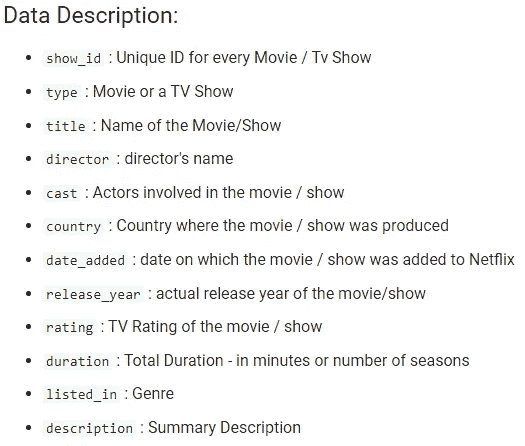

数据描述

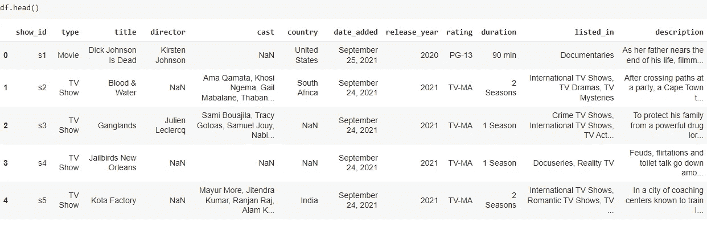

**导入库:**

## 数据清理:

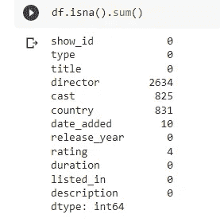

在我们的数据中，有许多 NaN 值，在继续讨论之前，处理这些 NaN 值很重要。现在，有很多方法可以处理 NaN，但是因为我们有分类数据，用列的*模式*填充 NaN 没有意义，所以删除所有具有 NaN 值的行。

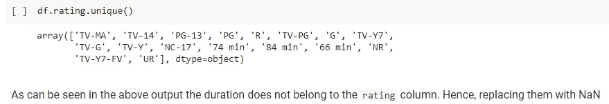

评级栏中有一些值，如*80 分钟*，显然不属于这里。所以移除它们

## 图表 1:电影在网飞上映超过 6 次的导演

嘶！超过 6 倍，因为图表上挤满了在网飞上映 5 部或更少电影的导演。

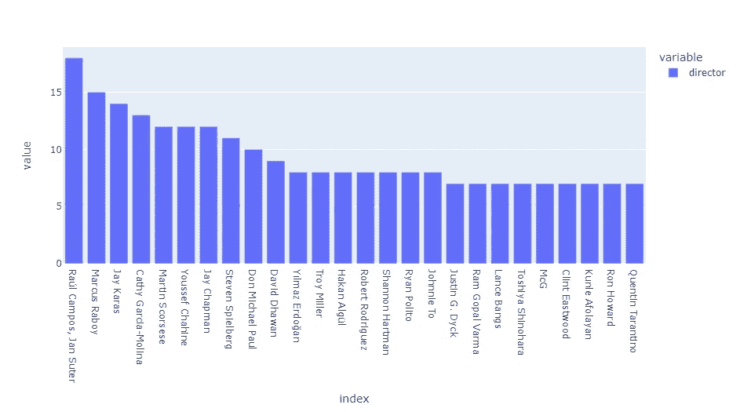

从上图可以推断出，劳尔·坎普、马库斯·雷波依和杰伊·卡拉斯是在网飞发行电影数量最多的前三名导演。

## 图表 2:电影与电视节目

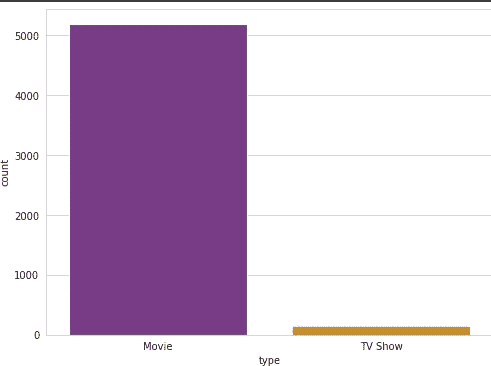

## 图表 3:制作电影/节目最多的五个国家

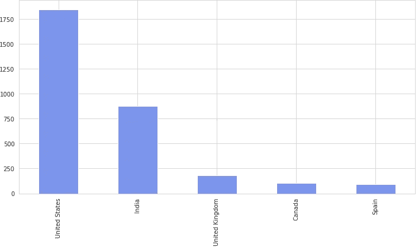

## 图 4:大部分电影/节目被添加到网飞的年份

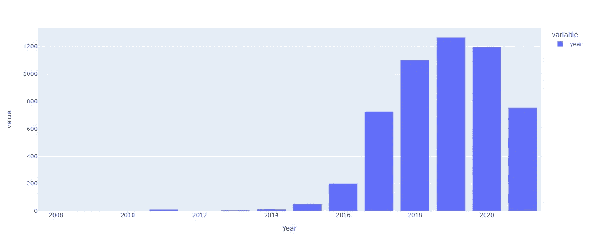

## 图表 5:大多数电影/节目的收视率

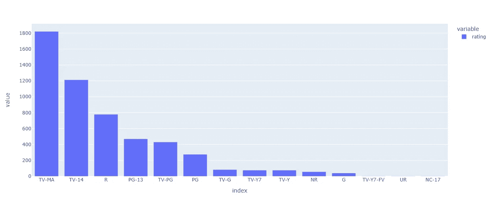

## 总流派

总共有 42 种类型，包括戏剧，独立电影，喜剧，浪漫电影…

## 图表 6:体裁词云

## 了解不同国家有哪些内容

## 图表 7:电视节目的季节

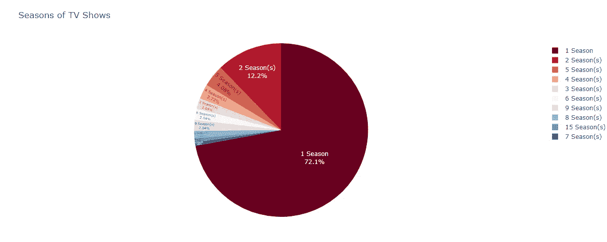

我在下图中列出了我的最终见解:

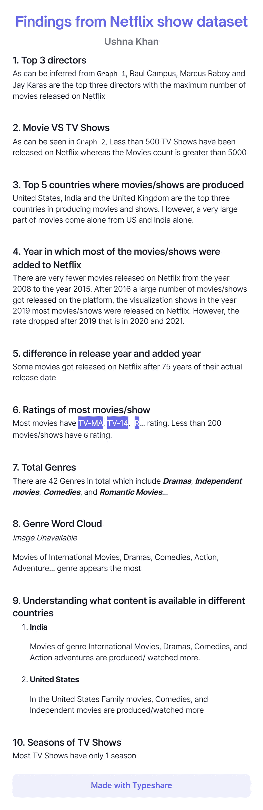

现在，这就是这篇文章。我很高兴你能走到这一步。

**结论:**

完整的代码可以在这里[访问](https://github.com/ushnak-tech/Netflix-show-data-analysis)在这里我发现了更多的见解，比如:

*   获取特定类型的电影
*   让男演员/女演员了解国家
*   分级为 G 的电影
*   最新电影(2021 年和 2020 年上映)以及更多…

谢谢大家！！