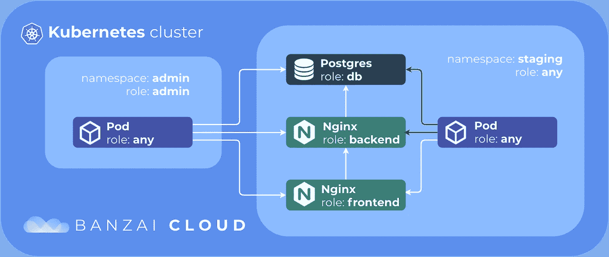
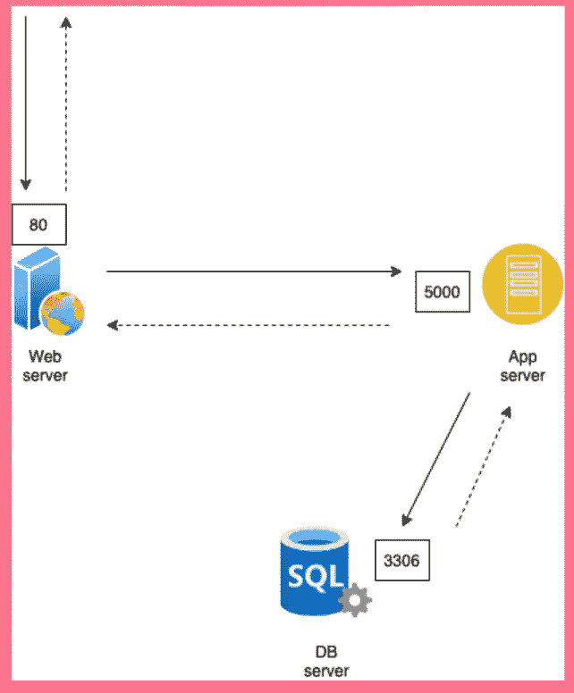

# K8s 中的网络策略

> 原文：<https://blog.devgenius.io/network-policy-in-k8s-14eeeb905bb?source=collection_archive---------5----------------------->



图片来源:[https://banzaicloud.com/blog/network-policy/](https://banzaicloud.com/blog/network-policy/)

> 我们想要实现的设置



*   所有的实线方向线可以认为是**入口**规则，所有的虚线方向线可以认为是**出口**规则。
*   对于 Web 服务器，我们希望允许端口 80 上的传入流量(传入)和“用户”的传出流量(传出)。
*   对于应用服务器，我们希望允许端口 5000 上的传入流量(传入)和 DB 服务器“3306”上的传出流量(传出)。
*   对于数据库服务器，我们希望在端口 3306 上允许传入流量(入口),此时不允许传出流量(出口)。

> Pod 配置

**网络服务器 Pod**

```
apiVersion: v1
kind: Pod
metadata:
  name: web-pod
  namespace: dev
  labels:
    role: web
spec:
  containers:
    - name: web-pod
      image: some-web-app
      ports:
        - containerPort: 80
```

**应用服务器盒**

```
apiVersion: v1
kind: Pod
metadata:
  name: api-pod
  namespace: dev
  labels:
    role: api
spec:
  containers:
    - name: api-pod
      image: some-api-app
      ports:
        - containerPort: 5000
```

数据库服务器盒

```
apiVersion: v1
kind: Pod
metadata:
  name: db-pod
  namespace: dev
  labels:
    role: db
spec:
  containers:
    - name: db-pod
      image: mysql
      ports:
        - containerPort: 3306
```

> 网络策略:应用服务器

```
apiVersion: networking.k8s.io/v1
kind: NetworkPolicy
metadata:
  name: api-policy
spec:
  podSelector:
    matchLabels:
      role: api
  policyTypes:
  - Ingress
  - Egress
  ingress:
    - from:
        - podSelector:
            matchLabels:
              name: web-pod
          namespaceSelector:
            matchLabels:
              name: dev
      ports:
      - protocol: TCP
        port: 5000
  egress:
    - to:
        - podSelector:
            matchLabels:
              name: db-pod
        - namespaceSelector:
            matchLabels:
              name: dev
      ports:
        - protocol: TCP
          port: 3306
```

*   像任何 k8s 对象一样,“网络策略”对象也有 4 个主要部分:apiVersion、kind、metadata 和 spec。
*   spec/podSelector/matchLabels 表示此网络策略需要映射到哪个 pod。如果您在元数据/标签处查看 db server pod 的 pod 配置，您会发现同样的情况。
*   在 spec/policyTypes 下，我们指定将要配置的策略。仅入口、仅出口或两者都有。
*   然后我们定义入口和出口定义。
*   这里入口定义说允许来自:
    1 的输入流量。名为“web-pod”(入口/来源/pod 选择器/匹配标签)的 pod
    2。&在命名空间“dev”(ingress/from/namespace selector/match labels)中
    3。&至端口‘5000’(入口/端口)
*   出口定义表示允许传出流量到:
    1。名为' d b-pod '(egress/to/pod selector/matchLabels)的 pod
    2。&在命名空间‘dev’(egress/to/namespace selector/match labels)中
    3。&至端口‘3306’(出口/端口)

> 网络策略:Web 服务器

```
apiVersion: networking.k8s.io/v1
kind: NetworkPolicy
metadata:
  name: web-policy
spec:
  podSelector:
    matchLabels:
      role: web
  policyTypes:
  - Egress
  egress:
    - to:
        - podSelector:
            matchLabels:
              name: api-pod
        - namespaceSelector:
            matchLabels:
              name: dev
      ports:
        - protocol: TCP
          port: 5000
```

*   这里我们没有入口策略类型/规则。因此默认情况下，它会允许所有流量通过端口 80 进入 web 服务器。但它可能受到负载平衡器或 VPN 的保护。
*   spec/podSelector/matchLabels 表示此网络策略需要映射到哪个 pod。如果您在元数据/标签处查看 web 服务器 pod 的 pod 配置，您会发现同样的情况。
*   在 spec/policyTypes 下，我们指定将要配置的策略。仅入口、仅出口或两者都有。
*   然后我们定义入口和出口定义。
*   这里的出口定义说允许流出的流量到:
    1。名为' API-pod '(egress/to/pod selector/matchLabels)的 pod
    2。&在命名空间“dev”(egress/to/namespace selector/match labels)中
    3。&至端口‘5000’(出口/端口)

> 网络策略:数据库服务器

```
apiVersion: networking.k8s.io/v1
kind: NetworkPolicy
metadata:
  name: db-policy
spec:
  podSelector:
    matchLabels:
      role: db
  policyTypes:
  - Ingress
  - Egress
  ingress:
    - from:
        - podSelector:
            matchLabels:
              name: api-pod
          namespaceSelector:
            matchLabels:
              name: dev
        - ipBlock:
            cidr: 192.168.5.10/32
      ports:
      - protocol: TCP
        port: 3306
  egress:
    - to:
        - ipBlock:
            cidr: 192.168.5.10/32
      ports:
        - protocol: TCP
          port: 80
```

*   这里的情况有点不同，因为我们偏离了我们定义的设置。
*   稍微偏离的原因是为了展示一个场景。
*   这种情况下，如果我们想允许一些备份数据库服务器从一个特定的 IP/范围来访问我们的数据库服务器。同样，如果我们想访问特定 IP/范围的备份数据库服务器。
*   spec/podSelector/matchLabels 表示此网络策略需要映射到哪个 pod。如果您在元数据/标签处查看 db server pod 的 pod 配置，您会发现同样的情况。
*   在 spec/policyTypes 下，我们指定将要配置的策略。仅入口、仅出口或两者都有。
*   然后我们定义入口和出口定义。
*   这里入口定义说允许来自:
    1 的输入流量。名为' API-pod '(ingress/from/pod selector/matchLabels)的 pod
    2。&在命名空间‘dev’(入口/来自/命名空间选择器/匹配标签)
    3。&至端口‘3306’(入口/端口)
    4。此外，它还允许来自特定 IP/范围(入口/来源/IP 块)的流量
*   这里的出口定义是允许输出流量到特定的 IP/范围(出口/到/IP 块)

朋友们，如果你喜欢我的内容，你会考虑关注我在 https://www.linkedin.com/in/hitesh-pattanayak-52290b160/[的链接吗](https://www.linkedin.com/in/hitesh-pattanayak-52290b160/)