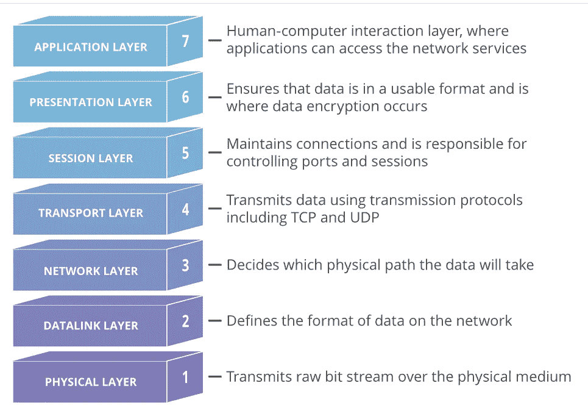

# 网络:什么是端口？

> 原文：<https://blog.devgenius.io/networking-what-is-a-port-59fa35adc4cf?source=collection_archive---------14----------------------->

## 它们到底是什么？我一直在使用它们，但不知何故，我甚至不知道它们是什么。

## 这是什么？

端口是网络连接开始和结束的虚拟点。端口是基于软件的，由计算机的操作系统管理。每个端口都与特定的进程或服务相关联。[1]

## 它是用来做什么的？

端口允许计算机很容易地区分不同类型的流量:例如，电子邮件和网页会到达不同的端口，即使两者通过相同的互联网连接到达计算机。[1]

## 什么是端口号？

所有联网设备的端口都是标准化的，每个端口都有一个编号。大多数端口是为某些[协议](https://www.cloudflare.com/learning/network-layer/what-is-a-protocol/)保留的——例如，所有的[超文本传输协议(HTTP)](https://www.cloudflare.com/learning/ddos/glossary/hypertext-transfer-protocol-http/) 消息都去往端口 80。虽然 [IP 地址](https://www.cloudflare.com/learning/dns/glossary/what-is-my-ip-address/)使信息能够往来于特定设备，但端口号允许在这些设备中定位特定的服务或应用。[1]

# 端口是网络层的一部分吗？

OSI 模型是互联网如何工作的概念模型。它将不同的互联网服务和流程分为 7 层。这些层是:



[1][https://www . cloud flare . com/learning/network-layer/what-A-computer-port/#:~:text = A % 20 port % 20 is % 20a % 20 virtual，A % 20 specific % 20 process % 20 or % 20 service](https://www.cloudflare.com/learning/network-layer/what-is-a-computer-port/#:~:text=A%20port%20is%20a%20virtual,a%20specific%20process%20or%20service)。

端口是传输层(第 4 层)的概念。只有像[传输控制协议(TCP)](https://www.cloudflare.com/learning/ddos/glossary/tcp-ip/) 或[用户数据报协议(UDP)](https://www.cloudflare.com/learning/ddos/glossary/user-datagram-protocol-udp/) 这样的传输协议才能指示数据包应该到达哪个端口。TCP 和 UDP 报头有一个部分用于指示端口号。[网络层](https://www.cloudflare.com/learning/network-layer/what-is-the-network-layer/)协议——例如[互联网协议(IP)](https://www.cloudflare.com/learning/network-layer/internet-protocol/)——不知道给定网络连接中使用的是哪个端口。在标准的 IP 报头中，没有地方指示数据[分组](https://www.cloudflare.com/learning/network-layer/what-is-a-packet/)应该去往哪个端口。IP 报头仅指示目的 IP 地址，而不是该 IP 地址的端口号。

## 如何检查我的端口？

您可以使用 netstat(在 Windows 的管理员控制台中)

```
netstat -tlpn
```

因为我不能在 Windows 上通过管道连接到 grep，所以我喜欢像这样输出到一个文本文件:

```
netstat -tlpn > C:\Users\ashle\Desktop\ports.txt
```

然后在文本编辑器中打开该文件，搜索我感兴趣的端口。例如，如果我想查看 MysqlServer 连接到哪个端口，我也可以只搜索“SQL”。(默认情况下，MySQLServer 连接到端口 3306)

# 参考

[1]什么是端口？[https://www . cloud flare . com/learning/network-layer/what-A-computer-port/#:~:text = A % 20 port % 20 is % 20a % 20 virtual，A % 20 specific % 20 process % 20 or % 20 service](https://www.cloudflare.com/learning/network-layer/what-is-a-computer-port/#:~:text=A%20port%20is%20a%20virtual,a%20specific%20process%20or%20service)。

【2】[如何检查 mysql 运行在什么端口](https://serverfault.com/questions/116100/how-to-check-what-port-mysql-is-running-on)。[https://server fault . com/questions/116100/how-to-check-what-port-MySQL-is-running-on](https://serverfault.com/questions/116100/how-to-check-what-port-mysql-is-running-on)