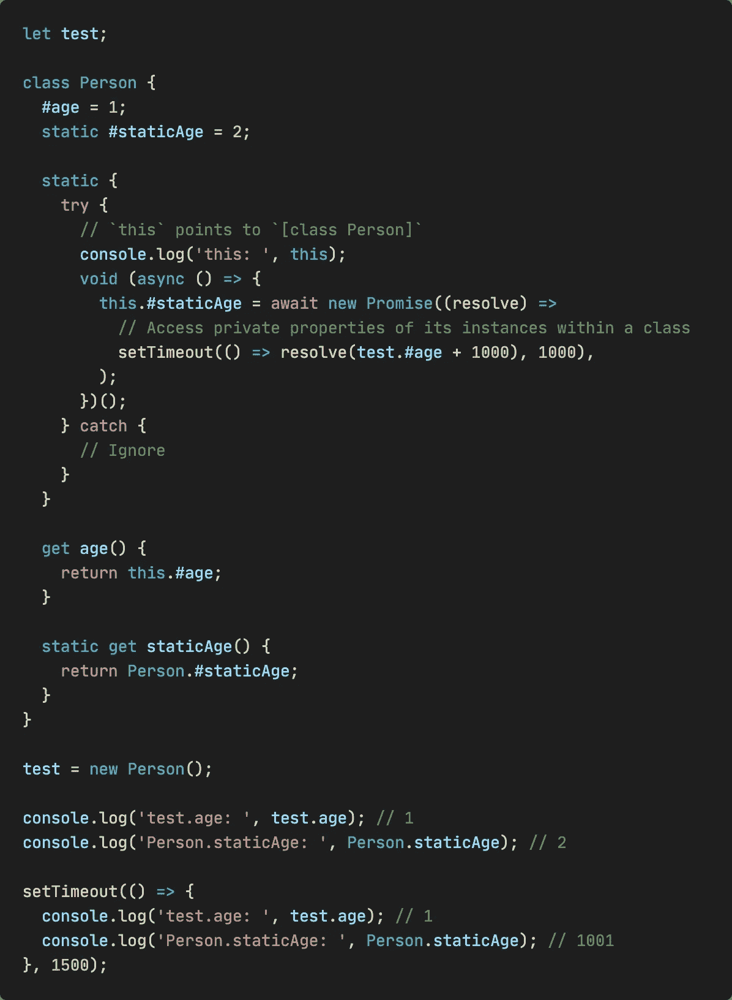

# ECMAScript 2022 中针对类元素的新功能

> 原文：<https://blog.devgenius.io/new-features-in-ecmascript-2022-for-class-elements-b4a8f4a26659?source=collection_archive---------0----------------------->

## 它带来了什么便利？


[杰斯温·托马斯](https://unsplash.com/@jeswinthomas?utm_source=medium&utm_medium=referral)在 [Unsplash](https://unsplash.com?utm_source=medium&utm_medium=referral) 上拍摄的照片

这篇文章是 ECMAScript 2022 中一系列新特性的第二篇，主要关注类元素。第一个在这里:

[](/ecmascript-2022-is-officially-released-what-should-we-pay-attention-to-5e207ed61a46) [## ECMAScript 2022 正式发布，需要注意什么？

### 有没有带来什么有趣的东西？

blog.devgenius.io](/ecmascript-2022-is-officially-released-what-should-we-pay-attention-to-5e207ed61a46) 

# 公共和私有实例字段

实例字段允许使用`=`将属性添加到类定义中。默认情况下所有属性都是公共的，你可以在字段前使用`#`来定义一个私有字段。

```
class Person {
  name = 'A';
  #age = 35; getName = () => this.name;
  getAge = () => this.#age;
}const test = new Person();console.log(test.name); // A
console.log(test.getName()); // A*// SyntaxError: Private field '#age' must be declared in an enclosing class*
console.log(test.#age);
console.log(test.getAge()); // 35
```

# 公共和私有静态字段

添加了`static`关键字来声明静态字段，这些字段只能通过类本身来访问，也可以被继承。

```
class Person {
  static name = 'A';
  static #age = 35; getStaticAge = () => Person.#age;
  getAge = () => this.#age;
}const test = new Person();*// SyntaxError: Private field '#age' must be declared in an enclosing class*
console.log(Person.#age);
console.log(Person.name); // 'A'*// TypeError: Cannot read private member #age from an object whose class did not declare it*
console.log(test.getAge());
console.log(test.getStaticAge()); // 35
```

# 私有实例方法和访问器

类似地，私有实例的方法和访问器也可以使用`#`来声明:

```
class Person {
  #getAge = () => 35;
  getAge = () => this.#getAge() + 1; get #age() {
    return 35;
  } get age() {
    return this.#age;
  }
}const test = new Person();console.log(test.getAge()); // 36
console.log(test.age); // 35
```

# 私有静态方法和访问器

```
class Person {
  static #getAge = () => 35;
  static getAge = () => this.#getAge() + 1; static get #age() {
    return 35;
  } static get age() {
    return this.#age;
  }
}const test = new Person();console.log(Person.getAge()); // 36
console.log(Person.age); // 35*// TypeError: test.getAge is not a function*
console.log(test.getAge());
console.log(test.age); // undefined
```

# 类内部的静态块

在此之前，如果您需要在初始化期间评估语句(如`try..catch`)，或者从一个值设置两个字段，您必须在类定义之外执行该逻辑。像下面这样:

```
// without static blocks:
class C {
  static x = ...;
  static y;
  static z;
}try {
  const obj = doSomethingWith(C.x);
  C.y = obj.y
  C.z = obj.z;
}
catch {
  C.y = ...;
  C.z = ...;
}
```

但是现在我们可以使用下面的语法:

```
class C {
  static {
    // statements
  }
}
```

这里有一个例子:



# `#x in obj`语法

使用`#x in obj`语法，我们可以测试对象上私有字段的存在:

```
class A {
  #age = 35; static isAInstance(obj) {
    return #age in obj;
  }
}class B extends A {}const test0 = new A();
const test1 = new B();console.log(A.isAInstance(test0)); // true
console.log(A.isAInstance(test1)); // true
console.log(A.isAInstance(Object.create(null))); // false
```

# 结论

这是关于类元素的新特性，那么你觉得哪个最有用？

*感谢阅读。如果你喜欢这样的故事，想支持我，请考虑成为* [*中会员*](https://medium.com/@islizeqiang/membership) *。每月 5 美元，你可以无限制地访问媒体内容。如果你通过* [*我的链接*](https://medium.com/@islizeqiang/membership) *报名，我会得到一点佣金。*

你的支持对我很重要——谢谢。