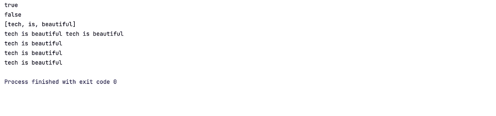
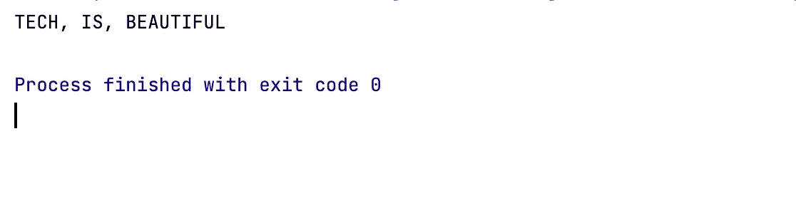

# 你必须知道的 Java 11: 8 特性和例子

> 原文：<https://blog.devgenius.io/new-features-you-must-know-in-java-11-and-examples-3fda2ad26def?source=collection_archive---------0----------------------->

# JAVA 11 概述

从 Java 11 开始，甲骨文 JDK 将不再免费用于商业用途，你可以将 Java 11 用于学习，但不能用于商业用途。Java 11 是继 Java 8 之后的第二个 LTS(长期支持)版本。在本文中，我们将看看选择 Java 11 SDK 的选项。此外，我们将探索 Java 11 中的新特性、删除特性和增强功能。

> (07/21/2022)更新:Java 17 LTS 是 Java SE 平台的最新长期支持版本。JDK 18 和 JDK 17 二进制文件可以在生产中免费使用，并且可以根据甲骨文免费条款和条件免费再分发。


# JAVA 11 的选项

甲骨文 JDK 公司提供 Java 10 的最新免费版本。从 Java 11 开始，Oracle 就没有免费的 LTS 了。然而，我们仍将使用 OpenJDK 发行版，它可以免费下载和使用。此外，我们还可以考虑其他一些 OpenJDK 提供商:Azul Zulu、HotSpot、Amazon Corretto 等。

> (07/21/2022)更新:Java 17 LTS 是 Java SE 平台的最新长期支持版本。根据[甲骨文免费条款和条件](https://java.com/freeuselicense)，JDK 18 和 JDK 17 二进制文件可以在生产中免费使用，并且可以免费重新发布。

# JAVA 11 特性

## 新的内置字符串方法

Java 11 提供了一些改进 String 类的新方法:isBlank()、lines()、repeat(n)、strip()、stripLeading()、stripTrailing()。这是演示上述 String 类中所有新方法的示例代码:

```
**import** java.util.stream.Collectors;**public class TechIsBeautiful** { **public static void** main(String[] args) {
    String str1 = **""**;
    System.***out***.println(str1.isBlank()); String str2 = **"tech is beautiful"**;
    System.***out***.println(str2.isBlank()); String str3 = **"tech\nis\nbeautiful"**;
    System.***out***.println(str3.lines().collect(Collectors.*toList*())); String str4 = **"tech is beautiful "**;
    System.***out***.println(str4.repeat(2)); String str5 = **" tech is beautiful"**;
    System.***out***.println(str5.stripLeading()); String str6 = **"tech is beautiful "**;
    System.***out***.println(str6.stripTrailing()); String str7 = **" tech is beautiful "**;
    System.***out***.println(str7.strip());
  }
}
```

代码的输出:



## 新建 HTTP 客户端

这个来自 java.net.http.*包的新 HTTP 客户端现在是 Java 11 的标准特性。它不仅提高了整体性能，还提供了对 HTTP 1.1 和 HTTP2 的支持。这是向示例 API 端点发送请求并打印出 http 响应的示例代码，您应该修改端点字符串:

```
**import** java.io.IOException;
**import** java.net.URI;
**import** java.net.http.HttpClient;
**import** java.net.http.HttpRequest;
**import** java.net.http.HttpResponse;
**import** java.time.Duration;

**public class TechIsBeautiful** {

  **public static void** main(String[] args) **throws** InterruptedException, IOException {
    HttpClient httpClient = HttpClient.*newBuilder*()
        .version(HttpClient.Version.***HTTP_2***)
        .connectTimeout(Duration.*ofSeconds*(20))
        .build();
    HttpRequest httpRequest = HttpRequest.*newBuilder*()
        .GET()
        .uri(URI.*create*(**"https://dummy.restapiexample.com/api/v1/employees"**)) *// Modify to your endpoint* .build();
    HttpResponse httpResponse = httpClient.send(httpRequest, HttpResponse.BodyHandlers.*ofString*());
    System.***out***.println(httpResponse.body());
  }
}
```

## 直接运行 Java 文件

在 Java 11 之前，要运行 Java 应用程序，我们需要用 javac 命令显式编译 Java 源文件:

```
$ javac **TechIsBeautiful**.java
$ java **TechIsBeautiful**
```

现在，有了 Java 11，我们可以使用 Java 命令直接运行文件，而无需使用 javac 命令进行任何编译:

```
$ java **TechIsBeautiful**.java
```

## Lambda 参数的局部变量语法

Java 11 提供了在 Lambda 参数中使用局部 var 语法，让我们回顾一下这个示例代码:

```
**import** java.util.Arrays;
**import** java.util.List;
**import** java.util.stream.Collectors;

**public class TechIsBeautiful** {

  **public static void** main(String[] args) {
    List<String> sample = Arrays.*asList*(**"tech"**, **"is"**, **"beautiful"**);
    String output = sample.stream()
        .map((**var** x) -> x.toUpperCase())
        .collect(Collectors.*joining*(**", "**));
    System.***out***.println(output);
  }
}
```

代码的输出:



## 新的内置文件方法

有了这些新方法，现在在 Java 11 中读、写文件更容易了:

```
**import** java.io.IOException;
**import** java.nio.file.Files;
**import** java.nio.file.Path;

**public class TechIsBeautiful** {

  **public static void** main(String[] args) **throws** IOException {
    Path filePath = Files.*writeString*(Files.*createTempFile*(
        Path.*of*(**"../java11"**), **"techisbeautiful"**, **".txt"**), **"Tech is beautiful"**);
    String fileContent = Files.*readString*(filePath);
    System.***out***.println(fileContent);
  }
}
```

## 动态类文件常数

这个新特性是为了增强性能。Java 类文件格式支持新的常量池形式。这样做的目的是通过创建一个新的常量池形式来减少开发新形式的可具体化类文件约束的成本和中断。

## Epsilon 垃圾收集器

Epsilon 只分配内存，不像 JVM GC 那样释放内存。使用这个新的垃圾收集器在测试环境中非常有用，因为没有内存清理开销。因此，它给出了准确的性能测试结果。需要注意的是，Epsilon 只适用于测试环境，因为它会导致生产环境中的 OOM (OutOfMemory ),并使 Java 应用程序崩溃。

## 删除了 Java EE 和 CORBA 模块

我们不再使用以前版本中删除的、不推荐使用的特性，因此 Java SE 不需要包含 Java EE 的技术。在版本 11 中，所有这些(JavaEE 和 CORBA)现在都被完全删除了。

## 摘要

在本文中，我们通过例子学习了 Java 11 的一些新特性。我们还讨论了 API 的变化和样例代码，以及 Java 11 中删除或废弃的模块。

*喜欢这篇文章？给我弄个* [*Ko-fi*](https://ko-fi.com/techisbeautiful) *。*

*爱我的文字？加入我的* [*邮箱列表*](https://medium.com/subscribe/@techisbeautiful) *。*

*爱读书？加入*[*Medium*](https://medium.com/@techisbeautiful/membership)*(如果你用这个链接，也是支持我，因为我有一点 Medium 的提成)。*

如果你喜欢这个故事，你也会喜欢:

*   [你必须知道的 Java 18: 4 特性](/java-18-top-4-features-you-must-know-1f36ee23e2ab)
*   [你必须知道的 Java 17: 5 特性](https://medium.com/@techisbeautiful/java-17-top-5-features-you-must-know-bbed2afaea3d)
*   [你必须知道的 Java 8 : 7 特性](/java-8-seven-features-you-must-know-and-examples-1c3964ae7fe8)