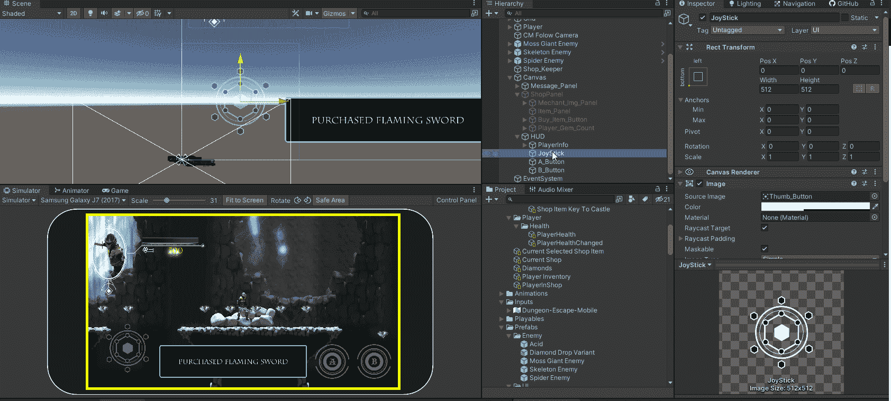

# 新输入系统第 3 部分

> 原文：<https://blog.devgenius.io/new-input-system-part-3-441a4246758c?source=collection_archive---------0----------------------->

## 使用屏幕控制

 [## 屏幕控制

### 您可以使用屏幕上的控件来模拟带有 UI 小部件的输入设备，用户可以在屏幕上与之交互…

docs.unity3d.com](http://docs.unity3d.com/Packages/com.unity.inputsystem@1.0/manual/OnScreen.html) 

# 建立

因为我正在开发的游戏是为移动设备设计的，所以我需要一个可以控制玩家的。最简单的方法是在屏幕控件上使用新的输入系统。我的 HUD 上有一个图像，代表游戏控制器上的左手拇指棒。我也有 2 个按钮来代表跳跃按钮和攻击按钮。

# 让玩家移动

为了让玩家移动，我将使用屏幕上的棍子。

 [## 屏幕控制

### 您可以使用屏幕上的控件来模拟带有 UI 小部件的输入设备，用户可以在屏幕上与之交互…

docs.unity3d.com](http://docs.unity3d.com/Packages/com.unity.inputsystem@1.0/manual/OnScreen.html#on-screen-sticks) 

我将屏幕上的操纵杆组件添加到操纵杆图像中。

我将移动范围设置为 10，这是操纵杆在屏幕上移动的距离。

然后，我将控制路径设置为游戏手柄上的左摇杆，这是我用来移动玩家的地方。

# 攻击和跳跃

为了让玩家攻击和跳跃，我将使用屏幕上的按钮。

 [## 屏幕控制

### 您可以使用屏幕上的控件来模拟带有 UI 小部件的输入设备，用户可以在屏幕上与之交互…

docs.unity3d.com](http://docs.unity3d.com/Packages/com.unity.inputsystem@1.0/manual/OnScreen.html#on-screen-buttons) 

对于攻击，我使用东按钮，对于跳跃，我使用西按钮。

我将屏幕按钮组件添加到我的两个按钮中。然后我将控制路径设置为 Button East 和 Button West。

