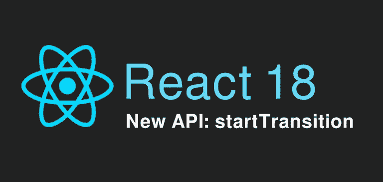
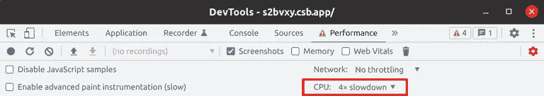
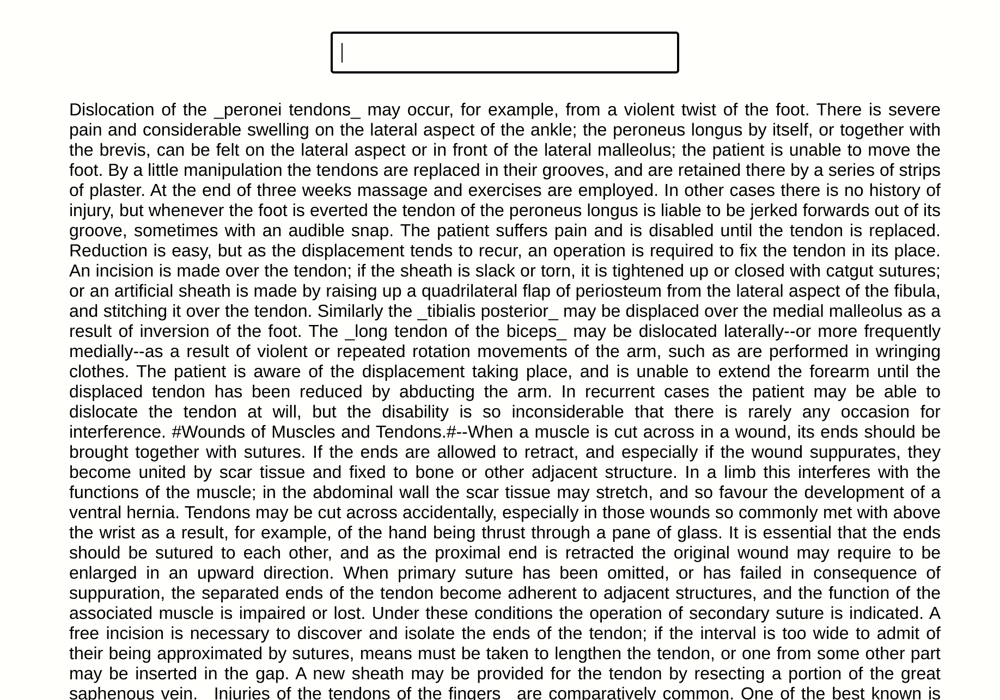
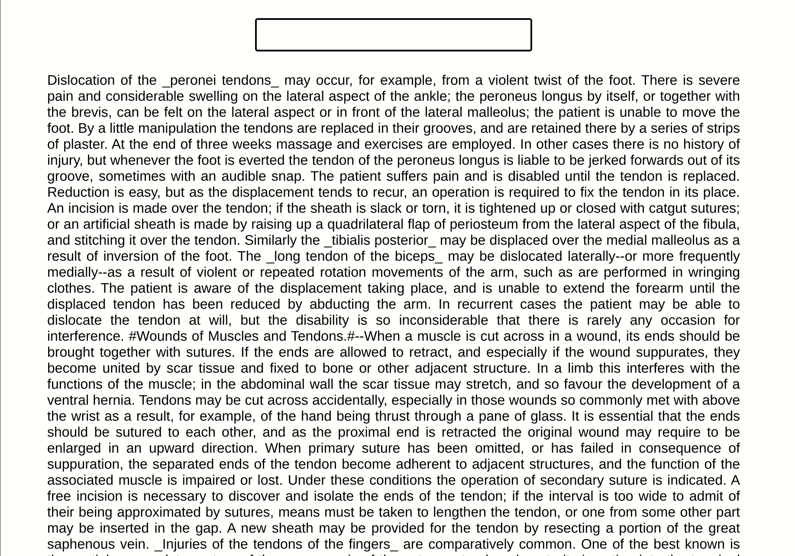
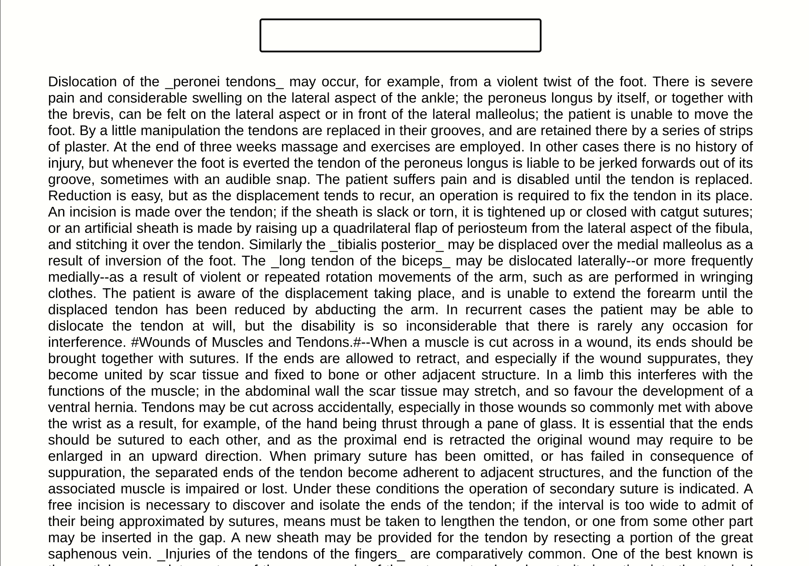

# React 中的新 startTransition API

> 原文：<https://blog.devgenius.io/new-starttransition-api-in-react-9d407c86eec1?source=collection_archive---------11----------------------->



# 什么是过渡？

转换是 React 中的一个新概念，用于区分紧急更新和非紧急更新。

*   **紧急更新**反映直接交互，比如打字、点击、按压等等。
*   **转换更新**将用户界面从一个视图转换到另一个视图。

像打字、点击、按键这样的紧急更新需要**即时**响应，以符合我们对物理对象行为的直觉。否则他们会觉得**【不对】**。然而，**转换**是不同的，因为用户不期望在屏幕上看到每个中间值。

例如，当您在搜索框中键入内容时，您希望输入字段本身做出响应，并在您按键时立即显示键入的字符**。然而，实际结果可能会分别过渡到**和**，通常会有小的延迟。如果您在结果渲染完成之前再次更改搜索词，您只需要查看最新的**结果。****

**在 React 18 中，我们可以使用`startTransition` API 将任何状态更新标记为非紧急。**

**在下面的代码块中，有两个状态更新——一个是紧急的，另一个被标记为非紧急的，因为它被包装在`startTransition`回调中:**

```
import {startTransition} from 'react';

// Urgent: Show what was typed
setInputValue(input);

// Mark any state updates inside as transitions (non-urgent)
startTransition(() => {
  // Transition: Show the results
  setResults(input);
});
```

**如果更紧急的更新，如点击或按键，非紧急更新将被**中断**。如果一个过渡被用户打断(例如，在一行中输入多个字符)，React 将丢弃没有完成的**陈旧的**渲染工作，只渲染**最新的**更新。**

# **演示应用程序:有无 startTransition 的性能**

**我们构建了一个简单的应用程序来展示新的`startTransition` API 的威力。**

**这个应用程序基本上是一个“文本搜索”特性，它为用户提供了在一个很长的文本块(在我们的例子中大约有 60000 个字符)中搜索一个术语的能力。**

**我们的应用程序需要提供两个特性:**

*   **呈现一个**输入**，允许用户键入一个**搜索**项。**
*   **对**突出显示**任何与输入的搜索词匹配(不区分大小写)的字符。**

**我们用来获得匹配项的简单算法是:**

1.  **从**搜索词**构建一个正则表达式，它将匹配任何字符(不区分大小写)。**
2.  **将`highlight`类添加到匹配字符的所有*跨度*中。**

**`applyFilter`功能的代码如下所示:**

```
const applyFilter = (query, setFilteredNode) => {
  setFilteredNode(() => {
    if (!query || query.trim().length === 0) {
      return INITIAL_VALUE;
    }

    const regex = new RegExp(
      query.trim().replace(/[-[\]{}()*+?.,\\^$|#\s]/g, "\\$&"),
      "ig"
    );

    const node = TEXT.replaceAll(regex, (s) => `##${s}##`)
      .split("##")
      .map((s, i) => (
        <span key={i} className={i % 2 === 1 ? "highlight" : ""}>
          {s}
        </span>
      ));

    return node;
  });
};
```

**显然，我们可以提出更优化的算法——这个正则表达式严重影响了性能——但是我们在这里的任务是“创建”一个导致大量 React 状态更新的高成本函数，以便我们可以看到`startTransition` API 是否会改善这种情况。**

****你可以在这里** **找到 app** [**的所有代码。**](https://codesandbox.io/s/react-18-starttransition-demo-s2bvxy?file=/src/App.js)**

# **第一次实施:未优化，没有开始过渡**

**我们的第一个实现是一个具有两个简单状态更新的组件，一个用于输入值，另一个将应用过滤后的结果。每当输入值改变时，函数`applyFilter`将被调用。默认情况下，两种状态更新都标记为紧急:**

```
import {useState} from 'react';

const Unoptimized = () => {
  const [query, setQuery] = useState("");
  const [filteredNode, setFilteredNode] = useState(INITIAL_VALUE);

  const onInputChange = (e) => setQuery(e.target.value);

  useEffect(() => {
    applyFilter(query, setFilteredNode);
  }, [query]);

  return (
    <>
      <div className="input">
        <input onChange={onInputChange} />
      </div>
      <div className="text">{filteredNode}</div>
    </>
  );
};
```

****未优化****

**您可以看到字符没有立即显示在输入字段中，用户界面感觉有点“慢”:**

****

****未优化，CPU 速度降低 4 倍****

**我们应用了 4 倍的 CPU 减速(来自 Chrome dev tools)来更好地模拟普通 CPU 或移动设备。我们可以看到，用户界面肯定感觉很慢，一点也不流畅:**

********

# **第二次实施:使用 startTransition 优化**

**在我们的第二个实现中，我们利用了`startTransition` API。具体来说，我们使用了返回一个`pending`状态的`useTransition`钩子——我们使用该状态通过模糊屏幕向用户表明一个转换仍在处理中(我们也可以显示一个加载程序)。**

**我们通过将结果的状态更新封装在一个`startTransition`回调中，将它标记为非紧急:**

```
import {useState, useTransition} from 'react';

const Optimized = () => {
  const [query, setQuery] = useState("");
  const [filteredNode, setFilteredNode] = useState(INITIAL_VALUE);
  const [pending, startTransition] = useTransition();

  const onInputChange = (e) => setQuery(e.target.value);

  useEffect(() => {
    startTransition(() => {
      applyFilter(query, setFilteredNode);
    });
  }, [query, startTransition]);

  return (
    <>
      {pending && <div className="fade" />}
      <div className="input">
        <input onChange={onInputChange} />
      </div>
      <div className="text">{filteredNode}</div>
    </>
  );
};
```

****优化后的****

**看看字符在输入屏幕上显示得多快；它感觉自然、光滑，是用户所期望的。当`pending`变量为真时，我们模糊屏幕，以向用户指示转换仍在进行中。**

****

****优化了 CPU 4x 减速****

**我们甚至应用了 4 倍的 CPU 减速来检查 UI 如何响应。看起来**不错**，甚至在**那种场景下**！**

****

# **React 18 之前的替代解决方案？**

**在 React 18 之前我们没有`startTransition` API，那么我们如何在早期 React 版本中修复它呢？**

**面对此类问题并避免大量重复状态更新的最常见解决方案是利用**去抖**或**节流**技术。**

**例如，我们可以利用这个棒极了的 [use-debounce](https://www.npmjs.com/package/use-debounce) 库，将结果的重状态更新封装在一个**de bounce 回调**中，如下所示:**

```
import {useState} from 'react';
import {useDebouncedCallback} from 'use-debounce';

const Debounced = () => {
  const [query, setQuery] = useState("");
  const [filteredNode, setFilteredNode] = useState(INITIAL_VALUE);

  const onInputChange = (e) => setQuery(e.target.value);

  const debounced = useDebouncedCallback(
    (query, setFilteredNode) => {
       applyFilter(value, setFilteredNode);
    },
    100 // debounce 100 ms
  );  

  useEffect(() => {
    debounced(query, setFilteredNode);
  }, [query, startTransition]);

  return (
    <>
      {pending && <div className="loader" />}
      <div className="input">
        <input onChange={onInputChange} />
      </div>
      <div className="text">{filteredNode}</div>
    </>
  );
};
```

**但是这种方法仍然有一些问题。**

**首先，`applyFilter`函数不能在用户完成输入后的 100 毫秒内被调用(或者你选择的任何时间)。另一方面，通过使用`startTransition` API，结果的繁重处理尽快开始**，而不必等待任意长的时间。****

****其次，即使我们使用节流而不是去抖来尝试解决第一个问题，处理结果的工作也是**不可中断的**。这意味着如果在结果还在处理的时候有新的紧急更新进来(比如按键), UI 不可避免地会**无响应**。而使用`startTransition` API，当紧急更新到来时，处理工作将被**中断**，以这种方式保持输入域的响应。****

# ****结束了****

****我希望你发现这篇文章内容丰富。****

****回头见。🙂****

*****原载于*[*https://tasoskakour.com*](https://tasoskakour.com/blog/react-18-new-api-start-transition)*。*****