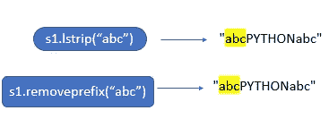
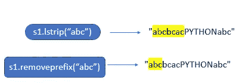
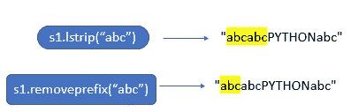
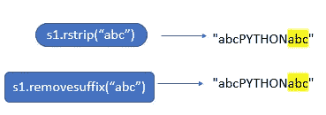
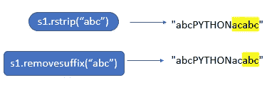
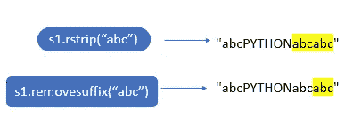
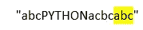
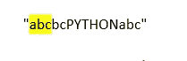
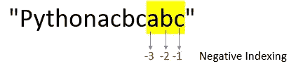

# Python 3.9 中移除前缀和后缀的新字符串方法

> 原文：<https://blog.devgenius.io/new-string-methods-to-remove-prefixes-and-suffixes-in-python-3-9-4d5b3a5b034f?source=collection_archive---------0----------------------->

## removeprefix() vs lstrip()，removesuffix vs rstrip()


来自 [Pexels](https://www.pexels.com/photo/photo-of-paper-on-top-of-wooden-surface-4668348/?utm_content=attributionCopyText&utm_medium=referral&utm_source=pexels) 的[弗拉达·卡尔波维奇](https://www.pexels.com/@vlada-karpovich?utm_content=attributionCopyText&utm_medium=referral&utm_source=pexels)的照片

# Python 3.9 中的新字符串方法

在 Python 3.9 中，引入了新的字符串方法`removeprefix()`和`removesuffix()`。

## 本故事涵盖的主题

[remove prefix()vs lstrip()](#db63)
[remove suffix()vs rst rip()](#93d2)
[Python 3.9 之前去除前缀和后缀的不同方式](#fd27)

# removeprefix()与 lstrip()

## removeprefix()

`str.removeprefix(prefix)`

*   如果字符串以*前缀*字符串开始，返回`string[len(prefix):]` 否则，返回原始字符串的副本。
*   `removeprefix()`的参数被认为是一个子串，而不是一组字符。

## lstrip()

`str.**lstrip**([*chars*])`

*   返回删除了前导字符的字符串的副本。 *chars* 参数是指定要删除的字符集的字符串。`chars` 参数不是前缀，而是其值的所有组合都被剥离- [Python 文档](https://docs.python.org/3/library/stdtypes.html#str.lstrip)

**示例 1:从字符串**中删除前缀“abc”



作者图片

```
s1=**"abcPYTHONabc"** print (s1.removeprefix(**"abc"**))
*#Output:PYTHONabc* print (s1.lstrip(**"abc"**))
*#Output:PYTHONabc*
```

**例 2:**`removeprefix()`的参数被认为是一个子串。但是`lstrip()`的参数被认为是一组字符。



```
s1="abcbcacPYTHONabc"
print (s1.removeprefix("abc"))
#Output:bcacPYTHONabc
print (s1.lstrip("abc"))
#Output:PYTHONabc
```

**例 3:** `**removeprefix**` **不会删除一个前缀的多个副本。但是 lstrip()会删除一个前缀的多个副本**



```
s1=**"abcabcPYTHONabc"** print (s1.lstrip(**"abc"**))
*#Output:PYTHONabc* print (s1.removeprefix(**"abc"**))
*#Output:abcPYTHONabc*
```

**例 4** :如果 lstrip()中没有提到该参数，它将删除前导空格。但是如果 removeprefix()中没有提到该参数，就会引发 TypeError

```
s1=**"   PYTHON"** print (s1.lstrip())
*#Output:PYTHON* print (s1.removeprefix())
*#Output:TypeError: str.removeprefix() takes exactly one argument (0 given)*
```

**例 5:如果提到的参数在字符串 means 的开头没有找到，两个方法都将返回字符串的副本**

```
s1=**"PYTHONabc"** print (s1.lstrip(**"abc"**))
*#Output:PYTHONabc* print (s1.removeprefix(**"abc"**))
*#Output:PYTHONabc*
```

# removesuffix() vs rstrip()

## removesuffix()

`str.**removesuffix**(*suffix*)`

*   如果字符串以*后缀*字符串结束，并且*后缀*不为空，则返回`string[:-len(suffix)]`。否则，返回原始字符串的副本:
*   removesuffix()的参数被视为子字符串，而不是一组字符。

## rstrip()

`str.**rstrip**([*chars*])`

返回删除了尾随字符的字符串的副本。`*chars*` 参数是指定要删除的字符集的字符串。如果省略或`None`，那么 *chars* 参数默认移除空白。 `*chars*`参数不是后缀；相反，它的值的所有组合都被剥离。- [Python 文档](https://docs.python.org/3/library/stdtypes.html#str.rstrip)

**例 1:从字符串**中去掉前缀 `**“abc”**`

****

**作者图片**

```
s1=**"abcPYTHONabc"** print(s1.rstrip(**"abc"**))
*#Output:abcPYTHON* print(s1.removesuffix(**"abc"**))
*#Output:abcPYTHON*
```

****例 2:**`removesuffix()`的参数被认为是一个子串。但是`rstrip()`的参数被认为是一组字符。**

****

**作者图片**

```
s1=**"abcPYTHONacabc"** print(s1.rstrip(**"abc"**))
*#Output:abcPYTHON* print(s1.removesuffix(**"abc"**))
*#Output:abcPYTHONac*
```

****例 3:** `**removesuffix**` **不会去掉后缀的多个副本。但是** `**rstrip()**` **会去掉多个副本的后缀。****

****

**作者图片**

```
s1=**"abcPYTHONabcabc"** print(s1.rstrip(**"abc"**))
*#Output:abcPYTHON* print(s1.removesuffix(**"abc"**))
*#Output:abcPYTHONabc*
```

****例 4** :如果 rstrip()中没有提到该参数，它将删除尾部空格。但是如果 removesuffix()中没有提到该参数，就会引发 TypeError**

```
s1=**"PYTHON   "** print(s1.rstrip())
*#Output:PYTHON* print(s1.removesuffix())
*#Output:TypeError: str.removesuffix() takes exactly one argument (0 given)*
```

****例 5:如果提到的参数在字符串 means 的末尾没有找到，两个方法都将返回字符串的副本****

```
s1=**"abcPYTHON"** print(s1.rstrip(**"abc"**))
*#Output:abcPYTHON* print(s1.removesuffix(**"abc"**))
*#Output:abcPYTHON*
```

# **Python 3.9 之前移除前缀和后缀的不同方法**

## ****1。使用 re sub()****

****去除后缀****

```
**import** re
pattern=**r"abc$"** s1=**"abcPYTHONacbcabc"** s2=re.sub(pattern,**""**,s)1
print (s2)
*#Output:abcPYTHONacbc*
```

**`pattern=r”abc$”` →检查字符串是否以`“abc”`
`$`结尾→表示字符串结束。**

****

**`s2=re.sub(pattern,””,s1)` →如果模式匹配，会用空字符串替换子串。**

****删除前缀****

```
**import** re
pattern=**r"^abc"** s1=**"abcbcPYTHONabc"** s2=re.sub(pattern,**""**,s1)
print (s2)
*#Output:bcPYTHONabc*
```

**`pattern=r”^abc”` →检查字符串是否以 `“abc”`开头**

**`^` →表示字符串的开始**

****

**`s2=re.sub(pattern,””,s1)` →如果模式匹配，就会用空字符串替换子串。**

****2。使用 str.startswith()****

```
s1=**"abcbcacPythonacbcabc"
if** (s1.startswith(**"abc"**)):
    print (s1.replace(**"abc"**,**""**,1))

*#Output:bcacPythonacbcabc*
```

**如果字符串以`“abc”`开头，意味着它将用`“”`(空字符串)
替换该子字符串，count =1 意味着提到的子字符串只有一次被空字符串替换。**

****3。使用 str.endswith()****

```
s2=**"Pythonacbcabc"
if** (s2.endswith(**"abc"**)):
    print (s2[:-3])

*#Output:Pythonacbc*
```

****

**作者图片**

**在 python 3.9 中，removesuffix()和 removeprefix()方法使得从字符串中移除后缀和前缀变得更加简单。**

# **结论**

1.  **lstrip 和 rstrip 的参数被解释为一组字符，而不是子字符串。但是 removeprefix 和 removesuffix 的参数被解释为子字符串，而不是一组字符。**
2.  **removeprefix，removesuffix →最多只删除前缀/后缀的一个副本。
    lstrip，rstrip →从字符串的开头/结尾重复删除字符。**
3.  **removeprefix()和 removesuffix()的参数是必需的。但是对于 lstrip()和 rstrip()，这不是强制的。**

# **资源**

**[PEP-616](https://www.python.org/dev/peps/pep-0616/)**

# **我的其他博客与字符串方法有关**

**[](https://medium.com/dev-genius/different-ways-to-replace-occurences-of-a-substring-in-python-strings-2911b1f7bf86) [## 在 Python 字符串中替换子字符串的不同方法

### 在 python 中使用字符串方法和正则表达式

medium.com](https://medium.com/dev-genius/different-ways-to-replace-occurences-of-a-substring-in-python-strings-2911b1f7bf86) [](https://betterprogramming.pub/split-vs-partition-in-python-strings-9505d070af55) [## Python 字符串中的 split()与 partition()

### 有什么区别？

better 编程. pub](https://betterprogramming.pub/split-vs-partition-in-python-strings-9505d070af55) [](https://levelup.gitconnected.com/remove-whitespaces-from-strings-in-python-c5ee612ee9dc) [## 在 Python 中移除字符串中的空格

### 在 Python 中使用字符串方法和正则表达式

levelup.gitconnected.com](https://levelup.gitconnected.com/remove-whitespaces-from-strings-in-python-c5ee612ee9dc) [](https://betterprogramming.pub/5-ways-to-find-the-index-of-a-substring-in-python-13d5293fc76d) [## 在 Python 中查找子串索引的 5 种方法

### 在 Python 中使用字符串方法和正则表达式

better 编程. pub](https://betterprogramming.pub/5-ways-to-find-the-index-of-a-substring-in-python-13d5293fc76d) 

感谢阅读，我希望你们都喜欢它。

*观看此空间，了解更多关于 Python 和数据科学的文章。如果你喜欢多看我的教程，就关注我的* [***中***](https://medium.com/@IndhumathyChelliah)[***LinkedIn***](https://www.linkedin.com/in/indhumathy-chelliah/)*[***推特***](https://twitter.com/IndhuChelliah) ***。******