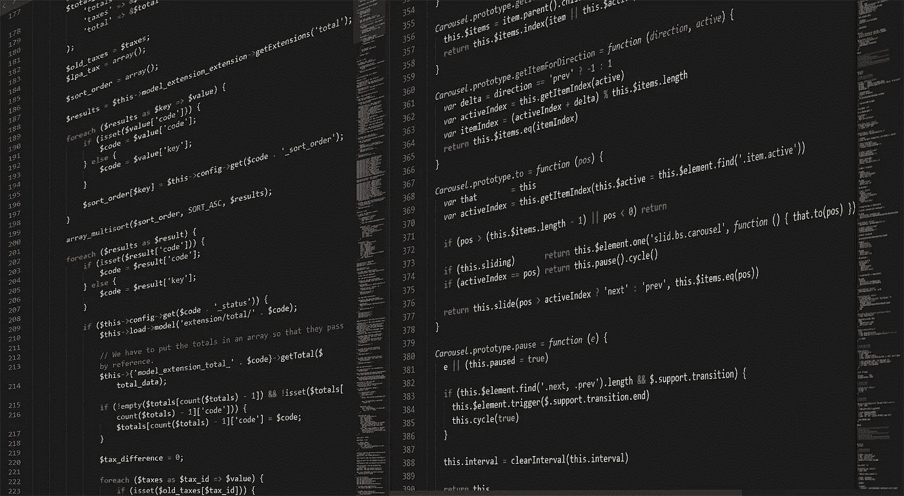

# 编程新手？这是你开始的地方；)

> 原文：<https://blog.devgenius.io/new-to-programming-this-is-where-you-start-78ee295b098e?source=collection_archive---------1----------------------->

进入编程是一项艰巨的任务。你应该超级聪明…而且年轻。而且，你将需要很多时间，因为这太难了。我相信数学也很有用……而且你需要一台高端电脑，当然是 Linux 的。3 台显示器，咖啡和一件连帽衫…还有从别人那里窃取信用卡信息的癖好…还有你公寓里没有灯。这是好莱坞告诉我的…对吗？简短的回答:没有。长的回答:没有。

正如我在[关于 Windows 11](https://kraft-pascal.medium.com/how-microsoft-cured-my-split-personality-disorder-c3f574722177) 的文章中提到的，计算机有一个有趣的属性:它们既是工具，也是制造新工具的工具。就像火和火柴合二为一。这就是为什么，在我看来，在世界上所有你可以学习如何使用的工具中，电脑是最有意义的；雇主们似乎也有同感。

然而，由于它对我们所有人生活的影响，围绕着实际话题的核心有相当多的教条。在许多地方，经典书呆子的形象已经从 80 年代的漫画书《龙与地下城》粉丝转变为在黑暗的房间里以咕鲁式的姿势坐在键盘上、面对太多屏幕的蒙面人。虽然不良姿势对健康的影响可能不是很有趣，但程序员能力的纯粹价值不断吸引越来越多的人进入 IT、编程和计算机科学这一迷人的领域——正常人每天仍在这一领域取得巨大进步。

虽然有许多指南(Google 是你的朋友)来开始你的编码之旅，但我在这个过程中学到了许多经验，因为许多其他人在帮助我节省大量时间的帖子上投入了时间，所以我今天想为你做同样的事情。当你开始你的旅程时，让我与你分享一些想法。

# 语言不重要。一点也不。

世界上有数百种语言，每种语言背后都有一个社区，很可能有人会告诉你，这种语言是最好的入门语言。我接触过 C++、C#、Java、JavaScript、TypeScript、HTML、PHP、Python、Matlab，甚至 OmicronBasic、C 和 Assembler，我学到的一件事是，学习一门新的编程语言就像骑自行车——不是因为你永远不会忘记如何去做，而且很快就能重新投入进去，而是因为我已经做了很多，通常不会花很长时间，到了某个时候，你就会停止思考它，直接去做。

所以你看这篇文章很可能是因为你想做的事情。一个网站？学 Javascript 或者 PHP。一个 App？学习 Flutter 或者 Java。想做一些快速数学或复杂逻辑？学 Python 或者 C++。我的观点是:不要谷歌“2022 年最佳编程语言”,尝试用你新喜欢的语言做任何事情。取而代之的是，谷歌“学习编程#YourTopicHere#”，然后跟着你找到的东西走。

# 负责任地谷歌

互联网是一个庞大群体的家园，他们和你一样面临着同样的问题，所以你的每一个问题都有一个答案。这同时既有价值又有风险。如果你遇到了问题，有些东西不工作:谷歌一下。在这一点上，我相当确信 Stackoverflow 可以回答所有的问题。但是为了你自己的进步和作为开发人员的成功，我建议你小心使用这个工具。

术语“脚本小子”描述的是这样一个人，他有一段别人写的代码，然后简单地应用它。这也适用于一群特定的骗子，他们从某个地方获得简单的脚本，然后认为自己是“黑客”，尽管他们自己永远也不可能产生这样的代码。在我看来，这是一个重要的指标。随便谷歌一下，复制你需要的任何东西——最后:为什么要重新发明轮子？你不需要重写排序算法之类的。但是如果你这样做了，并且代码的逻辑对你的产品很重要，那就努力去理解这些代码，这样下次你就可以自己写了。试着不要一遍又一遍地搜索同样的东西，而是在你需要的时候接受帮助。顺便说一下，这对于白板面试很有用。

# 好好享受吧！

对我来说，编程通常是一段美好的时光。这就像一次解决一个非常复杂的难题。这是令人兴奋和振奋的，我相当肯定所有程序员在晚上工作的画面都与一旦开始就很难停下来的事实有关。那是因为它很有趣。简单明了。

另一方面，也有不是这样的时候。调试是编程的重要部分，你会痛苦地意识到这一点。我们产生了很多错误，当我们认为我们发现了所有错误时，我们发现了更多的错误。这可能会变得非常令人沮丧和烦恼，尤其是如果你有最后期限的话。我发现，帮助我度过这些阶段的一件事，就是真的编程一些别的东西。编程的神奇之处在于，你家里的电脑，甚至是你的智能手机，都足够强大，可以解决你丢给它的几乎所有问题。很可能不到一眨眼的时间。

努力留意日常生活中遇到的事情，努力发现有趣的模式。举个例子:当 Covid 爆发，第一波袭击世界的时候，我编了一个网站，让你模拟传染病的传播。当我玩自我射击游戏时，我想知道为什么激进的玩家似乎比慢玩家更成功，尽管坐在角落里等待是有道理的，我建立了一个小工具，让随机的代理人互相比赛，看看运动如何影响成功的概率。写一个脚本，从你的健身追踪器获取数据，提醒你在股票达到一定价格时卖出股票，或者在你吹口哨的时候发出一点马达旋转的声音。这些事情可以在几个小时内完成，但当它们完成时你会很高兴，每当你看到书架上的那个设备或桌面上的那个脚本文件时，这种高兴就会产生共鸣。

# 使用 VSCode — go standard

对于大多数语言来说，都有一些特殊的工具，一旦你被迫使用其中一种语言，最好也使用这种工具。例如，Java 最好用 JetBrains 的 IntelliJ 或 Eclipse 开发，这取决于你问谁。然而，这两种工具都在某种程度上受限于 Java 生态系统。如果您是新手，我建议您使用通用编辑器和集成开发环境(IDE)，最好是 VSCode，因为它是最好的，作为新手，它将为您提供所需的一切。处于主流有一个很大的优势:如果你使用一个朋友告诉你的那个特别的编辑器，它很神奇，有 100 个用户，一旦你遇到问题，谷歌一下，你可能找不到任何有用的信息。只要您使用通用的语言和广泛使用的工具，其他人就会发现您的问题并解决它。我们中有很多人。)此外，将每种语言首选项设置为英语。会有很大帮助的，相信我。

# 不要相信广告

如今，每种语言、每个软件包、每个工具和新的宣传都有自己的网站。它将看起来超级现代，它将向你承诺，你现在可以在更短的时间内花更少的钱做所有你想做的事情，可靠，当然是可持续的，它看起来也很棒，通过在云原生过程中利用人工智能的力量，比竞争对手更好，同时，它将养活世界，让独角兽回来。

事实是，它可能是对其他一些旧工具的改进，这些旧工具也完成了工作，但您仍然需要做大量的工作，因为需要您做大量工作的工具通常会有一些开发人员没有考虑到的问题，现在很难强迫系统做以前简单的事情。

这就是为什么我试图采取一种立场，在一个简单的玩具问题中简单地尝试工具。当我进入持续集成并让 Jenkins 和 GitLab CI 为我的两个更大的项目建立时，我了解了 CircleCI。我写了一小段进行进化优化的代码(你可以在这里找到代码和[一篇关于它的文章](https://medium.com/swlh/evolutionary-algorithms-for-optimization-including-opensource-java-code-and-a-ci-example-80293172fbbd))并添加了一些测试，这样我就可以尝试整个设置过程实际上是如何进行的。我喜欢它，它很容易，但它没有带回任何独角兽。现在我知道在什么情况下我会考虑使用 CircleCI，什么时候不会。在大多数情况下，这些天你至少有一个免费试用期。用那个。看看使用它的实际感受，因为有时，一个非常简单的事情，比如 IDE 中缺少集成或者特定应用程序中的一些烦人的 bug，就可以使工具变得毫无用处。

# Windows 很好。Linux 也是。我想麦克也是。

我总是在 windows 上完成我的大部分工作，因为我也喜欢游戏，而游戏通常只在 Windows 上运行(没有酒，走开！).Linux 被誉为最好的操作系统家族，特别是因为 C++开发在那里是最容易的，并且因为 shell 是一个有用的工具。然而，现在，特别是有了 Windows 中的 WSL，你也可以在 Windows 上享受所有这些好处，因为很多人都有 MacBooks，而且 Mac 的底层系统与 Linux 密切相关，所以许多团体也为苹果设备提供大量的文档和支持。用你有的，它会做得很好。

然而，有一件事我想和你分享。对于一个程序员来说，我接触 Linux 世界很晚了。我一直只有一台电脑，因为我也想玩游戏，所以我的主要操作系统一直是 Windows。出于这个原因，当我第一次不得不学习如何在 Linux 上工作时，我才 20 岁。当时的一个朋友建议我学习 Gentoo，这是一个 Linux 版本，你可以自己从源代码编译整个操作系统。这个过程产生了快得惊人的操作系统，因为它们实际上是为你的设备制造的，而且只为你的设备制造。在一个这样的系统中，编辑图片的 Linux 程序 Gimp 启动如此之快，以至于我看不到旧笔记本电脑上的加载屏幕，而在我装有最新硬件的游戏 windows PC 上，同样的应用程序足足花了 10 秒钟才加载完毕。

然而，这样做需要很长时间，一旦你完成了，你面对的是一个需要几乎不间断工作的操作系统。但是在这样做的过程中，你几乎了解了操作系统的每个部分和所有的硬件，这让你对你和你的操作系统实际上在做什么有了惊人的了解。我发现这是了解 Linux 和其他操作系统如何工作的一个很好的方法，自从我这样做后，我在 Linux 环境中有了家的感觉。在正常情况下，我在那台旧笔记本电脑上用几天时间打造的舒适度和体验可能需要几年才能达到。因此，如果你周围有任何旧的硬件，无论如何都要扔掉，在上面安装 Gentoo 或 Arch-Linux。如果你遇到可怕的问题，你可以把旧东西扔掉。如果没有，你会学到很多，相信我，纯粹的表演会让你大吃一惊——真的很有趣。

# 从哪里开始

最后:何去何从？我推荐的是一本老派的书。我就是这样学习的，而且对我很有效。也有大量的视频课程，但很难推荐其中任何一个，因为视频编辑的细节或演讲者的声音会对课程是否对你有用产生巨大的影响。然而，重要的不是媒介，而是时间。带着一个目标，一个你想解决的任务，去追求它。解决那个问题。想出一个应用程序的想法，并了解构建该应用程序需要什么。你完成那个项目后，一切都会自然而然地到来。

例如，你可以在 android 上做一个小的任务应用程序，你可以添加，删除和更新任务，并以列表的形式显示它们。你可以开始学习 Java 并实现一个 Android 应用程序。一旦应用程序工作了，你会发现自然的下一步:也许你想让应用程序看起来更漂亮。也许你还想为 iOS 构建它，也许你想将任务存储在服务器上并允许应用程序的用户登录，也许你想使用人工智能自动为符合主题的任务卡找到背景图像，并在虚拟的 3D 世界中可视化任务——真的没有太多限制。所有这些问题都会引导你进入下一个自然的话题。重要的一点是要把一门语言学习到你可以独自承担简单项目的程度，并在新的课题出现时学习它们。

最后:如果这对你有用，给这篇文章点个赞，并在下面的评论中与你认识的人分享你的经历——编程是美妙而具有挑战性的，与朋友分享是一件很好的事情。