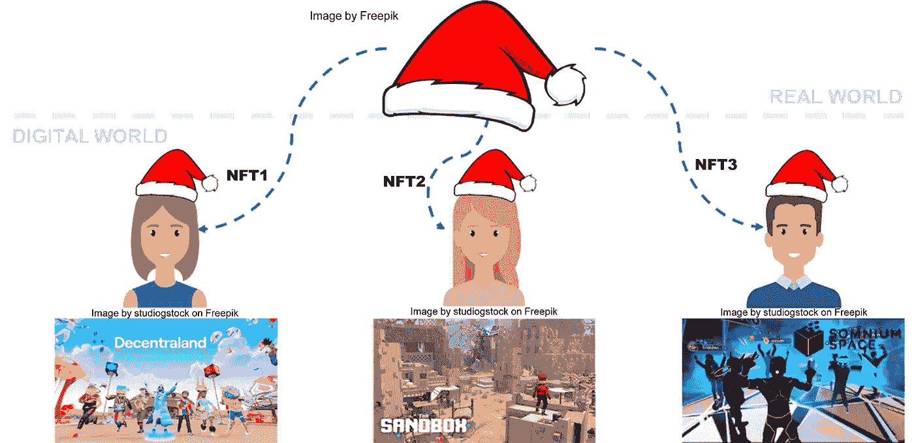
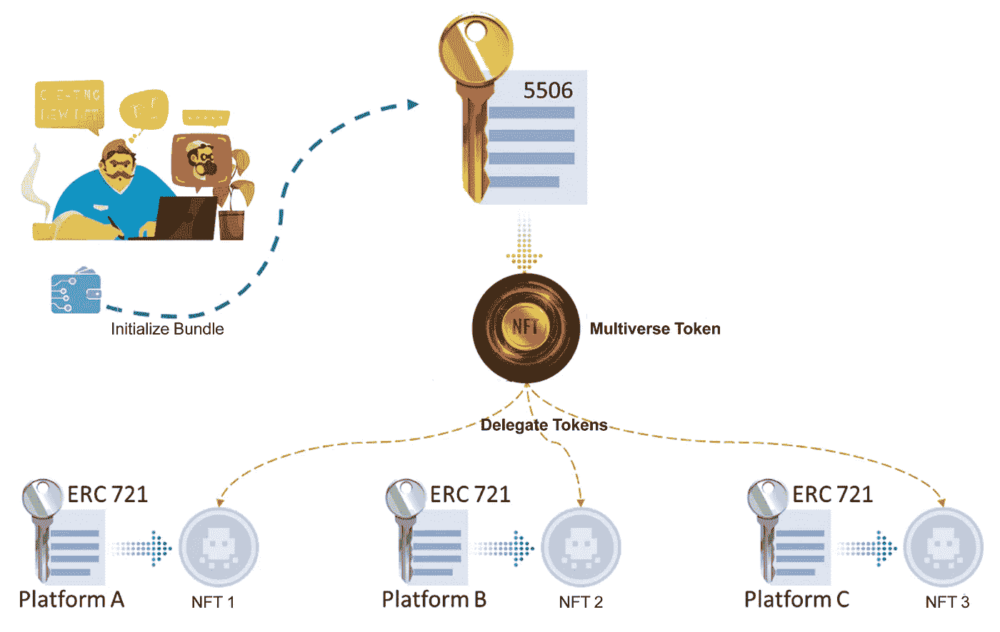

# 下一代可互操作的 NFTs——多元宇宙 NFT (EIP-5606)

> 原文：<https://blog.devgenius.io/next-gen-interoperable-nfts-multiverse-nft-eip-5606-a79c311d653f?source=collection_archive---------9----------------------->

NFTs 的互操作性特性和跨各种平台的全方位所有权的简单类比。

以太坊的改进提案中有一个新的提案，叫做 EIP-5606，它是不久前提出的，目前正处于审核阶段。尽管在其早期阶段，它引入了一个关于当前 NFT 在元宇宙和类似产品中的使用的解决方案。我将简要介绍它是什么以及它是如何工作的。

## 背景故事

NFT 无处不在，metaverses，games，dApps，它们让 web2 到 web3 的转换变得更容易，更有用。他们在很多方面提供了帮助，比如管理有价值的资产、游戏中的物品，甚至是实物资产。两个广泛使用的提议是 EIP-721 和 EIP-1155 令牌合同，以将 NFT 整合到其自身的宇宙空间中。

## 实施:

[https://eips . ether eum . org/assets/EIP-5606/contracts/multiversenft . sol](https://eips.ethereum.org/assets/eip-5606/contracts/MultiverseNFT.sol)

## 问题

不同平台上的相同数字资产

到目前为止，引入的标准没有任何问题，但是开发人员必须在各种平台上发布合同作为单独的令牌。

假设一家公司想要向市场推出一款新产品，它应该可以在多个平台上作为数字可穿戴设备使用，因此它需要在每个平台上被打造为一个单独的 NFT，尤其是如果它是相同的对象。

如上图所示，同一个 NFT 部署在 3 个平台上，但是它们之间没有关系，因此稀有性的概念成为一个需要处理的严重问题。我们可以将此视为 NFT 缺乏跨平台的互操作性。

## 解决方案(工作原理)

正在初始化包

EIP-5606 规范是解决非功能性传输系统互操作性方面的第一次尝试。它引入了多元宇宙 NFT 的概念，定义了一种新的令牌类型，在对应平台中的独特数字资产之间建立关系。

捆绑包的简单概念是由标准引入的。本质上，bundle 是由特殊 ID 号(多元宇宙令牌 ID)区分的委托 NFT 的集合。

*   NFT 创造者将不得不创建一个生活在多个平台上的所需 NFT 的捆绑包，并批准他们加入多元宇宙 NFT 合同。
*   此后，需要对包进行初始化，在这一点上没有回头路，所以什么都不能改变。
*   一个新的多元宇宙令牌将被铸造给“创造者”
*   区块链将存储多元宇宙 NFT 和其授权的 NFTs 之间的关系。

## 捆

多重宇宙 NFT 适用于捆绑操作。它赋予多元宇宙契约本身对委托令牌的所有权。当然，在执行捆绑功能之前，所有者必须将授权 NFT“授权”给多元宇宙 NFT 合同。

捆绑函数只能由多元宇宙 NFT 的所有者(或具有捆绑者角色的地址)调用。

链接到多元宇宙令牌的委托 NFT 则归契约所有(不一定是全部)。

捆绑的多元宇宙令牌现在可以集中处理所有委托的 NFT。主人可能会决定卖掉它。销售意味着转让的非功能性森林产品可以再次使用或销售。

## 分类定价

多元宇宙 NFT 的所有者可以在任何平台上单独销售或使用授权的 NFT，这要归功于分拆过程。实质上，在拆分之后，授权 NFT 的原始所有者从合同中重新获得了对它们的控制权。对解捆绑函数的调用必须仅来自所有者。

## 包扎

之前在《多元宇宙 NFT》中提到的捆绑/解绑方法能够在许多平台上处理相同的数字内容。然而，NFT 分裂仍然是一种可能性。

这是因为所有者能够有选择地捆绑或拆分授权的 NFT，将代表相同数字资产的 NFT 分开。

连接到 3 个委托 NFTs、Y 和 Z)的多元宇宙 NFT(已经捆绑)可能会发生以下事件:

*   车主刚刚解开了 NFT 1
*   然后，所有者单独出售给买方 A。
*   NFT 1 对多元宇宙合同的批准被买方 a 撤销

现在只有 NFT 2 和 NFT 3 可以在各自的平台上被所有者使用或出售。只有 NFT X 可以被买方 a 使用或出售。如果这三个 NFT 在逻辑上对应于相同的数字资产，则它们也可以被分类为独立的对象。

## 参考资料:

本文中使用的图片来自 freepik。

[Gaurang Torvekar](https://github.com/gaurangtorvekar) ， [Khemraj Adhawade](https://github.com/akhemraj) ， [Nikhil Asrani](https://github.com/nikhilasrani) ，《EIP-5606:多元宇宙 NFTs[草案]，《以太坊改进提案》，第 5606 期，2022 年 9 月。【网上连载】。可用:[https://eips.ethereum.org/EIPS/eip-5606](https://eips.ethereum.org/EIPS/eip-5606)。

感谢您的阅读，我希望您喜欢它，它为您提供了一些见解。