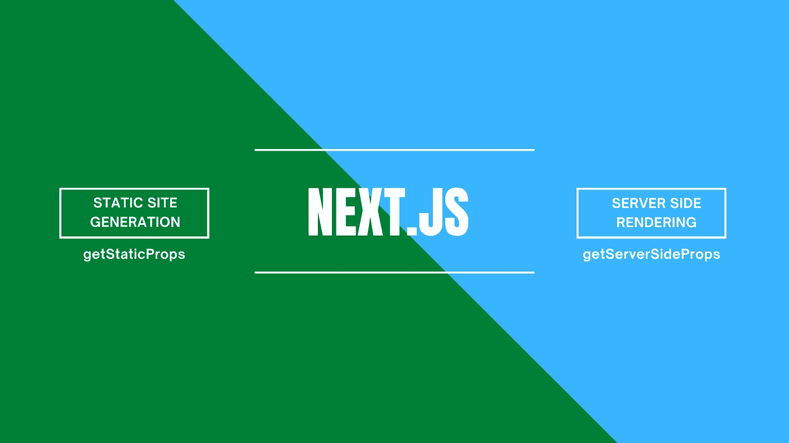

# 下一个。JS —实现静态站点生成和服务器端呈现

> 原文：<https://blog.devgenius.io/next-js-static-site-generation-and-server-side-rendering-explained-bc9cae0885c6?source=collection_archive---------3----------------------->

在这篇文章中，我们来看看 Next.js 框架提供的内置渲染技术——**SSG(静态站点生成)和 SSR(服务器端渲染)**。通过示例和代码片段，我们还可以看到如何实现这两种渲染方法以及在开发应用程序时选择哪种类型的渲染。

请阅读本文的第一部分，在那里我解释了 Next.js 框架的主要优点、内置特性、应用程序设置、文件夹结构和基于文件的路由。

 [## 下一个。JS—应用程序设置和基于文件的路由(第 1 部分)

### 当涉及到前端应用程序开发时，我们通常会更多地考虑优化以改进应用程序…

medium.com](https://medium.com/geekculture/next-js-application-setup-and-file-based-routing-cbb0b70d514c) 

# **next . js 上的预渲染**

默认情况下，Next.js 为每个页面提供预渲染。这意味着 Next.js 框架在服务器端而不是客户端生成标记。因为服务器已经呈现了标记，所以我们不想扔掉它并重新创建所有的 DOM 元素。相反，我们希望“水合”静态标记，使其具有交互性。

# Next.js 上的静态站点生成

使用静态生成，页面内容是在构建时生成的。这意味着页面内容只创建一次，然后在每次请求时重用。页面内容现在驻留在服务器上，框架不再需要生成页面。这是为什么呢？如果页面是静态的(意味着它的内容不会改变)，那么它可以被 CDN(内容交付网络)缓存并快速提供。每次请求时，浏览器都会更快地呈现页面。这非常适合内容不经常改变的页面。

现在，让我们看看如何在 Next.js 上实现*静态站点生成*！

## 使用“getStaticProps”方法

在 Next.js 中，可以静态地生成页面，可以提取数据也可以不提取数据。如果页面需要获取外部数据进行预渲染，Next.js 允许您从同一个文件中调用一个名为`getStaticProps`的`export`函数。这个函数在构建时被调用，让您在预渲染时将获取的数据传递给页面的`props`。

让我们看看例子。我需要使用一个 API 获取外部数据(货币列表)来显示全球的货币列表。

# Next.js 中的服务器端呈现

如果您希望在用户请求之前预先呈现页面，而您的页面显示频繁更新的数据，并且页面内容在每次请求时都会发生变化，该怎么办呢？在这种情况下，我们可以跳过预渲染(SSG ),直接进行服务器端渲染。SSR 有助于在服务器上呈现 JavaScript，而不是将负担放在用户代理(浏览器)上，使内容在被请求时快速且容易地被访问。

Next.js 还提供了一种服务器端渲染的方法。要使用 SSR，您需要在页面中导出`getServerSideProps`。

## 使用“getServerSideProps”方法

只有在需要预先呈现一个在请求时必须获取数据的页面时，才应该使用`getServerSideProps`。到达第一个字节的时间( [TTFB](https://web.dev/time-to-first-byte/) )会比`getStaticProps`慢，因为服务器必须计算每个请求的结果。

让我们看看例子。我需要获取 SpaceX 发射的所有航天飞机，并显示列表。

在上面的代码片段中，`getServerSideProps`在请求时被调用，它的参数`context`包含特定于请求的参数。

如果你的应用程序/产品依赖于 SEO 并且你的网站包含大量的**公共内容**，那么静态网站生成(SSG) 是很棒的**。它也是经典 CMS 的一个很好的替代，性能和开发者体验会很好。**

如果您正在构建一个类似于电子商务网站的应用程序，或者任何 B2C 应用程序，在这些应用程序中，性能和页面加载应该更快，并且大部分页面都有外部数据读取，我建议在您的应用程序中使用 SSR。由于内容是从服务器呈现的，所以 TTFB 在 SSR 中可能会慢一些，但是一旦应用程序被加载，性能就会变得平稳。

这就是 Next.js 中的 SSG 和 SSR 实现！查看 Next.js 中的 SSR 和 SSG 实现 [**工作代码**](https://github.com/vinayds21/NextJS-Application) ，以及部署在 vercel 上的 [**生产应用**](https://next-js-application.vercel.app/) 。

*更多内容尽在*[*blog . dev genius . io*](http://blog.devgenius.io)*。*