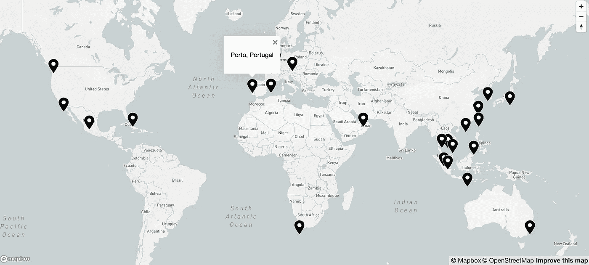
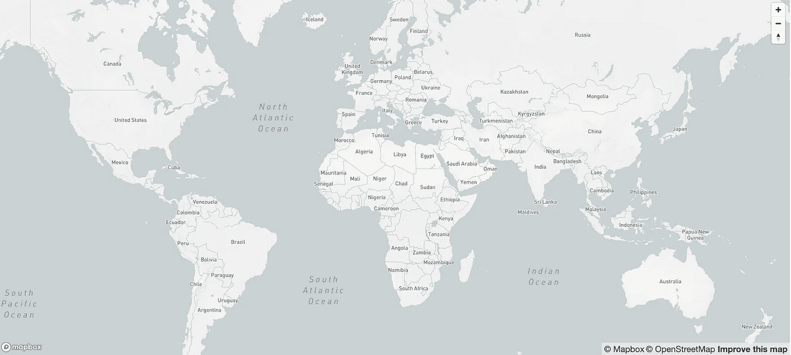
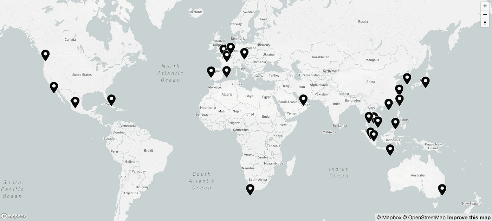
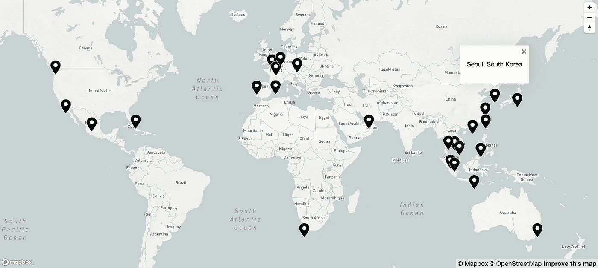
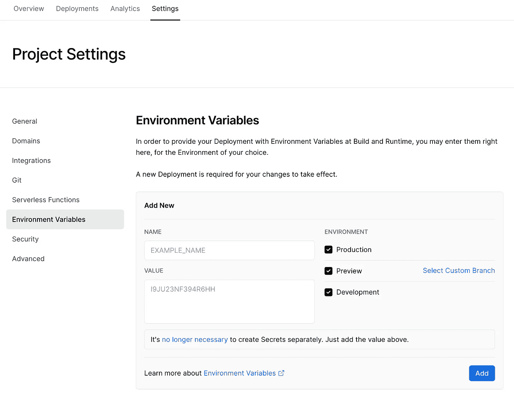

# Next.js 与 Mapbox GL JS 地图

> 原文：<https://blog.devgenius.io/next-js-with-mapbox-gl-js-map-707fed31beea?source=collection_archive---------1----------------------->



我一直是地图的超级粉丝，喜欢在网页上与地图互动。Mapbox GL JS 是我今天在演示中使用的库。首先，您需要获得一个地图框[访问令牌](https://docs.mapbox.com/help/getting-started/access-tokens/)。我目前在他们的[免费层，](https://www.mapbox.com/pricing/)，但是随着更多的 API 请求，如果需要实施支持，就会有分级定价计划。一旦你有了访问令牌，我们就可以开始编码了！

# 设置和安装

要在您的项目中使用 Mapbox GL JS，您需要[安装](https://docs.mapbox.com/mapbox-gl-js/guides/install/)NPM 包并将`mapboxgl`导入到您的`.jsx/.tsx`文件中。

```
npm install --save mapbox-glyarn add mapbox-gl--- JS file ---*import* mapboxgl *from* 'mapbox-gl';
```

或者你可以在你的文件的`<head>`中使用他们的 CDN 脚本。

```
<head>
  <script src='[https://api.mapbox.com/mapbox-gl-js/v2.8.2/mapbox-gl.js'](https://api.mapbox.com/mapbox-gl-js/v2.8.2/mapbox-gl.js') />
</head>
```

对于样式，如果你使用 CSS 加载器，你可以在你的 JS 文件中导入样式。

```
import 'mapbox-gl/dist/mapbox-gl.css';
```

或者在文件的`<head>`中使用一个`<link>`标签。

```
<head>
  <link href='[https://api.mapbox.com/mapbox-gl-js/v2.8.2/mapbox-gl.css'](https://api.mapbox.com/mapbox-gl-js/v2.8.2/mapbox-gl.css') rel='stylesheet' />
</head>
```

我的`import mapboxgl from 'mapbox-gl'`出现了一个打字错误。要修复这个错误，您需要安装`@types/mapbox-gl`。

```
npm install --save @types/mapbox-glyarn add @types/mapbox-gl
```

# 地图渲染

在这一点上，在你的代码编辑器中可能没有太多的文件，但是它应该看起来像这样。在这个演示中，我使用了 TypeScript，所以你会看到包含的类型。

```
*import* *type* { NextPage } *from* 'next';
*import* mapboxgl *from* 'mapbox-gl';
*import* 'mapbox-gl/dist/mapbox-gl.css';const *Map*: *NextPage* =()=>{
  return (
    <main>{/* *MAP* */}</main>
  );
};export default Map;
```

为了在页面上呈现地图，我们需要在元素上创建一个`ref`。这个`ref`将指定包含地图的 DOM 元素。

```
const *mapContainer* = *useRef*(*null*);
```

使用 TypeScript 时，当我试图通过`const mapContainer = useRef<string | HTMLElement>(null);`将类型添加到这个`ref`时，我收到了一个错误。这里有一些有用的[文档](https://stackoverflow.com/questions/66271302/reactjs-mapbox-gl-invalid-type-container-must-be-a-string-or-htmlelement)，我曾遇到过这些文档来进行故障诊断，但最终我将类型设置为`any`。

```
const mapContainer = useRef<any>(null);
```

现在，在您的`return`语句中，您需要将这个`ref`添加到您希望包含地图的 DOM 元素中。在你的样式中，你需要添加一个`height`和`width`到这个容器中，这样地图就会出现。

```
const *Map*: *NextPage* =()=>{
  return (
    <main>
      <div className="map-container" ref={mapContainer} />
    </main>
  );
};
```

下一部分将涉及到您的 Mapbox GL 访问令牌。为了不公开暴露我的令牌，我创建了一个`.env.local`文件来包含我的环境变量。您需要记住将您的 env 变量添加到您的产品构建的服务中。如果你使用 [Vercel](https://vercel.com/docs/concepts/projects/environment-variables) 作为你的平台，你将需要[在你的变量名](https://nextjs.org/docs/basic-features/environment-variables)前加上`NEXT_PUBLIC`以允许你的浏览器访问它。(参见 **Vercel 部署**部分，了解如何在 Vercel 平台中设置 env 变量)

```
NEXT_PUBLIC_MAPBOX_GL_ACCESS_TOKEN=...
```

同样在你的`next.config.js`文件中，你需要添加你的 env 变量。

```
module*.*exports = {
  env: {
    NEXT_PUBLIC_MAPBOX_GL_ACCESS_TOKEN: *process.env.*NEXT_PUBLIC_MAPBOX_GL_ACCESS_TOKEN,
  },
};
```

现在回到您的`Map`组件中，您将使用那个访问令牌。你会想用一个`useEffect`来渲染你的地图，并提供数据。另外，如果使用 TypeScript，当我设置 Mapbox 访问令牌时，我得到了一个类型错误，解决方案是这个`mapboxgl.accessToken = process.env.NEXT_PUBLIC_MAPBOX_GL_ACCESS_TOKEN ?? ''`。

```
useEffect(() => {
  const *mapContainer* = *useRef*<*any*>(*null*);
  const *map* = *useRef*<*mapboxgl.Map* | *any*>(*null*); *mapboxgl.accessToken* = *process.env.NEXT_PUBLIC_MAPBOX_GL_ACCESS_TOKEN ?? '';* *map.current* =new *mapboxgl.Map*({
    *container*: *mapContainer.current*,
    *style*:'mapbox://styles/mapbox/light-v10',
    *center*:[15.4542,18.7322],// *center map on Chad
    zoom*:1.8
}, []);
```

瞧，你应该有一张地图！我使用的是`light`风格主题，但是还有其他多种[风格](https://docs.mapbox.com/api/maps/styles/)可供选择。



地图框总帐地图

让我们在这张地图上获得更多的乐趣，并添加[自定义位置标记](https://docs.mapbox.com/help/tutorials/custom-markers-gl-js/)。我创建了一些名为`markers`的模拟数据，其中设置了位置的纬度和经度坐标。

```
*export* const *markers*: *Marker*[]=[
  {
    *city*:'Sydney',
    *country*:'Australia',
    *latCoord*:-33.8688,
    *longCoord*:151.2093,
  },
  {
    *city*:'Amsterdam',
    *country*:'Netherlands',
    *latCoord*:52.3676,
    *longCoord*:4.9041,
  },
  {
    *city*:'Seoul',
    *country*:'South Korea',
    *latCoord*:37.5665,
    *longCoord*:126.9780,
  },
]
```

您将使用`geojson`在地图上生成标记。

```
const *geojson* ={
  *type*:'Feature',
  *features*: *markers.map*((*marker*)=>({
    *geometry*:{
      *type*:'Point',
      *coordinates*:{
        *lat*: *marker.latCoord*,
        *lng*: *marker.longCoord* }
    }
  }))
};*map.current.on*('load',()=>{
  *geojson.features.forEach*((*marker*)=>{ // *create a DOM element for the marker* const *markerIcon* = *document.createElement*('div');
  *markerIcon.className* ='location-marker';
  *markerIcon.style.backgroundImage* ='url(/location-marker.png)';
  *markerIcon.style.width* = *marker.properties.iconSize*[0]+'px';
  *markerIcon.style.height* = *marker.properties.iconSize*[1]+'px';

  new *mapboxgl.Marker*(*markerIcon*)
    *.setLngLat*(*marker.geometry.coordinates*) *.addTo*(*map.current*);
  });
});
```



带有位置标记的地图

最后，让我们在这些位置标记上添加一个弹出窗口，显示标记所在的城市和国家。

```
const *geojson* ={
  *type*:'Feature',
  *features*: *markers.map*((*marker*)=>({
    *properties*:{
      *city*: *marker.city*,
      *country*: *marker.country*,
      *iconSize*:[30,42],
    },
    *geometry*:{
      *type*:'Point',
      *coordinates*:{
        *lat*: *marker.latCoord*,
        *lng*: *marker.longCoord* }
    }
  }))
};*map.current.on*('load',()=>{
  *geojson.features.forEach*((*marker*)=>{ // *create a DOM element for the marker* const *markerIcon* = *document.createElement*('div');
  *markerIcon.className* ='location-marker';
  *markerIcon.style.backgroundImage* ='url(/location-marker.png)';
  *markerIcon.style.width* = *marker.properties.iconSize*[0]+'px';
  *markerIcon.style.height* = *marker.properties.iconSize*[1]+'px';

  new *mapboxgl.Marker*(*markerIcon*)
    *.setLngLat*(*marker.geometry.coordinates*)// *add marker to map
    .setPopup*(// *add pop out to map* new *mapboxgl.Popup*({ *offset*:25})*.setHTML*(
        `*<p>*${*marker.properties.city*}*,* ${*marker.properties.country*}*</p>*`
      )
    )
    *.addTo*(*map.current*);
  });
});
```



带有弹出标记的地图

# Vercel 部署

部署到 Vercel 非常简单，我很快就有了一个[现场演示](https://joy-of-travel.vercel.app/)！要部署到 Vercel，您可以[在 Vercel 的平台上连接您的 Git 存储库](https://vercel.com/docs/concepts/git)或者使用 Vercel CLI。如果您使用 Git，它会在每次分支推送时自动部署。但是，只有在您的`main`分支上执行拉/合并时，它才会进行生产部署。

我选择使用 V [ercel CLI](https://vercel.com/docs/concepts/deployments/overview#vercel-cli) ，这样我可以对我的部署有更多的控制。在您的终端中，使用命令`vercel`进行预览部署，使用命令`vercel --prod`进行生产部署。就这么简单！

别忘了，您需要在**设置**选项卡中添加您的 Mapbox GL 访问令牌作为[环境变量。一旦你进入**设置**选项卡，点击**环境变量**并添加你的键值对。然后你需要](https://vercel.com/docs/concepts/projects/environment-variables)[将](https://vercel.com/docs/concepts/deployments/redeploying)重新部署到生产中。



Vercel 项目设置

去制作你自己的地图吧！我创建了一个地图项目来记录我所有的[旅行冒险者](https://joy-of-travel.vercel.app/)！🌎