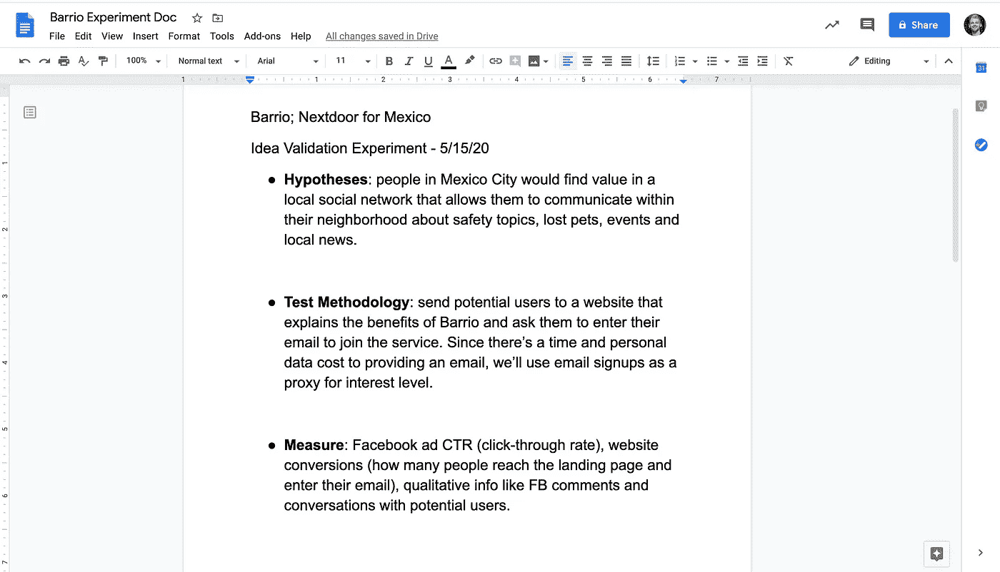
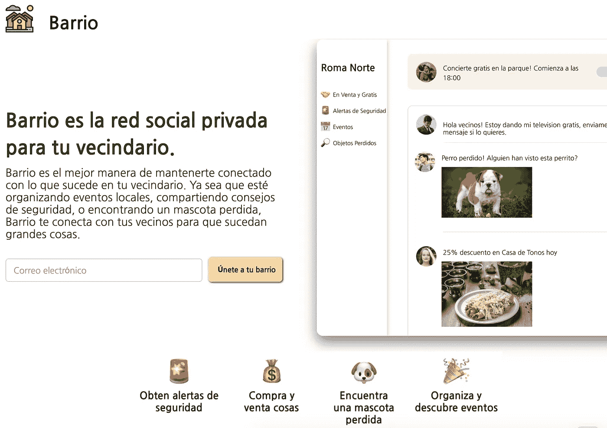
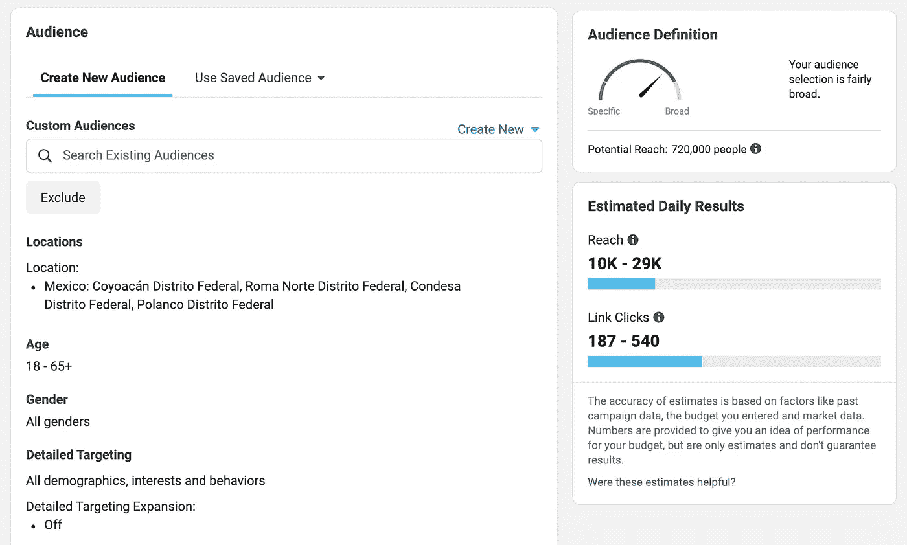
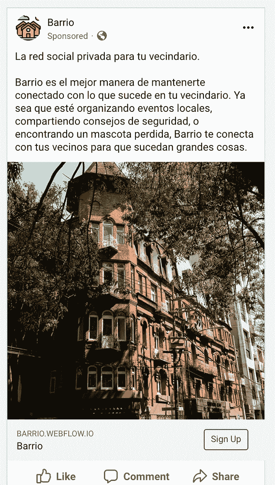
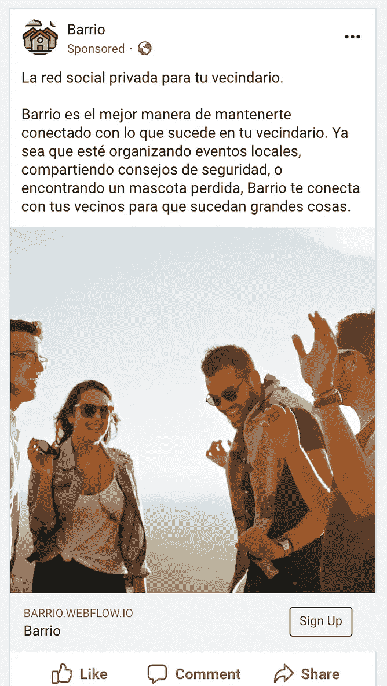
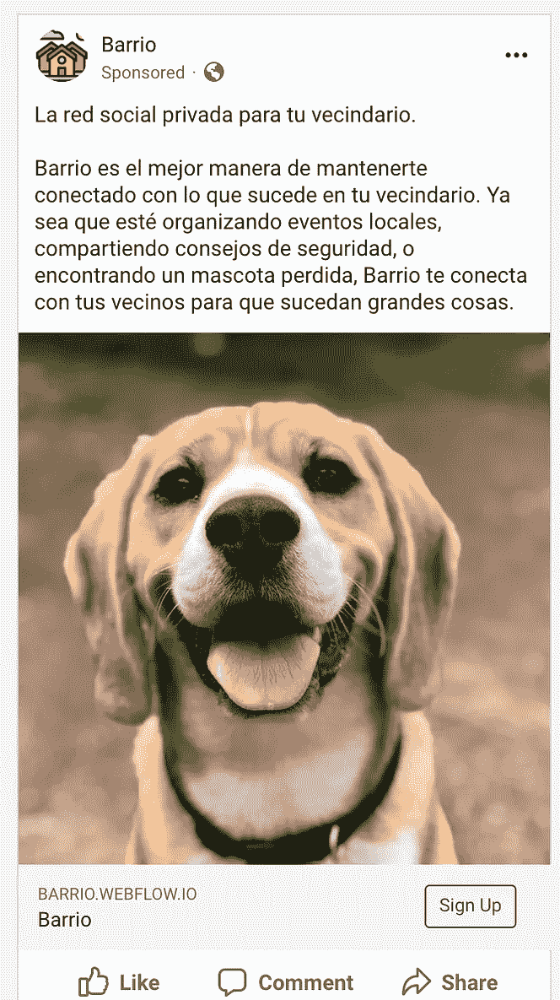
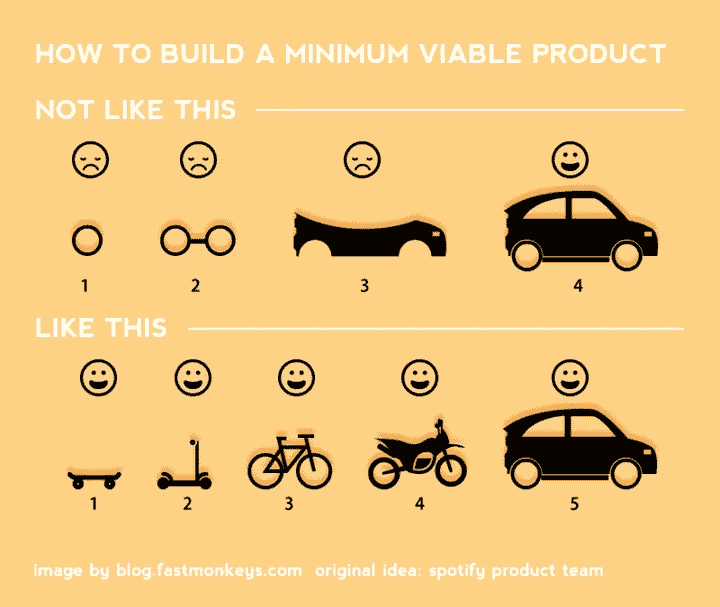

# 墨西哥城的 Nextdoor:在不到一周的时间内验证一个创业想法，花费不到 100 美元，无需编写一行代码

> 原文：<https://blog.devgenius.io/nextdoor-for-mexico-city-validating-a-startup-idea-in-less-than-a-week-for-100-without-code-70d9f00448bc?source=collection_archive---------19----------------------->

在 [Unsplash](https://unsplash.com?utm_source=medium&utm_medium=referral) 上由 [Max Duzij](https://unsplash.com/@max_duz?utm_source=medium&utm_medium=referral) 拍照

我们在 webuildyourapps.com[经常看到的是有伟大想法的创始人，但很少得到证实。这导致的常见路径是(1)花费大量的金钱和时间来构建一个应用程序(2)发布(3)发现没有人首先想要这个产品。我们无法预测未来，但是我们可以(在构思阶段)做一些事情来看看是否可行。](http://webuildyourapps.com)

**我将使用一个真实的例子(墨西哥城的 Nextdoor)，并运行一个短期(< 7 天)廉价(< $100)，无代码的实验，看看这个想法是否有潜力，并获得真正的客户反馈。**

# 这个想法

在旧金山和墨西哥城之间划分时间之前，我注意到可用产品的有趣差异。Nextdoor 就是一个例子。在美国，我的家人都是 Nextdoor 的狂热用户——他们用它来买卖东西，寻找丢失的动物，讨论安全问题。在墨西哥城，我没有看到任何类似的东西，出于某种原因，Nextdoor 在拉美没有扩大多少业务。

因此，基本的想法是创建一个产品，用户将能够在社区板上添加消息，与邻居聊天，购买/销售东西，并在墨西哥城组织活动。为什么是墨西哥城？

*   很多人都有手机
*   人口密集
*   一个街区发生的足够多的事情可以成为有趣的内容
*   根据与当地朋友的交谈，人们正在通过“邻里团体”在线下解决这个问题，并且大多数离线做的事情可以在网上变得更有效率

我们称之为 **BARRIO** 。

# #1:定义实验(1/2 天，$0)

我从定义我的假设开始，并确定我需要证明什么才能使它成立。我将使用一个可共享的谷歌文档，这样整个团队都可以理解我的想法:

# #2:建立一个登陆页面(2 天，12 美元)

现在我需要建立一个简单的网站，展示产品。为此，我使用 [Webflow](http://webflow.com) ，但是任何网站构建器都可以使用( [Squarespace](http://squarespace.com) 很好)。

在 Webflow 上不使用代码构建简单的登录页面— [barrio.webflow.io](https://barrio.webflow.io/)

就目前而言，我真的只需要一个标志，一个粗略的产品模型，一个明确的服务价值主张，以及一个收集电子邮件的地方。

显然，如果人们用电子邮件注册，就没有真正的产品可以带他们去，所以我会在他们提交后添加一条消息，让他们知道一旦产品上线，我们就会联系他们。

# #3:通过脸书广告获得登陆页面的流量(3 天，40 美元)

随着登陆页面的建立，现在我需要一些流量。我会用脸书的广告瞄准墨西哥城的某些街区。

驱动这种流量的其他方式可能是:

*   在现有的在线社区(Reddit、脸书群组、博客)发帖
*   谷歌搜索广告
*   口碑/现有网络
*   物理传单
*   电子邮件营销

我用不同的图形做了几个不同的广告。

# #4:衡量结果

让广告运行几天后，结果如下:

*   脸书广告点击率:(1，093 次点击/ 54，720 次展示)* 100 = **2%点击率**
*   登陆页面转换:(55 封邮件/1093 次访问)* 100 =**5%**登陆页面转换

作为参考，平均 FB 广告点击率和登陆页面转化率分别在 1.04% ( [来源](https://www.wordstream.com/blog/ws/2017/02/28/facebook-advertising-benchmarks#:~:text=The%20average%20click%2Dthrough%20rate,across%20all%20industries%20is%200.90%25.))和 2.35% ( [来源](https://www.wordstream.com/blog/ws/2014/03/17/what-is-a-good-conversion-rate#:~:text=But%20what%20is%20a%20good%20conversion%20rate%3F,rates%20of%2011.45%25%20or%20higher.))左右。

# #5:做出基于数据的决策

从这里我们有三条路可走:

1.  **打造！** —实验非常成功，我们觉得假设得到了证实，我们有信心投入时间和金钱来构建产品的第一个版本。
2.  **深入挖掘** —我们的实验显示了一些希望，但我们认为我们的假设没有得到完全证明(可能我们没有达到登录页面的转化率%或者我们的反馈点击率不是很高)。从这里我们应该深入挖掘。我们能联系那些给我们发邮件进行面试的人吗？我们可以用不同的观众做同样的实验吗？我们应该改变网站上的价值主张吗？
3.  **Pivot** —我们的实验失败了，我们甚至没有接近我们想要的转化率，我们对前进和构建产品没有信心。**这有一个巨大的光明面:通过及早发现我们的想法与客户没有共鸣，我们节省了数千美元和数月的时间。从这里开始，我们可以放弃这个想法，把我们的资源用在其他事情上，或者我们可以对现有的想法进行修改，然后重试另一个实验。**

# 后续步骤

根据调查结果，我强烈感觉到墨西哥城需要一种类似 Nextdoor 的服务。数据超过或符合行业平均水平，我从评论和对话中获得的定性反馈是有希望的。

我想建立一个简单的留言板，看看人们是否真的会用它来张贴本地内容。如果进展顺利，我可以继续以迭代的方式构建特性。在这种情况下，这一点尤其重要，因为在美国奏效的方法可能与在墨西哥奏效的方法截然不同。在迭代中工作(而不是在第一个版本中构建所有的东西)帮助我识别那些需求，并构建适合市场的东西。

滑板=简单的本地留言板

希望这是一篇对验证仍处于创意阶段的初创公司有帮助的文章。

如果你想了解更多，请联系——jeff@maplyapp.com·✌️