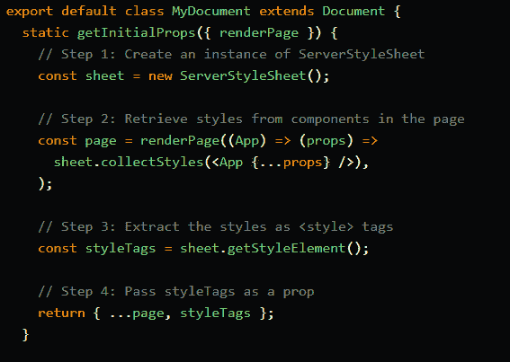

# NextJS —第一印象

> 原文：<https://blog.devgenius.io/nextjs-first-impressions-26aa16658e58?source=collection_archive---------1----------------------->

上个月，我使用 NextJS 完成了第一个 web 应用程序。以下几点是我的初步想法和印象。我没有花足够的时间来建立一个强有力的观点，所以请半信半疑地接受它。

## **非常固执己见**

NextJS 不是 NodeJS 的另一个 express 框架。相反，它提供了一种关于如何构建 web 应用程序的非常固执己见的方法。他们似乎有严格的规则，不像其他通用框架如 Express 或 ASP.NET 那样含糊不清。

从我的经验来看，当我看到如此严格的规则时，我期望不寻常的神奇的东西结合一点令人惊讶的限制(我正在看你 ASP.NET 动态数据网站)。

在这种情况下，它也是真实的，我们将在后面看到。

## **做很多事情**

有趣的是，NextJS 的战斗比我最初想象的要多。它提供站点的静态生成(通常用于博客和其他静态内容)以及服务器端呈现(SSR)。甚至混合方法也是完全可能的。

我不知道这是好是坏。SSR 和静态生成对于这样不同的用例似乎很有用。在文档的某些地方，您很容易迷失自己，无法识别哪些部分与 SSR 相关，哪些部分与静态生成相关。它们被混淆了，初学者可能很难区分它们。

## **配置约定**

NextJS 提供了多个有价值的约定。例如，您的页面上有一个名为 *GetServerSideProps* 的方法，该方法的出现关闭了静态内容生成。小菜一碟，在怪异的配置文件中没有笨拙的声明。

路由也很管用。只需在文件夹页面中创建一个新组件，它就能完成这个任务。实际上，它让我想起了老 ASP.NET 的 Webforms。

## **定制**

即使我的项目很小，我也需要使用更高级的定制来支持样式化的组件和定制的 HTML 根文档。NextJS 提供了所有这些。然而，有时这意味着编写(也称为复制粘贴)一段有点奇怪的代码。

只需看看“打开”样式组件。

如果没有对框架的深入了解，很难理解这里发生了什么。

## **打字稿**

我非常喜欢 Typescript，所以我很高兴看到对 Typescript 的支持真的达到了那个水平。打字也很好，很精确。老实说，在 Javascript 世界里，这不是我想当然的。

## **动态文件限制**

最让我震惊的是，你不能提供动态创建的文件。该限制在[文件](https://nextjs.org/docs/basic-features/static-file-serving)中有明确说明:

这真的出乎意料和限制。

我猜这是因为 NextJS 是云优先的公民。我认为这是一个新的*范例*——像 ASP.NET 或 Express 这样的通用框架与集中框架的对比。专注的公司在他们所做的事情上很出色，但是也严重依赖其他服务。

## **维尔塞尔主持**

我在之前的一篇文章中提到过，但我也想在这里提一下。NextJS 可能已经过优化，可以在 Vercel 主机上运行。你可以在别的东西上运行它，但是它需要你做更多的工作。

考虑到价格比预期的要高一点，我很难相信这是一个合适的货币化模式。20 美元一个月，一个开发商是不便宜的“定期”托管。但这只是我的感觉。

据我所知，他们使用 AWS 来托管网站。因此，Vercel 托管似乎“只是”云基础设施上的另一层。

## **工具的怪异行为**

偶尔热重装不起作用，build ( *命令下一个 build* )有时也不完成。也许这是由我的操作系统(经典的 windows 10)引起的，但正如你可能想象的那样，这可能真的令人困惑和沮丧。

## **开发者体验**

最后一点是开发者体验(DX)说实话，DX 似乎真的不如其他主流框架的 DX 好，我习惯于在这些框架中工作。

看看下面的[问题](https://github.com/vercel/next.js/issues/7915)就知道了，原来是 NextJS 这边的 bug，不过唯一的补救办法是变通办法。我知道这没什么大不了的，但是我第一次看到这个问题的时候就觉得有点不舒服。

## **重述**

我能够创建我的应用程序，但是我需要其他 Azure 服务的帮助来正确地完成它。所以就这样接受吧。NextJS 仍然是一个引人注目的优秀 React 框架，但是请记住，有些事情仅仅使用这个框架几乎是不可能完成的。