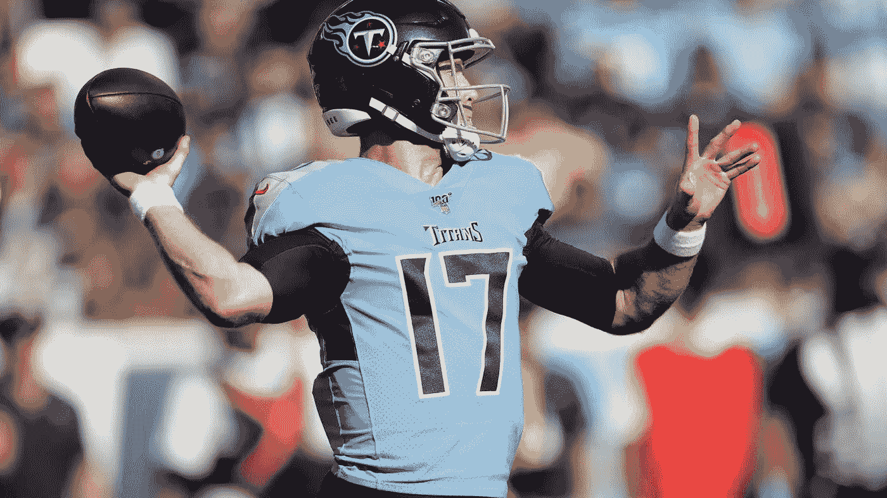
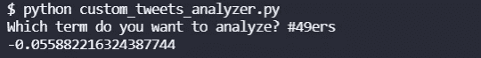
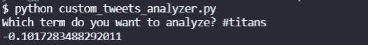

# NFL 推特 NLP:49 人在泰坦，第 16 周

> 原文：<https://blog.devgenius.io/nfl-twitter-nlp-49ers-at-titans-week-16-84862ce4569e?source=collection_archive---------3----------------------->

## 我们能用推特情绪预测比赛吗？

[来自 blogspot 的图片](https://hogueradelasnecedades.blogspot.com/2019/10/nfl-2019-semana-8-pronosticos.html?utm_source=feedburner&utm_medium=feed&utm_campaign=Feed:+HogueraDeLasNecedades+(La+Hoguera+de+las+Necedades))

这是我们第二次在中场休息时用 Twitter 情绪分析预测 NFL 比赛。到目前为止，我们的分析表明，Twitter 情绪是赛前情绪的 2 比 5。赛前推特人气较高的队伍输了。有一次我们在半场时预测了这场比赛，即[红雀队对雄狮队](/twitter-sentiment-for-nfl-games-week-15-washington-at-eagles-and-seahawks-at-rams-1a9c2a6ec290)，半场时的情绪是对的。

在本帖中，我们将回顾并比较 49 人队和巨人队的推特情绪。我们将使用这个关于[在命令行上搜索 Twitter 的教程](https://pythonalgos.com/2021/12/02/search-twitter-from-your-command-line-with-python/)来获取推文，使用[文本 API](https://www.thetextapi.com) 来获取情绪。

# 49 人的推特情绪

吉米·加罗波洛带领 49 人队。他们在过去的 6 场比赛中 5 胜 1 负。让我们看看推特在中场休息时对他们有什么评价。

Twitter 对此并不乐观。-0.0559.那是相当垃圾的。

# 推特上对巨头们的看法

泰坦队以 9 比 5 战胜了 49 人队的 8 比 6。不知何故，14td-14INT tanne hill 让他们创造了如此伟大的记录。无论如何，让我们看看中场休息时 Twitter 对此有什么说法。

泰坦队在 49 人队的排名更低。我的意思是这是有道理的，因为他们在半场落后 10 分。

# 摘要

看看收视率和最后一场比赛的半场情绪，我们会预测情绪较低的球队会在半场输掉比赛。好吧，这跟我们启发式预测博弈的方式一样。我们预测泰坦队会输，让我们看看会发生什么。