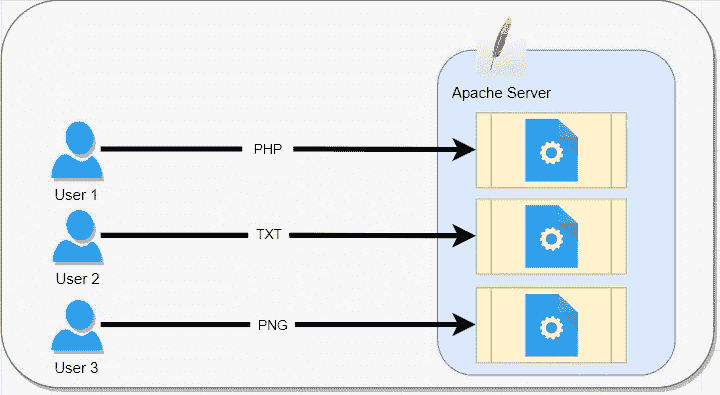
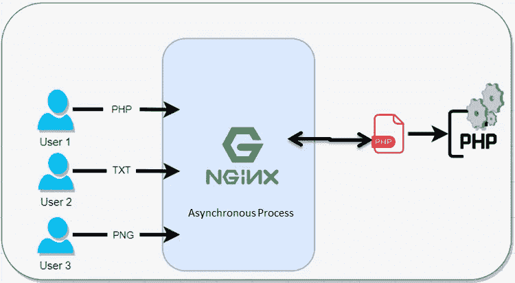

# NGINX——满足现代应用需求的 web 服务器

> 原文：<https://blog.devgenius.io/nginx-the-web-server-for-modern-application-needs-f6b7a8d45b2f?source=collection_archive---------12----------------------->

对于大多数基于企业服务器的解决方案来说，Apache 仍然是服务器管理员的首选，因为它具有灵活性、架构简单性、功能兼容性和多平台支持。它可以运行在几乎所有的操作系统上，如 Windows、UNIX、OSX、NetWare 等。但是它通常与 Linux 结合使用。

Apache 成为了 WWW(万维网)的支柱，它确实处于游戏的顶端，但是当 NGINX 进入业务时，服务器管理员的选择就改变了。

# **NGINX 是什么？**

**NGINX** 是一款开源软件，用于 web 服务、反向代理、缓存、负载平衡、媒体流等等。它最初是一个为获得最佳性能和稳定性而设计的 web 服务器。除了 HTTP 服务器功能，NGINX 还可以充当电子邮件(IMAP、POP3 和 SMTP)的代理服务器，以及 HTTP、TCP 和 UDP 服务器的反向代理和负载平衡器。

# **有何不同？**

要解释区别需要比较一下，让我试着用简单的比较来解释。

例如，对于 Apache 服务器，默认情况下它被配置为 Prefork 模式。[ [更多详情](https://httpd.apache.org/docs/2.4/mod/prefork.html#:~:text=Summary,non%2Dthread%2Dsafe%20libraries.) ]

Apache 请求流程详细信息

这意味着它创建了一定数量的进程，每个进程**可以在时间**为一个请求服务。不管请求是 PHP 脚本还是图像。

另一方面，NGINX 异步处理请求。[ [更多详情](https://www.nginx.com/blog/inside-nginx-how-we-designed-for-performance-scale/)

NGINX 请求流程详细信息

这意味着一个【NGINX 进程可以同时服务多个请求**。这个数字基本上取决于 NGINX 进程可用的系统资源。**

**由于这种异步设计，与 Apache 不同，NGINX 不能将服务器端编程语言嵌入到它的进程中。所有对动态内容的请求都必须由一个完全独立的过程来处理，比如 FPM，然后通过 NGINX 将代理返回给客户端。**

**因为不需要像 Apache 那样直接处理嵌入式编程语言，使得 NGINX 消耗的资源少了很多。因此，用于服务器端语言处理的资源被分配给其他进程。**

**因此，对于现代应用程序，当我们必须使用基于微服务的架构时，NGINX 服务器非常适合托管消耗更少服务器资源、满足并发请求和更快的服务。**

**通过适当的 [**系统调优**](https://www.nginx.com/blog/tuning-nginx/) ，NGINX 可以扩展到每个工作进程处理数十万个并发 HTTP 连接，并且可以吸收流量峰值(新游戏的涌入)而不会错过任何一个节拍。**

# ****用例****

**尽管 NGINX 以最快的网络服务器而闻名，可扩展的底层架构已经被证明是服务内容之外的许多网络任务的理想选择。因为它可以处理大量的连接，NGINX 通常被用作反向代理和 [**负载平衡器**](https://www.nginx.com/blog/five-reasons-use-software-load-balancer/) 来管理传入的流量并将其分发到较慢的上游服务器——从传统的数据库服务器到微服务。**

**NGINX 也经常放在客户机和第二台 web 服务器之间，作为 SSL/TLS 终端或 web 加速器。**

*   **在本地应用程序的云迁移期间，该应用程序已经与多个接口应用程序进行了交互，因此提供新的连接细节以在云环境中着陆是一项挑战。这里我们可以使用 NGINX。在内部部署中，我们可以维护一个 NGINX 服务器，该服务器具有旧的连接详细信息，可以将收到的请求向上游发送到新迁移的应用程序云环境。**
*   **有时，我们的应用程序基本上以安全和不安全的方式与其他接口应用程序进行交互。使用 NGINX，我们可以添加证书或删除证书等。**
*   **保护上游应用服务器不会同时被过多的用户请求淹没( [**防御 DDoS 攻击**](https://www.nginx.com/blog/mitigating-ddos-attacks-with-nginx-and-nginx-plus/) )。限速功能。**

****来源:****

** [## 高级负载平衡器、Web 服务器和反向代理- NGINX

### 跳到 KubeCon NA 的内容？通过 F5 预订现场演示，充分利用您的体验…

www.nginx.com](https://www.nginx.com/)  [## 关于 Apache HTTP Server 项目-Apache HTTP Server 项目

### Apache HTTP Server 项目是一个协作软件开发项目，旨在创建一个健壮的…

httpd.apache.org](https://httpd.apache.org/ABOUT_APACHE.html)**