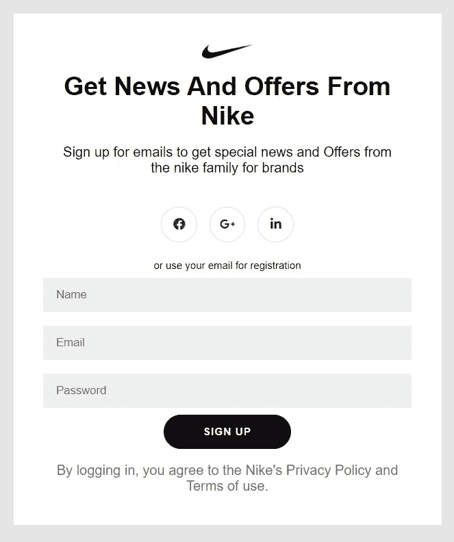
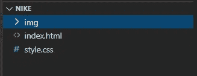

# 耐克注册表单使用 HTML 和 CSS。

> 原文：<https://blog.devgenius.io/nike-sign-up-form-using-html-and-css-2ad8b42f5edd?source=collection_archive---------3----------------------->

## 从头开始创建一个注册。


在 [Unsplash](https://unsplash.com?utm_source=medium&utm_medium=referral) 上拍摄的 [ThisisEngineering RAEng](https://unsplash.com/@thisisengineering?utm_source=medium&utm_medium=referral)

在耐克网站上，我看到了一个注册表格，我只是在这里克隆。为了有所触动，我们制作了一个如下的标志。



要了解 HTML，请访问下面的链接。

[](https://medium.com/dev-genius/get-started-with-html-13dc1a0472a4) [## 3 分钟学会基本 HTML！

### 每个人都应该知道的基本语言之一。它是 Web 开发的根本。

medium.com](https://medium.com/dev-genius/get-started-with-html-13dc1a0472a4) 

1.  创建一个名为 Nike 的文件夹，并在其中创建 index.html，style.css 和一个如下所示的图像文件夹。



2.在 index.html 写下面的代码。用！并回车获取 Visual Studio 中的 HTML 样板文件。HTML 样板文件只是用来编写 HTML init 的预制代码。

```
<!DOCTYPE html><html lang=”en”><head><meta charset=”UTF-8"><meta name=”viewport” content=”width=device-width, initial-scale=1.0"><title>HTML Boilerplate</title></head><body></body></html>
```

3.将下面的代码写在 index.html 的标签之间。在这里，我只是添加了链接到一个 style.css 和字体真棒获得图标。要从字体 awesome 获得谷歌或脸书的图标，你必须创建你的帐户，并从中获得链接。

```
<!DOCTYPE html><html lang=”en”><head><meta charset=”UTF-8"><meta name=”viewport” content=”width=device-width, initial-scale=1.0"><title>Sign Up</title><link rel=”stylesheet” href=”style.css”><script src=”https://kit.fontawesome.com/ce40c1dce7.js" crossorigin=”anonymous”></script></head>
```

4.现在在 body 标签中添加下面的代码，就这样。

```
<body><div class=”form-container sign-up-container”><form action=”#”><h1>Get News and Offers from Nike</h1><p>Sign up for emails to get special news and Offersfrom the nike family for brands</p><div class=”social-container”><a href=”#” class=”social”><i class=”fab fa-facebook”></i></a><a href=”#” class=”social”><i class=”fab fa-google-plus-g”></i></a><a href=”#” class=”social”><i class=”fab fa-linkedin-in”></i></a></div><span>or use your email for registration</span><input type=”text” placeholder=”Name”/><input type=”email” placeholder=”Email” /><input type=”password” placeholder=”Password” /><button>Sign Up</button><p class=”privacy”>By logging in, you agree to the Nike’s Privacy Policy and Terms of use.</p></form></div>
```

5.在 style.css 中编写以下代码。

```
body{font-family: ‘Montserrat’, sans-serif;background: #E5E5E5;display: flex;justify-content: center;align-items: center;flex-direction: column;}img{width: 60px;height: 48px;}h1{font-weight: bold;margin: 0;font-size: 30px;text-transform: capitalize;}span {font-size: 12px;}a {color: #333;font-size: 14px;text-decoration: none;margin: 15px 0;}.privacy{color: #737272;}.form-container form{background: #fff;display: flex;flex-direction: column;padding: 20px 50px;margin-top: 10px;width: 400px;height: auto;justify-content: center;align-items: center;text-align: center;}.social-container{margin: 20px 0;}.social-container a{border: 1px solid #ddd;border-radius: 50%;display: inline-flex;justify-content: center;align-items: center;margin: 0 5px;height: 40px;width: 40px;}.form-container input{background: #eee;border: none;padding: 12px 15px;margin: 8px 0;width: 100%;}button{border-radius: 20px;border: 1px solid #101010;background: #101010;color: #fff;font-size: 12px;font-weight: bold;padding: 12px 45px;letter-spacing: 1px;text-transform: uppercase;transition: transform 80ms ease-in;outline: none;cursor: pointer;}button:active{transform: scale(0.95);}button.ghost {background:transparent;border-color: #fff;;}
```

就这样，您已经创建了一个注册表单。这里我们使用了字体系列 Montserrat 和所有基本的 CSS，包括 flex、transform 和 ghost button

名为 img 的文件夹用于将 Nike 徽标放在注册表单的顶部。

声明:这个注册表单是从耐克克隆的，所以它只是得到一个关于创建注册表单的想法。