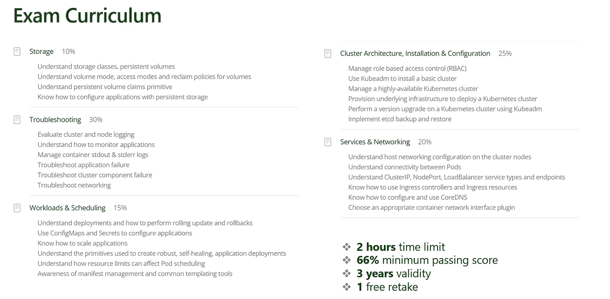

# 如何准备 CKA 认证

> 原文：<https://blog.devgenius.io/nilesh-gules-technical-blog-how-to-prepare-for-cka-certification-7f3ea30d6a0c?source=collection_archive---------2----------------------->

# 背景

前几天，我通过了**认证 Kubernetes 管理员(CKA)** 认证。这是我第二次试图通过考试。是我目前为止回答的最好的在线认证考试。这篇文章是关于我的考试经验以及如何准备考试。我也分享一些可能对考试本身有帮助的信息。

# 考试课程

考试完全是动手。没有选择题。我们得到了一组 6 个不同的 Kubernetes 集群。每个集群都有不同的配置，问题都与管理 Kubernetes 环境有关。评估了五个不同的广泛领域，如下所示。这些包括

*   存储 10%
*   故障排除 30%
*   工作负载和调度 15%
*   集群架构、安装和配置 25%
*   服务和网络 20%

该考试由 Linux 基金会与云计算原生计算基金会(CNCF)合作举办。你可以在 [Linux 基础培训网站](https://training.linuxfoundation.org/certification/certified-kubernetes-administrator-cka/)上了解更多关于考试的信息。

测试持续时间为 2 小时，最低及格分数为 66%。证书有效期为 3 年。如果你不能在第一次尝试中过关，你将获得一次免费的重考机会。

# 备考参考

我喜欢在准备任何认证时使用多种资源。对于 CKA，我也参考了多种信息来源。这里是我使用的不同参考的快速列表。

# Kubernetes 文档

我们被允许在考试期间参考 Kubernetes 的文件。这就像开卷考试。以下链接有助于 Kubernetes 入门和理解不同的概念。

*   kubernetes docs—【https://kubernetes.io/docs/home/ 
*   Kubernetes.io 任务—[https://kubernetes.io/docs/tasks/](https://kubernetes.io/docs/tasks/)
*   kubectl cheat sheet—[https://kubernetes.io/docs/reference/kubectl/cheatsheet/](https://kubernetes.io/docs/reference/kubectl/cheatsheet/)

# 学习课程

除了 Kubernetes 文档，我还通过注册电子学习课程来补充知识。网上有很多课程。几乎每个电子教学平台都会有一门或多门与 CKA 考试准备相关的课程。有些还提供模拟测试。我参加了 CKA 考试，还参加了 Linux 基金会的 Kubernetes 基础捆绑包。

通过 Mumshad Mannambeth 在 Udemy 上的实践测试认证的 Kubernetes administrator(CKA)也是最受欢迎的课程之一。

# Github Repos

以下是我发现有用的 Github 库列表

*   https://github.com/ShubhamTatvamasi/cka 的舒巴姆·塔特瓦马西·CKA—
*   Walid Shaari Kuberentes 认证管理员—[https://github . com/Walid Shaari/Kubernetes 认证管理员](https://github.com/walidshaari/Kubernetes-Certified-Administrator)
*   https://github.com/NileshGule/cka-prep 尼尔什·古乐·CKA 预科学校
*   Denny Zhang ku bectl cheat sheet—[https://github.com/dennyzhang/cheatsheet-kubernetes-A4](https://github.com/dennyzhang/cheatsheet-kubernetes-A4)
*   Ahmet Alp Balkan Kubernetes 网络政策方案—[https://github.com/ahmetb/kubernetes-network-policy-recipes](https://github.com/ahmetb/kubernetes-network-policy-recipes)

# 博客

这些博客文章为备考和考试提供了有用的技巧

*   快与 ku bectl—[https://faun . pub/be-fast-with-ku bectl-1-18-ckad-cka-31be 00 ACC 443](https://faun.pub/be-fast-with-kubectl-1-18-ckad-cka-31be00acc443)
*   如何搞定 Kubernetes 认证考试—[https://www . infoworld . com/article/3631108/how-to-nail-the-Kubernetes-certification-exams . html](https://www.infoworld.com/article/3631108/how-to-nail-the-kubernetes-certification-exams.html)
*   code fresh Kubernetes cheat sheet—[https://code fresh . io/Kubernetes-tutorial/Kubernetes-cheat-sheet/](https://codefresh.io/kubernetes-tutorial/kubernetes-cheat-sheet/)
*   CKA 实战挑战系列—[https://level up . git connected . com/kubernetes-cka-示例-问题-实战-挑战-86318d85b4d](https://levelup.gitconnected.com/kubernetes-cka-example-questions-practical-challenge-86318d85b4d)
*   鲁迪·马丁森 CKA 资源公司—[https://rudimartinsen.com/cka-resources/](https://rudimartinsen.com/cka-resources/)

# 技巧

# 当心打折

你会发现在黑色星期五，网络星期一，圣诞节，新年，排灯节，开斋节等打折。在学习课程和实际考试中利用这些折扣。

# 学习命令式命令

由于 2 小时的时间限制，您需要快速完成与完成考试相关的任务。虽然您可以从 Kubernetes 文档中复制并粘贴 yaml，但是编辑它可能需要一些时间。测试将有特定的需求，比如用特定的名称命名 Kubernetes 对象，并将它们部署到特定的名称空间。通常，Kubernetes 文档将在默认名称空间中部署对象。如果您知道如何使用命令式命令，将会节省您不少时间。这些命令的输出可以通过管道传输到 yaml 文件，然后您可以进行所需的修改，而不是从头开始手工制作完整的 yaml。

# 学习基本的 vi 或 nano 编辑器命令

测试环境是基于 Linux 的。如果你和我一样是从 Windows 后台过来的，你需要熟悉 vi 或者 nano 代码编辑器。熟悉编辑文件和命令，如删除代码行，导航到特定行，更新单词，保存文件等。

# 练习，练习，练习

无论谁通过了 CKA、CKAD 或 CKS 考试，都会告诉你练习是备考中最重要的部分。如果您不知道如何管理 Kubernetes 集群，就没有办法通过这个测试。完成同一项任务可能有多种方式。你需要找到一个最省时的。

# 书签特定链接

用书签标记 Kubernetes 文档中的链接有助于快速找到资源。我建议不要给顶级页面做书签，而是给特定的部分做书签，以避免在冗长的页面中滚动寻找信息。

# 实践考试

如果您在 2021 年 6 月之后预订 Kubernetes 相关认证考试，您将可以访问来自 [Killer.sh](https://killer.sh/cka) 的实践考试。这次考试给你两次机会来做同样的测试。该环境提供 36 个小时，并提供答案以及详细的步骤说明，以帮助您更好地准备真正的测试。

# 考试期间的小贴士

*   使用外部显示器(推荐)
*   启用 kubectl 自动完成
*   创建别名
*   更新 vimrc /编辑器配置文件
*   时间管理
*   使用复印功能代替打字
*   使用记事本功能快速记笔记
*   标记要审阅的问题
*   不要在一个问题上花太多时间
*   任务完成后验证解决方案

这篇文章中提到的所有话题在 Youtube 视频中都有更详细的解释。

# 结论

CKA 认证旨在评估 Kubernetes 管理员的技能。如果您不知道如何管理 Kubernetes 集群，那么这个认证不适合您。考前好好练习。共有 17 个不同权重的问题。希望这个帖子对以后备考的人有帮助。

直到下一次，激情编码，精益求精。

*原载于 2021 年 12 月 12 日*[*【https://www.handsonarchitect.com】*](https://www.handsonarchitect.com/2021/12/how-to-prepare-for-cka-certification.html)*。*