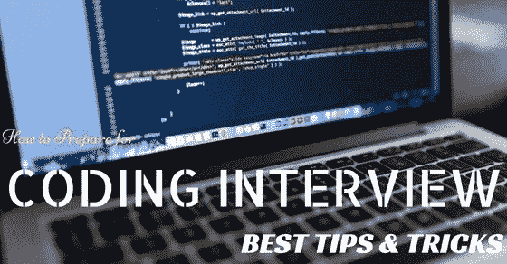

# 涅槃——安置传奇——编码面试

> 原文：<https://blog.devgenius.io/nirvana-the-placement-saga-7d4f5e4a8f27?source=collection_archive---------10----------------------->

充分证明准备手册

我很抱歉在开始我的安置准备工作时迟到了。我在 10 月份的第一周开始准备——风险很大，不建议这么做。然而，对我有利的是，在 2018 年夏天我在 [CDC 实习期间，我已经做了一些彻底的面试具体准备。在那之后，我提升了我在 ACM-ICPC 2018 的 CP 比赛，并且处于一个体面的水平——足以让我通过安置。我所需要的只是一些最后的润色和整理。](https://medium.com/@himanshumundhra98/internship-chronicles-the-cdc-chapter-948d1a1f5a51)

## 如何在出现差距后修改 CP — Algo 和 DS？

这是我不得不做很多次的事情，因为我已经从 CP 中抽出时间去探索其他的事情。自从我在 JEE 的日子以来，我意识到需要有一个有效的复习系统，这将使我达到上次离开时的敏锐和舒适。所以当我在 2018 年夏天第一次做准备时，我会在 InterviewBit、 [Narsimha Karumanchi 的书](https://www.amazon.in/Data-Structures-Algorithms-Made-Easy-ebook/dp/B01N4OA309)上标记某些问题，以及 Codeforces 上的一些问题。我觉得，这些都是触发器，会让我在再次坐下来讨论 CP 时，朝着我想要的方向思考。*我很想与你分享，但我强烈认为每个人都应该有自己的一套触发机制。*这些触发器通常可用于特殊问题，尤其是针对特定主题的问题，如滑动窗口、堆栈或 KMP。每个人都有自己的方法，但这是我坚持了多年的方法。另一件重要的事情是[维护你所有代码的代码库](https://github.com/shmundhra/Algorithmic-Programming)。这有助于你回顾你在解决老问题时所运用的技巧，并对你当时的思维过程有所了解。在竞赛中提高分数和解决问题的数量是可以的，但是另一个跟踪一个人进步的重要方法是当你面对同样的问题时，一个人的现场思维发展了多少。

我的 CP 程序很简单。我会每天坐下来讨论一个话题，解决我的触发性问题，浏览 InterviewBit(我已经在 2018 年夏天完成过一次)和 LeetCode，寻找一些中等水平的问题，然后用 Narsimha Karumanchi 结束。老实说，你不需要比这更多的东西了，我几乎没有接触过极客们为 CP 准备的 ForGeeks，因为它不必要的庞大，因此令人生畏。

从位置的角度练习编码时，要记住的一件事是您的代码样式。当面试官看到你的代码时，他们不仅检查你算法的正确性和效率，还检查你代码的质量、可读性、结构和清晰性。我在实习期间遵循了谷歌的 C++风格指南，这在这些方面帮助了我。我甚至和谷歌进行了一次植入前的谈话，他们讨论了他们对我们代码的期望——[看一下](https://github.com/shmundhra/Algorithms/blob/master/Interesting%20Reads/Google_InterviewTips.pdf)。

## 您牌组中的重要通配符。

每年，IITs 通常会为最后一年的学生设立[脸书小组](https://www.facebook.com/groups/1540488506008368/)，这成为分享信息的重要平台。大多数情况下，当公司的测试没有在所有校园完美同步时，有可能从其他已经进行过测试的 IIT 那里获得你未来的问题。在我那个时代，有一个谷歌文档，学生们会上传他们完成测试的截图。即使问题不尽相同，通过这些**模拟测试**也有助于理解特定公司提出的问题类型以及你相对于他们预期标准的立场。同样，有些情况下，考试可能只相隔几个小时——在这种情况下，有朋友在其他 IIT 是一个很大的帮助。

Leetcode 是另一个重要的网站，像 InterviewBit 一样，它有一个很大的特定主题问题的档案。有一个叫做[leet code discuse](https://leetcode.com/discuss/interview-question?currentPage=1&orderBy=hot&query=)的版块，在那里有时会讨论面试问题，尤其是在就业季节。如果你幸运的话，你也可能在那里挖到金子。

## 安置准备的非 CP 部分

这是对实习大纲的一个重要补充。在实习期间，一些公司要求面向对象的编程，这是一种趋势，将持续到实习。然而，在 Alphagrep、Quadeye、Cohesity 等公司的面试中，关于操作系统、计算机网络和计算机体系结构的理论问题是常见的。系统设计是公司盘问我们的另一个重要话题。

**面向对象编程—** 基本上包括绘制 UML 图和设计模式，以及软件生命周期和基本的继承和抽象概念。
这里要做的一件重要的事情是选择你将尝试哪种语言来回答任何与“哎呀”相关的问题。 **Java** 是一个流行的选择，但是在 **Cpp** 中了解 OOP 也是一个不错的选择。原因是面试官倾向于用你在**编码回合中使用的语言问你问题，我强烈建议你在 Cpp** 中使用这种语言(在 Python 中，Java 根本不在此列:P)。我选修了一门面向对象系统设计的课程**，**，这为我用 Java 解决问题做了充分的准备。*然而，我不知道 OOPs 概念在 Cpp 中实现方式的细微差别，这是我在 Alphagrep 的面试中意识到的。* 对于那些不够幸运没有这门课的人来说，设计模式的一些资源是[这个](https://www.youtube.com/playlist?list=PLF206E906175C7E07)和[这个](https://www.udemy.com/course/patterns-cplusplus/)。我自己没有严格检查过这些，但是它们的质量来自可靠的来源。

**系统设计—** 我个人没有准备系统设计，虽然[这个](https://www.youtube.com/playlist?list=PLMCXHnjXnTnvo6alSjVkgxV-VH6EPyvoX)资源是个不错的资源。正如我的前辈告诉我的那样，我所针对的公司(主要是谷歌)在他们的安置面试中没有问系统设计。更重要的是，我同时在为研究生入学做准备，并且正在进行 2-3 个项目，所以我不能在这上面花额外的时间。我想我以后会看这个，但是相信我，这个“以后”永远不会到来。

> 我严重高估了自己的能力，可能已经咬下了大得难以下咽的东西。我对 CP 的良好控制帮助我顺利通过，但有几次我陷入了严重的困境，把我所做的所有正交努力都搞砸了。我强调我的学生要做出明智的选择，并以 100%的信念全心全意地献身于一个单一的目标。是的，他们说‘你不应该把所有的鸡蛋放在一个篮子里’,但是你也不应该脚踏多条船，最终还是掉进河里。在我的大学生活中，我一直强烈支持这样一句话——做一个万事通，精通一门。

[破解编码面试](https://www.amazon.com/Cracking-Coding-Interview-Programming-Questions/dp/0984782850)和[编程面试曝光](https://www.amazon.com/Programming-Interviews-Exposed-Through-Interview/dp/111941847X)也是这些话题的绝佳资源。

**操作系统和计算机网络—** 一些公司想要测试你的核心概念，Alphagrep、Quadeye、Cohesity 和 Nutanix 就是其中的一些。虚拟内存和 TCP 的复杂性是我觉得被问到的一些重要话题。我很幸运地在我的核心课程中彻底地涵盖了所有这些内容，Silberschatz-Galvin 和 Tanenbaum 是我们学习的书籍。我的 [OS-Notes](https://github.com/shmundhra/Systems-and-Networks/blob/master/OperatingSystems/OS_ISG_Spring2019%20Notes.pdf) 和 Sandip Sir 的[讲座](https://www.youtube.com/playlist?list=PLbRMhDVUMngf-peFloB7kyiA40EptH1up)可能会对你有所帮助。

**计算机架构—** 只听过 Quadeye 问 COA。轩尼诗[-](https://www.amazon.com/Computer-Organization-Design-RISC-V-Architecture/dp/0128122757)[帕特森](https://www.elsevier.com/books/computer-organization-and-design-mips-edition/patterson/978-0-12-407726-3)的《指令集架构与流水线》是我读过的最好的文学作品之一。

## 项目

我不能一概而论，但通常情况是这样的——在面试开始时，你介绍你自己，面试官浏览你提供给他们的简历，他们可能会问你一些你做过的特定项目，或者让你解释一些你选择的项目。最好不要虚张声势，简历里只写合法的东西。让他们每个人都做好充分的准备，这样你就可以给他们一个关于这个项目的大致介绍。在这种情况下，我做的一些事情是—

*   在你的声音中保持真诚的热情，这样你的演讲就能充满激情地解释你的想法——这个项目。
*   简要地向他们介绍一下你的项目时间表，你是如何开始的，你是如何推进的，以及你是如何达到高潮的。
*   提及你在做项目时遇到的障碍和失败，以及你是如何克服它们的。
*   如果你在一个团队中工作过，一定要让他们知道你是一个优秀的团队成员。展示你——尊重队友的意见，相信他们的能力，善于沟通，善解人意，富有同情心——所有这些。

## 简历

疾病预防控制中心的安置注册门户网站通常在 7 月底开放，我们必须在 8 月底左右提交我们的 3 份简历*(不知道 2020 年的时间表)。*基本上，你需要在实际工作开始前 3 个月左右提交你的官方简历。在这三个月里，可能会发生很多事情，你想把它们添加到你的简历中，但是你不能，因为门户不会重新打开。

*   你可以估计到公司真正过来的时候你已经完成了什么，并提前写在你的简历上。举个例子——你为本学期选择的某个主题的学期项目，你正在做的某个在线课程，你可能在未来几个月获得的某个 PoR。这些将被标上“**！”**因为你无法证明它们，但这取决于你。您可以使用多个 CV 选项来创建不同的 CV，其中一些包含这些未来包含的内容，一些不包含。根据你在公司到来时所取得的成就，你可以选择递交相应的有效简历。
*   我特别为面试做的另一件事是，我把自己的简历和疾控中心的简历放在一起。乳胶简历绝对是最新的，比疾控中心的简历好看多了。我每次都给我的面试官提供两份简历，每次他们都会看最新的那份。

尽量把你的简历控制在最多 2 页，如果可能的话，在第一页写上所有主要部分，比如**教育、经历、项目和出版物以及成就。将你的成就和项目的证明放在手边，因为他们希望你上传 pdf 证明。**

*   Github 回购截图和单页 pdf 格式的回购链接适用于项目。
*   排行榜或排名列表截图以及单页 pdf 格式的链接适用于 CP 比赛。
*   贵公司的实习结业证书或 CDC 反馈表均可。
*   对于官方的 por，一封由你所在社团的负责教授签名的信就可以了。
*   如果你想继续随波逐流，就把你的出生证明，X 级和 XII 级成绩证明也这样做。不过有点过头了。

## 申请公司和优先顺序

事先没有发布公司名单，所以你必须使用去年的名单。最好是决定你想申请哪些公司，以及一个模糊的优先顺序。我所知道的唯一方法就是和有经验的前辈交谈，尽你所能从他们那里获取所有信息。该公司的工作类型和质量、声誉、发展可能性、编码过程的难度以及面试中的怪癖。最好保留一个文档，只和在那里工作了至少一年的老年人交谈。尽早做出决定在很多方面都有帮助

*   你可以把你的准备工作引向某个方向，这个方向与你首选公司的需求同步。例如，谷歌会更强调 Algo 和 DS，而不是系统设计和 LR。但是 GS 会问很多 Quant。像 Alphagrep 这样的人会在系统上拷问你。
*   你的学期将在编码回合*(我猜，不能对后 COVID 场景发表评论)*期间同时进行，可能会有你需要管理工作量的情况。在这种情况下，您可能不得不牺牲一些编码回合，并且您最好知道要牺牲哪一个。
*   过去许多年的最终名单都是在第一天的前一天晚上公布的。那时你没有足够的时间去研究和决定优先顺序，所以最好早点准备好。

事后看来，所有这些似乎都有很多事要做，但话说回来，这对每个有志之士来说都是一个非常关键的时刻。CDC 课程更容易，因为公司来这里的目的是招聘，你有多种选择，而在校外课程中，你是被聘用的动机。

考虑到后 COVID 时代的新情况，我不确定拒绝 PPO 有多明智，但我有两点看法。通常，只有那些对公司文化极度不满，甚至会降低职位等级的人，或者那些觉得自己在实习期间准备不足，可以做得更好的人，才会被拒绝。如果你没有发现自己属于这些类别，我会强烈建议不要拒绝 PPOs，特别是考虑到新的世界秩序。

 [## 涅槃——安置传奇:上一页

### 最后的边疆

medium.com](https://medium.com/@himanshumundhra98/nirvana-the-placement-saga-2bba9a8cba7d)  [## 涅槃——安置传奇:下一部

### CDC 布局编码回合

medium.com](https://medium.com/@himanshumundhra98/nirvana-the-placement-saga-9410c84ec3bc)