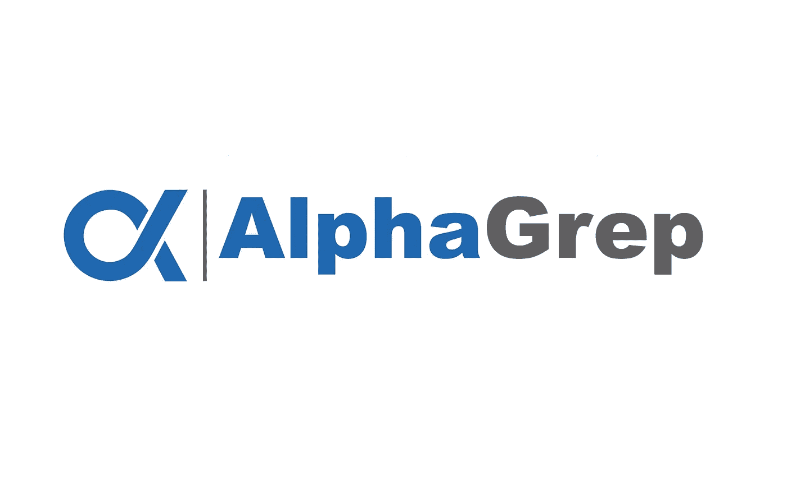

# 涅槃——安置传奇

> 原文：<https://blog.devgenius.io/nirvana-the-placement-saga-89f0d7a99845?source=collection_archive---------6----------------------->

他们的衬衫真的很棒，据我所知，他们的作品也很棒…

AlphaGrep Securities 是一家高频交易或算法交易公司，在班加罗尔和孟买(他们招聘新生的地点)设有办事处。在 KGP，量化交易员的角色并没有开放，他们只有系统工程师的身份。我的一个学长在 Alphagrep 工作，我和他讨论过这家公司，老实说，我对那里的工作非常着迷。我在这里想说的是，他们致力于底层优化，以加快他们将请求转发给交易员的管道，这些交易员发回订单，以进一步转发给市场。因为所有这些都是高频率的，所以即使最小的优化也很重要。在共享内存、分布式系统、风险管理、核心系统和套接字编程方面有大量的工作。此外，他们在纯 C/C++技术栈上工作。

## 第一轮

迎接我的是面试官，顺便说一下，他的名字也是 Himanshu！在一些基本的介绍之后，我根据他的要求继续描述我正在进行的一个项目。由于我大致了解他们所做的工作，我选择了精心制作其中一个相关项目，该项目涉及我认为可能会给他留下深刻印象的概念和方法 —我选择了一个涉及内核编程的项目，另一个涉及许多套接字和系统编程概念，如 fork()、select()、signal()。我不知道这有多大帮助，但我仍然相信这是明智之举。

当我描述我的网络相关项目时，我们慢慢地开始转向一些概念，如拼接、内核空间和用户空间分离、网络协议栈，我想这个讨论以 TCP——具体的拥塞控制机制——结束。老实说，我觉得是我让他这么做的，他们一般不会问这些问题。我的坏运气是我没有准备所有这些，甚至我在高级操作系统和计算机网络中学习的东西，我根本没有复习。**如果有人的目标是进入高频交易市场，试着有一个坚实的系统背景，请好好复习。**

然后他继续让我设计一个有一些规格的系统——这不是一个系统设计类型的问题，这更像是一个设计模式的测试。他让我在纸上用 Java 编写类，并就此盘问了我一段时间。

之后，他让我编写一个共享指针的简单实现。我记不太清楚了，但是大概是这样的:*因为不止一个指针可以指向一个对象，所以我们需要维护这些信息，并正确地管理指针的创建和释放。*虽然我使用过智能指针，但我的解决方案并不令人信服。我在这里做的一件事是不断地大声思考，通过我的讨论和他的一些插话，我想出了一个可行的解决方案。
这次采访大概持续了一个小时左右，一开始问了很多小问题，我甚至无法回忆起所有被问到的问题。

## 第二轮

我参加了我的第二轮比赛，我们以相似的方式开始。我解释了内核模块项目和我在第六学期操作系统实验中创建的磁盘文件系统。内核模块涉及 BST，然后她离题问了我一个关于 BST 和堆的 Algo 问题。

让我们假设我有一个向量对。有没有可能创建一个树，使得该对的第二个值遵循 Heap 属性(有一些放松)，而该对的第一个值遵循 BST 属性？
老实说，这是一个很好的问题，我举了一些例子，并设计了一个算法。即使在那一刻，我真的很兴奋，因为我可以解决这个问题，因为它看起来非常优雅，不知道，我有很多乐趣。她让我用尽可能好的时间复杂度来编码。我最初的解决方案不是她所期望的，所以她告诉我用另一种方式来尝试。我对我的算法做了一点修改，就这样编码了。经过一番辩论和讨论；我们的结论是，虽然两者的最坏情况复杂度都是 O(N*N)，但平均来说，第二个会给出更好的结果。

然后她问我关于 *static_cast* 和 *reinterpret_cast 的事情。我很自责，因为我在夏天的时候用过这些词，虽然我已经模糊地浏览了它们的意思，但我无法解释它们到底是什么。我只是知道什么时候用什么，我向她解释了。*

她接着问我纯虚函数和虚函数的区别。正是在这里，由于 Java-C++的差异，我遇到了一个小问题。我是用我对*接口*和*抽象、*的了解来回答这个问题的，而这个问题略有不同。老实说，我甚至不知道 C++中不存在*接口*关键字，也不知道它是通过哪种方式实现的。

*struct A { B b，int c }；(B*) & a 是什么意思？* 不完全确定但有所指。我一开始有点笨拙，这让我觉得它比这个稍微复杂一点，但是是的，我给出了这个问题的答案。

其他的什么都不记得了，当时是 10:30 左右，我很饿，所以在面试结束时，我们一边嚼着饼干，一边随意聊着办公室环境和作为一名工程师的成长机会。我知道我搞砸了一个提议，但在我内心深处，我很平静，因为我对谷歌充满信心。当我平静的时候，我是一个非常令人愉快的人——我想这就是为什么他们让我等着，而不是马上拒绝我。我离开了房间，AlphaGrep PlaceCom 通知我谷歌已经为我发生了！我还是去了谷歌走廊证实了这一点，然后去见了其他被安置在不同公司的人。过了一段时间，我被召回阿尔法格瑞普进行另一轮特别为我准备的闪电战，因为他们仍然不相信。尽管我想得到他们的报价，但我认为我已经放松了警惕。

## 第 3 轮

一开始，我的面试官告诉我，他也是 KGP 大学的毕业生。他们问了我一个 DP 式的难题，我只能在提示(Yikes)和一些简单的哎呀和设计问题后才能解决。正如我所说的，我的警觉性下降了，这一轮与前两轮相似——没有足够的说服力。

因此，我最终没有再听到 AlphaGrep 的任何消息，但我认为我的模糊面试，甚至可能是 PlaceCom 的优先订单政策，导致我没有获得聘用。难以下咽的苦果，但总的来说这只是愉快的一天，所以我不会带着任何遗憾回顾这次失败。

 [## 涅槃——安置传奇:上一页

### 谷歌回合 3

medium.com](https://medium.com/@himanshumundhra98/nirvana-the-placement-saga-b295b7a737f0)  [## 涅槃——安置传奇:下一部

### 最后的边疆

medium.com](https://medium.com/@himanshumundhra98/nirvana-the-placement-saga-2bba9a8cba7d)